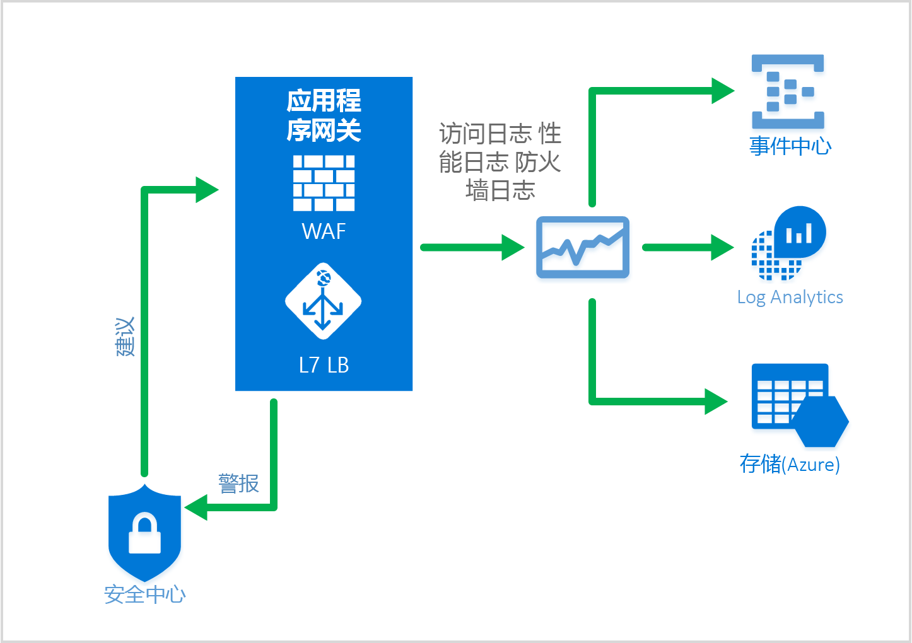

# <a name="web-application-firewall-waf"></a>Web 应用程序防火墙 (WAF)

Web 应用程序防火墙 (WAF) 是应用程序网关的功能，可以对 Web 应用程序进行集中保护，避免其受到常见的攻击和漏洞伤害。 

Web 应用程序防火墙基于 [OWASP 核心规则集](https://www.owasp.org/index.php/Category:OWASP_ModSecurity_Core_Rule_Set_Project) 3.0 或 2.2.9 中的规则。 Web 应用程序已逐渐成为利用常见已知漏洞的恶意攻击的目标。 这些攻击中最常见的攻击包括 SQL 注入攻击、跨站点脚本攻击等。 防止应用程序代码遭受此类攻击颇具挑战性，并且可能需要对应用程序拓扑的多个层进行严格的维护、修补和监视。 集中式 Web 应用程序防火墙有助于大幅简化安全管理，为抵卸威胁或入侵的应用程序管理员提供更好的保障。 相较保护每个单独的 Web 应用程序，WAF 解决方案还可通过在中央位置修补已知漏洞，更快地响应安全威胁。 可将现有应用程序网关轻松转换为支持 Web 应用程序防火墙的应用程序网关。


应用程序网关可作为应用程序传送控制器运行，并提供 SSL 终止、基于 Cookie 的会话相关性、轮循负载分发、基于内容的路由，以及托管多个网站和安全增强功能的能力。 应用程序网关提供的安全增强功能包括 SSL 策略管理、端到端 SSL 支持。 通过直接集成到 ADC 产品的 WAF（Web 应用程序防火墙），应用程序的安全性现已得到增强。 这提供了易于配置的中央位置，可用于管理和保护 Web 应用程序，使其免受常见 Web 漏洞的威胁。

## <a name="benefits"></a>优点

下面是应用程序网关和 Web 应用程序防火墙提供的核心优势：

### <a name="protection"></a>保护

* 无需修改后端代码即可保护 Web 应用程序免受 Web 漏洞和攻击的威胁。

* 在应用程序网关背后同时保护多个 Web 应用程序。 应用程序网关支持在单个网关背后托管最多 20 个网站，并使用 WAF 防止所有这些网站受到 Web 攻击的威胁。

### <a name="monitoring"></a>监视

* 使用实时 WAF 日志监视 Web 应用程序受到的攻击。 此日志与 [Azure Monitor](../monitoring-and-diagnostics/monitoring-overview.md) 集成，让你跟踪 WAF 警报和日志并轻松监视趋势。

* WAF 与 Azure 安全中心集成。 使用 Azure 安全中心可在一个中心位置查看所有 Azure 资源的安全状态。

### <a name="customization"></a>自定义

* 可根据应用程序的要求自定义 WAF 规则和规则组，并消除误报。

## <a name="features"></a>功能

Web 应用程序防火墙中默认已预先配置 CRS 3.0，也可以选择使用版本 2.2.9。 与版本 2.2.9 相比，CRS 3.0 的误报数更少。 提供[根据需求自定义规则](application-gateway-customize-waf-rules-portal.md)的功能。 Web 应用程序防火墙防范的某些常见 Web 安全漏洞包括：

* SQL 注入保护
* 跨站点脚本保护
* 常见 Web 攻击保护，例如命令注入、HTTP 请求走私、HTTP 响应拆分和远程文件包含攻击
* 防止 HTTP 协议违反行为
* 防止 HTTP 协议异常行为，例如缺少主机用户代理和接受标头
* 防止自动程序、爬网程序和扫描程序
* 检测常见应用程序错误配置（即 Apache、IIS 等）。

有关规则及其保护措施的更详细列表，请参阅下面的[核心规则集](#core-rule-sets)。

### <a name="core-rule-sets"></a>核心规则集

应用程序网关支持两个规则集：CRS 3.0 和 CRS 2.2.9。 这些核心规则集是防范 Web 应用程序中的恶意活动的规则集合。

#### <a name="owasp30"></a>OWASP_3.0

如下表中所示，提供的 3.0 核心规则集包含 13 个规则组。 每个规则组包含多个可以禁用的规则。

|RuleGroup|说明|
|---|---|
|**[REQUEST-911-METHOD-ENFORCEMENT](application-gateway-crs-rulegroups-rules.md#crs911)**|包含用于锁定方法（PUT、PATCH< 等）的规则。|
|**[REQUEST-913-SCANNER-DETECTION](application-gateway-crs-rulegroups-rules.md#crs913)**| 包含用于防范端口和环境扫描程序的规则。|
|**[REQUEST-920-PROTOCOL-ENFORCEMENT](application-gateway-crs-rulegroups-rules.md#crs920)**|包含用于防范协议和编码问题的规则。|
|**[REQUEST-921-PROTOCOL-ATTACK](application-gateway-crs-rulegroups-rules.md#crs921)**|包含用于防范标头注入、请求走私和响应拆分的规则|
|**[REQUEST-930-APPLICATION-ATTACK-LFI](application-gateway-crs-rulegroups-rules.md#crs930)**|包含用于防范文件和路径攻击的规则。|
|**[REQUEST-931-APPLICATION-ATTACK-RFI](application-gateway-crs-rulegroups-rules.md#crs931)**|包含用于防范远程文件包含 (RFI) 的规则|
|**[REQUEST-932-APPLICATION-ATTACK-RCE](application-gateway-crs-rulegroups-rules.md#crs932)**|包含用于防范远程代码执行的规则。|
|**[REQUEST-933-APPLICATION-ATTACK-PHP](application-gateway-crs-rulegroups-rules.md#crs933)**|包含用于防范 PHP 注入攻击的规则。|
|**[REQUEST-941-APPLICATION-ATTACK-XSS](application-gateway-crs-rulegroups-rules.md#crs941)**|包含用于防范跨站点脚本的规则。|
|**[REQUEST-942-APPLICATION-ATTACK-SQLI](application-gateway-crs-rulegroups-rules.md#crs942)**|包含用于防范 SQL 注入攻击的规则。|
|**[REQUEST-943-APPLICATION-ATTACK-SESSION-FIXATION](application-gateway-crs-rulegroups-rules.md#crs943)**|包含用于防范会话固定攻击的规则。|

#### <a name="owasp229"></a>OWASP_2.2.9

如下表中所示，提供的 2.2.9 核心规则集包含 10 个规则组。 每个规则组包含多个可以禁用的规则。

|RuleGroup|说明|
|---|---|
|**[crs_20_protocol_violations](application-gateway-crs-rulegroups-rules.md#crs20)**|包含用于防范协议冲突（无效字符、使用请求正文执行 GET 等等）的规则。|
|**[crs_21_protocol_anomalies](application-gateway-crs-rulegroups-rules.md#crs21)**|包含用于防范错误标头信息的规则。|
|**[crs_23_request_limits](application-gateway-crs-rulegroups-rules.md#crs23)**|包含用于防范参数或文件超出限制的规则。|
|**[crs_30_http_policy](application-gateway-crs-rulegroups-rules.md#crs30)**|包含用于防范受限方法、标头和文件类型的规则。 |
|**[crs_35_bad_robots](application-gateway-crs-rulegroups-rules.md#crs35)**|包含用于防范 Web 爬网程序和扫描程序的规则。|
|**[crs_40_generic_attacks](application-gateway-crs-rulegroups-rules.md#crs40)**|包含用于防范普通攻击（会话固定、远程文件包含、PHP 注入等等）的规则。|
|**[crs_41_sql_injection_attacks](application-gateway-crs-rulegroups-rules.md#crs41sql)**|包含用于防范 SQL 注入攻击的规则|
|**[crs_41_xss_attacks](application-gateway-crs-rulegroups-rules.md#crs41xss)**|包含用于防范跨站点脚本的规则。|
|**[crs_42_tight_security](application-gateway-crs-rulegroups-rules.md#crs42)**|包含用于防范路径遍历攻击的规则|
|**[crs_45_trojans](application-gateway-crs-rulegroups-rules.md#crs45)**|包含用于防范后门特洛伊木马的规则。|

### <a name="waf-modes"></a>WAF 模式

应用程序网关 WAF 可配置为在以下两种模式中运行：

* **检测模式** - 配置为在检测模式下运行时，应用程序网关 WAF 将监视所有威胁警报并将其记录到日志文件中。 应使用“诊断”部分打开应用程序网关的日志记录诊断。 还需确保已选择并打开 WAF 日志。 在检测模式下运行时，Web 应用程序防火墙不会阻止传入的请求。
* **阻止模式** - 配置为在阻止模式下运行时，应用程序网关主动阻止其规则检测到的入侵和攻击。 攻击者会收到 403 未授权访问异常，且连接会终止。 阻止模式会继续在 WAF 日志中记录此类攻击。

### <a name="application-gateway-waf-reports"></a>WAF 监视

监视应用程序网关的运行状况非常重要。 借助日志记录以及与 Azure Monitor、Azure 安全中心和 Log Analytics 的集成，可以监视 Web 应用程序防火墙及其保护的应用程序的运行状况。



#### <a name="azure-monitor"></a>Azure 监视器

每个应用程序网关日志与 [Azure Monitor](../monitoring-and-diagnostics/monitoring-overview.md) 集成。  这样，便可以跟踪包括 WAF 警报和日志在内的诊断信息。  门户中“诊断”选项卡上的“应用程序网关”资源中提供了此功能，也可以通过 Azure Monitor 服务直接访问此功能。 若要详细了解如何为应用程序网关启用诊断日志，请访问[应用程序网关诊断](application-gateway-diagnostics.md)

#### <a name="azure-security-center"></a>Azure 安全中心

[Azure 安全中心](../security-center/security-center-intro.md)有助于预防、检测和响应威胁，同时增加 Azure 资源的可见性和安全可控性。 应用程序网关将[集成到 Azure 安全中心](application-gateway-integration-security-center.md)。 Azure 安全中心会扫描环境以检测未受保护的 Web 应用程序。 它现在可以建议应用程序网关 WAF 保护这些易受攻击的资源。 可直接从 Azure 安全中心创建应用程序网关 WAF。  这些 WAF 实例与 Azure 安全中心集成，并将警报和运行状况信息发送回 Azure 安全中心，以便进行报告。


#### <a name="logging"></a>日志记录

应用程序网关 WAF 提供有关检测到的每个威胁的详细报告。 日志记录与 Azure 诊断日志集成，警报以 JSON 格式记录。 这些日志可与 [Log Analytics](../log-analytics/log-analytics-azure-networking-analytics.md) 集成。


```json
{
  "resourceId": "/SUBSCRIPTIONS/{subscriptionId}/RESOURCEGROUPS/{resourceGroupId}/PROVIDERS/MICROSOFT.NETWORK/APPLICATIONGATEWAYS/{appGatewayName}",
  "operationName": "ApplicationGatewayFirewall",
  "time": "2017-03-20T15:52:09.1494499Z",
  "category": "ApplicationGatewayFirewallLog",
  "properties": {
    "instanceId": "ApplicationGatewayRole_IN_0",
    "clientIp": "104.210.252.3",
    "clientPort": "4835",
    "requestUri": "/?a=%3Cscript%3Ealert(%22Hello%22);%3C/script%3E",
    "ruleSetType": "OWASP",
    "ruleSetVersion": "3.0",
    "ruleId": "941320",
    "message": "Possible XSS Attack Detected - HTML Tag Handler",
    "action": "Blocked",
    "site": "Global",
    "details": {
      "message": "Warning. Pattern match \"<(a|abbr|acronym|address|applet|area|audioscope|b|base|basefront|bdo|bgsound|big|blackface|blink|blockquote|body|bq|br|button|caption|center|cite|code|col|colgroup|comment|dd|del|dfn|dir|div|dl|dt|em|embed|fieldset|fn|font|form|frame|frameset|h1|head|h ...\" at ARGS:a.",
      "data": "Matched Data: <script> found within ARGS:a: <script>alert(\\x22hello\\x22);</script>",
      "file": "rules/REQUEST-941-APPLICATION-ATTACK-XSS.conf",
      "line": "865"
    }
  }
} 

```

## <a name="application-gateway-waf-sku-pricing"></a>应用程序网关 WAF SKU 定价

Web 应用程序防火墙在新的 WAF SKU 中提供。 此 SKU 仅在 Azure 资源管理器预配模型中可用，在经典部署模型中不可用。 此外，WAF SKU 仅提供中型和大型应用程序网关实例大小。 应用程序网关的所有限制同样适用于 WAF SKU。 定价基于每小时网关实例费和数据处理费。 WAF SKU 的每小时网关定价不同于标准 SKU 费用，具体请参阅[应用程序网关定价详细信息](https://azure.microsoft.com/pricing/details/application-gateway/)。 数据处理费保持不变。 不会按规则或规则组收费。 可以使用同一个 Web 应用程序防火墙保护多个 Web 应用程序，支持多个应用程序不会产生额外的费用。 


## <a name="next-steps"></a>后续步骤

深入了解 WAF 的功能后，请参阅[如何在应用程序网关上配置 Web 应用程序防火墙](application-gateway-web-application-firewall-portal.md)。

