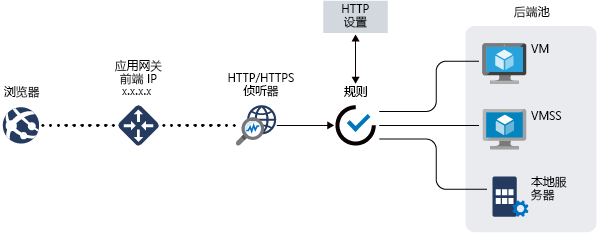

# Azure 应用程序网关功能

[Azure 应用程序网关](overview.md)是一种 Web 流量负载均衡器，可用于管理 Web 应用程序的流量。

应用程序网关包含以下功能：

- [安全套接字层（SSL/TLS）终止](#secure-sockets-layer-ssltls-termination)
- [自动](#autoscaling)
- [区域冗余](#zone-redundancy)
- [静态 VIP](#static-vip)
- [Web 应用程序防火墙](#web-application-firewall)
- [AKS 的入口控制器](#ingress-controller-for-aks)
- [基于 URL 的路由](#url-based-routing)
- [多站点托管](#multiple-site-hosting)
- [重定向](#redirection)
- [会话相关性](#session-affinity)
- [Websocket 和 HTTP/2 流量](#websocket-and-http2-traffic)
- [连接排出](#connection-draining)
- [自定义错误页](#custom-error-pages)
- [重写 HTTP 标头](#rewrite-http-headers)
- [大小调整](#sizing)

## 安全套接字层 (SSL/TLS) 终止

应用程序网关支持在网关上终止 SSL/TLS，之后，流量通常会以未加密状态流到后端服务器。 此功能让 Web 服务器不用再负担昂贵的加密和解密开销。 但有时与服务器的未加密通信不是可以接受的选项。 这可能是因为安全要求、符合性要求，或者应用程序可能仅接受安全连接。 对于这些应用程序，应用程序网关支持端到端 SSL/TLS 加密。

有关详细信息，请参阅[ssl 终止概述和应用程序网关的端到端 ssl](ssl-overview.md)

## 自动缩放

应用程序网关 Standard_v2 支持自动缩放，并且可以根据不断变化的流量负载模式增加或缩减。 自动缩放还无需在预配期间要求选择部署大小或实例计数。 

有关应用程序网关 Standard_v2 功能的详细信息，请参阅自动[缩放 V2 SKU](application-gateway-autoscaling-zone-redundant.md)。

## 区域冗余

Standard_v2 应用程序网关可跨多个可用性区域，提供更好的容错能力，并且无需在每个区域中预配单独的应用程序网关。

## 静态 VIP

应用程序网关 Standard_v2 SKU 以独占方式支持静态 VIP 类型。 这样可确保与应用程序网关关联的 VIP 在应用程序网关的整个生存期内都不会更改。

## Web 应用程序防火墙

Web 应用程序防火墙（WAF）是一种服务，可提供对 web 应用程序的集中保护，并防范常见的漏洞。 WAF 基于 [OWASP（开放 Web 应用程序安全项目）核心规则集](https://www.owasp.org/index.php/Category:OWASP_ModSecurity_Core_Rule_Set_Project) 3.1（仅限 WAF_v2）、3.0 和 2.2.9 中的规则。 

Web 应用程序已逐渐成为利用常见已知漏洞的恶意攻击的目标。 这些攻击中最常见的攻击包括 SQL 注入攻击、跨站点脚本攻击等。 防止应用程序代码中的此类攻击颇具挑战性，可能需要在应用程序拓扑的多个层进行严格的维护、修补和监视。 集中式 Web 应用程序防火墙有助于大幅简化安全管理，为抵卸威胁或入侵的应用程序管理员提供更好的保障。 相较保护每个单独的 Web 应用程序，WAF 解决方案还可通过在中央位置修补已知漏洞，更快地响应安全威胁。 可以轻松地将现有应用程序网关转换为启用了 Web 应用程序防火墙的应用程序网关。

有关详细信息，请参阅[什么是 Azure Web 应用程序防火墙？](../web-application-firewall/overview.md)。

## AKS 的入口控制器
应用程序网关入口控制器 (AGIC) 允许你使用应用程序网关作为 [Azure Kubernetes 服务 (AKS)](https://azure.microsoft.com/services/kubernetes-service/) 群集的入口。 

入口控制器在 AKS 群集中运行为 pod，并使用[Kubernetes 入口资源](https://kubernetes.io/docs/concepts/services-networking/ingress/)，并将其转换为应用程序网关配置，使网关能够将流量负载均衡到 Kubernetes pod。 入口控制器仅支持应用程序网关 Standard_v2 和 WAF_v2 SKUs。 

有关详细信息，请参阅[应用程序网关入口控制器 (AGIC)](ingress-controller-overview.md)。

## 基于 URL 的路由

基于 URL 路径的路由用于根据请求的 URL 路径，将流量路由到后端服务器池。 方案之一是将不同内容类型的请求路由到不同的池。

例如，将 `http://contoso.com/video/*` 的请求路由到 VideoServerPool，将 `http://contoso.com/images/*` 的请求路由到 ImageServerPool。 如果没有任何路径模式匹配，则选择 DefaultServerPool。

有关详细信息，请参阅[基于 URL 路径的路由概述](url-route-overview.md)。

## 多站点托管

使用多站点托管可以在同一应用程序网关实例上配置多个网站。 此功能使你可以为部署配置更有效的拓扑，方法是将最多100个网站添加到一个应用程序网关（以获得最佳性能）。 每个网站都可以定向到自己的池。 例如，应用程序网关可以通过两个名为 ContosoServerPool 和 FabrikamServerPool 的服务器池分别处理 `contoso.com` 和 `fabrikam.com` 的流量。

对 `http://contoso.com` 的请求路由到 ContosoServerPool，对 `http://fabrikam.com` 的请求路由到 FabrikamServerPool。

同样，可以将同一父域的两个子域托管在同一应用程序网关部署中。 例如，在单个应用程序网关部署中托管的 `http://blog.contoso.com` 和 `http://app.contoso.com` 都是使用子域。

有关详细信息，请参阅[应用程序网关多站点托管](multiple-site-overview.md)。

## 重定向

为确保应用程序与其用户之间的所有通信都通过加密路径进行，适用于许多 Web 应用程序的常见方案是支持 HTTP 到 HTTPS 自动重定向。

你可能过去用过专用池创建等技术，其唯一目的是将通过 HTTP 接收的请求重定向到 HTTPS。 应用程序网关支持重定向应用程序网关流量的功能。 这样可以简化应用程序配置、优化资源使用情况，并支持全局重定向和基于路径的重定向等新的重定向方案。 应用程序网关重定向支持并不仅限于 HTTP 到 HTTPS 的重定向。 这是一种通用重定向机制，因此可以针对使用规则定义的任何端口进行双向重定向。 它还支持重定向到外部站点。

应用程序网关重定向支持具有以下功能：

- 在网关上进行的从一个端口到另一个端口的全局重定向。 这样可实现站点上的 HTTP 到 HTTPS 重定向。
- 基于路径的重定向。 这种类型的重定向只能在特定站点区域（例如 `/cart/*` 表示的购物车区域）中进行 HTTP 到 HTTPS 的重定向。
- 重定向到外部站点。

有关详细信息，请参阅[应用程序网关重定向概述](redirect-overview.md)。

## 会话相关性

需要在同一服务器上保留用户会话时，可以使用基于 Cookie 的会话相关性功能。 借助网关托管的 Cookie，应用程序网关可以将来自用户会话的后续流量定向到同一服务器进行处理。 在用户会话的会话状态在服务器上进行本地保存的情况下，此功能十分重要。

有关详细信息，请参阅[应用程序网关的工作](how-application-gateway-works.md#modifications-to-the-request)原理。

## Websocket 和 HTTP/2 流量

应用程序网关为 WebSocket 和 HTTP/2 协议提供本机支持。 用户无法通过配置设置来选择性地启用或禁用 WebSocket 支持。

WebSocket 和 HTTP/2 协议通过长时间运行的 TCP 连接，在服务器和客户端之间实现全双工通信。 此功能让 Web 服务器和客户端之间能够进行交互性更强的通信。这种通信可以是双向的，而且不像基于 HTTP 的实现那样需要轮询。 与 HTTP 不同，这些协议的开销较低，并且可以对多个请求/响应重复使用同一 TCP 连接，从而提高资源利用率。 这些协议设计为通过传统 HTTP 端口 80 和 443 运行。

有关详细信息，请参阅 [WebSocket 支持](application-gateway-websocket.md)和 [HTTP/2 支持](configuration-overview.md#http2-support)。

## 连接清空

连接清空可帮助你在计划内服务更新期间正常删除后端池成员。 此设置是通过后端 http 设置启用的，并且可以在创建规则期间应用于后端池的所有成员。 启用后，应用程序网关可确保后端池的所有取消注册实例不会收到任何新请求，同时允许现有请求在配置的时间限制内完成。 这适用于通过用户配置更改显式从后端池中删除的后端实例，以及所报告的由运行状况探测确定为不正常的后端实例。 这种情况的唯一例外是绑定到已显式取消注册的注销实例的请求，因为网关托管会话相关性，并继续代理到注销实例。

有关详细信息，请参阅[应用程序网关配置概述](configuration-overview.md#connection-draining)。

## 自定义错误页

应用程序网关允许你创建自定义错误页而非显示默认错误页。 你可以在自定义错误页上使用自己的品牌和布局。

有关详细信息，请参阅[自定义错误](custom-error.md)。

## 重写 HTTP 标头

HTTP 标头可让客户端和服务器连同请求或响应一起传递附加的信息。 重写这些 HTTP 标头可帮助实现多个重要方案，例如：

- 添加安全相关的标头字段（如 HSTS/ X-XSS-Protection）。
- 删除可能会透露敏感信息的响应标头字段。
- 从 X-Forwarded-For 标头中去除端口信息。

当请求和响应数据包在客户端与后端池之间移动时，可以通过应用程序网关添加、删除或更新 HTTP 请求和响应标头。 它还允许你添加条件，确保只有在满足特定条件的情况下才能重写指定标头。

有关详细信息，请参阅[重写 HTTP 标头](rewrite-http-headers.md)。

## 调整大小

可以为自动缩放或固定大小部署配置应用程序网关 Standard_v2。 此 SKU 不提供不同的实例大小。 有关 v2 性能和定价的详细信息，请参阅[自动缩放 v2 SKU](application-gateway-autoscaling-zone-redundant.md#pricing)。

应用程序网关标准提供三种大小：**小型**、**中型**和**大型**。 小型实例大小适用于开发和测试方案。

有关应用程序网关限制的完整列表，请参阅[应用程序网关服务限制](../azure-resource-manager/management/azure-subscription-service-limits.md?toc=%2fazure%2fapplication-gateway%2ftoc.json#application-gateway-limits)。

下表显示了已启用 SSL 卸载的每个应用程序网关 v1 实例的平均性能吞吐量：

| 平均后端页面响应大小 | 小型 | 中型 | 大型 |
| --- | --- | --- | --- |
| 6 KB |7.5 Mbps |13 Mbps |50 Mbps |
| 100 KB |35 Mbps |100 Mbps |200 Mbps |

> [!NOTE]
> 这些值是应用程序网关吞吐量的大约值。 实际吞吐量取决于平均页面大小、后端实例的位置、提供页面所需的处理时间等各种环境详细信息。 如需确切的性能数字，则应运行自己的测试。 提供的这些值仅适用于容量规划指南。

## 后续步骤

- 了解应用程序网关的工作原理-[应用程序网关的工作](how-application-gateway-works.md)原理