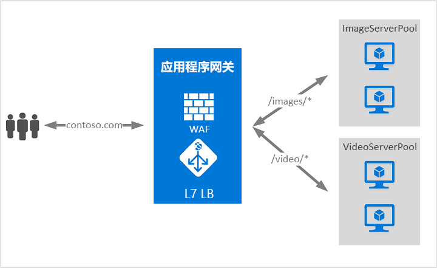

# 什么是 Azure 应用程序网关？

Azure 应用程序网关是一种 Web 流量负载均衡器，可用于管理 Web 应用程序的流量。 传统负载均衡器在传输层（OSI 层 4 - TCP 和 UDP）进行操作，并基于源 IP 地址和端口将流量路由到目标 IP 地址和端口。

应用程序网关可以根据 HTTP 请求的其他属性（例如 URI 路径或主机头）进行路由决策。 例如，可以基于传入 URL 路由流量。 因此，如果 `/images` 在传入 URL 中，则可将流量路由到为映像配置的一组特定服务器（称为池）中。 如果 `/video` 在 URL 中，则可将该流量路由到针对视频优化的另一个池中。

这种类型的路由称为应用程序层（OSI 层 7）负载均衡。 Azure 应用程序网关可以执行基于 URL 的路由等操作。

>[!NOTE]
> Azure 为方案提供了一套完全托管的负载均衡解决方案。 如需高性能、低延迟的 4 层负载均衡，请参阅[什么是 Azure 负载均衡器？](../load-balancer/load-balancer-overview.md) 如果正在查找全局 DNS 负载均衡，请查看[什么是流量管理器？](../traffic-manager/traffic-manager-overview.md) 端到端场景可从结合这些解决方案中受益。
>
> 有关 Azure 负载平衡选项的比较，请参阅 [Overview of load-balancing options in Azure](https://docs.microsoft.com/azure/architecture/guide/technology-choices/load-balancing-overview)（Azure 中的负载平衡选项概述）。

## 功能

若要了解应用程序网关功能，请参阅 [Azure 应用程序网关功能](features.md)。

## 定价和 SLA

有关应用程序网关定价信息，请参阅[应用程序网关定价](https://azure.microsoft.com/pricing/details/application-gateway/)。

有关应用程序网关 SLA 信息，请参阅[应用程序网关 SLA](https://azure.microsoft.com/support/legal/sla/application-gateway/v1_2/)。

## 后续步骤

可以根据自己的需求和环境，使用 Azure 门户、Azure PowerShell 或 Azure CLI 创建测试性应用程序网关。

- [快速入门：使用 Azure 应用程序网关定向 Web 流量 - Azure 门户](quick-create-portal.md)
- [快速入门：使用 Azure 应用程序网关定向 Web 流量 - Azure PowerShell](quick-create-powershell.md)
- [快速入门：使用 Azure 应用程序网关定向 Web 流量 - Azure CLI](quick-create-cli.md)
