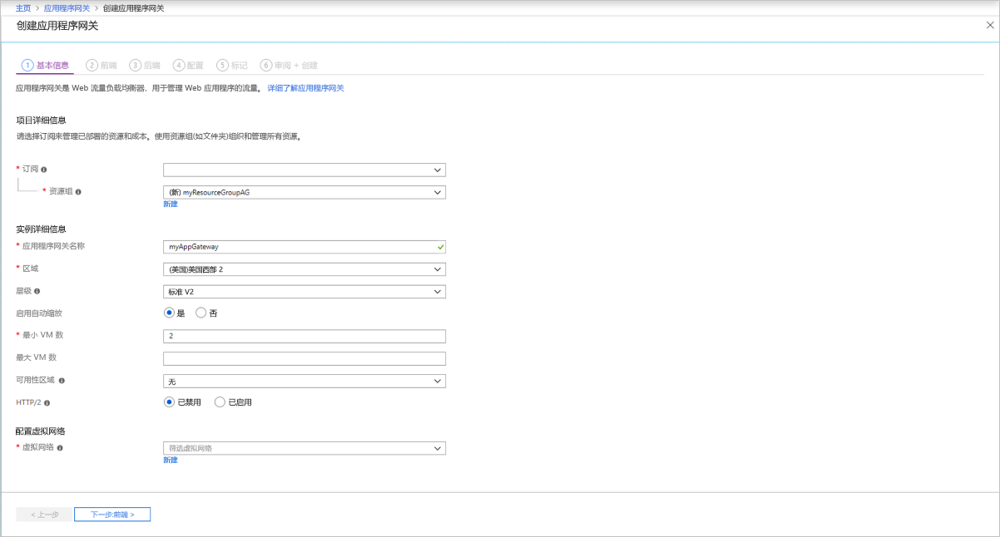
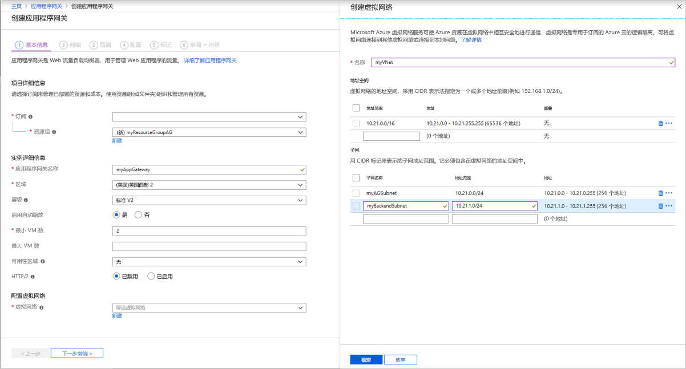
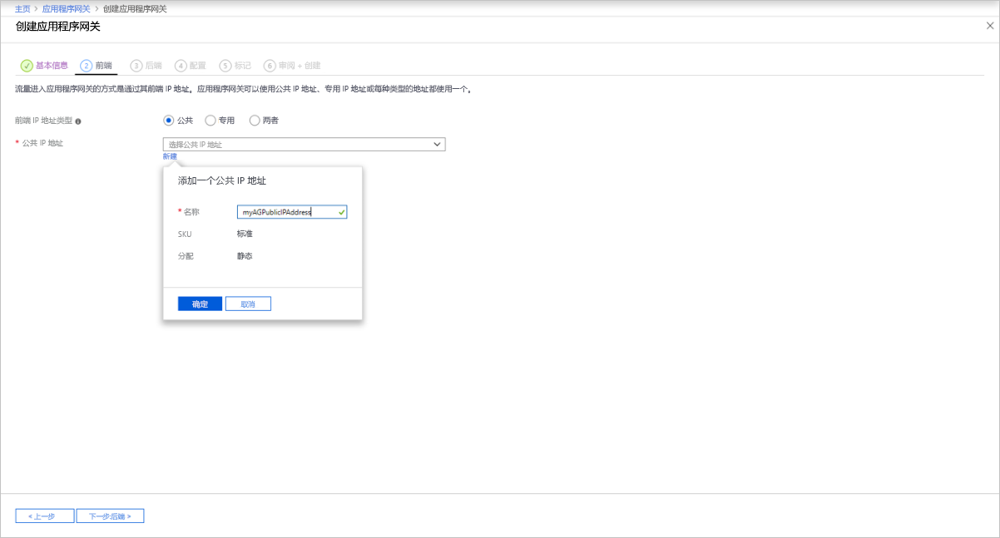
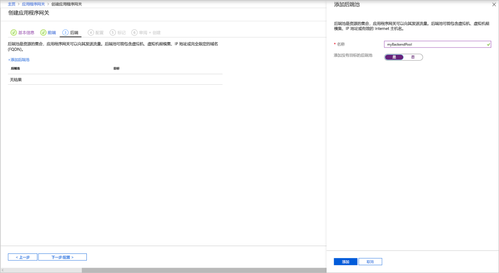
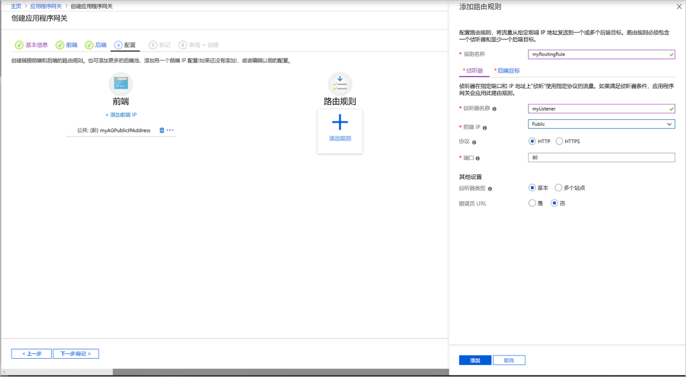
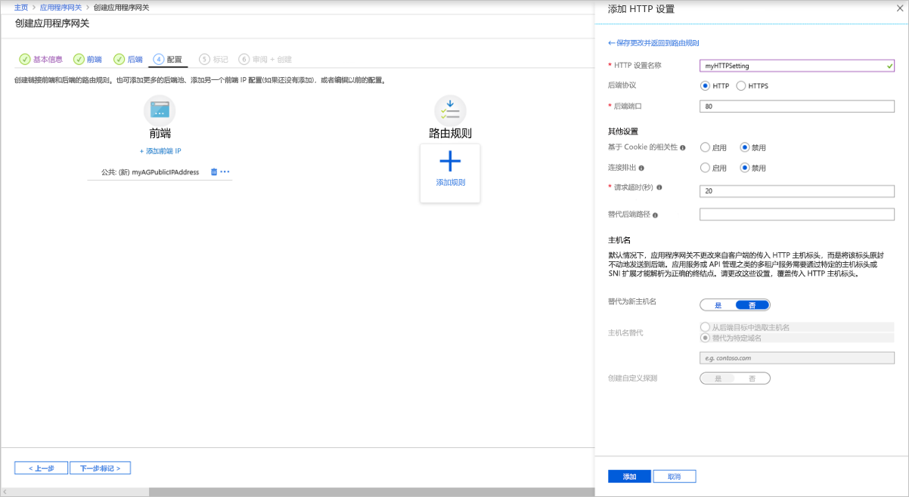
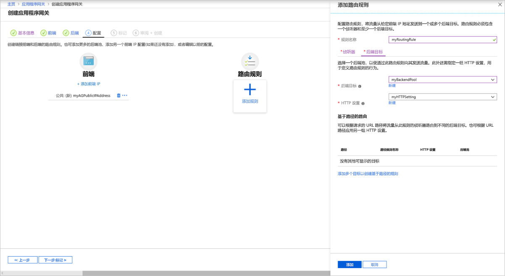

# <a name="quickstart-direct-web-traffic-with-azure-application-gateway---azure-portal"></a>快速入门：使用 Azure 应用程序网关定向 Web 流量 - Azure 门户

本快速入门介绍如何使用 Azure 门户创建应用程序网关。  创建应用程序网关后，请测试该网关以确保其正常运行。 使用 Azure 应用程序网关，可以为端口分配侦听器、创建规则以及向后端池添加资源，以便将应用程序 Web 流量定向到特定资源。 为简单起见，本文使用了带有公共前端 IP 的简单设置、在此应用程序网关上托管单个站点的基本侦听器、用于后端池的两台虚拟机以及基本请求传递规则。

如果没有 Azure 订阅，请在开始之前创建一个[免费帐户](https://azure.microsoft.com/free/?WT.mc_id=A261C142F)。


[!INCLUDE [updated-for-az](../../includes/updated-for-az.md)]

## <a name="sign-in-to-azure"></a>登录 Azure

使用 Azure 帐户登录到 [Azure 门户](https://portal.azure.com)。

## <a name="create-an-application-gateway"></a>创建应用程序网关

1. 在 Azure 门户菜单或“主页”页上，选择“创建资源”。 此时会显示“新建”窗口。

2. 选择“网络”，然后在“特色”列表中选择“应用程序网关”。

### <a name="basics-tab"></a>“基本信息”选项卡

1. 在“基本信息”选项卡上，输入这些值作为以下应用程序网关设置：

   - **资源组**：选择资源组的 " **myResourceGroupAG** "。 如果该资源组不存在，请选择“新建”，创建一个新的。
   - **应用程序网关名称**：输入*myAppGateway*作为应用程序网关的名称。

     

2. Azure 需要一个虚拟网络才能在创建的资源之间通信。 可以创建新的虚拟网络，也可以使用现有的虚拟网络。 在此示例中，将在创建应用程序网关的同时创建新的虚拟网络。 在不同的子网中创建应用程序网关实例。 在本示例中创建两个子网：一个用于应用程序网关，另一个用于后端服务器。

    在“配置虚拟网络”下，通过选择“新建”创建新的虚拟网络。 在打开的“创建虚拟网络”窗口中，输入以下值以创建虚拟网络和两个子网：

    - **名称**：输入*myVNet*作为虚拟网络的名称。

    - **子网名称**（应用程序网关子网）：**子**网网格将显示名为*Default*的子网。 将此子网的名称更改为 myAGSubnet。<br>应用程序网关子网只能包含应用程序网关。 不允许其他资源。

    - **子网名称**（后端服务器子网）：**在子网网格的**第二行中，在 "**子网名称**" 列中输入*myBackendSubnet* 。

    - **地址范围**（后端服务器子网）：在**子网**网格的第二行中，输入与*myAGSubnet*的地址范围不重叠的地址范围。 例如，如果 myAGSubnet 的地址范围为 10.0.0.0/24，则为 myBackendSubnet 的地址范围输入 10.0.1.0/24。

    选择“确定”以关闭“创建虚拟网络”窗口，并保存虚拟网络设置。

     
    
3. 在 "**基本**信息" 选项卡上，接受其他设置的默认值，然后选择 "**下一步：前端**"。

### <a name="frontends-tab"></a>“前端”选项卡

1. 在“前端”选项卡上，验证“IP 地址类型”是否设置为“公共”。 <br>可以根据用例将前端 IP 配置为公共或专用。 本示例将选择公共前端 IP。
   > [!NOTE]
   > 对于应用程序网关 v2 SKU，必须有一个**公共**前端 IP 配置。 你仍可以同时有公共和专用前端 IP 配置，但目前没有为 v2 SKU 启用仅专用前端 IP 配置（仅限 ILB 模式）。 

2. 为“公共 IP 地址”选择“新建”，输入“myAGPublicIPAddress”作为公共 IP 地址名称，然后选择“确定”。 

     

3. 选择**下一步：后端**。

### <a name="backends-tab"></a>“后端”选项卡

后端池用于将请求路由到为请求提供服务的后端服务器。 后端池可以包含 NIC、虚拟机规模集、公共 IP、内部 IP、完全限定的域名 (FQDN) 和多租户后端（例如 Azure 应用服务）。 在此示例中，将使用应用程序网关创建空的后端池，然后将后端目标添加到后端池。

1. 在“后端”选项卡上，选择“+添加后端池”。

2. 在打开的“添加后端池”窗口中，输入以下值以创建空的后端池：

    - **名称**：输入*myBackendPool*作为后端池的名称。
    - **添加无目标后端池**：选择 **"是"** 以创建没有目标的后端池。 你将在创建应用程序网关之后添加后端目标。

3. 在“添加后端池”窗口中，选择“添加”以保存后端池配置并返回到“后端”选项卡。

     

4. 在 "**后端**" 选项卡上，选择 "**下一步：配置**"。

### <a name="configuration-tab"></a>配置选项卡

在“配置”选项卡上，将连接使用传递规则创建的前端和后端池。

1. 选择“传递规则”列中的“添加规则”。

2. 在打开的“添加传递规则”窗口中，输入“myRoutingRule”作为规则名称。

3. 传递规则需要侦听器。 在“添加传递规则”窗口中的“侦听器”选项卡上，输入侦听器的以下值：

    - **侦听器名称**：为侦听器的名称输入*myListener* 。
    - **前端 IP**：选择 "**公共**" 可选择为前端创建的公共 IP。
  
      接受“侦听器”选项卡上其他设置的默认值，然后选择“后端目标”选项卡以配置剩余的传递规则。

   

4. 在“后端目标”选项卡上，为“后端目标”选择“myBackendPool”。

5. 对于“HTTP 设置”，选择“新建”以创建新的 HTTP 设置。 HTTP 设置将决定传递规则的行为。 在打开的“添加 HTTP 设置”窗口中，为“HTTP 设置名称”输入“myHTTPSetting”。 接受“添加 HTTP 设置”窗口中其他设置的默认值，然后选择“添加”以返回到“添加传递规则”窗口。 

     

6. 在“添加传递规则”窗口上，选择“添加”以保存传递规则并返回到“配置”选项卡。

     

7. 选择 "**下一步：标记**"，然后单击 "**查看**"。

### <a name="review--create-tab"></a>“查看 + 创建”选项卡

复查“查看 + 创建”选项卡上的设置，然后选择“创建”以创建虚拟网络、公共 IP 地址和应用程序网关。 Azure 可能需要数分钟时间来创建应用程序网关。 请等待部署成功完成，然后再前进到下一部分。

## <a name="add-backend-targets"></a>添加后端目标

本示例将使用虚拟机作为目标后端。 可以使用现有的虚拟机，或创建新的虚拟机。 将创建两个虚拟机，供 Azure 用作应用程序网关的后端服务器。

为此，将要：

1. 创建两个新的 VM（myVM 和 myVM2），用作后端服务器。
2. 可以在虚拟机上安装 IIS，以验证是否已成功创建了应用程序网关。
3. 将后端服务器添加到后端池。

### <a name="create-a-virtual-machine"></a>创建虚拟机

1. 在 Azure 门户菜单或“主页”页上，选择“创建资源”。 此时会显示“新建”窗口。
2. 选择“计算”，然后在“常用”列表中选择“Windows Server 2016 Datacenter”。 此时会显示“创建虚拟机”页。<br>应用程序网关可以将流量路由到其后端池中使用的任何类型的虚拟机。 在此示例中，可以使用 Windows Server 2016 Datacenter。
3. 对于以下虚拟机设置，请在“基本信息”选项卡中输入相应值：

    - **资源组**：选择 " **myResourceGroupAG** " 作为资源组名称。
    - **虚拟机名称**：输入*myVM*作为虚拟机的名称。
    - **用户名**：输入*azureuser*作为管理员用户名。
    - **密码**：输入*Azure123456！* 作为管理员密码。
4. 接受其他默认值，然后选择 "**下一步：磁盘**"。  
5. 接受 "**磁盘**" 选项卡默认值，然后选择 "**下一步：网络**"。
6. 在“网络”选项卡上，验证是否已选择 **myVNet** 作为**虚拟网络**，以及是否已将“子网”设置为 **myBackendSubnet**。 接受其他默认值，然后选择 "**下一步：管理**"。<br>应用程序网关可与其所在的虚拟网络外部的实例进行通信，但需要确保已建立 IP 连接。
7. 在“管理”选项卡上，将“启动诊断”设置为“关闭”。 接受其他默认值，然后选择“复查 + 创建”。
8. 在“复查 + 创建”选项卡上复查设置，更正任何验证错误，然后选择“创建”。
9. 等待虚拟机创建完成，然后再继续操作。

### <a name="install-iis-for-testing"></a>安装 IIS 进行测试

本示例在虚拟机上安装 IIS，只为验证 Azure 是否已成功创建应用程序网关。

1. 打开 [Azure PowerShell](https://docs.microsoft.com/azure/cloud-shell/quickstart-powershell)。 为此，请在 Azure 门户的顶部导航栏中选择“Cloud Shell”，然后从下拉列表中选择“PowerShell”。 

    

2. 运行以下命令以在虚拟机上安装 IIS： 

    ```azurepowershell-interactive
    Set-AzVMExtension `
      -ResourceGroupName myResourceGroupAG `
      -ExtensionName IIS `
      -VMName myVM `
      -Publisher Microsoft.Compute `
      -ExtensionType CustomScriptExtension `
      -TypeHandlerVersion 1.4 `
      -SettingString '{"commandToExecute":"powershell Add-WindowsFeature Web-Server; powershell Add-Content -Path \"C:\\inetpub\\wwwroot\\Default.htm\" -Value $($env:computername)"}' `
      -Location EastUS
    ```

3. 使用以前完成的步骤创建第二个虚拟机并安装 IIS。 使用 *myVM2* 作为虚拟机名称，以及作为 **Set-AzVMExtension** cmdlet 的 **VMName** 设置。

### <a name="add-backend-servers-to-backend-pool"></a>将后端服务器添加到后端池

1. 在 Azure 门户菜单上，选择“所有资源”，或搜索并选择“所有资源”。 然后选择“myAppGateway”。

2. 从左侧菜单中选择“后端池”。

3. 选择“myBackendPool”。

4. 在“目标”下，从下拉列表中选择“虚拟机”。

5. 在“虚拟机”和“网络接口”下，从下拉列表中选择 **myVM** 和 **myVM2** 虚拟机及其关联的网络接口。

    

6. 选择“保存”。

7. 等待部署完成之后再继续下一步。

## <a name="test-the-application-gateway"></a>测试应用程序网关

虽然不需 IIS 即可创建应用程序网关，但本快速入门中安装了它，用来验证 Azure 是否已成功创建应用程序网关。 使用 IIS 测试应用程序网关：

1. 在“概述”页面上查找应用程序网关的公共 IP 地址**记录应用程序网关公共 IP 地址**或者，可以选择“所有资源”，在搜索框中输入“myAGPublicIPAddress”，然后在搜索结果中选择该地址。 Azure 会在“概览”页上显示公共 IP 地址。
2. 复制该公共 IP 地址，并将其粘贴到浏览器的地址栏。
3. 检查响应。 有效响应验证应用程序网关是否已成功创建，以及是否能够成功连接后端。

## <a name="clean-up-resources"></a>清理资源

如果不再需要通过应用程序网关创建的资源，请删除资源组。 删除资源组时，也会删除应用程序网关和及其所有的相关资源。 

若要删除资源组，请执行以下操作：

1. 在 Azure 门户菜单上，选择“资源组”，或搜索并选择“资源组”。
2. 在“资源组”页的列表中搜索“myResourceGroupAG”，然后将其选中。
3. 在“资源组”页上，选择“删除资源组”。
4. 在“键入资源组名称”字段中输入“myResourceGroupAG”，然后选择“删除”

## <a name="next-steps"></a>后续步骤

> [!div class="nextstepaction"]
> [通过 Azure CLI 使用应用程序网关管理 Web 流量](./tutorial-manage-web-traffic-cli.md)
