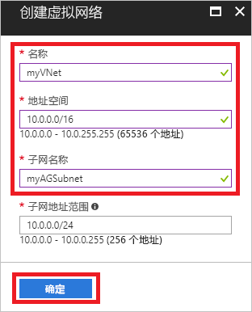
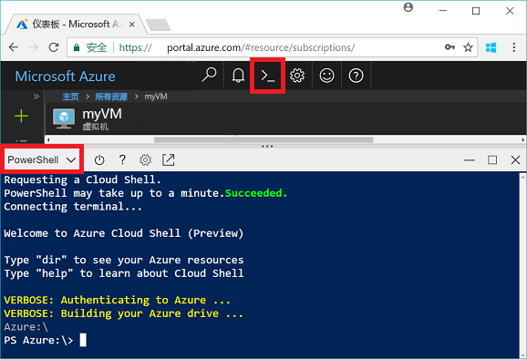
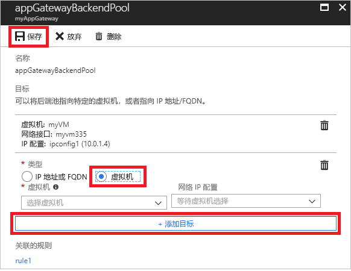
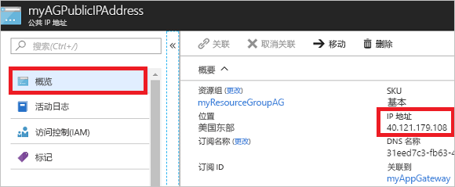

# <a name="quickstart-direct-web-traffic-with-azure-application-gateway---azure-portal"></a>快速入门：使用 Azure 应用程序网关定向 Web 流量 - Azure 门户

使用 Azure 应用程序网关，可以通过为端口分配侦听器、创建规则以及向后端池添加资源，来将应用程序 Web 流量定向到特定资源。

本快速入门展示了如何使用 Azure 门户快速创建后端池中有两台虚拟机的应用程序网关。 然后，对它进行测试以确保它正常工作。

如果你还没有 Azure 订阅，可以在开始前创建一个 [免费帐户](https://azure.microsoft.com/free/?WT.mc_id=A261C142F)。

## <a name="log-in-to-azure"></a>登录 Azure

在 [http://portal.azure.com](http://portal.azure.com) 登录到 Azure 门户

## <a name="create-an-application-gateway"></a>创建应用程序网关

需要为应用程序网关创建虚拟网络才能与其他资源进行通信。 可以在创建应用程序网关的同时创建虚拟网络。 在本示例中创建了两个子网：一个用于应用程序网关，另一个用于虚拟机。 

1. 单击 Azure 门户左上角的“创建资源”。
2. 选择“网络”，然后在“特色”列表中选择“应用程序网关”。
3. 输入应用程序网关的以下值：

    - *myAppGateway* - 应用程序网关的名称。
    - *myResourceGroupAG* - 新资源组。

    

4. 接受其他设置的默认值，然后单击“确定”。
5. 单击“选择虚拟网络” > “新建”，然后为虚拟网络输入以下值：

    - *myVNet* - 虚拟网络的名称。
    - *10.0.0.0/16* - 虚拟网络地址空间。
    - *myAGSubnet* - 子网名称。
    - *10.0.0.0/24* - 子网地址空间。

    

6. 单击“确定”创建虚拟网络和子网。
6. 单击“选择公用 IP 地址” > “新建”，然后输入公用 IP 地址的名称。 在本示例中，公用 IP 地址名为 *myAGPublicIPAddress*。 接受其他设置的默认值，然后单击“确定”。
8. 接受侦听器配置的默认值，让 Web 应用程序防火墙保留禁用状态，然后单击“确定”。
9. 复查摘要页上的设置，然后单击“确定”以创建虚拟网络、公用 IP 地址和应用程序网关。 创建应用程序网关可能需要最多 30 分钟，请等到部署成功完成，然后转到下一部分。

### <a name="add-a-subnet"></a>添加子网

1. 单击左侧菜单中的“所有资源”，然后从资源列表中单击“myVNet”。
2. 单击“子网” > “子网”。

    

3. 输入 *myBackendSubnet* 作为子网的名称，然后单击“确定”。

## <a name="create-backend-servers"></a>创建后端服务器

在此示例中，将创建两个虚拟机以用作应用程序网关的后端服务器。 

### <a name="create-a-virtual-machine"></a>创建虚拟机

1. 单击“新建” 。
2. 选择“计算”，然后在“特色”列表中选择“Windows Server 2016 Datacenter”。
3. 输入虚拟机的以下值：

    - *myVM* - 作为虚拟机的名称。
    - *azureuser* - 作为管理员用户名。
    - *Azure123456!* - 密码。
    - 选择“使用现有资源组”，然后选择“myResourceGroupAG”。

4. 单击“确定”。
5. 选择“DS1_V2”作为虚拟机的大小，然后单击“选择”。
6. 请确保选择 **myVNet** 作为虚拟网络，子网是 **myBackendSubnet**。 
7. 单击“禁用”以禁用启动诊断。
8. 创建“确定”，检查“摘要”页上的设置，然后单击“创建”。

### <a name="install-iis"></a>安装 IIS

可以在虚拟机上安装 IIS，以验证是否已成功创建了应用程序网关。

1. 打开交互式 shell 并确保它已设置为 **PowerShell**。

    

2. 运行以下命令以在虚拟机上安装 IIS： 

    ```azurepowershell-interactive
    Set-AzureRmVMExtension `
      -ResourceGroupName myResourceGroupAG `
      -ExtensionName IIS `
      -VMName myVM `
      -Publisher Microsoft.Compute `
      -ExtensionType CustomScriptExtension `
      -TypeHandlerVersion 1.4 `
      -SettingString '{"commandToExecute":"powershell Add-WindowsFeature Web-Server; powershell Add-Content -Path \"C:\\inetpub\\wwwroot\\Default.htm\" -Value $($env:computername)"}' `
      -Location EastUS
    ```

3. 使用刚刚完成的步骤创建第二个虚拟机并安装 IIS。 输入 *myVM2* 作为其名称，并将其用于 Set-AzureRmVMExtension 中的 VMName。

### <a name="add-backend-servers"></a>添加后端服务器

创建虚拟机后，需要将它们添加到应用程序网关中的后端池。

1. 单击“所有资源” > “myAppGateway”。
2. 单击“后端池”。 默认池已随应用程序网关自动创建。 单击 **appGatewayBackendPool**。
3. 单击“添加目标” > “虚拟机”，然后选择“myVM”。 选择“添加目标” > “虚拟机”，然后选择“myVM2”。

    

4. 单击“ **保存**”。

## <a name="test-the-application-gateway"></a>测试应用程序网关

创建应用程序网关不需要安装 IIS，但本快速入门中安装了它，用来验证应用程序网关是否已成功创建。

1. 在“概述”屏幕上找到应用程序网关的公用 IP 地址。 单击“所有资源” > “myAGPublicIPAddress”。

    

2. 复制该公用 IP 地址，并将其粘贴到浏览器的地址栏。

    

刷新浏览器时，应该会看到显示了另一 VM 的名称。

## <a name="clean-up-resources"></a>清理资源

首先，探究随应用程序网关创建的资源，当不再需要这些资源时，可以删除资源组、应用程序网关和所有相关资源。 为此，请选择包含应用程序网关的资源组，并单击“删除”。

## <a name="next-steps"></a>后续步骤

> [!div class="nextstepaction"]
> [通过 Azure CLI 使用应用程序网关管理 Web 流量](./tutorial-manage-web-traffic-cli.md)
