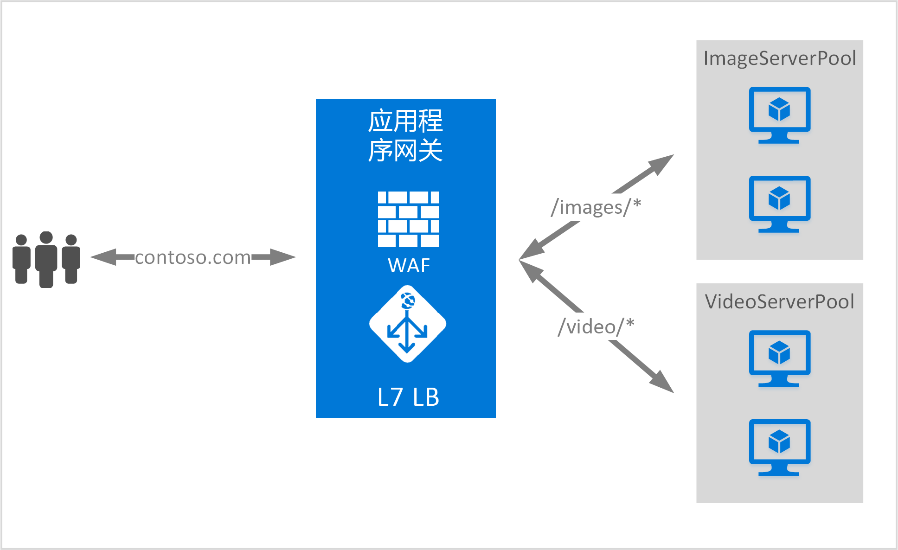

# <a name="url-path-based-routing-overview"></a>基于 URL 路径的路由概述

基于 URL 路径的路由用于根据请求的 URL 路径，将流量路由到后端服务器池。 

方案之一是将针对不同内容类型的请求路由到不同的后端服务器池。

在以下示例中，应用程序网关针对 contoso.com 从三个后端服务器池提供流量，例如：VideoServerPool、ImageServerPool 和 DefaultServerPool。



对 http\://contoso.com/video/* 的请求会路由到 VideoServerPool，对 http\://contoso.com/images/* 的请求会路由到 ImageServerPool。 如果没有任何路径模式匹配，则选择 DefaultServerPool。

> [!IMPORTANT]
> 规则将按照门户中的列出顺序进行处理。 我们强烈建议先配置多站点侦听器，然后再配置基本侦听器。  这确保将流量路由到适当的后端。 如果基本侦听器先列出并且与传入的请求匹配，则该侦听器将处理该请求。

## <a name="urlpathmap-configuration-element"></a>UrlPathMap 配置元素

UrlPathMap 元素用于指定后端服务器池映射的路径模式。 以下代码示例是模板文件中 urlPathMap 元素的代码片段。

```json
"urlPathMaps": [{
    "name": "{urlpathMapName}",
    "id": "/subscriptions/{subscriptionId}/../microsoft.network/applicationGateways/{gatewayName}/urlPathMaps/{urlpathMapName}",
    "properties": {
        "defaultBackendAddressPool": {
            "id": "/subscriptions/    {subscriptionId}/../microsoft.network/applicationGateways/{gatewayName}/backendAddressPools/{poolName1}"
        },
        "defaultBackendHttpSettings": {
            "id": "/subscriptions/{subscriptionId}/../microsoft.network/applicationGateways/{gatewayName}/backendHttpSettingsList/{settingname1}"
        },
        "pathRules": [{
            "name": "{pathRuleName}",
            "properties": {
                "paths": [
                    "{pathPattern}"
                ],
                "backendAddressPool": {
                    "id": "/subscriptions/{subscriptionId}/../microsoft.network/applicationGateways/{gatewayName}/backendAddressPools/{poolName2}"
                },
                "backendHttpsettings": {
                    "id": "/subscriptions/{subscriptionId}/../microsoft.network/applicationGateways/{gatewayName}/backendHttpsettingsList/{settingName2}"
                }
            }
        }]
    }
}]
```

### <a name="pathpattern"></a>PathPattern

PathPattern 是要匹配的路径模式列表。 每个模式必须以 / 开头，只允许在后接“/”的末尾处添加“*”。 提供给路径匹配器的字符串在第一个“?” 或“#”之后不包含任何文本，而且这些字符不允许在这里。 否则，URL 中允许的任何字符在 PathPattern 中都是允许的。

受支持的模式取决于是部署应用程序网关 v1 还是 v2：

#### <a name="v1"></a>v1

路径规则不区分大小写。

|v1 路径模式  |是否支持？  |
|---------|---------|
|`/images/*`     |是|
|`/images*`     |否|
|`/images/*.jpg`     |否|
|`/*.jpg`     |否|
|`/Repos/*/Comments/*`     |否|
|`/CurrentUser/Comments/*`     |是|

#### <a name="v2"></a>v2

路径规则不区分大小写。

|v2 路径模式  |是否支持？  |
|---------|---------|
|`/images/*`     |是|
|`/images*`     |是|
|`/images/*.jpg`     |否|
|`/*.jpg`     |否|
|`/Repos/*/Comments/*`     |否|
|`/CurrentUser/Comments/*`     |是|

有关详细信息，可以查看[使用基于 URL 的路由的 Resource Manager 模板](https://azure.microsoft.com/documentation/templates/201-application-gateway-url-path-based-routing)。

## <a name="pathbasedrouting-rule"></a>PathBasedRouting 规则

PathBasedRouting 类型的 RequestRoutingRule 可用于将侦听器绑定到 urlPathMap。 此侦听器收到的所有请求会根据 urlPathMap 中指定的策略进行路由。
PathBasedRouting 规则的代码段：

```json
"requestRoutingRules": [
    {

"name": "{ruleName}",
"id": "/subscriptions/{subscriptionId}/../microsoft.network/applicationGateways/{gatewayName}/requestRoutingRules/{ruleName}",
"properties": {
    "ruleType": "PathBasedRouting",
    "httpListener": {
        "id": "/subscriptions/{subscriptionId}/../microsoft.network/applicationGateways/{gatewayName}/httpListeners/<listenerName>"
    },
    "urlPathMap": {
        "id": "/subscriptions/{subscriptionId}/../microsoft.network/applicationGateways/{gatewayName}/ urlPathMaps/{urlpathMapName}"
    },

}
    }
]
```

## <a name="next-steps"></a>后续步骤

了解基于 URL 的内容路由之后，请转到[使用基于 URL 的路由创建应用程序网关](create-url-route-portal.md)，使用 URL 路由规则创建应用程序网关。
