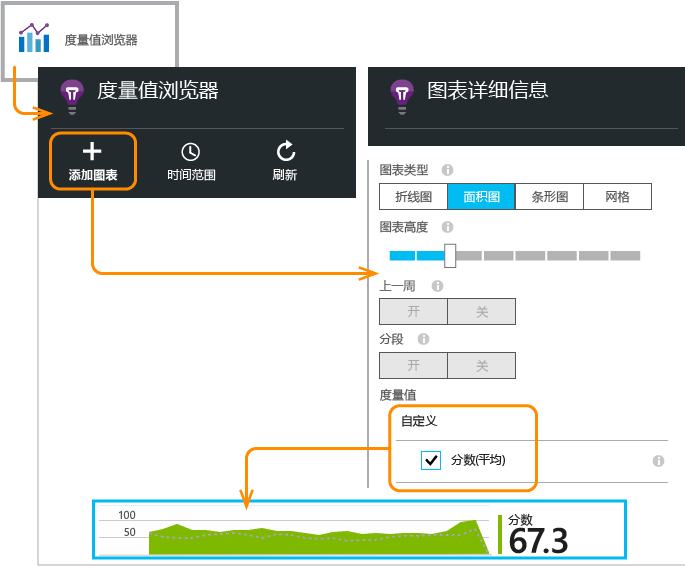
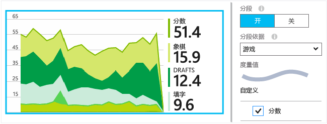

# <a name="application-insights-api-for-custom-events-and-metrics"></a>用于处理自定义事件和指标的 Application Insights API


在应用程序中插入几行代码，即可了解用户在该应用程序中执行的操作或帮助诊断问题。 可以从设备和桌面应用、Web 客户端和 Web 服务器发送遥测数据。 使用 [Visual Studio Application Insights](app-insights-overview.md) 核心遥测 API 发送自定义事件和指标，以及自己的标准遥测版本。 此 API 与标准 Application Insights 数据收集器使用的 API 相同。

## <a name="api-summary"></a>API 摘要
API 在所有平台中是一致的，只有一些微小的差异。

| 方法 | 用途 |
| --- | --- |
| [`TrackPageView`](#page-views) |页面、屏幕、边栏选项卡或窗体。 |
| [`TrackEvent`](#track-event) |用户操作和其他事件。 用于跟踪用户行为或监视性能。 |
| [`TrackMetric`](#track-metric) |性能度量，例如与特定事件不相关的队列长度。 |
| [`TrackException`](#track-exception) |记录诊断的异常。 跟踪与其他事件的相关性，以及检查堆栈跟踪。 |
| [`TrackRequest`](#track-request) |记录服务器请求的频率和持续时间以进行性能分析。 |
| [`TrackTrace`](#track-trace) |诊断日志消息。 还可以捕获第三方日志。 |
| [`TrackDependency`](#track-dependency) |记录对应用依赖的外部组件的调用持续时间和频率。 |

可以[将属性和指标附加到](#properties)其中的大多数遥测调用。

## <a name="a-nameprepabefore-you-start"></a><a name="prep"></a>开始之前
如果尚未完成以下操作：

* 将 Application Insights SDK 添加到项目：

  * [ASP.NET 项目][greenbrown]
  * [Java 项目][java]
  * [每个网页中的 JavaScript][client]   
* 在设备或 Web 服务器代码中包含以下内容：

    *C#：* `using Microsoft.ApplicationInsights;`

    Visual Basic：`Imports Microsoft.ApplicationInsights`

    *Java：* `import com.microsoft.applicationinsights.TelemetryClient;`

## <a name="constructing-a-telemetryclient-instance"></a>构造 TelemetryClient 实例
构造 TelemetryClient 的实例（网页中的 JavaScript 除外）：

*C#*

    private TelemetryClient telemetry = new TelemetryClient();

Visual Basic

    Private Dim telemetry As New TelemetryClient

*Java*

    private TelemetryClient telemetry = new TelemetryClient();

TelemetryClient 是线程安全的。

建议针对每个应用模块都使用一个 TelemetryClient 实例。 例如，可以在 Web 服务中使用一个 TelemetryClient 实例报告传入的 HTTP 请求，在中间件类中使用另一个实例报告业务逻辑事件。 可以设置诸如 `TelemetryClient.Context.User.Id` 的属性来跟踪用户和会话，或设置 `TelemetryClient.Context.Device.Id` 来标识计算机。 此信息将附加到实例发送的所有事件中。

## <a name="trackevent"></a>TrackEvent
在 Application Insights 中，自定义事件是一个数据点，它可在[指标资源管理器][metrics]中显示为聚合计数，在[诊断搜索][diagnostic]中显示为单个事件。 （它与 MVC 或其他框架“事件”不相关。）

在代码中插入 TrackEvent 调用可以统计用户选择特定功能的频率、实现特定目标的频率，或可能制造特定类型的错误的频率。

例如，在游戏应用中，每当用户获胜时将会发送事件：

*JavaScript*

    appInsights.trackEvent("WinGame");

*C#*

    telemetry.TrackEvent("WinGame");

Visual Basic

    telemetry.TrackEvent("WinGame")

*Java*

    telemetry.trackEvent("WinGame");


### <a name="view-your-events-in-the-azure-portal"></a>在 Azure 门户中查看事件
若要查看事件计数，请打开[“指标资源管理器”](app-insights-metrics-explorer.md)边栏选项卡、添加新图表，然后选择“事件”。  


若要比较不同事件的计数，请将图表类型设置为“网格”，并按事件名称分组：


在网格中逐个单击事件名称，查看该事件的发生次数。 单击任何一项事件可查看详细信息。


若要在“搜索”或“指标资源管理器”中专注查看特定事件，请将边栏选项卡筛选器设置为所需的事件名称：


## <a name="trackmetric"></a>TrackMetric
使用 TrackMetric 发送未附加到特定事件的指标。 例如，可以定期监视队列长度。

指标在指标资源管理器中显示为统计图表。 但不同于事件，无法在诊断搜索中搜索单个事件。

这些值应大于或等于 0，以便正确显示指标值。

*JavaScript*

    appInsights.trackMetric("Queue", queue.Length);

*C#*

    telemetry.TrackMetric("Queue", queue.Length);

Visual Basic

    telemetry.TrackMetric("Queue", queue.Length)

*Java*

    telemetry.trackMetric("Queue", queue.Length);

事实上，可能在后台线程中执行此操作：

*C#*

    private void Run() {
     var appInsights = new TelemetryClient();
     while (true) {
      Thread.Sleep(60000);
      appInsights.TrackMetric("Queue", queue.Length);
     }
    }


若要查看结果，请打开指标资源管理器并添加新图表。 将图表设置为显示指标。




## <a name="page-views"></a>页面视图
在设备或网页应用中，加载每个屏幕或页面时默认将发送页面视图遥测数据。 但是，可以更改为在其他时间或不同时间跟踪页面视图。 例如，在显示选项卡或边栏选项卡的应用中，可以在用户每次打开新边栏选项卡时跟踪一个页面。


用户和会话数据与页面视图作为属性一起发送，以便在有页面视图遥测数据时显示用户与会话图表。

### <a name="custom-page-views"></a>自定义页面视图
*JavaScript*

    appInsights.trackPageView("tab1");

*C#*

    telemetry.TrackPageView("GameReviewPage");

Visual Basic

    telemetry.TrackPageView("GameReviewPage")


如果不同的 HTML 网页中有多个选项卡，还可以指定 URL：

    appInsights.trackPageView("tab1", "http://fabrikam.com/page1.htm");

### <a name="timing-page-views"></a>计时页面视图
默认情况下，报告为“页面视图加载时间”的时间测量是从浏览器发送请求开始、调用浏览器的页面加载事件为止的时间。

可以：

* 在 [trackPageView](https://github.com/Microsoft/ApplicationInsights-JS/blob/master/API-reference.md#trackpageview) 调用中设置显式持续时间：`appInsights.trackPageView("tab1", null, null, null, durationInMilliseconds);`。
* 使用页面视图计时调用 `startTrackPage` 和 `stopTrackPage`。

*JavaScript*

    // To start timing a page:
    appInsights.startTrackPage("Page1");

...

    // To stop timing and log the page:
    appInsights.stopTrackPage("Page1", url, properties, measurements);

用作第一个参数的名称会将开始调用与停止调用相关联。 该名称默认为当前页面名称。

显示在指标资源管理器中的最终页面加载持续时间派生自开始调用与停止调用的间隔时间。 实际时间间隔由你决定。

## <a name="trackrequest"></a>TrackRequest
服务器 SDK 使用 TrackRequest 记录 HTTP 请求。

如果想要在没有 Web 服务模块运行的上下文中模拟请求，也可以自行调用。

*C#*

    // At start of processing this request:

    // Operation Id and Name are attached to all telemetry and help you identify
    // telemetry associated with one request:
    telemetry.Context.Operation.Id = Guid.NewGuid().ToString();
    telemetry.Context.Operation.Name = requestName;

    var stopwatch = System.Diagnostics.Stopwatch.StartNew();

    // ... process the request ...

    stopwatch.Stop();
    telemetry.TrackRequest(requestName, DateTime.Now,
       stopwatch.Elapsed,
       "200", true);  // Response code, success


## <a name="operation-context"></a>操作上下文
可通过为遥测项附加通用操作 ID，将它们关联在一起。 标准的请求跟踪模块针对在处理 HTTP 请求时发送的异常和其他事件执行此操作。 在[搜索](app-insights-diagnostic-search.md)和[分析](app-insights-analytics.md)中，可以使用此 ID 轻松找到与请求关联的任何事件。

设置此 ID 的最简单方法是使用以下模式设置操作上下文：

    // Establish an operation context and associated telemetry item:
    using (var operation = telemetry.StartOperation<RequestTelemetry>("operationName"))
    {
        // Telemetry sent in here will use the same operation ID.
        ...
        telemetry.TrackEvent(...); // or other Track* calls
        ...
        // Set properties of containing telemetry item--for example:
        operation.Telemetry.ResponseCode = "200";

        // Optional: explicitly send telemetry item:
        telemetry.StopOperation(operation);

    } // When operation is disposed, telemetry item is sent.

除了设置操作上下文之外，`StartOperation` 还会创建一个所指定类型的遥测项。 在处理操作时，或如果显式调用 `StopOperation`，它将发送遥测项。 如果使用 `RequestTelemetry` 作为遥测类型，其持续时间将设置为开始与停止的间隔时间。

操作上下文不能嵌套。 如果已存在操作上下文，其 ID 已与所有被包含项（包括使用 `StartOperation` 创建的项）关联。

在搜索中，操作上下文可用于创建“相关项”列表：


## <a name="trackexception"></a>TrackException
将异常发送到 Application Insights：

* 用于[对其计数][metrics]，作为问题发生频率的指示。
* 用于[检查单个事件][diagnostic]。

报告包含堆栈跟踪。

*C#*

    try
    {
        ...
    }
    catch (Exception ex)
    {
       telemetry.TrackException(ex);
    }

*JavaScript*

    try
    {
       ...
    }
    catch (ex)
    {
       appInsights.trackException(ex);
    }

SDK 将自动捕获许多异常，因此不一定需要显式调用 TrackException。

* ASP.NET：[编写代码来捕获异常](app-insights-asp-net-exceptions.md)。
* J2EE：[自动捕获异常](app-insights-java-get-started.md#exceptions-and-request-failures)。
* JavaScript：自动捕获异常。 若要禁用自动收集，请在插入网页的代码片段中添加一行：

    ```
    ({
      instrumentationKey: "your key"
      , disableExceptionTracking: true
    })
    ```

## <a name="tracktrace"></a>TrackTrace
使用 TrackTrace 可以通过将“痕迹导航跟踪”发送到 Application Insights 来帮助诊断问题。 可以发送诊断数据区块，并在[诊断搜索][diagnostic]中检查。

[日志适配器][trace]使用此 API 将第三方日志发送到门户。

*C#*

    telemetry.TrackTrace(message, SeverityLevel.Warning, properties);


可以搜索消息内容，但是（不同于属性值）无法在其中进行筛选。

`message` 上的大小限制比属性上的限制高得多。
TrackTrace 的一个优势是可将相对较长的数据放置在消息中。 例如，可在此处对 POST 数据进行编码。  

此外，可向你的消息添加严重性级别。 并像其他遥测一样，可以添加属性值以帮助筛选或搜索不同跟踪集。 例如：

    var telemetry = new Microsoft.ApplicationInsights.TelemetryClient();
    telemetry.TrackTrace("Slow database response",
                   SeverityLevel.Warning,
                   new Dictionary<string,string> { {"database", db.ID} });

在[“搜索”][diagnostic]中，可轻松筛选出与特定数据库相关的所有特定严重性级别的消息。

## <a name="trackdependency"></a>TrackDependency
可使用 TrackDependency 调用跟踪响应时间以及调用外部代码片段的成功率。 结果将显示在门户上的依赖项图表中。

```C#

            var success = false;
            var startTime = DateTime.UtcNow;
            var timer = System.Diagnostics.Stopwatch.StartNew();
            try
            {
                success = dependency.Call();
            }
            finally
            {
                timer.Stop();
                telemetry.TrackDependency("myDependency", "myCall", startTime, timer.Elapsed, success);
            }
```

请记住，服务器 SDK 包含[依赖项模块](app-insights-asp-net-dependencies.md)，用于自动发现和跟踪特定的依赖项调用（例如，数据库和 REST API）。 必须在服务器上安装一个代理才能让模块正常运行。 如果想要跟踪自动跟踪未捕获的调用，或不想安装代理，可以使用此调用。

若要关闭标准依赖项跟踪模块，请编辑 [ApplicationInsights.config](app-insights-configuration-with-applicationinsights-config.md) 并删除对 `DependencyCollector.DependencyTrackingTelemetryModule` 的引用。

## <a name="flushing-data"></a>刷新数据
通常，SDK 在选定的时间发送数据，以便最大程度地降低对用户的影响。 但是，在某些情况下，可能需要刷新缓冲区，例如，在关闭的应用程序中使用 SDK 时。

*C#*

    telemetry.Flush();

    // Allow some time for flushing before shutdown.
    System.Threading.Thread.Sleep(1000);

请注意，[服务器遥测通道](https://www.nuget.org/packages/Microsoft.ApplicationInsights.WindowsServer.TelemetryChannel/)的函数是异步的。

## <a name="authenticated-users"></a>经过身份验证的用户
在 Web 应用中，默认按 Cookie 标识用户。 如果用户从不同的计算机或浏览器访问应用或删除 Cookie，则可能会多次统计它们。

如果用户登录到应用，可以通过在浏览器代码中设置经过身份验证的用户 ID 来获取更准确的计数：

*JavaScript*

```JS
    // Called when my app has identified the user.
    function Authenticated(signInId) {
      var validatedId = signInId.replace(/[,;=| ]+/g, "_");
      appInsights.setAuthenticatedUserContext(validatedId);
      ...
    }
```

例如，在 ASP.NET Web MVC 应用程序中：

*Razor*

        @if (Request.IsAuthenticated)
        {
            <script>
                appInsights.setAuthenticatedUserContext("@User.Identity.Name
                   .Replace("\\", "\\\\")"
                   .replace(/[,;=| ]+/g, "_"));
            </script>
        }

不需要使用用户的实际登录名。 只需使用该用户的唯一 ID 即可。 该 ID 不能包含空格或任何 `,;=|` 字符。

还可在会话 Cookie 中设置用户 ID 并将其发送到服务器。 如果安装了服务器 SDK，则经过身份验证的用户 ID 将作为客户端和服务器遥测上下文属性的一部分发送。 可对其进行筛选和搜索。

如果应用将用户分组到帐户，则还可以传递该帐户的标识符（具有相同的字符限制）。

      appInsights.setAuthenticatedUserContext(validatedId, accountId);

在[指标资源管理器](app-insights-metrics-explorer.md)中，可以创建统计**经身份验证的用户**和**用户帐户**的图表。

还可以[搜索][diagnostic]具有特定用户名和帐户的客户端数据点。

## <a name="a-namepropertiesafiltering-searching-and-segmenting-your-data-by-using-properties"></a><a name="properties"></a>使用属性筛选、搜索和细分数据
可以将属性和度量值附加到事件（以及指标、页面视图、异常和其他遥测数据）。

*属性*是可以在使用情况报告中用来筛选遥测数据的字符串值。 例如，如果应用提供多种游戏，可以将游戏的名称附加到每个事件，了解哪些游戏更受欢迎。

字符串长度限制为 1,000。 （如果想要发送大型数据区块，请使用消息参数 [TrackTrace](#track-trace)。）

*指标*是能够以图形方式呈现的数字值。 例如，可以查看玩家的分数是否逐渐增加。 可以根据连同事件一起发送的属性对图表进行分段，以便获取不同游戏的独立图形或堆积图。

这些值应大于或等于 0，以便正确显示指标值。

可[对属性、属性值和指标的数目使用一些限制](#limits)。

*JavaScript*

    appInsights.trackEvent
      ("WinGame",
         // String properties:
         {Game: currentGame.name, Difficulty: currentGame.difficulty},
         // Numeric metrics:
         {Score: currentGame.score, Opponents: currentGame.opponentCount}
         );

    appInsights.trackPageView
        ("page name", "http://fabrikam.com/pageurl.html",
          // String properties:
         {Game: currentGame.name, Difficulty: currentGame.difficulty},
         // Numeric metrics:
         {Score: currentGame.score, Opponents: currentGame.opponentCount}
         );


*C#*

    // Set up some properties and metrics:
    var properties = new Dictionary <string, string>
       {{"game", currentGame.Name}, {"difficulty", currentGame.Difficulty}};
    var metrics = new Dictionary <string, double>
       {{"Score", currentGame.Score}, {"Opponents", currentGame.OpponentCount}};

    // Send the event:
    telemetry.TrackEvent("WinGame", properties, metrics);


Visual Basic

    ' Set up some properties:
    Dim properties = New Dictionary (Of String, String)
    properties.Add("game", currentGame.Name)
    properties.Add("difficulty", currentGame.Difficulty)

    Dim metrics = New Dictionary (Of String, Double)
    metrics.Add("Score", currentGame.Score)
    metrics.Add("Opponents", currentGame.OpponentCount)

    ' Send the event:
    telemetry.TrackEvent("WinGame", properties, metrics)


*Java*

    Map<String, String> properties = new HashMap<String, String>();
    properties.put("game", currentGame.getName());
    properties.put("difficulty", currentGame.getDifficulty());

    Map<String, Double> metrics = new HashMap<String, Double>();
    metrics.put("Score", currentGame.getScore());
    metrics.put("Opponents", currentGame.getOpponentCount());

    telemetry.trackEvent("WinGame", properties, metrics);


> [!NOTE]
> 请注意不要在属性中记录个人身份信息。
>
>

如果使用了指标，请打开“指标资源管理器”，然后从“自定义”组中选择指标：


> [!NOTE]
> 如果指标未显示或“自定义”标题未出现，请关闭选项边栏选项卡并稍后重试。 有时，通过管道聚合指标可能需要花费一个小时。

*如果使用了属性和指标*，请按属性将指标分段：



*在诊断搜索中*，可以查看发生的每个事件的属性和指标。


使用“搜索”字段查看具有特定属性值的事件匹配项。


[详细了解搜索表达式][diagnostic]。

### <a name="alternative-way-to-set-properties-and-metrics"></a>设置属性和指标的替代方法
如果更方便的话，可以收集不同对象中的事件的参数：

    var event = new EventTelemetry();

    event.Name = "WinGame";
    event.Metrics["processingTime"] = stopwatch.Elapsed.TotalMilliseconds;
    event.Properties["game"] = currentGame.Name;
    event.Properties["difficulty"] = currentGame.Difficulty;
    event.Metrics["Score"] = currentGame.Score;
    event.Metrics["Opponents"] = currentGame.Opponents.Length;

    telemetry.TrackEvent(event);

> [!WARNING]
> 请不要重复使用相同的遥测项实例（本示例中为 `event`）来调用 Track*() 多次。 这可能会导致使用不正确的配置发送遥测数据。
>
>

## <a name="a-nametimeda-timing-events"></a><a name="timed"></a>计时事件
有时，需要绘制图表来呈现执行某个操作花费了多少时间。 例如，你可能想要知道用户在游戏中考虑如何选择时花费了多少时间。 为此，可以使用度量参数。

*C#*

    var stopwatch = System.Diagnostics.Stopwatch.StartNew();

    // ... perform the timed action ...

    stopwatch.Stop();

    var metrics = new Dictionary <string, double>
       {{"processingTime", stopwatch.Elapsed.TotalMilliseconds}};

    // Set up some properties:
    var properties = new Dictionary <string, string>
       {{"signalSource", currentSignalSource.Name}};

    // Send the event:
    telemetry.TrackEvent("SignalProcessed", properties, metrics);


## <a name="a-namedefaultsadefault-properties-for-custom-telemetry"></a><a name="defaults"></a>自定义遥测的默认属性
如果想要为编写的一些自定义事件设置默认属性值，可以在 TelemetryClient 实例中设置。 这些值将附加到从该客户端发送的每个遥测项。

*C#*

    using Microsoft.ApplicationInsights.DataContracts;

    var gameTelemetry = new TelemetryClient();
    gameTelemetry.Context.Properties["Game"] = currentGame.Name;
    // Now all telemetry will automatically be sent with the context property:
    gameTelemetry.TrackEvent("WinGame");

Visual Basic

    Dim gameTelemetry = New TelemetryClient()
    gameTelemetry.Context.Properties("Game") = currentGame.Name
    ' Now all telemetry will automatically be sent with the context property:
    gameTelemetry.TrackEvent("WinGame")

*Java*

    import com.microsoft.applicationinsights.TelemetryClient;
    import com.microsoft.applicationinsights.TelemetryContext;
    ...


    TelemetryClient gameTelemetry = new TelemetryClient();
    TelemetryContext context = gameTelemetry.getContext();
    context.getProperties().put("Game", currentGame.Name);

    gameTelemetry.TrackEvent("WinGame");


单个遥测调用可以重写其属性字典中的默认值。

*对于 JavaScript Web 客户端*，请[使用 JavaScript 遥测初始值设定项](#js-initializer)。

若要向所有遥测数据（包括来自标准收集模块的数据）添加属性，请[实现 `ITelemetryInitializer`](app-insights-api-filtering-sampling.md#add-properties)。

## <a name="sampling-filtering-and-processing-telemetry"></a>采样、筛选和处理遥测数据
可以先通过编写代码来处理遥测数据，然后再从 SDK 发送该数据。 处理包括从标准遥测模块（如 HTTP 请求收集和依赖项收集）发送的数据。

通过实现 `ITelemetryInitializer` [将属性添加到](app-insights-api-filtering-sampling.md#add-properties)遥测。 例如，可添加版本号或从其他属性计算得出的值。

[筛选](app-insights-api-filtering-sampling.md#filtering)可以先修改或丢弃遥测数据，然后通过实现 `ITelemetryProcesor` 从 SDK 发送遥测数据。 可以控制要发送或丢弃的项，但必须考虑到这会给指标造成怎样的影响。 根据丢弃项的方式，有时你可能无法在相关项之间导航。

[采样](app-insights-api-filtering-sampling.md)是减少从应用发送到门户的数据量的打包解决方案。 它不会影响显示的指标。 且不影响通过在相关项（如异常、请求和页面视图）之间导航来诊断问题。

[了解详细信息](app-insights-api-filtering-sampling.md)。

## <a name="disabling-telemetry"></a>禁用遥测
*动态停止和启动*收集与传输遥测数据：

*C#*

```C#

    using  Microsoft.ApplicationInsights.Extensibility;

    TelemetryConfiguration.Active.DisableTelemetry = true;
```

若要禁用选定的标准收集器（例如性能计数器、HTTP 请求或依赖项），请删除或注释掉 [ApplicationInsights.config][config] 中的相关行。 例如，如果想要发送自己的 TrackRequest 数据，则可以这样做。

## <a name="a-namedebugadeveloper-mode"></a><a name="debug"></a>开发人员模式
在调试期间，通过管道加速遥测会很有效，这样可以立即看到结果。 此外，还可以获得其他消息来帮助跟踪任何遥测问题。 在生产环境中请关闭此模式，因为它可能会拖慢应用。

*C#*

    TelemetryConfiguration.Active.TelemetryChannel.DeveloperMode = true;

Visual Basic

    TelemetryConfiguration.Active.TelemetryChannel.DeveloperMode = True


## <a name="a-nameikeya-setting-the-instrumentation-key-for-selected-custom-telemetry"></a><a name="ikey"></a>设置所选自定义遥测的检测密钥
*C#*

    var telemetry = new TelemetryClient();
    telemetry.InstrumentationKey = "---my key---";
    // ...


## <a name="a-namedynamic-ikeya-dynamic-instrumentation-key"></a><a name="dynamic-ikey"></a> 动态检测密钥
若要避免混合来自开发、测试和生产环境的遥测，可以[创建单独的 Application Insights 资源][create]，并根据环境更改其密钥。

无需从配置文件获取检测密钥，可以在代码中设置密钥。 在初始化方法中设置密钥，如 ASP.NET 服务中的 global.aspx.cs：

*C#*

    protected void Application_Start()
    {
      Microsoft.ApplicationInsights.Extensibility.
        TelemetryConfiguration.Active.InstrumentationKey =
          // - for example -
          WebConfigurationManager.Settings["ikey"];
      ...

*JavaScript*

    appInsights.config.instrumentationKey = myKey;


在网页中，可能需要通过 Web 服务器的状态设置密钥，而不是以文本方式将它编码到脚本中。 例如，在 ASP.NET 应用中生成的网页中：

*使用 Razor 的 JavaScript*

    <script type="text/javascript">
    // Standard Application Insights webpage script:
    var appInsights = window.appInsights || function(config){ ...
    // Modify this part:
    }({instrumentationKey:  
      // Generate from server property:
      @Microsoft.ApplicationInsights.Extensibility.
         TelemetryConfiguration.Active.InstrumentationKey"
    }) // ...


## <a name="telemetrycontext"></a>TelemetryContext
TelemetryClient 具有上下文属性，其中包含与所有遥测数据一起发送的值。 它们通常由标准遥测模块设置，但你也可以自行设置。 例如：

    telemetry.Context.Operation.Name = "MyOperationName";

如果自行设置这些值，请考虑从 [ApplicationInsights.config][config] 中删除相关的代码行，以便你的值与标准值不会造成混淆。

* **Component**：应用及其版本。
* **Device**：有关正在运行应用的设备的数据。 （在 Web 应用中，是指从其中发送遥测的服务器或客户端设备。）
* **InstrumentationKey**：Azure 中显示遥测数据的 Application Insights 资源。 通常可从 ApplicationInsights.config 中选择。
* **Location**：设备的地理位置。
* **Operation**：在 Web 应用中，为当前的 HTTP 请求。 在其他应用类型中，可将此属性设置为将事件分组在一起。
  * **Id**：一个生成的值，它将不同的事件关联在一起，以便在诊断搜索中检查任何事件时，可以发现相关项。
  * **Name**：一个标识符，通常是 HTTP 请求的 URL。
  * **SyntheticSource**：如果不为 null 或空，则此字符串表示请求的源已标识为傀儡或 Web 测试。 默认情况下，该属性将从指标资源管理器的计算中排除。
* **Properties**：与所有遥测数据一起发送的属性。 可在单个 Track* 调用中重写。
* **Session**：用户的会话。 ID 设置为生成的值，当用户有一段时间处于非活动状态时，此值将会更改。
* **User**：用户信息。

## <a name="limits"></a>限制
[!INCLUDE [application-insights-limits](../../includes/application-insights-limits.md)]

若要避免达到数据速率限制，请使用[采样](app-insights-sampling.md)。

若要确定保留数据的时间期限，请参阅[数据保留和隐私][data]。

## <a name="reference-docs"></a>参考文档
* [ASP.NET 参考](https://msdn.microsoft.com/library/dn817570.aspx)
* [Java 参考](http://dl.windowsazure.com/applicationinsights/javadoc/)
* [JavaScript 参考](https://github.com/Microsoft/ApplicationInsights-JS/blob/master/API-reference.md)
* [Android SDK](https://github.com/Microsoft/ApplicationInsights-Android)
* [iOS SDK](https://github.com/Microsoft/ApplicationInsights-iOS)

## <a name="sdk-code"></a>SDK 代码
* [ASP.NET Core SDK](https://github.com/Microsoft/ApplicationInsights-dotnet)
* [ASP.NET 5](https://github.com/Microsoft/ApplicationInsights-aspnet5)
* [Windows Server 包](https://github.com/Microsoft/applicationInsights-dotnet-server)
* [Java SDK](https://github.com/Microsoft/ApplicationInsights-Java)
* [JavaScript SDK](https://github.com/Microsoft/ApplicationInsights-JS)
* [所有平台](https://github.com/Microsoft?utf8=%E2%9C%93&query=applicationInsights)

## <a name="questions"></a>问题
* *Track_() 调用可能会引发哪些异常？*

    无。 不需要将它们包装在 try-catch 子句中。 如果 SDK 遇到问题，它将会在调试控制台输出中记录消息，如果消息已传入，可在诊断搜索中查看。
* *是否可以使用某个 REST API 从门户获取数据？*

    是的，可以使用[数据访问 API](https://dev.applicationinsights.io/)。 提取数据的其他方法包括[从 Analytics 导出到 Power BI](app-insights-export-power-bi.md) 和[连续导出](app-insights-export-telemetry.md)。

## <a name="a-namenextanext-steps"></a><a name="next"></a>后续步骤
* [搜索事件和日志][diagnostic]

* [示例和演练](app-insights-code-samples.md)

* [故障排除][qna]

<!--Link references-->

[client]: app-insights-javascript.md
[config]: app-insights-configuration-with-applicationinsights-config.md
[create]: app-insights-create-new-resource.md
[data]: app-insights-data-retention-privacy.md
[diagnostic]: app-insights-diagnostic-search.md
[exceptions]: app-insights-asp-net-exceptions.md
[greenbrown]: app-insights-asp-net.md
[java]: app-insights-java-get-started.md
[metrics]: app-insights-metrics-explorer.md
[qna]: app-insights-troubleshoot-faq.md
[trace]: app-insights-search-diagnostic-logs.md


<!--HONumber=Feb17_HO1-->


