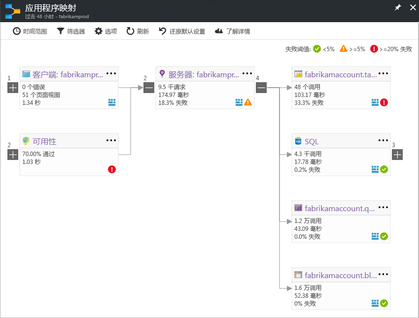

# Application Insights 中的应用程序映射
在 [Azure Application Insights](app-insights-overview.md) 中，应用程序映射是应用程序组件的依赖项关系的可视化布局。 每个组件显示负载、性能、故障和警报等 KPI，有助于发现导致性能问题或故障的任何组件。 可从任何组件单击以获得更详细的诊断，如 Application Insights 事件。 如果应用使用了 Azure 服务，还可以单击获得 Azure 诊断，如 SQL 数据库顾问建议。

与其他图一样，可以将应用程序映射固定到 Azure 仪表板，该映射可在其中完全正常运行。 

## 打开应用程序映射
从应用程序的概述边栏选项卡中打开映射：

该映射显示：

* 可用性测试
* 客户端组件（使用 JavaScript SDK 监视）
* 服务器端组件
* 客户端和服务器组件的依赖项

可展开和折叠依赖项链接组：

如果一种类型（SQL、HTTP 等）有许多依赖项，它们可能分组显示。 

## 发现问题
每个节点都有相关的性能指标，例如该组件的负载、性能和故障率。 

警告图标突出显示可能的问题。 橙色警告表示请求、页面视图或依赖项调用中出现故障。 红色表示故障率高于 5%。 如果要调整这些阈值，请打开“选项”。

活动警报还显示： 

如果使用 SQL Azure，在对性能改进方式有建议时，会显示一个图标。 

单击任何图标，获取更多详细信息：

## 诊断单击
映射上的每个节点都提供诊断的定向单击。 选项因节点类型而异。

对于在 Azure 中托管的组件，选项包括指向它们的直接链接。

## 筛选器和时间范围
默认情况下，映射概括了可用于所选时间范围的所有数据。 但可以进行筛选，以便仅包含特定操作名称或依赖项。

* 操作名称：这包括页面视图和服务器端请求类型。 使用此选项，映射将仅显示所选操作的服务器端/客户端节点上的 KPI。 它显示在这些特定操作的上下文中调用的依赖项。
* 依赖项基名称：这包括 AJAX 浏览器依赖项和服务器端依赖项。 如果使用 TrackDependency API 报告自定义依赖项遥测，它们也会显示在此处。 可以选择要显示在映射上的依赖项。 此选择当前不会筛选服务器端请求或客户端页面视图。

## 保存筛选器
要保存已应用的筛选器，请将筛选的视图固定到[仪表板](app-insights-dashboards.md)。

## 错误窗格
单击映射中的节点，会在右侧显示汇总该节点故障的错误窗格。 故障首先按操作 ID 分组，然后按问题 ID 分组。

单击故障可转到该故障的最新实例。

## 资源运行状况
对于某些资源类型，资源运行状况会显示在错误窗格的顶部。 例如，单击 SQL 节点会显示数据库运行状况和触发的任何警报。

可以单击资源名称，查看该资源的标准概述指标。

## 端到端系统应用映射

需要 SDK 2.3 或更高版本

如果应用程序具有多个组件（例如，除 Web 应用外还有后端服务），则通过一个集成的应用映射将其全部显示。

应用映射通过跟踪已安装 Application Insights SDK 的服务器之间进行的任何 HTTP 依赖项调用来查找服务器节点。 假定每个 Application Insights 资源包含一个服务器。

### 多角色应用映射（预览版）

预览版多角色应用映射功能允许使用包含多个服务器的应用映射将数据发送到相同的 Application Insights 资源/检测密钥。 映射中的服务器由遥测项上的 cloud_RoleName 属性进行分段。 在“预览”边栏选项卡上，将“多角色应用程序映射”设置为“启用”以启用此配置。

此方法可能适用于微服务应用程序，或需在单个 Application Insights 资源中跨多个服务器关联事件的方案。

## 视频

> [!VIDEO https://channel9.msdn.com/events/Connect/2016/112/player] 

## 反馈
请通过门户反馈选项提供反馈。

## 后续步骤

* [Azure 门户](https://portal.azure.com)
