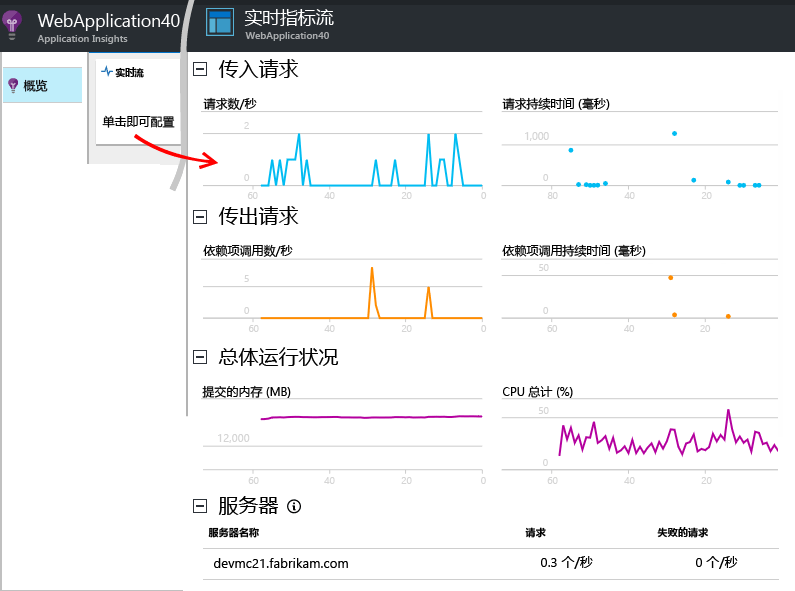
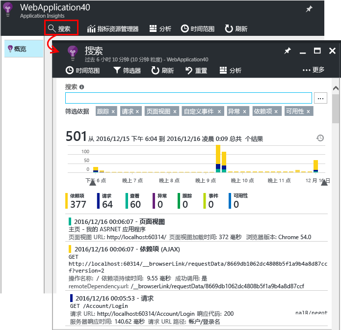
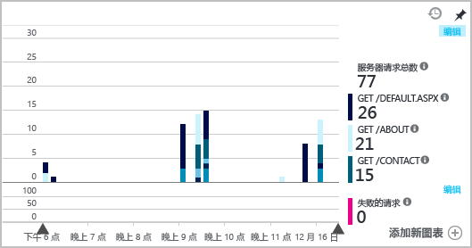
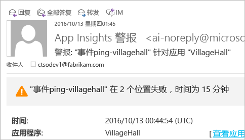

# <a name="set-up-application-insights-for-aspnet"></a>设置用于 ASP.NET 的 Application Insights
[Azure Application Insights](app-insights-overview.md) 监视实时应用程序，帮助[检测和诊断性能问题及异常](app-insights-detect-triage-diagnose.md)，同时[了解应用的使用情况](app-insights-overview-usage.md)。  它适用于在自有本地 IIS 服务器或云 VM 上托管的应用，以及 Azure Web 应用。

## <a name="before-you-start"></a>开始之前
你需要：

* Visual Studio 2013 Update 3 或更高版本。 版本越高越好。
* [Microsoft Azure](http://azure.com)订阅。 如果你的团队或组织拥有 Azure 订阅，则所有者可以使用你的 [Microsoft 帐户](http://live.com)将你加入其中。 

如果对以下内容感兴趣，请查看其他文章：

* [在运行时检测 Web 应用](app-insights-monitor-performance-live-website-now.md)
* [Azure 云服务](app-insights-cloudservices.md)

## <a name="a-nameidea-1-add-application-insights-sdk"></a><a name="ide"></a> 1.添加 Application Insights SDK
### <a name="if-its-a-new-project"></a>如果是新项目...
在 Visual Studio 中创建新项目时，确保选择 Application Insights。 


### <a name="-or-if-its-an-existing-project"></a>…如果是现有项目
右键单击解决方案资源管理器中的项目，然后选择“添加 Application Insights 遥测”或“配置 Application Insights”。


* ASP.NET Core 项目？ - [按照这些说明，修改几行代码](https://github.com/Microsoft/ApplicationInsights-aspnetcore/wiki/Getting-Started#add-application-insights-instrumentation-code-to-startupcs)。 

## <a name="a-nameruna-2-run-your-app"></a><a name="run"></a> 2.运行您的应用程序
使用 F5 运行应用程序并试用：打开不同的页面来生成一些遥测。

在 Visual Studio 中，将看到已记录事件的计数。 


## <a name="3-see-your-telemetry"></a>3.查看遥测...
### <a name="-in-visual-studio"></a>...在 Visual Studio 中
在 Visual Studio 中打开“Application Insights”窗口：单击“Application Insights”按钮，或在解决方案资源管理器中右键单击项目：


此视图（“调试会话中的数据”）显示在应用的服务器端生成的遥测。 使用这些筛选器进行试验，然后单击任何事件以查看更多详细信息。

* *没有数据？请确保时间范围正确，然后单击“搜索”图标。*

[了解有关 Visual Studio 中的 Application Insights Tools 的详细信息](app-insights-visual-studio.md)。

<a name="monitor"></a> 

### <a name="-in-the-portal"></a>...在门户中
除非选择“仅安装 SDK”  ，否则还可以在 Application Insights Web 门户中查看遥测。 

该门户中的图表、分析工具和仪表板比 Visual Studio 中的多。 

打开 Application Insights 资源 - 可以登录到 [Azure 门户](https://portal.azure.com/)，在门户中找到此资源，也可以右键单击 Visual Studio 中的项目，然后转到相应的位置。


* *访问错误？如果有多组 Microsoft 凭据，可能在登录时使用了错误的凭据组。在门户中注销，然后再次登录。*

门户会打开应用的遥测视图：

单击任何磁贴或图表以查看更多详细信息。

### <a name="more-detail-in-the-portal"></a>门户中的更多详细信息

* [**实时指标流**](app-insights-metrics-explorer.md#live-metrics-stream)近实时显示遥测。

    

    在应用运行的同时打开实时流，使之进行连接。

    实时流仅在发送遥测后显示遥测一分钟。 如需更多历史调查，请使用“搜索”、“指标资源管理器”和“分析”。 数据可能需要几分钟才会在这些位置显示。

* [**搜索**](app-insights-diagnostic-search.md)显示请求、异常和页面视图等各个事件。 可以按事件类型、术语匹配和属性值进行筛选。 单击任何事件即可查看其属性和相关事件。 

    

 * 在开发模式下，可能会看到大量的依赖项 (AJAX) 事件。 这些是在浏览器和服务器模拟器之间的同步。 若要隐藏它们，请单击“依赖项”筛选器。
* [**聚合指标**](app-insights-metrics-explorer.md)例如图表中显示的请求和失败率。 单击任何图表即可打开包含更多详细信息的边栏选项卡。 单击任意图表的“编辑”标记即可设置筛选器、大小等。
    
    

[了解有关在 Azure 门户中使用 Application Insights 的详细信息](app-insights-dashboards.md)。

## <a name="4-publish-your-app"></a>4.发布应用
将应用发布到 IIS 服务器或 Azure。 监视 [实时指标流](app-insights-metrics-explorer.md#live-metrics-stream) ，确保一切平稳运行。

将在 Application Insights 门户中看到遥测累积，还可在此监视指标、搜索遥测以及设置 [仪表板](app-insights-dashboards.md)。 还可以使用功能强大的 [分析查询语言](app-insights-analytics.md) 来分析使用情况和性能，或查找特定事件。 

也可以继续在 [Visual Studio](app-insights-visual-studio.md) 中借助诊断搜索和[趋势](app-insights-visual-studio-trends.md)等工具来分析遥测。

> [!NOTE]
> 如果应用发送的遥测足够达到[限制](app-insights-pricing.md#limits-summary)，自动[采样](app-insights-sampling.md)会打开。 采样可以减少从应用发送的遥测数量，同时为诊断保留相关数据。
> 
> 

## <a name="a-namelanda-what-did-add-application-insights-do"></a><a name="land"></a> “添加 Application Insights”执行哪些操作？
Application Insights 从应用将遥测发送到 Application Insights 门户（在 Microsoft Azure 中托管）：


因此该命令执行三个操作：

1. 将 Application Insights Web SDK NuGet 包添加到项目。 若要在 Visual Studio 中查看，请右键单击项目，然后选择“管理 NuGet 包”。
2. 在 [Azure 门户](https://portal.azure.com/)中创建 Application Insights 资源。 这是可以查看数据的位置。 它会检索可标识资源的 *检测密钥* 。
3. 在 `ApplicationInsights.config`中插入检测密钥，以便 SDK 可以将遥测发送到门户。

如果需要，可以为 [ASP.NET 4](app-insights-windows-services.md) 或 [ASP.NET Core](https://github.com/Microsoft/ApplicationInsights-aspnetcore/wiki/Getting-Started) 手动执行这些步骤。

### <a name="to-upgrade-to-future-sdk-versions"></a>升级到 SDK 的未来版本
若要升级到 [SDK 的新版本](https://github.com/Microsoft/ApplicationInsights-dotnet-server/releases)，请再次打开 NuGet 包管理器，然后筛选已安装的包。 选择 Microsoft.ApplicationInsights.Web，然后选择“升级”。

如果对 ApplicationInsights.config 执行了任何自定义操作，请在升级前保存相关副本，并在升级后将更改合并到新版本中。

## <a name="add-more-telemetry"></a>添加更多遥测
### <a name="web-pages-and-single-page-apps"></a>网页和单页应用
1. [将 JavaScript 代码片段添加到网页](app-insights-javascript.md)可用以下相关数据点亮浏览器和使用情况边栏选项卡：页面视图、加载时间、浏览器异常、AJAX 调用性能、用户和会话计数。
2. [为自定义事件编写代码](app-insights-api-custom-events-metrics.md)可对用户操作进行计数、计时或度量。

### <a name="dependencies-exceptions-and-performance-counters"></a>依赖项、异常和性能计数器
在每个服务器计算机上[安装状态监视器](app-insights-monitor-performance-live-website-now.md)，可获取有关应用的其他遥测数据。 以下是你获得的内容：

* [性能计数器](app-insights-performance-counters.md) - 
  CPU、内存、磁盘及其他与应用相关的性能计数器。 
* [异常](app-insights-asp-net-exceptions.md) - 有关一些异常的更详细遥测数据。
* [依赖项](app-insights-asp-net-dependencies.md) - 调用 REST API 或 SQL 服务。 了解外部组件的响应速度慢是否会导致应用出现性能问题。 （如果应用在 .NET 4.6 上运行，则不需要状态监视器，即可获取这些遥测数据。）

### <a name="diagnostic-code"></a>诊断代码
遇到了问题？ 如果要在应用中插入代码以帮助诊断，可以使用几个选项：

* [捕获日志跟踪](app-insights-asp-net-trace-logs.md)：如果已在使用 Log4N、NLog 或 System.Diagnostics.Trace 记录跟踪事件，则可以将输出发送到 Application Insights，以便将它与请求相关联，搜索它，并对其进行分析。 
* [自定义事件和指标](app-insights-api-custom-events-metrics.md)：在服务器或网页代码中使用 TrackEvent() 和 TrackMetric()。
* [使用其他属性标记遥测](app-insights-api-filtering-sampling.md#add-properties)

使用[搜索](app-insights-diagnostic-search.md)来查找和关联特定事件，并进行[分析](app-insights-analytics.md)以执行更强大的查询。

## <a name="alerts"></a>警报
第一个了解你的应用是否出现问题。 （不等到用户告诉你！） 

* [创建 Web 测试](app-insights-monitor-web-app-availability.md)，确保你的站点可在 Web 上可见。
* 自动运行[主动诊断](app-insights-proactive-diagnostics.md)（如果你的应用具有某些最少的流量）。 无需执行任何操作来设置它们。 它们会告诉你应用是否具有异常的失败请求速率。
* [设置指标警报](app-insights-alerts.md)，在某个度量值超过阈值时，向你发出警告。 可以在编码到应用中的自定义指标中设置它们。

默认情况下，警报通知将发送给 Azure 订阅的所有者。 



## <a name="version-and-release-tracking"></a>版本和发行版本跟踪
### <a name="track-application-version"></a>跟踪应用程序版本
请确保 `buildinfo.config` 由 MSBuild 进程生成。 在 .csproj 文件中，添加：  

```XML

    <PropertyGroup>
      <GenerateBuildInfoConfigFile>true</GenerateBuildInfoConfigFile>    <IncludeServerNameInBuildInfo>true</IncludeServerNameInBuildInfo>
    </PropertyGroup> 
```

当它具有内部信息时，Application Insights Web 模块自动将**应用程序版本**作为属性添加到每个遥测项。 这允许你在执行[诊断搜索](app-insights-diagnostic-search.md)时或在[浏览指标](app-insights-metrics-explorer.md)时按版本进行筛选。 

但请注意，内部版本号仅由 MS Build，而不是 Visual Studio 内部的开发人员生成。

### <a name="release-annotations"></a>版本注释
如果使用 Visual Studio Team Services，则可以在每次发布新版本时将[批注标记](app-insights-annotations.md)添加到图表中。


## <a name="next-steps"></a>后续步骤
|  |
| --- | --- |
| **[在 Visual Studio 中使用 Application Insights](app-insights-visual-studio.md)**<br/>使用遥测调试、诊断搜索、钻取代码。 |
| **[使用 Application Insights 门户](app-insights-dashboards.md)**<br/>仪表板、功能强大的诊断和分析工具、警报、应用程序的实时依赖项映射和遥测导出。 |
| **[添加更多数据](app-insights-asp-net-more.md)**<br/>监视使用情况、可用性、依赖项、异常。 集成来自记录框架的跟踪。 编写自定义遥测。 |


<!--HONumber=Dec16_HO3-->


