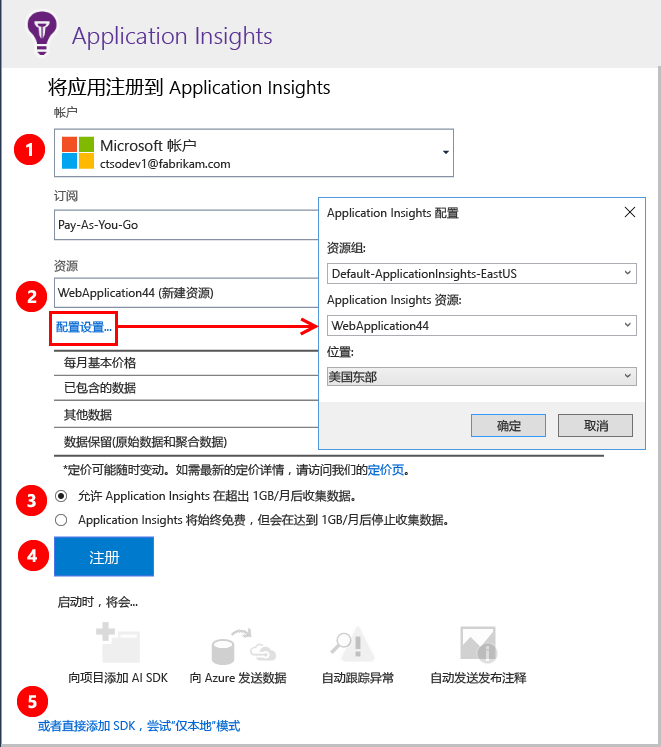

# <a name="set-up-application-insights-for-your-aspnet-website"></a>为 ASP.NET 网站设置 Application Insights
[Azure Application Insights](app-insights-overview.md) 监视实时应用程序，帮助[检测和诊断性能问题及异常](app-insights-detect-triage-diagnose.md)。 它还可以帮助[了解应用的使用情况](app-insights-overview-usage.md)。 它适用于 Azure 应用服务的 Web 应用功能，以及在自有本地 IIS 服务器或云 VM 上托管的应用。

## <a name="before-you-start"></a>开始之前
你需要：

* Visual Studio 2013 Update 3 或更高版本。 版本越高越好。
* [Microsoft Azure](http://azure.com)订阅。 如果你的团队或组织拥有 Azure 订阅，则所有者可以使用你的 [Microsoft 帐户](http://live.com)将你加入其中。

如果对以下主题感兴趣，请查看其他相关文章：

* [在运行时检测 Web 应用](app-insights-monitor-performance-live-website-now.md)
* [Azure 云服务](app-insights-cloudservices.md)

## <a name="ide"></a>步骤 1：添加 Application Insights SDK

在解决方案资源管理器中右键单击你的 Web 应用，然后选择“添加”、“Application Insights 遥测...”或“配置 Application Insights”。


（在 Visual Studio 2015 中，还可以使用一个选项在“新建项目”对话框中添加 Application Insights。）

转到 Application Insights 配置页：



1. 选择用于访问 Azure 的帐户和订阅。
2. 在 Azure 中，选择要在其中查看应用数据的资源。 通常需要为每个应用单独创建一个资源。 如果想要设置用于存储数据的资源组或位置，请单击“配置设置”。 资源组用于控制对数据的访问。 例如，如果有多个应用构成了同一个系统的一部分，可在同一个资源组中放置这些应用的 Application Insights 数据。
3. 只要不超过特定的遥测量，Application Insights 都是免费的。 可对遥测量施加上限，避免产生费用。 创建资源后，可以通过在门户中打开“功能 + 定价”、“数据量管理”、“每日数量上限”，来更改选择。
4. 单击“注册”，继续为 Web 应用配置 Application Insights。 在调试期间以及发布应用后，遥测数据将发送到 [Azure 门户](https://portal.azure.com)。
5. 此外，也可以将 Application Insights SDK 添加到应用。 这样，在调试时便可以在 Visual Studio 中查看遥测数据。 稍后可以返回此配置页，或者等到部署应用后，启用[在运行时打开遥测](app-insights-monitor-performance-live-website-now.md)。


## <a name="run"></a>步骤 2：运行应用
使用 F5 运行应用。 打开不同的页以生成一些遥测数据。

在 Visual Studio 中，将看到已记录事件的计数。


## <a name="step-3-see-your-telemetry-in-visual-studio-or-application-insights"></a>步骤 3：在 Visual Studio 或 Application Insights 中查看遥测数据
可在 Visual Studio 或 Application Insights Web 门户中查看遥测数据。

**在 Visual Studio 中**打开 Application Insights 窗口。 单击“Application Insights”按钮，或在解决方案资源管理器中右键单击项目，然后单击“搜索实时遥测数据”。

在 Visual Studio Application Insights 搜索窗口中，查看“来自调试会话的数据”视图，其中显示了在应用的服务器端生成的遥测数据。 使用这些筛选器进行试验，然后单击任何事件以查看更多详细信息。


> [!NOTE]
> 如果看不到任何数据，请确保时间范围正确，然后单击“搜索”图标。

[了解有关 Visual Studio 中的 Application Insights Tools 的详细信息](app-insights-visual-studio.md)。

<a name="monitor"></a>
### <a name="the-application-insights-web-portal"></a>Application Insights Web 门户
除非选择仅安装 SDK，否则还可以**在 Application Insights Web 门户**中查看遥测数据。 该门户中的图表、分析工具和仪表板比 Visual Studio 中的多。

打开 Application Insights 资源。 登录到 [Azure 门户](https://portal.azure.com/)并在其中找到该资源，或者在 Visual Studio 中右键单击项目转到相应的位置。


> [!NOTE]
> 如果收到访问错误：你是否有多个 Microsoft 凭据集？是否登录时使用了错误的凭据集？ 请在门户中注销，然后再次登录。

门户将从应用打开遥测视图。


单击任何磁贴或图表以查看更多详细信息。

### <a name="more-details-in-the-application-insights-web-portal"></a>Application Insights Web 门户中的更多详细信息
下面是有关门户如何提供更多详细信息的一些示例。

* [**实时指标流**](app-insights-live-stream.md)近实时显示遥测。

    

    在运行应用的同时打开“实时指标流”，使流能够建立连接。

    实时指标流仅显示过去一分钟内发送的遥测数据。 如需更多历史调查，请使用“搜索”、“指标资源管理器”和“分析”。 数据可能需要几分钟才会在这些位置显示。

* [**搜索**](app-insights-diagnostic-search.md)显示请求、异常和页面视图等各个事件。 可以按事件类型、术语匹配和属性值进行筛选。 单击任何事件即可查看其属性和相关事件。

    

 * 在开发模式下，可能会看到大量的依赖项 (AJAX) 事件。 这些是在浏览器和服务器模拟器之间的同步。 若要隐藏它们，请单击“依赖项”筛选器。
* [**聚合指标**](app-insights-metrics-explorer.md)例如图表中显示的请求和失败率。 单击任何图表即可打开包含更多详细信息的边栏选项卡。 单击任意图表的“编辑”标记可设置筛选器和大小。

    

[了解有关在 Azure 门户中使用 Application Insights 的详细信息](app-insights-dashboards.md)。

## <a name="step-4-publish-your-app"></a>步骤 4：发布应用
将应用发布到 IIS 服务器或 Azure。 监视 [实时指标流](app-insights-metrics-explorer.md#live-metrics-stream) ，确保一切平稳运行。

遥测数据将在 Application Insights 门户中累积，可在此监视指标、搜索遥测数据以及设置[仪表板](app-insights-dashboards.md)。 还可以使用功能强大的[分析查询语言](app-insights-analytics.md)来分析使用情况和性能，或查找特定的事件。

还可以继续在 [Visual Studio](app-insights-visual-studio.md) 中借助诊断搜索和[趋势](app-insights-visual-studio-trends.md)等工具来分析遥测。

> [!NOTE]
> 如果应用发送的遥测足够达到[限制](app-insights-pricing.md#limits-summary)，自动[采样](app-insights-sampling.md)会打开。 采样可以减少从应用发送的遥测数量，同时为诊断保留相关数据。
>
>

## <a name="land"></a>“添加 Application Insights”命令有什么作用？
Application Insights 将遥测数据从应用发送到 Application Insights 门户（在 Azure 中托管）。


因此，该命令执行三项操作：

1. 将 Application Insights Web SDK NuGet 包添加到项目。 若要在 Visual Studio 中查看，请右键单击项目，然后选择“管理 NuGet 包”。
2. 在 [Azure 门户](https://portal.azure.com/)中创建 Application Insights 资源。 可在门户中查看数据。 它会检索可标识资源的*检测密钥*。
3. 在 `ApplicationInsights.config`中插入检测密钥，以便 SDK 可以将遥测发送到门户。

如果需要，可以为 [ASP.NET 4](app-insights-windows-services.md) 或 [ASP.NET Core](https://github.com/Microsoft/ApplicationInsights-aspnetcore/wiki/Getting-Started) 手动执行这些步骤。

### <a name="upgrade-to-future-sdk-versions"></a>升级到更高的 SDK 版本
若要升级到 [SDK 的新版本](https://github.com/Microsoft/ApplicationInsights-dotnet-server/releases)，请再次打开 **NuGet 包管理器**，然后筛选已安装的包。 选择“Microsoft.ApplicationInsights.Web”，然后选择“升级”。

如果对 ApplicationInsights.config 执行了任何自定义操作，请在升级前保存相关副本。 然后，将更改合并到新版本中。

## <a name="add-more-telemetry"></a>添加更多遥测
下面是可以添加的其他类型的遥测。
### <a name="dependencies-exceptions-and-performance-counters"></a>依赖项、异常和性能计数器

在每台 IIS 服务器计算机上[安装状态监视器](http://go.microsoft.com/fwlink/?LinkId=506648)，获取有关 Web 应用的其他遥测数据。 如果已安装，无需重新执行任何其他操作。 （你可能已使用状态监视器开始在运行时监视应用。）

在生成时 SDK 的基础上使用状态监视器，可以获得更完整的遥测数据集，其中包括：

* [性能计数器](app-insights-performance-counters.md)：CPU、内存、磁盘及其他与应用相关的性能计数器。
* [异常](app-insights-asp-net-exceptions.md)：有关一些异常的更详细遥测数据。
* [依赖项](app-insights-asp-net-dependencies.md)：包括返回值。

### <a name="webpages-and-single-page-apps"></a>网页和单页应用
1. 在网页中[添加 JavaScript 代码片段](app-insights-javascript.md)可显示有关页面视图、加载时间、浏览器异常、AJAX 调用性能、用户和会话计数的数据。 这些数据显示在“浏览器”和“使用情况”边栏选项卡中。
2. [为自定义事件编写代码](app-insights-api-custom-events-metrics.md)可对用户操作进行计数、计时或度量。


### <a name="diagnostic-code"></a>诊断代码
遇到了问题？ 如果要在应用中插入代码以帮助诊断，可以使用几个选项：

* [捕获日志跟踪](app-insights-asp-net-trace-logs.md)：如果已在使用 Log4N、NLog 或 System.Diagnostics.Trace 记录跟踪事件，则可以将输出发送到 Application Insights。 可将这些输出与请求相关联、对其进行搜索或进行分析。
* [自定义事件和指标](app-insights-api-custom-events-metrics.md)：在服务器或网页代码中使用 TrackEvent() 和 TrackMetric()。
* [使用其他属性标记遥测数据](app-insights-api-filtering-sampling.md#add-properties)。

使用[搜索](app-insights-diagnostic-search.md)来查找和关联特定事件，并进行[分析](app-insights-analytics.md)以执行更强大的查询。

## <a name="alerts"></a>警报
第一个了解你的应用是否出现问题。

* [可用性测试](app-insights-monitor-web-app-availability.md)：创建测试来确保站点在 Web 上可见。
* [智能诊断](app-insights-proactive-diagnostics.md)：这些测试可自动运行，因此不需要进行任何设置。 它们会告诉你应用是否具有异常的失败请求速率。
* [指标警报](app-insights-alerts.md)：设置这些警报可在某个指标超过阈值时发出警告。 可以在编码到应用中的自定义指标中设置它们。

默认情况下，警报通知将发送给 Azure 订阅的所有者。


## <a name="version-and-release-tracking"></a>版本和发行版本跟踪
若要跟踪应用程序版本，请确保 Microsoft 生成引擎进程生成了 `buildinfo.config`。 在 .csproj 文件中，添加：  

```XML

    <PropertyGroup>
      <GenerateBuildInfoConfigFile>true</GenerateBuildInfoConfigFile>    <IncludeServerNameInBuildInfo>true</IncludeServerNameInBuildInfo>
    </PropertyGroup>
```

当它具有内部信息时，Application Insights Web 模块自动将**应用程序版本**作为属性添加到每个遥测项。 这样，便可以在执行[诊断搜索](app-insights-diagnostic-search.md)或[浏览指标](app-insights-metrics-explorer.md)时按版本进行筛选。

但请注意，内部版本号只能由 Microsoft 生成引擎生成，而不能由 Visual Studio 中的开发人员生成引擎生成。

### <a name="release-annotations"></a>版本注释
如果使用 Visual Studio Team Services，则可以在每次发布新版本时将[批注标记](app-insights-annotations.md)添加到图表中。 下图显示了此标记的形式。


## <a name="video"></a>视频

> [!VIDEO https://channel9.msdn.com/events/Connect/2016/100/player]

## <a name="next-steps"></a>后续步骤
**[在 Visual Studio 中使用 Application Insights](app-insights-visual-studio.md)**<br/>包含有关使用遥测数据进行调试、诊断搜索和钻取代码的信息。

**[使用 Application Insights 门户](app-insights-dashboards.md)**<br/> 包含有关仪表板、功能强大的诊断和分析工具、警报、应用程序的实时依赖项映射和遥测数据导出功能的信息。

