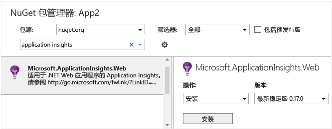

# <a name="application-insights-for-azure-cloud-services"></a>适用于 Azure 云服务的 Application Insights
可以通过 [Application Insights][start] 来监视 [Microsoft Azure 云服务应用](https://azure.microsoft.com/services/cloud-services/)的可用性、性能、故障情况和使用情况，只需将 Application Insights 的 SDK 提供的数据与云服务提供的 [Azure 诊断](https://docs.microsoft.com/en-us/azure/monitoring-and-diagnostics/azure-diagnostics)数据进行组合分析即可。 通过收到的有关应用在现实中的性能和有效性的反馈，可以针对每个开发生命周期确定合理的设计方向。


## <a name="before-you-start"></a>开始之前
需要：

* 一个 [Microsoft Azure](http://azure.com) 订阅。 使用 Microsoft 帐户登录，该帐户可能适用于 Windows、XBox Live 或其他 Microsoft 云服务。 
* Microsoft Azure SDK 2.9 或更高版本
* Developer Analytics Tools 7.10 或更高版本

## <a name="quick-start"></a>快速启动
使用 Application Insights 监视云服务的最快、最简单方法是将服务发布到 Azure 时选择 Application Insights 选项。


此选项可在运行时检测应用，提供监视请求所需的全部遥测数据、Web 角色中的异常和依赖项，以及辅助角色中的性能计数器。 应用生成的所有诊断跟踪也会发送到 Application Insights。

如果这就是你所需的全部信息，Application Insights 完全可以满足要求。 后续步骤是[通过应用查看指标](app-insights-metrics-explorer.md)、[使用 Analytics 查询数据](app-insights-analytics.md)，以及设置[仪表板](app-insights-dashboards.md)。 可以设置[可用性测试](app-insights-monitor-web-app-availability.md)并[将代码添加到网页](app-insights-javascript.md)，以便在浏览器中监视性能。

但是，也可以使用更多选项：

* 通过不同的组件发送数据，以及在单独的资源上生成配置。
* 通过应用添加自定义遥测。

如果对这些选项感兴趣，请继续阅读。

## <a name="sample-application-instrumented-with-application-insights"></a>使用 Application Insights 检测的示例应用程序
请看一下此[示例应用程序](https://github.com/Microsoft/ApplicationInsights-Home/tree/master/Samples/AzureEmailService)，其 Application Insights 已添加到一个云服务，该服务包含两个在 Azure 中托管的辅助角色。 

以下内容说明如何以相同的方式改编云服务项目。

## <a name="plan-resources-and-resource-groups"></a>规划资源和资源组
应用中的遥测数据在 Application Insights 类型的 Azure 资源中进行存储、分析和显示。 

每个资源属于一个资源组。 资源组用于管理成本、向团队成员授予访问权限，以及在单个协调式事务中部署更新。 例如，可以[编写一个脚本](../azure-resource-manager/resource-group-template-deploy.md)，通过一个操作部署 Azure 云服务及其 Application Insights 监视资源。

### <a name="resources-for-components"></a>组件的资源
建议的方案是为应用程序的每个组件（即，每个 Web 角色和辅助角色）单独创建一个资源。 可以单独分析每个组件，但也可以创建[仪表板](app-insights-dashboards.md)，将所有组件中的关键图表汇总到一起，以便可以统一比较和监视资源。 

备选方案是将多个角色中的遥测数据发送到同一个资源，但[将维度属性添加到标识其源角色的每个遥测项](app-insights-api-filtering-sampling.md#add-properties-itelemetryinitializer)。 在此方案中，异常等指标图表通常显示不同角色的计数汇总，但你可根据需要按角色标识符将图表分段。 此外，还可以按同一个维度筛选搜索结果。 使用这种备选方法可以方便一次性查看所有信息，但同时可能导致在角色之间产生一定的混淆。

浏览器遥测数据通常包含在与服务器端 Web 角色相同的资源中。

可将不同组件的 Application Insights 资源放在一个资源组中。 这样可以方便统一管理这些资源。 

### <a name="separating-development-test-and-production"></a>将开发、测试和生产数据隔离
要开发适合下一功能的自定义事件但上一版本仍有效，可将开发遥测数据发送到独立的 Application Insights 资源。 否则，很难在实时站点的所有流量中找到测试遥测数据。

为了避免这种情况，可以单独为系统的每个生成配置或“戳记”（开发、测试、生产...）创建资源。 将每个生成配置的资源放在独立的资源组中。 

要将遥测数据发送到相应的资源，可以设置 Application Insights SDK，使其根据生成配置选择不同的检测密钥。 

## <a name="create-an-application-insights-resource-for-each-role"></a>为每个角色创建 Application Insights 资源
如果决定为每个角色单独创建资源（也许是为每个生成配置单独创建资源集），最简单的方法是在 Application Insights 门户中创建这些资源。 （如果要创建大量的资源，可以[将创建过程自动化](app-insights-powershell.md)。

1. 在 [Azure 门户][portal]中，创建新的 Application Insights 资源。 对于应用程序类型，选择 ASP.NET 应用。 

    
2. 请注意，每个资源都由检测密钥标识。 以后若要手动配置或验证 SDK 的配置，可能需要使用该检测密钥。

     

## <a name="set-up-azure-diagnostics-for-each-role"></a>为每个角色设置 Azure 诊断
设置此选项可以使用 Application Insights 监视应用。 对于 Web 角色，此选项可提供性能监视、警报、诊断以及使用情况分析。 对于其他角色，可以搜索和监视 Azure 诊断信息，例如重新启动、性能计数器和对 System.Diagnostics.Trace 的调用。 

1. 在 Visual Studio 解决方案资源管理器中的“YourCloudService”、“角色”下面，打开每个角色的属性。&lt;&gt;
2. 在“配置”中，设置“将诊断数据发送到 Application Insights”，然后选择前面创建的相应 Application Insights 资源。

如果决定对每个生成配置使用不同的 Application Insights 资源，请先选择该配置。


这相当于将 Application Insights 检测密钥插入到名为 `ServiceConfiguration.*.cscfg` 的文件。 （[示例代码](https://github.com/Microsoft/ApplicationInsights-Home/blob/master/Samples/AzureEmailService/AzureEmailService/ServiceConfiguration.Cloud.cscfg)）。

若要改变发送到 Application Insights 的诊断信息级别，可[直接编辑 `.cscfg` 文件](app-insights-azure-diagnostics.md)进行此操作。

## <a name="sdk"></a>在每个项目中安装 SDK
使用此选项可将自定义的业务遥测数据添加到任何角色，以便更细致地分析应用程序的用法和性能。

在 Visual Studio 中，为每个云应用项目配置 Application Insights SDK。

1. **Web 角色**：右键单击项目，并选择“配置 Application Insights”或“添加”>“Application Insights 遥测”。

2. **辅助角色**： 
 * 右键单击项目，并选择“管理 Nuget 包”。
 * 添加[适用于 Windows Server 的 Application Insights](https://www.nuget.org/packages/Microsoft.ApplicationInsights.WindowsServer/)。

    

3. 将 SDK 配置为向 Application Insights 资源发送数据。

    在适当的启动函数中，通过 .cscfg 文件中的配置设置指定检测密钥：
 
    ```C#
   
     TelemetryConfiguration.Active.InstrumentationKey = RoleEnvironment.GetConfigurationSettingValue("APPINSIGHTS_INSTRUMENTATIONKEY");
    ```
   
    请针对应用程序中的每个角色执行此操作。 参阅示例：
   
   * [Web 角色](https://github.com/Microsoft/ApplicationInsights-Home/blob/master/Samples/AzureEmailService/MvcWebRole/Global.asax.cs#L27)
   * [辅助角色](https://github.com/Microsoft/ApplicationInsights-Home/blob/master/Samples/AzureEmailService/WorkerRoleA/WorkerRoleA.cs#L232)
   * [网页](https://github.com/Microsoft/ApplicationInsights-Home/blob/master/Samples/AzureEmailService/MvcWebRole/Views/Shared/_Layout.cshtml#L13) 
4. 将 ApplicationInsights.config 文件设置为始终复制到输出目录。 
   
    （在 .config 文件中，可以看到消息询问将检测密钥放到该处。 但是，对于云应用程序，最好是通过 .cscfg 文件设置检测密钥。 这可以确保在门户中正确识别角色。）

#### <a name="run-and-publish-the-app"></a>运行并发布应用
运行应用并登录到 Azure。 打开创建的 Application Insights 资源，此时可以看到[搜索](app-insights-diagnostic-search.md)中显示了每个数据点，并且[指标资源管理器](app-insights-metrics-explorer.md)中显示了聚合数据。 

添加更多遥测数据 - 请参阅以下部分 - 并发布应用以获取实时诊断和用法反馈。 

#### <a name="no-data"></a>没有数据？
* 打开[“搜索”][diagnostic]磁贴，查看各个事件。
* 使用应用程序打开不同的页面，以生成一些遥测。
* 请等待几秒钟，并单击“刷新”。
* 请参阅[故障排除][qna]。

## <a name="view-azure-diagnostic-events"></a>查看 Azure 诊断事件
在 Application Insights 中的何处查找 [Azure 诊断](https://docs.microsoft.com/en-us/azure/monitoring-and-diagnostics/azure-diagnostics)信息：

* 性能计数器显示为自定义指标。 
* Windows 事件日志显示为跟踪和自定义事件。
* 应用程序日志、ETW 日志和所有诊断基础结构日志均显示为跟踪。

若要查看性能计数器和事件计数，请打开[指标资源管理器](app-insights-metrics-explorer.md)并添加新图表：


使用[搜索](app-insights-diagnostic-search.md)或[分析查询](app-insights-analytics-tour.md)功能在 Azure 诊断发送的各种跟踪日志中进行搜索。 例如，假设具有导致角色崩溃和再循环的未经处理的异常。 该信息会在应用程序通道的 Windows 事件日志中显示。 可使用“搜索”功能查看 Windows 事件日志错误，并获取异常的完整堆栈跟踪。 这会帮助你找到问题的根本原因。


## <a name="more-telemetry"></a>其他遥测数据
以下部分说明如何从应用程序的不同层面获取其他遥测数据。

## <a name="track-requests-from-worker-roles"></a>从辅助角色跟踪请求
在 Web 角色中，请求模块会自动收集有关 HTTP 请求的数据。 有关如何覆盖默认收集行为的示例，请参阅[示例 MVCWebRole](https://github.com/Microsoft/ApplicationInsights-Home/tree/master/Samples/AzureEmailService/MvcWebRole)。 

可以像跟踪 HTTP 请求一样捕获辅助角色调用的性能。 在 Application Insights 中，请求遥测类型用于测量一个单位的可计时且可独立成功/失败的命名服务器端工作。 当 SDK 自动捕获 HTTP 请求时，可以插入自己的代码来跟踪针对辅助角色发出的请求。

参阅报告请求的两个检测示例辅助角色：[WorkerRoleA](https://github.com/Microsoft/ApplicationInsights-Home/tree/master/Samples/AzureEmailService/WorkerRoleA) 和 [WorkerRoleB](https://github.com/Microsoft/ApplicationInsights-Home/tree/master/Samples/AzureEmailService/WorkerRoleB)

## <a name="exceptions"></a>异常
有关如何从不同的 Web 应用程序类型收集未经处理的异常的信息，请参阅 [Monitoring Exceptions in Application Insights](app-insights-asp-net-exceptions.md)（在 Application Insights 中监视异常）。

该示例 Web 角色包含 MVC5 和 Web API 2 控制器。 可使用以下处理程序捕获这两个控制器的未经处理的异常：

* 按[此处](https://github.com/Microsoft/ApplicationInsights-Home/blob/master/Samples/AzureEmailService/MvcWebRole/App_Start/FilterConfig.cs#L12)所示设置 MVC5 控制器的 [AiHandleErrorAttribute](https://github.com/Microsoft/ApplicationInsights-Home/blob/master/Samples/AzureEmailService/MvcWebRole/Telemetry/AiHandleErrorAttribute.cs)
* 按[此处](https://github.com/Microsoft/ApplicationInsights-Home/blob/master/Samples/AzureEmailService/MvcWebRole/App_Start/WebApiConfig.cs#L25)所示设置 Web API 2 控制器的 [AiWebApiExceptionLogger](https://github.com/Microsoft/ApplicationInsights-Home/blob/master/Samples/AzureEmailService/MvcWebRole/Telemetry/AiWebApiExceptionLogger.cs)

对于辅助角色，可通过两种方式跟踪异常：

* TrackException(ex)
* 如果已添加 Application Insights 跟踪侦听器 NuGet 包，可使用 **System.Diagnostics.Trace** 记录异常。 [代码示例](https://github.com/Microsoft/ApplicationInsights-Home/blob/master/Samples/AzureEmailService/WorkerRoleA/WorkerRoleA.cs#L107)

## <a name="performance-counters"></a>性能计数器
默认收集以下计数器：

    * \Process(??APP_WIN32_PROC??)\%处理器时间
    * \Memory\Available Bytes
    * \.NET CLR Exceptions(??APP_CLR_PROC??)\# of Exceps Thrown / sec
    * \Process(??APP_WIN32_PROC??)\Private Bytes
    * \Process(??APP_WIN32_PROC??)\IO Data Bytes/sec
    * \Processor(_Total)\% Processor Time

对于 Web 角色，还将收集以下计数器：

    * \ASP.NET Applications(??APP_W3SVC_PROC??)\Requests/Sec
    * \ASP.NET Applications(??APP_W3SVC_PROC??)\Request Execution Time
    * \ASP.NET Applications(??APP_W3SVC_PROC??)\Requests In Application Queue

可通过编辑 ApplicationInsights.config 指定其他自定义或其他 windows 性能计数器，[如此示例中所示](https://github.com/Microsoft/ApplicationInsights-Home/blob/master/Samples/AzureEmailService/WorkerRoleA/ApplicationInsights.config#L14)。

  

## <a name="correlated-telemetry-for-worker-roles"></a>辅助角色的关联遥测数据
Application Insights 提供丰富的诊断体验，可让用户查明请求失败或请求长时间延迟的原因。 使用 Web 角色，SDK 可在相关遥测数据之间自动设置关联。 对于辅助角色，使用自定义遥测初始值设定项为所有遥测设置一个通用的 Operation.Id 上下文属性即可实现此目的。 这样，延迟/失败问题是否由依赖项或代码造成便一目了然！ 

方法如下：

* 如[此处](https://github.com/Microsoft/ApplicationInsights-Home/blob/master/Samples/AzureEmailService/WorkerRoleA/WorkerRoleA.cs#L36)所示，将关联 ID 设置到 CallContext 中。 在本例中，我们使用了请求 ID 作为关联 ID
* 添加自定义 TelemetryInitializer 实现，将 Operation.Id 设置为先前所设的 correlationId。 相关示例请参见 [ItemCorrelationTelemetryInitializer](https://github.com/Microsoft/ApplicationInsights-Home/blob/master/Samples/AzureEmailService/WorkerRoleA/Telemetry/ItemCorrelationTelemetryInitializer.cs#L13)
* 添加自定义遥测初始值设定项。 可以在 ApplicationInsights.config 文件或代码中执行该操作，如[此处](https://github.com/Microsoft/ApplicationInsights-Home/blob/master/Samples/AzureEmailService/WorkerRoleA/WorkerRoleA.cs#L233)所示

就这么简单！ 门户中的体验随时可以提供，帮助你一目了然地查看所有关联的遥测数据：


## <a name="client-telemetry"></a>客户端遥测数据
[将 JavaScript SDK 添加到网页][client]，以获取基于浏览器的遥测数据（例如页面视图计数、页面加载时间、脚本异常），并允许在页面脚本中编写自定义遥测。

## <a name="availability-tests"></a>可用性测试
[设置 Web 测试][availability]，确保应用程序处于活动状态且能够做出响应。

## <a name="display-everything-together"></a>统一显示所有信息
要获取系统的整体视图，可以将关键监视图表统合到一个[仪表板](app-insights-dashboards.md)中。 例如，可以固定每个角色的请求和失败次数。 

如果系统使用其他 Azure 服务（例如流分析），也可以包含这些服务的监视图表。 

如果在使用客户端移动应用，可以插入一些代码来发送有关重要用户操作的自定义事件，并创建 [HockeyApp 桥](app-insights-hockeyapp-bridge-app.md)。 在 [Analytics](app-insights-analytics.md) 中创建查询来显示事件计数，并将事件固定到仪表板。

## <a name="example"></a>示例
[该示例](https://github.com/Microsoft/ApplicationInsights-Home/tree/master/Samples/AzureEmailService)监视包含一个 Web 角色和两个辅助角色的服务。

## <a name="exception-method-not-found-on-running-in-azure-cloud-services"></a>在 Azure 云服务中运行时发生“找不到方法”异常
生成的项目是否面向 .NET 4.6？ Azure 云服务角色不能现成地支持 4.6。 请先[在每个角色上安装 4.6](../cloud-services/cloud-services-dotnet-install-dotnet.md)，再运行应用。

## <a name="video"></a>视频

> [!VIDEO https://channel9.msdn.com/events/Connect/2016/100/player]

## <a name="next-steps"></a>后续步骤
* [将 Azure 诊断配置为向 Application Insights 发送数据](app-insights-azure-diagnostics.md)
* [自动创建 Application Insights 资源](app-insights-powershell.md)
* [自动化 Azure 诊断](app-insights-powershell-azure-diagnostics.md)
* [Azure Functions](https://github.com/christopheranderson/azure-functions-app-insights-sample)

[api]: app-insights-api-custom-events-metrics.md
[availability]: app-insights-monitor-web-app-availability.md
[azure]: app-insights-azure.md
[client]: app-insights-javascript.md
[diagnostic]: app-insights-diagnostic-search.md
[netlogs]: app-insights-asp-net-trace-logs.md
[portal]: http://portal.azure.com/
[qna]: app-insights-troubleshoot-faq.md
[redfield]: app-insights-monitor-performance-live-website-now.md
[start]: app-insights-overview.md 
