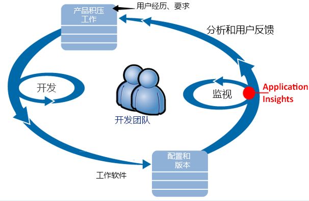
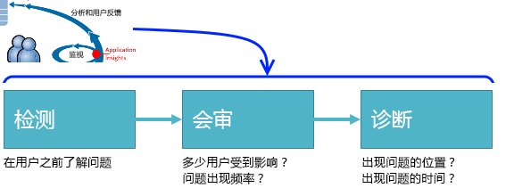
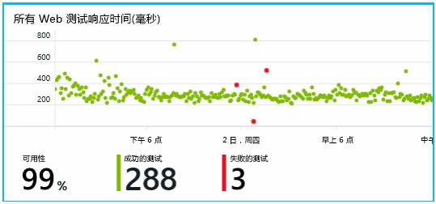
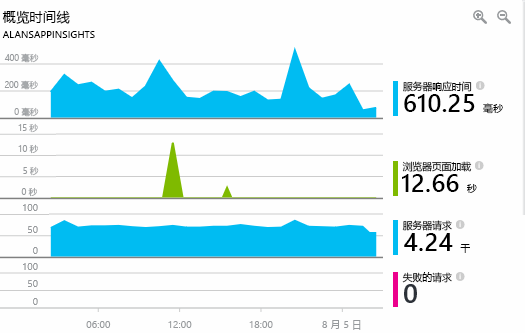
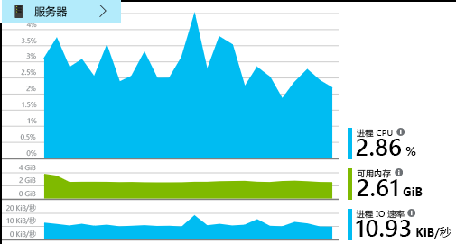
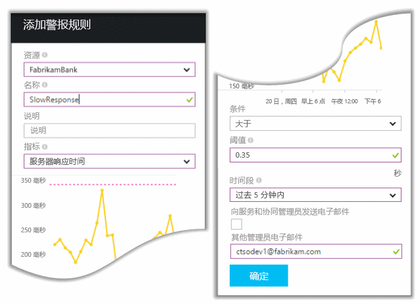
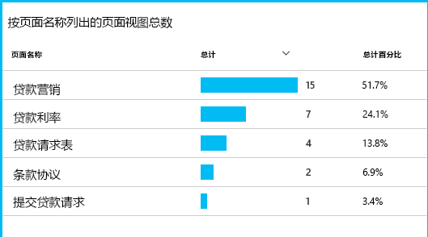
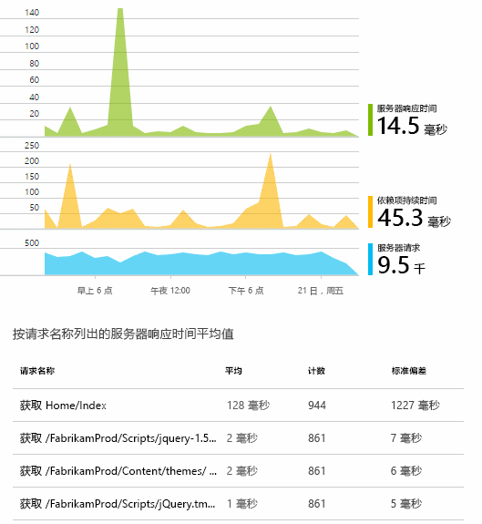
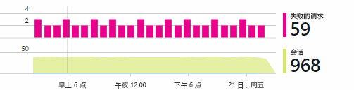
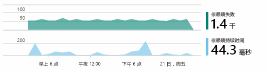

# 通过 Application Insights 检测、会审和诊断

[Application Insights](app-insights-overview.md) 是面向 Web 开发人员的可扩展应用程序性能管理 (APM) 服务。 它有助于了解应用执行情况和处于活动状态时的使用情况。 如果没有问题，它可告知相关情况、帮助评估影响，并帮助确定原因。

以下是一个开发 Web 应用程序的团队的描述：

* *“几天前 ，我们部署了‘次要’修补程序。没有运行广泛测试通过，但遗憾的是，有效负载发生了某些意外更改，致使前端和后端不兼容。很快，服务器异常数激增、警报拉响，我们意识到了情况的严重性。在 Application Insights 门户上单击几下鼠标后，我们从异常调用堆栈中获取了足够信息，缩小了问题范围。我们立即回滚，限制了受损范围。Application Insights 使这部分的开发周期变得简单易行。”*

让我们来看看典型的 Web 开发团队如何使用 Application Insights 进行性能管理。 我们将关注 Fabrikam Bank 中开发联机银行系统 (OBS) 的团队。

该团队运转的 devOps 周期如下：

各项要求发送到开发积压工作（任务列表）。 它们在简短冲刺中处理，这通常提供可用软件，这些软件的形式通常是现有应用程序的改进和扩展。 动态应用经常更新新功能。 在它处于动态状态时，该团队借助 Application Insights 监视其性能和使用情况。 此 APM 数据将馈送回到开发积压工作。

该团队使用 Application Insights 密切监视动态 Web 应用程序的以下方面：

* 性能。 他们希望了解响应时间随请求计数变化而变化的情况；CPU、网络、磁盘和其他资源的使用情况；以及瓶颈在哪里。
* 失败。 如果出现异常或请求失败，或者性能计数器超出合理范围，该团队需要立即知道，以便采取措施。
* 使用情况。 新功能无论什么时候发布，该团队都想知道它的使用程度以及用户使用时是否遇到任何难题。

让我们来关注该循环的反馈部分：

## 检测不良可用性
Marcela Markova 是 OBS 团队的高级开发人员，负责监视联机性能。 她设置了几项[可用性测试](app-insights-monitor-web-app-availability.md)：

* 应用主登录页面的单一 URL 测试，http://fabrikambank.com/onlinebanking/。 她设定了 HTTP 代码 200 和文本“Welcome!”的条件。 如果此测试失败，则是网络或服务器出现了严重问题，或者可能是部署问题所致。 （或者是有人在她不知道的情况下更改了页面上的 Welcome! 消息。）
* 更深入的多步骤测试可记录并获取当前帐户列表，并以此查看每个页面上的一些关键详细信息。 此测试验证指向帐户数据库的链接是否在正常运行。 她使用虚构的客户 ID：保留了其中一些，用作测试。

设置了这些测试后，Marcela 相信团队可快速知道任何中断。  

失败在 Web 测试图表上显示为红点：

但更重要的是，有关任何失败的警报将以电子邮件的形式发送到开发团队。 如此一来，他们几乎可在所有客户之前了解相关事项。

## 监视性能指标
在 Application Insights 的“概述”页上，有一张表格显示各种[关键指标](app-insights-web-monitor-performance.md)。

浏览器页面加载时间派生自直接从网页发送的遥测。 服务器响应时间、服务器请求计数和失败的请求计数均在 Web 服务器中测量，并从此处发送到 Application Insights。

Marcela 有点担忧服务器响应图表。 该图显示服务器从用户浏览器接收 HTTP 请求到其返回响应之间的平均时间。 在此图表中可经常看到变体，因为系统负载各不相同。 但在这种情况下，请求计数小幅提升和响应时间大幅提升之间看起来有关联。 这可能指示系统运行已达上限。

她打开“服务器”表格：

看起来没有任何资源限制的迹象，因此服务器响应图表中的凸起形状可能就是一个巧合。

## 警报
不过，她愿意关注响应时间。 如果时间过长，她希望立即知道。

因此，她设置了[警报](app-insights-metrics-explorer.md)，提示大于典型阈值的响应时间。 这使她确信，如果响应时间较慢，她就能知道。

可对其他各种指标设置警报。 例如，如果异常计数升高、可用内存降低或客户端请求出现峰值，可收到相关电子邮件。

## 智能检测警报
第二天确实收到了 Application Insights 的警报电子邮件。 但当她打开时，她发现那不是之前设置的响应时间警报。 相反，该邮件告知她，失败的请求数猛增，换句话说就是，返回失败代码的请求数有 500 或更多。

失败的请求是指用户看到了错误，通常是在代码引发异常后出现。 可能会显示一条消息，指出“很抱歉，当前无法更新你的详细信息。” 或者，最糟糕的情况是，堆栈转储将在用户屏幕（经由 Web 服务器）上显示。

这条警报令她大为惊讶 ，因为上一次看到时，失败的请求计数还比较低，让人不用担心。 忙碌的服务器是会有少数失败。

这对她而言也是一点惊喜，因为她不用配置此警报。 事实上，Application Insights 原本已经随附了智能检测。 它自动适应应用的常见失败模式，并“习惯”特定页面上、高负载情况下或与其他指标有关的失败。 它仅在计数超出预期时引发警报。

这是一种非常有用的电子邮件。 它不仅会引发警报。 还会执行许多会审和诊断工作。

它显示受影响的客户数以及相应网页和操作。 Marcela 可以决定是否要让整个团队处理这项事务，以作为一次演练，或者是否在下周前都可以忽略它。

该电子邮件还显示发生了特殊异常，并且更有趣的是，该失败与调用特定数据库失败有关。 这解释了突然显示错误的原因，即使 Marcela 的团队最近没有部署任何更新。

她选择了数据库团队的领导。 没错，他们在半小时前发布了修补程序，嗯，可能更改了一点架构....

于是，问题即将解决，这甚至赶在调查日志之前，并且在引发后 15 分钟内解决。 但 Marcela 单击链接，打开了 Application Insights。 它直接打开到失败的请求，她可以在依赖项调用的关联列表中看到失败的数据库调用。

## 检测异常
稍作设置，[异常](app-insights-asp-net-exceptions.md)将自动报告到 Application Insights。 通过将 [TrackException()](app-insights-api-custom-events-metrics.md#trackexception) 调用插入以下代码，还可以显式捕获它们：  

    var telemetry = new TelemetryClient();
    ...
    try
    { ...
    }
    catch (Exception ex)
    {
       // Set up some properties:
       var properties = new Dictionary <string, string>
         {{"Game", currentGame.Name}};

       var measurements = new Dictionary <string, double>
         {{"Users", currentGame.Users.Count}};

       // Send the exception telemetry:
       telemetry.TrackException(ex, properties, measurements);
    }

Fabrikam Bank 团队已经改进了始终发送异常遥测的做法，除非有明显的恢复。  

事实上，他们的策略比这要更广泛：他们发送客户对他们操作感到失望的所有情况的遥测，无论这是否与代码中出现的异常相对应。 例如，如果出于操作原因（不是客户的错），外部银行间的传输系统返回“无法完成此交易”的消息，他们将跟踪该事件。

    var successCode = AttemptTransfer(transferAmount, ...);
    if (successCode < 0)
    {
       var properties = new Dictionary <string, string>
            {{ "Code", returnCode, ... }};
       var measurements = new Dictionary <string, double>
         {{"Value", transferAmount}};
       telemetry.TrackEvent("transfer failed", properties, measurements);
    }

TrackException 用于报告异常，因为它发送堆栈副本。 TrackEvent 用于报告其他事件。 可附加任何可能在诊断中有用的属性。

在 [诊断搜索](app-insights-diagnostic-search.md) 边栏选项卡中显示的异常和事件。 可深入研究它们，了解其他属性和堆栈跟踪。

## 监视用户活动
如果响应时间始终良好且极少出现异常，则开发团队可转为处理可用性。 他们就可考虑如何提升用户体验，以及如何鼓励更多用户实现所需目标。

例如，用户的典型网站浏览过程反映在清晰的“漏斗图”上。 很多客户要查找不同类型贷款的费率。 其中部分客户要填写报价单。 在获得报价的客户当中，少部分人要进行贷款。

通过思考在哪里失去了最多客户，企业可以了解如何使更多用户继续前进到漏斗底部。 在某些情况下可能会出现用户体验 (UX) 失败，例如“下一步”按钮很难找到或说明不明显。 更有可能的是，客户减少是有更重要的业务原因：可能是贷款利率过高。

无论原因是什么，数据可帮助团队了解用户情况。 可插入更多跟踪调用，了解更多详细信息。 TrackEvent() 可用于计算任何用户操作，涵盖有关个别按钮单击量的具体细节到还清贷款等重要成就。

该团队已习惯掌握关于用户活动的信息。 如今，他们无论什么时候设计一项新功能，都能知道如何获取关于使用情况的反馈。 他们从开始就设计将跟踪调用插入功能。 在每个开发循环中都使用反馈改进功能。

## 主动监视
Marcela 并不是坐等警报出现。 每次重新部署后不久，她都会查看 [响应时间](app-insights-web-monitor-performance.md)，观察整体数字和最慢请求表以及异常计数。  

她可以评估每个部署的性能影响，通常是将每周的情况与上一周情况进行比较。 如果情况突然恶化，她就向相关开发人员提出异常。

## 会审
会审即评估问题的严重性和程度，是检测后执行的第一步操作。 我们应该在午夜召集团队吗？ 或者可以留到积压工作的下一个方便间隙吗？ 会审中会出现一些关键问题。

发生的程度是怎样的？ “概述”边栏选项卡上的图表可让我们对此问题有一些了解。 例如，Fabrikam 应用程序在一个晚上生成了四个 Web 测试警告。 在早上看到此图表时，团队可看到确实有一些红点，虽然大多数测试是绿点。 深入研究可用性图表后，明显可以看出，所有这些间歇性问题都源自一个测试位置。 这明显是仅影响一个路由的网络问题，很有可能会自我清理。  

相较而言，异常计数或响应时间图中出现显著和稳定提升的情况显然是要担忧的一件事。

有用的会审策略是自行尝试。 如果遇到相同的问题，你就知道这确实一个问题。

哪一部分用户会受影响？ 若要得到粗略答案，请将失败率除以会话计数。

在缓慢响应情况下，将最慢响应请求表与每页的使用频率进行比较。

受阻方案有多重要？ 如果是阻止特定用户情景的功能问题，这有很大关系吗？ 如果客户无法支付帐单，这就很严重了；如果他们无法更改屏幕颜色首选项，这或许可以等一下再来。 事件或异常的详细信息或者慢速页面的标识可告知客户在哪里遇到问题。

## 诊断
诊断和调试并不完全一样。 开始跟踪代码前，应大概知道问题发生的原因、位置和时间。

**何时发生？** 事件和指标图提供的历史记录视图使将影响与可能的原因联系起来变得简单。 如果响应时间或异常率间歇性出现峰值，请查看请求计数：如果在同一时间出现峰值，则应该是资源问题。 需要分配更多 CPU 或内存吗？ 或者这是因为无法管理负载的依赖项？

**是我们的原因吗？**  如果特定类型的请求性能突然降低（例如当客户需要账户号声明时），则可能是外部子系统的原因，而非 Web 应用程序的原因。 在指标资源管理器中，选择“依赖项失败率”和“依赖项持续时间率”，然后将它们在过去几小时或几天的历史记录与检测到的问题进行比较。 如果有关联更改，则可能要归咎于外部子系统。  

某些依赖项缓慢的问题是地理位置问题。 Fabrikam Bank 使用 Azure 虚拟机，发现他们无意中将 Web 服务器和帐户服务器定位其他国家/地区。 迁移其中一项设置即可带来显著提升。

**我们做了什么？** 我们此问题没有出现在依赖项中，并且不经常出现，则可能是最近的某项更改导致。 指标和事件图提供的历史角度使将任何突然更改与部署联系变得简单。 这可缩小问题的搜索范围。

**这是怎么回事？** 某些问题很少发生，脱机测试难以跟踪。 我们能做的就是在它发生时捕获 Bug。 可在异常报告中检查堆栈转储。 此外，可通过最喜爱的记录框架或者 TrackTrace() 或 TrackEvent() 编写跟踪调用。  

Fabrikam 的帐户间传输会间歇性出现问题，但只有某些帐户类型是这样。 为了更好地了解发生的事情，他们在代码的关键点中插入了 TrackTrace()，将帐户类型附加为每个调用的属性。 这简化了在“诊断搜索”中只筛选这些跟踪的操作。 他们也将参数值附加为跟踪调用的属性和度量值。

## 处理
诊断出问题后，可计划解决。 可能需要回滚到最近更改，或者直接解决。 修复完成后，Application Insights 将告知操作是否成功。  

Fabrikam Bank 开发团队采用比在使用 Application Insights 之前更结构化的方法处理衡量性能。

* 他们在 Application Insights“概述”页中根据特定度量值设置性能目标。
* 他们从开始就设计将性能度量值插入应用程序，例如测量用户通过“漏斗”的指标。  

## 使用情况
Application Insights 还可用于了解用户对应用执行了什么操作。 应用顺利运行后，该团队需要了解最受欢迎的功能、用户喜欢或难以使用的功能以及他们再次使用应用的频率。 这有助于确定接下来工作的优先级。 作为开发循环的一部分，他们还可以计划测量每个功能的成功程度。 [了解详细信息](app-insights-web-track-usage.md)。

## 应用程序
这就是一个团队使用 Application Insights 解决个别问题和改进开发周期的方式。 希望本文能够给读者带来一些启发，知道如何借助 Application Insights 在自己的应用程序中进行性能管理。

## 视频

> [!VIDEO https://channel9.msdn.com/events/Connect/2016/112/player]

## 后续步骤
可以根据应用程序的特征开始运用不同的方法。 选择最适合自己的方法：

* [ASP.NET Web 应用程序](app-insights-asp-net.md)
* [Java Web 应用程序](app-insights-java-get-started.md)
* [Node.js Web 应用程序](app-insights-nodejs.md)
* 在 [IIS](app-insights-monitor-web-app-availability.md)、[J2EE](app-insights-java-live.md) 或 [Azure](app-insights-azure.md) 上托管的已部署的应用。
* [网页](app-insights-javascript.md) - 单页应用或普通网页 - 单独使用此方法，或者将它与任何服务器选项结合使用。
* [可用性测试](app-insights-monitor-web-app-availability.md)：通过公共 Internet 测试应用。

