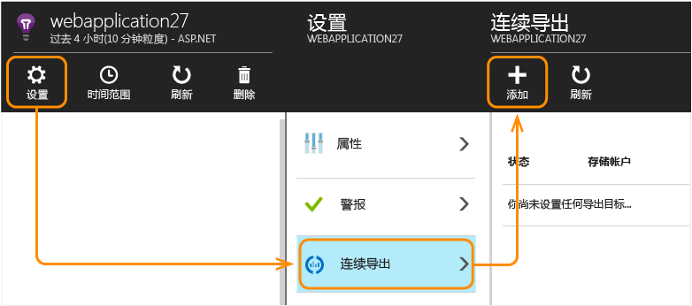
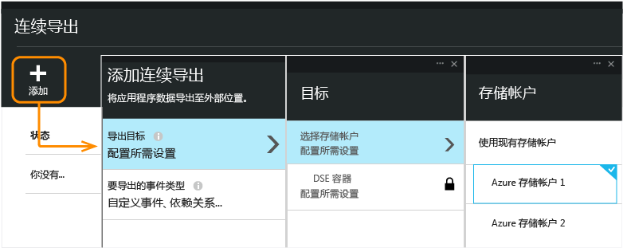
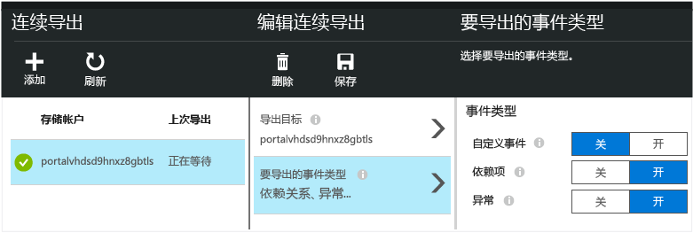
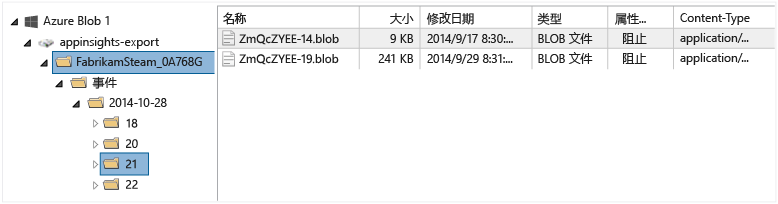
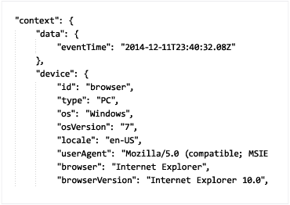
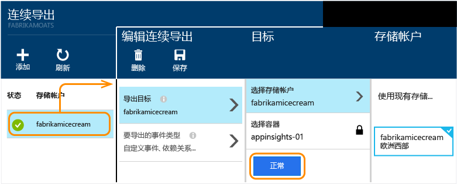

# 从 Application Insights 导出遥测数据
想要将遥测数据保留超过标准保留期限？ 或者要以某种专业方式处理这些数据？ 连续导出很适合此目的。 可以使用 JSON 格式将 Application Insights 门户中显示的事件导出到 Microsoft Azure 中的存储。 可以从该存储中下载这些数据，并编写所需的代码来处理这些数据。  

使用连续导出可能会产生额外费用。 检查[定价模型](http://azure.microsoft.com/pricing/details/application-insights/)。

在设置连续导出之前，请考虑一些备选方法：

* 通过指标或搜索边栏选项卡顶部的“导出”按钮，可将表格和图表发送到 Excel 电子表格。

* [Analytics](app-insights-analytics.md) 提供功能强大的遥测查询语言。 它还可以导出结果。
* 如果想要[在 Power BI 中浏览数据](app-insights-export-power-bi.md)，无需使用连续导出也可以做到。
* 使用[数据访问 REST API](https://dev.applicationinsights.io/) 能够以编程方式访问遥测数据。

连续导出将数据复制到存储后（数据可在其中保存任意长的时间），在正常[保留期](app-insights-data-retention-privacy.md)内，这些数据仍可在 Application Insights 中使用。

##  创建连续导出
1. 在应用的 Application Insights 资源中，打开“连续导出”，并选择“添加”：

    

2. 选择要导出的遥测数据类型。

3. 创建或选择要用于存储数据的 [Azure 存储帐户](../storage/common/storage-introduction.md)。

    > [!Warning]
    > 默认情况下，存储位置将设置为与 Application Insights 资源相同的地理区域。 如果存储在不同的区域中，则可能会产生传输费用。

    

4. 在存储中创建或选择一个容器：

    

创建导出之后，将开始导出数据。 只能获取创建导出后到达的数据。

数据出现在存储中之前可能有大约一小时的延迟。

### 编辑连续导出

如果以后想要更改事件类型，只需编辑导出：

### 停止连续导出

若要停止导出，请单击“禁用”。 再次单击“启用”时，将使用新数据重新启动导出。 无法获取在禁用导出时传入门户的数据。

要永久停止导出，请将其删除。 这样做不会将数据从存储中删除。

### 无法添加或更改导出？
* 若要添加或更改导出，需要“所有者”、“参与者”或“Application Insights 参与者”访问权限。 [了解角色][roles]。

##  获取哪些事件？
导出的数据是从应用程序接收的原始遥测数据，只不过我们添加了从客户端 IP 地址计算的位置数据。

被[采样](app-insights-sampling.md)丢弃的数据不会包含在导出的数据中。

不包含其他计算的指标。 例如，不会导出平均 CPU 使用率，但会导出用来计算平均值的原始遥测数据。

该数据还包含已设置的任何[可用性 Web 测试](app-insights-monitor-web-app-availability.md)的结果。

> [!NOTE]
> **采样。** 如果应用程序发送大量数据，采样功能可能会运行，并只发送一小部分生成的遥测数据。 [了解有关采样的详细信息。](app-insights-sampling.md)
>
>

##  检查数据
可以直接在门户中检查存储。 单击“浏览”、选择存储帐户，然后打开“容器”。

若要在 Visual Studio 中检查 Azure 存储，请依次打开“视图”、“Cloud Explorer”。 （如果未看到该菜单命令，则需要安装 Azure SDK：打开“新建项目”对话框，展开“Visual C#/云”，并选择“获取用于 .NET 的 Microsoft Azure SDK”。）

打开 Blob 存储后，会看到包含一组 Blob 文件的容器。 每个文件的 URI 派生自 Application Insights 的资源名称、其检测密钥、遥测类型/日期/时间。 （资源名称为全小写形式，检测密钥不包含连字符。）

日期和时间采用 UTC，表示在存储中存放遥测数据的时间 - 而不是生成遥测数据的时间。 因此，如果编写代码来下载数据，数据的日期和时间可能会线性移动。

路径格式如下：

    $"{applicationName}_{instrumentationKey}/{type}/{blobDeliveryTimeUtc:yyyy-MM-dd}/{ blobDeliveryTimeUtc:HH}/{blobId}_{blobCreationTimeUtc:yyyyMMdd_HHmmss}.blob"

其中

* `blobCreationTimeUtc` 是在内部暂存存储中创建 Blob 的时间
* `blobDeliveryTimeUtc` 是将 Blob 复制到导出目标存储的时间

##  数据格式
* 每个 Blob 是一个文本文件，其中包含多个以“\n”分隔的行。 它包含大约半分钟时间内处理的遥测数据。
* 每行代表遥测数据点，例如请求或页面视图。
* 每行是未设置格式的 JSON 文档。 如果想要琢磨该文档，请在 Visual Studio 中打开它，并依次选择“编辑”、“高级”、“设置文件格式”：

持续时间以刻度为单位，10000 刻度 = 1 毫秒。 例如，这些值显示从浏览器发送请求用了 1 毫秒时间，接收它用了 3 毫秒，在浏览器中处理页面用了 1.8 秒：

    "sendRequest": {"value": 10000.0},
    "receiveRequest": {"value": 30000.0},
    "clientProcess": {"value": 17970000.0}

[属性类型和值的详细数据模型参考。](app-insights-export-data-model.md)

## 处理数据
如果数据规模不大，可以编写一些代码来提取数据，在电子表格中阅读这些数据，或执行其他操作。 例如：

    private IEnumerable<T> DeserializeMany<T>(string folderName)
    {
      var files = Directory.EnumerateFiles(folderName, "*.blob", SearchOption.AllDirectories);
      foreach (var file in files)
      {
         using (var fileReader = File.OpenText(file))
         {
            string fileContent = fileReader.ReadToEnd();
            IEnumerable<string> entities = fileContent.Split('\n').Where(s => !string.IsNullOrWhiteSpace(s));
            foreach (var entity in entities)
            {
                yield return JsonConvert.DeserializeObject<T>(entity);
            }
         }
      }
    }

如需更详细的代码示例，请参阅[使用辅助角色][exportasa]。

## 删除旧数据
请注意，要负责管理存储容量，以及在必要时删除旧数据。

## 如果重新生成存储密钥...
如果更改存储密钥，连续导出将停止运行。 Azure 帐户中会显示通知。

打开“连续导出”边栏选项卡并编辑导出。 编辑“导出目标”，只保留选定的同一存储。 单击“确定”以确认。

连续导出将重新开始。

## 导出示例

* [使用流分析导出到 SQL][exportasa]
* [流分析示例 2](app-insights-export-stream-analytics.md)

如果数据规模较大，可以考虑 [HDInsight](https://azure.microsoft.com/services/hdinsight/) - 云中的 Hadoop 群集。 HDInsight 提供多种技术用于管理和分析大数据。可以使用 HDInsight 来处理从 Application Insights 导出的数据。

## 问题解答
* *我想要一次性下载某个图表。*  

    没问题，可以这样做。 请在边栏选项卡顶部单击“导出数据”。
* *我设置了导出，但存储中没有数据。*

    自设置导出之后，Application Insights 是否从应用程序收到了任何遥测数据？ 只会收到新数据。
* *尝试设置导出时出现拒绝访问错误*

    如果帐户由组织拥有，则你必须是所有者或参与者组的成员。
* *是否可以直接导出到我自己的本地存储？*

    很抱歉，不可以。 我们的导出引擎目前仅适用于 Azure 存储。  
* *放置在存储中的数据量是否有任何限制？*

    否。 我们将持续推送数据，直到删除了导出。 如果达到 Blob 存储的外在限制，推送会停止，但那个限制极大。 可以自行控制使用的存储量。  
* *存储中应会出现多少个 Blob？*

  * 对于选择要导出的每种数据类型，将每隔分钟创建一个新 Blob（如果有可用的数据）。
  * 此外，对于高流量应用程序，将分配额外的分区单元。 在此情况下，每个单元每隔一分钟创建一个 Blob。
* *我为存储重新生成了密钥或更改了容器的名称，但现在导出不能正常进行。*

    请编辑导出并打开导出目标边栏选项卡。 像以前一样保留选择相同的存储，并单击“确定”以确认。 导出将重新开始。 如果更改是在最近几天内做出的，则不会丢失数据。
* *是否可以暂停导出？*

    是的。 单击“禁用”即可。

## 代码示例

* [流分析示例](app-insights-export-stream-analytics.md)
* [使用流分析导出到 SQL][exportasa]
* [属性类型和值的详细数据模型参考。](app-insights-export-data-model.md)

<!--Link references-->

[exportasa]: app-insights-code-sample-export-sql-stream-analytics.md
[roles]: app-insights-resources-roles-access-control.md
