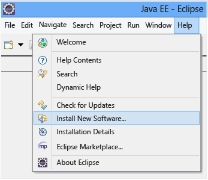
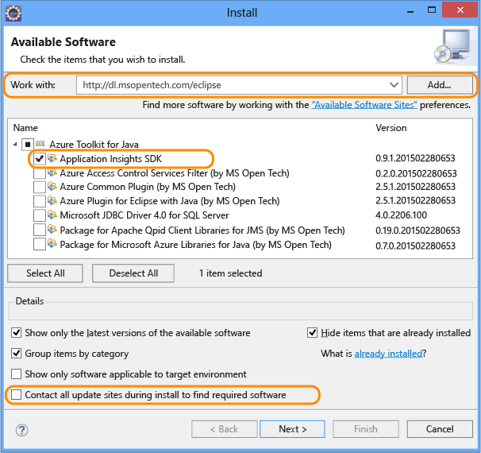
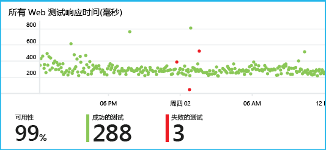

# <a name="get-started-with-application-insights-with-java-in-eclipse"></a>通过 Eclipse 中的 Java 开始使用 Application Insights
Application Insights SDK 通过 Java Web 应用程序发送遥测数据，使用户能够分析使用情况和性能。 适用于 Application Insights 的 Eclipse 插件自动在项目中安装 SDK，使用户能够获取现成的遥测功能，另外，还可以使用一个 API 来编写自定义遥测。   

## <a name="prerequisites"></a>先决条件
目前，该插件适用于 Eclipse 中的 Maven 项目和动态 Web 项目。
（[将 Application Insights 添加到其他类型的 Java 项目][java]。）

需要：

* JRE 1.7 或 1.8
* [Microsoft Azure](https://azure.microsoft.com/) 订阅。
* [Eclipse IDE for Java EE Developers](http://www.eclipse.org/downloads/)、Indigo 或更高版本。
* Windows 7 或更高版本，或 Windows Server 2008 或更高版本

## <a name="install-the-sdk-on-eclipse-one-time"></a>在 Eclipse 上安装 SDK（一次性操作）
只需在每台计算机上执行此操作一次。 此步骤将安装一个工具包，然后，该工具包将 SDK 添加到每个动态 Web 项目。

1. 在 Eclipse 中单击“帮助”，并单击“安装新软件”。

    
2. SDK 在 http://dl.microsoft.com/eclipse 中的“Azure 工具包”下。
3. 取消选中“联系所有更新站点...”

    

针对每个 Java 项目遵循余下的步骤。

## <a name="create-an-application-insights-resource-in-azure"></a>在 Azure 中创建 Application Insights 资源
1. 登录到 [Azure 门户](https://portal.azure.com)。
2. 新建 Application Insights 资源。 将应用程序类型设置为 Java Web 应用程序。  

      

4. 查找新资源的检测密钥。 稍后需要将此信息粘贴到代码项目中。  

      

## <a name="add-application-insights-to-your-project"></a>将 Application Insights 添加到项目
1. 从 Java Web 项目的上下文菜单添加 Application Insights。

    
2. 粘贴从 Azure 门户获取的检测密钥。

    

该密钥随遥测的每个项一起发送，并告知 Application Insights 在资源中显示它。

## <a name="run-the-application-and-see-metrics"></a>运行应用程序并查看指标
运行应用程序。

返回到 Microsoft Azure 中的 Application Insights 资源。

概述边栏选项卡会显示 HTTP 请求数据。 （如果未显示，请稍候片刻，并单击“刷新”。）


单击任何图表以查看更详细的指标。


[了解有关指标的详细信息。][metrics]

查看请求的属性时，可以查看与它关联的遥测事件，例如请求和异常。


## <a name="client-side-telemetry"></a>客户端遥测数据
在“快速启动”边栏选项卡中，单击“获取代码”来监视网页：


在 HTML 文件的标头中插入代码片段。

#### <a name="view-client-side-data"></a>查看客户端数据
打开已更新的网页并使用它们。 等待一两分钟，并返回 Application Insights，打开使用情况边栏选项卡。 （在“概述”边栏选项卡中，向下滚动并单击“使用情况”。）

页面视图、用户和会话指标会显示在使用情况边栏选项卡上：


[详细了解如何设置客户端遥测。][usage]

## <a name="publish-your-application"></a>发布应用程序
现在，将应用程序发布到服务器供用户使用，然后查看门户上显示的遥测数据。

* 请确保防火墙允许应用程序将遥测数据发送到以下端口：

  * dc.services.visualstudio.com:443
  * dc.services.visualstudio.com:80
  * f5.services.visualstudio.com:443
  * f5.services.visualstudio.com:80
* 在 Windows 服务器上，安装：

  * [Microsoft Visual C++ Redistributable](http://www.microsoft.com/download/details.aspx?id=40784)

    （此组件启用性能计数器。）

## <a name="exceptions-and-request-failures"></a>异常和请求失败
自动收集未经处理的异常：


若要收集其他异常数据，可使用两个选项：

* [在代码中插入 TrackException 调用](app-insights-api-custom-events-metrics.md#trackexception)。
* [在服务器上安装 Java 代理](app-insights-java-agent.md)。 指定要监视的方法。

## <a name="monitor-method-calls-and-external-dependencies"></a>监视方法调用和外部依赖项
[安装 Java 代理](app-insights-java-agent.md) ，记录指定的内部方法、通过 JDBC 发出的调用以及计时数据。

## <a name="performance-counters"></a>性能计数器
在“概述”边栏选项卡中，向下滚动并单击“服务器”磁贴。 此时会显示一系列性能计数器。


### <a name="customize-performance-counter-collection"></a>自定义性能计数器收集
要禁用收集性能计数器的标准集，请将以下代码添加到 ApplicationInsights.xml 文件的根节点下：

```XML

    <PerformanceCounters>
       <UseBuiltIn>False</UseBuiltIn>
    </PerformanceCounters>
```

### <a name="collect-additional-performance-counters"></a>收集其他性能计数器
可以指定要收集的其他性能计数器。

#### <a name="jmx-counters-exposed-by-the-java-virtual-machine"></a>JMX 计数器（由 Java 虚拟机公开）

```XML

    <PerformanceCounters>
      <Jmx>
        <Add objectName="java.lang:type=ClassLoading" attribute="TotalLoadedClassCount" displayName="Loaded Class Count"/>
        <Add objectName="java.lang:type=Memory" attribute="HeapMemoryUsage.used" displayName="Heap Memory Usage-used" type="composite"/>
      </Jmx>
    </PerformanceCounters>
```

* `displayName` – Application Insights 门户中显示的名称。
* `objectName` – JMX 对象名称。
* `attribute` – 提取的 JMX 对象名称属性
* `type` （可选）- JMX 对象的属性类型：
  * 默认值：简单类型，例如 int 或 long。
  * `composite`：性能计数器数据采用“Attribute.Data”格式
  * `tabular`：性能计数器数据采用表行格式

#### <a name="windows-performance-counters"></a>Windows 性能计数器
每个 [Windows 性能计数器](https://msdn.microsoft.com/library/windows/desktop/aa373083.aspx) 是类别的成员（就好比字段是类的成员）。 类别可以是全局的，也可以是带编号的实例或命名实例。

```XML

    <PerformanceCounters>
      <Windows>
        <Add displayName="Process User Time" categoryName="Process" counterName="%User Time" instanceName="__SELF__" />
        <Add displayName="Bytes Printed per Second" categoryName="Print Queue" counterName="Bytes Printed/sec" instanceName="Fax" />
      </Windows>
    </PerformanceCounters>
```

* displayName – Application Insights 门户中显示的名称。
* categoryName – 与此性能计数器关联的性能计数器类别（性能对象）。
* counterName – 性能计数器的名称。
* instanceName – 性能计数器类别实例的名称，如果类别包含单个实例，则为空字符串 ("")。 如果 categoryName 为 Process，而要收集的性能计数器来自应用运行所在的当前 JVM 进程，请指定 `"__SELF__"`。

性能计数器在[指标资源管理器][metrics]中以自定义指标的形式显示。


### <a name="unix-performance-counters"></a>Unix 性能计数器
* [使用 Application Insights 插件安装 collectd](app-insights-java-collectd.md) ，获取各种不同的系统和网络数据。

## <a name="availability-web-tests"></a>可用性 Web 测试
Application Insights 可以定期测试网站，检查网站是否正常运行且做出响应。 [若要设置][availability]，请向下滚动并单击“可用性”。


这样就可以获得响应时间的图表，当站点关闭时还可以收到电子邮件通知。



[详细了解可用性 Web 测试。][availability]

## <a name="diagnostic-logs"></a>诊断日志
如果使用 Logback 或 Log4J（v1.2 或 v2.0）进行跟踪，可将跟踪日志自动发送到 Application Insights，以便在其中发现和搜索日志。

[详细了解诊断日志][javalogs]

## <a name="custom-telemetry"></a>自定义遥测
在 Java Web 应用程序中插入几行代码，即可了解用户在该应用程序中执行的操作或帮助诊断问题。

可以在网页 JavaScript 和服务器端 Java 中插入代码。

[了解自定义遥测][track]

## <a name="next-steps"></a>后续步骤
#### <a name="detect-and-diagnose-issues"></a>检测和诊断问题
* [添加 Web 客户端遥测][usage]，以便从 Web 客户端获取性能遥测数据。
* [设置 Web 测试][availability]，确保应用程序处于活动状态且能够做出响应。
* [搜索事件和日志][diagnostic]帮助诊断问题。
* [捕获 Log4J 或 Logback 跟踪][javalogs]

#### <a name="track-usage"></a>跟踪使用情况
* [添加 Web 客户端遥测][usage]，以监视页面视图和基本用户指标。
* [跟踪自定义事件和指标](app-insights-web-track-usage.md)，了解应用程序在客户端和服务器上的使用情况。

<!--Link references-->

[availability]: app-insights-monitor-web-app-availability.md
[diagnostic]: app-insights-diagnostic-search.md
[java]: app-insights-java-get-started.md
[javalogs]: app-insights-java-trace-logs.md
[metrics]: app-insights-metrics-explorer.md
[track]: app-insights-api-custom-events-metrics.md
[usage]: app-insights-javascript.md
