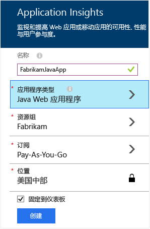
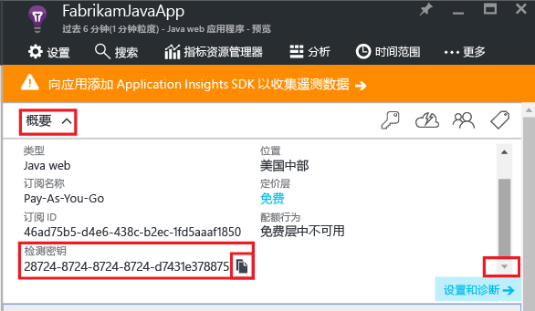
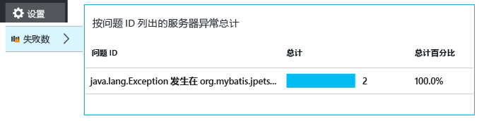
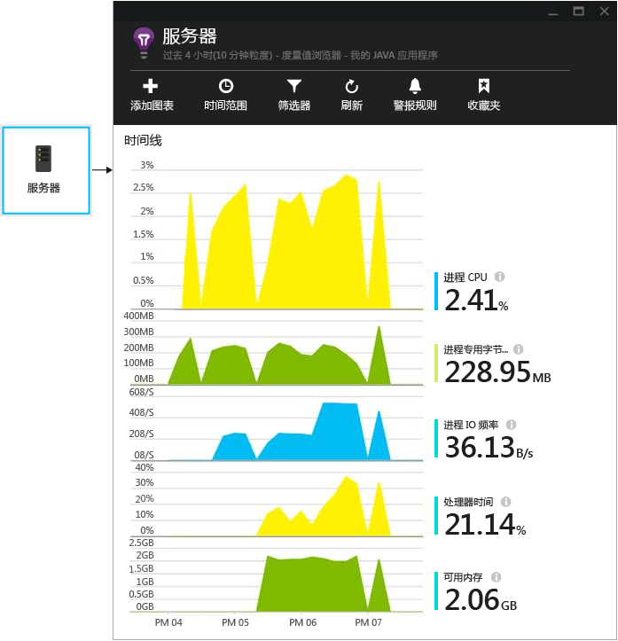
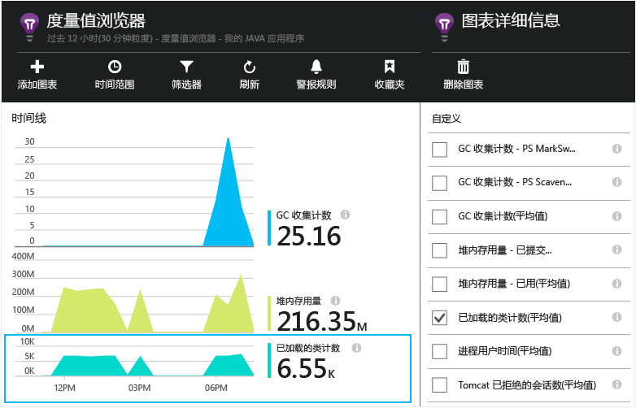

# <a name="get-started-with-application-insights-in-a-java-web-project"></a>Java Web 项目中的 Application Insights 入门


[Application Insights](https://azure.microsoft.com/services/application-insights/) 是为 Web 开发人员提供的可扩展分析服务，可帮助你了解实时应用程序的性能和使用情况。 使用它可以[检测和诊断性能问题与异常](app-insights-detect-triage-diagnose.md)，以及[编写代码][api]来跟踪用户对应用执行的操作。


Application Insights 支持 Linux、Unix 或 Windows 上运行的 Java 应用。

需要：

* Oracle JRE 1.6 或更高版本，或者 Zulu JRE 1.6 或更高版本
* [Microsoft Azure](https://azure.microsoft.com/) 订阅。

*如果有活动的 Web 应用，可以遵循替代过程[在运行时将 SDK 添加到 Web 服务器](app-insights-java-live.md)。这种替代方法可以避免重新生成代码，但没有任何选项可以编写代码来跟踪用户活动。*

## <a name="1-get-an-application-insights-instrumentation-key"></a>1.获取 Application Insights 检测密钥
1. 登录到 [Microsoft Azure 门户](https://portal.azure.com)。
2. 创建 Application Insights 资源。 将应用程序类型设置为 Java Web 应用程序。

    
3. 查找新资源的检测密钥。 稍后需要将此密钥粘贴到代码项目中。

    

## <a name="2-add-the-application-insights-sdk-for-java-to-your-project"></a>2.将用于 Java 的 Application Insights SDK 添加到项目
*为项目选择适当的方式。*

#### <a name="if-youre-using-eclipse-to-create-a-maven-or-dynamic-web-project-"></a>如果使用 Eclipse 创建 Maven 或动态 Web 项目...
使用[用于 Java 的 Application Insights SDK 插件][eclipse]。

#### <a name="if-youre-using-maven"></a>如果使用 Maven...
如果项目已设置为使用 Maven 进行生成，请将以下代码合并到 pom.xml 文件。

然后刷新项目依赖项，以下载库。

```XML

    <repositories>
       <repository>
          <id>central</id>
          <name>Central</name>
          <url>http://repo1.maven.org/maven2</url>
       </repository>
    </repositories>

    <dependencies>
      <dependency>
        <groupId>com.microsoft.azure</groupId>
        <artifactId>applicationinsights-web</artifactId>
        <!-- or applicationinsights-core for bare API -->
        <version>[1.0,)</version>
      </dependency>
    </dependencies>
```

* *发生了生成或校验和验证错误？* 尝试使用特定版本，例如：`<version>1.0.n</version>`。 可以在 [SDK release notes](https://github.com/Microsoft/ApplicationInsights-Java#release-notes)（SDK 发行说明）或 [Maven artifacts](http://search.maven.org/#search%7Cga%7C1%7Capplicationinsights)（Maven 项目）中找到最新版本。
* *需要更新到新 SDK？* 请刷新项目的依赖项。

#### <a name="if-youre-using-gradle"></a>如果使用 Gradle...
如果项目已设置为使用 Gradle 进行生成，请将以下代码合并到 build.gradle 文件。

然后刷新项目依赖项，以下载库。

```JSON

    repositories {
      mavenCentral()
    }

    dependencies {
      compile group: 'com.microsoft.azure', name: 'applicationinsights-web', version: '1.+'
      // or applicationinsights-core for bare API
    }
```

* *发生了生成或校验和验证错误？尝试使用特定版本，例如：* `version:'1.0.n'`。 *可以在 [SDK release notes](https://github.com/Microsoft/ApplicationInsights-Java#release-notes)。*
* *更新到新 SDK*
  * 请刷新项目的依赖项。

#### <a name="otherwise-"></a>否则...
手动添加 SDK：

1. 下载 [用于 Java 的 Application Insights SDK](https://aka.ms/aijavasdk)。
2. 解压缩 zip 文件中的二进制文件，然后将其添加项目。

### <a name="questions"></a>问题...
* *zip 中的 `-core` 与 `-web` 组件之间有怎样的关系？*

  * `applicationinsights-core` 提供单纯的 API。 始终需要此组件。
  * `applicationinsights-web` 提供用于跟踪 HTTP 请求计数和响应时间的指标。 如果不想要自动收集此遥测数据，可以忽略此组件。 例如，如果想要编写自己的组件。
* *在发布更改时更新 SDK*

  * 下载最新的 [用于 Java 的 Application Insights SDK](https://aka.ms/qqkaq6) 并替换旧版本。
  * [SDK release notes](https://github.com/Microsoft/ApplicationInsights-Java#release-notes)（SDK 发行说明）中描述了更改。

## <a name="3-add-an-application-insights-xml-file"></a>3.添加 Application Insights .xml 文件
在项目中的 resources 文件夹中添加 ApplicationInsights.xml，或确保将其添加到项目的部署类路径。 将以下 XML 复制到其中。

替换为从 Azure 门户获取的检测密钥。

```XML

    <?xml version="1.0" encoding="utf-8"?>
    <ApplicationInsights xmlns="http://schemas.microsoft.com/ApplicationInsights/2013/Settings" schemaVersion="2014-05-30">


      <!-- The key from the portal: -->

      <InstrumentationKey>** Your instrumentation key **</InstrumentationKey>


      <!-- HTTP request component (not required for bare API) -->

      <TelemetryModules>
        <Add type="com.microsoft.applicationinsights.web.extensibility.modules.WebRequestTrackingTelemetryModule"/>
        <Add type="com.microsoft.applicationinsights.web.extensibility.modules.WebSessionTrackingTelemetryModule"/>
        <Add type="com.microsoft.applicationinsights.web.extensibility.modules.WebUserTrackingTelemetryModule"/>
      </TelemetryModules>

      <!-- Events correlation (not required for bare API) -->
      <!-- These initializers add context data to each event -->

      <TelemetryInitializers>
        <Add   type="com.microsoft.applicationinsights.web.extensibility.initializers.WebOperationIdTelemetryInitializer"/>
        <Add type="com.microsoft.applicationinsights.web.extensibility.initializers.WebOperationNameTelemetryInitializer"/>
        <Add type="com.microsoft.applicationinsights.web.extensibility.initializers.WebSessionTelemetryInitializer"/>
        <Add type="com.microsoft.applicationinsights.web.extensibility.initializers.WebUserTelemetryInitializer"/>
        <Add type="com.microsoft.applicationinsights.web.extensibility.initializers.WebUserAgentTelemetryInitializer"/>

      </TelemetryInitializers>
    </ApplicationInsights>
```


* 检测密钥随遥测的每个项一起发送，并告知 Application Insights 在资源中显示它。
* HTTP 请求组件是可选的。 它自动将请求和响应时间的遥测数据发送到门户。
* 事件关联是对 HTTP 请求组件的补充。 它将标识符分配到服务器收到的每个请求，并将此标识符添加为遥测的每个项的“Operation.Id”属性。 使用它可以通过在[诊断搜索][diagnostic]中设置筛选器，来关联与每个请求关联的遥测。
* 可以从 Azure 门户将 Application Insights 密钥动态传递为系统属性 (-DAPPLICATION_INSIGHTS_IKEY=your_ikey)。 如果未定义任何属性，它会检查 Azure 应用设置中的环境变量 (APPLICATION_INSIGHTS_IKEY)。 如果未定义这两个属性，则使用 ApplicationInsights.xml 中的默认 InstrumentationKey。 此序列有助于动态管理不同环境的不同 InstrumentationKey。

### <a name="alternative-ways-to-set-the-instrumentation-key"></a>设置检测密钥的替代方法
Application Insights SDK 按以下顺序查找密钥：

1. 系统属性：-DAPPLICATION_INSIGHTS_IKEY=your_ikey
2. 环境变量：APPLICATION_INSIGHTS_IKEY
3. 配置文件：ApplicationInsights.xml

也可以 [在代码中设置方法](app-insights-api-custom-events-metrics.md#ikey)：

```Java

    telemetryClient.InstrumentationKey = "...";
```

## <a name="4-add-an-http-filter"></a>4.添加 HTTP 筛选器
最后一个配置步骤可让 HTTP 请求组件记录每个 Web 请求。 （如果只需要单纯的 API，则不需要执行此步骤。）

在项目中找到并打开 web.xml 文件，然后将以下代码合并到 Web 应用节点下，即应用程序筛选器的配置位置。

为获得最准确的结果，应该在其他所有筛选器的前面映射该筛选器。

```XML

    <filter>
      <filter-name>ApplicationInsightsWebFilter</filter-name>
      <filter-class>
        com.microsoft.applicationinsights.web.internal.WebRequestTrackingFilter
      </filter-class>
    </filter>
    <filter-mapping>
       <filter-name>ApplicationInsightsWebFilter</filter-name>
       <url-pattern>/*</url-pattern>
    </filter-mapping>
```

#### <a name="if-youre-using-spring-web-mvc-31-or-later"></a>如果使用 Spring Web MVC 3.1 或更高版本
编辑 *-servlet.xml 中的以下元素以包含 Application Insights 包：

```XML

    <context:component-scan base-package=" com.springapp.mvc, com.microsoft.applicationinsights.web.spring"/>

    <mvc:interceptors>
        <mvc:interceptor>
            <mvc:mapping path="/**"/>
            <bean class="com.microsoft.applicationinsights.web.spring.RequestNameHandlerInterceptorAdapter" />
        </mvc:interceptor>
    </mvc:interceptors>
```

#### <a name="if-youre-using-struts-2"></a>如果使用 Struts 2
将此项添加到 Struts 配置文件（通常名为 struts.xml 或 struts-default.xml）：

```XML

     <interceptors>
       <interceptor name="ApplicationInsightsRequestNameInterceptor" class="com.microsoft.applicationinsights.web.struts.RequestNameInterceptor" />
     </interceptors>
     <default-interceptor-ref name="ApplicationInsightsRequestNameInterceptor" />
```

（如果默认堆栈中定义了拦截器，只需将拦截器添加到该堆栈。）

## <a name="5-run-your-application"></a>5.运行应用程序
在开发计算机上以调试模式运行应用程序，或将其发布到服务器。

## <a name="6-view-your-telemetry-in-application-insights"></a>6.在 Application Insights 中查看遥测数据
返回 [Microsoft Azure 门户](https://portal.azure.com)中的 Application Insights 资源。

“概述”边栏选项卡中显示了 HTTP 请求数据。 （如果未显示，请稍候片刻，并单击“刷新”。）


[了解有关指标的详细信息。][metrics]

单击任一图表可查看详细聚合指标。


> Application Insights 假设 MVC 应用程序的 HTTP 请求的格式为： `VERB controller/action`。 例如，将 `GET Home/Product/f9anuh81`、`GET Home/Product/2dffwrf5` 和 `GET Home/Product/sdf96vws` 分组到 `GET Home/Product` 中。 这种分组可提供有意义的请求聚合，例如请求数量和请求的平均执行时间。
>
>

### <a name="instance-data"></a>实例数据
单击特定的请求类型可查看各个实例。

Application Insights 中显示两种类型的数据：聚合数据（存储并显示为平均值、计数和总和）；以及实例数据（HTTP 请求、异常、页面视图或自定义事件的不同报告）。

查看请求的属性时，可以查看与它关联的遥测事件，例如请求和异常。


### <a name="analytics-powerful-query-language"></a>分析：功能强大的查询语言
随着累积的数据越来越多，可以运行查询来聚合数据以及查找单个实例。  [分析](app-insights-analytics.md) 是一个强大的工具，既可用于了解性能和使用情况，也可用于诊断。


## <a name="7-install-your-app-on-the-server"></a>7.在服务器上安装应用
现在，将应用程序发布到服务器供用户使用，然后查看门户上显示的遥测数据。

* 请确保防火墙允许应用程序将遥测数据发送到以下端口：

  * dc.services.visualstudio.com:443
  * f5.services.visualstudio.com:443

* 如果必须通过防火墙路由传出流量，需定义系统属性 `http.proxyHost` 和 `http.proxyPort`。

* 在 Windows 服务器上，安装：

  * [Microsoft Visual C++ Redistributable](http://www.microsoft.com/download/details.aspx?id=40784)

    （此组件启用性能计数器。）


## <a name="exceptions-and-request-failures"></a>异常和请求失败
自动收集未经处理的异常：



若要收集其他异常数据，可使用两个选项：

* [在代码中插入 trackException() 调用][apiexceptions]。
* [在服务器上安装 Java 代理](app-insights-java-agent.md)。 指定要监视的方法。

## <a name="monitor-method-calls-and-external-dependencies"></a>监视方法调用和外部依赖项
[安装 Java 代理](app-insights-java-agent.md) ，记录指定的内部方法、通过 JDBC 发出的调用以及计时数据。

## <a name="performance-counters"></a>性能计数器
打开“设置”、“服务器”，查看一系列性能计数器。



### <a name="customize-performance-counter-collection"></a>自定义性能计数器收集
要禁用收集性能计数器的标准集，请将以下代码添加到 ApplicationInsights.xml 文件的根节点下：

```XML
    <PerformanceCounters>
       <UseBuiltIn>False</UseBuiltIn>
    </PerformanceCounters>
```

### <a name="collect-additional-performance-counters"></a>收集其他性能计数器
可以指定要收集的其他性能计数器。

#### <a name="jmx-counters-exposed-by-the-java-virtual-machine"></a>JMX 计数器（由 Java 虚拟机公开）

```XML
    <PerformanceCounters>
      <Jmx>
        <Add objectName="java.lang:type=ClassLoading" attribute="TotalLoadedClassCount" displayName="Loaded Class Count"/>
        <Add objectName="java.lang:type=Memory" attribute="HeapMemoryUsage.used" displayName="Heap Memory Usage-used" type="composite"/>
      </Jmx>
    </PerformanceCounters>
```

* `displayName` – Application Insights 门户中显示的名称。
* `objectName` – JMX 对象名称。
* `attribute` – 提取的 JMX 对象名称属性
* `type` （可选）- JMX 对象的属性类型：
  * 默认值：简单类型，例如 int 或 long。
  * `composite`：性能计数器数据采用“Attribute.Data”格式
  * `tabular`：性能计数器数据采用表行格式

#### <a name="windows-performance-counters"></a>Windows 性能计数器
每个 [Windows 性能计数器](https://msdn.microsoft.com/library/windows/desktop/aa373083.aspx) 是类别的成员（就好比字段是类的成员）。 类别可以是全局的，也可以是带编号的实例或命名实例。

```XML
    <PerformanceCounters>
      <Windows>
        <Add displayName="Process User Time" categoryName="Process" counterName="%User Time" instanceName="__SELF__" />
        <Add displayName="Bytes Printed per Second" categoryName="Print Queue" counterName="Bytes Printed/sec" instanceName="Fax" />
      </Windows>
    </PerformanceCounters>
```

* displayName – Application Insights 门户中显示的名称。
* categoryName – 与此性能计数器关联的性能计数器类别（性能对象）。
* counterName – 性能计数器的名称。
* instanceName – 性能计数器类别实例的名称，如果类别包含单个实例，则为空字符串 ("")。 如果 categoryName 为 Process，而要收集的性能计数器来自应用运行所在的当前 JVM 进程，请指定 `"__SELF__"`。

性能计数器在[指标资源管理器][metrics]中以自定义指标的形式显示。



### <a name="unix-performance-counters"></a>Unix 性能计数器
* [使用 Application Insights 插件安装 collectd](app-insights-java-collectd.md) ，获取各种不同的系统和网络数据。

## <a name="get-user-and-session-data"></a>获取用户和会话数据
好了，现在正在从 Web 服务发送遥测数据。 若要获取应用程序的 360 度全方位视图，可以添加更多监视：

* [将遥测添加到网页][usage]，监视页面视图和用户指标。
* [设置 Web 测试][availability]，确保应用程序处于活动状态且能够做出响应。

## <a name="capture-log-traces"></a>捕获日志跟踪
可以使用 Application Insights 将来自 Log4J、Logback 或其他记录框架的日志切片。 可以将日志与 HTTP 请求及其他遥测数据相关联。 [了解操作方法][javalogs]。

## <a name="send-your-own-telemetry"></a>发送自己的遥测数据
安装 SDK 后，可以使用 API 发送自己的遥测数据。

* [跟踪自定义事件和指标][api]，了解用户正在对应用程序执行的操作。
* [搜索事件和日志][diagnostic]帮助诊断问题。

## <a name="availability-web-tests"></a>可用性 Web 测试
Application Insights 可以定期测试网站，检查网站是否正常运行且做出响应。 [若要设置此功能][availability]，请单击“Web 测试”。


这样就可以获得响应时间的图表，当站点关闭时还可以收到电子邮件通知。


[详细了解可用性 Web 测试。][availability]

## <a name="questions-problems"></a>有疑问？ 遇到问题？
[Java 故障排除](app-insights-java-troubleshoot.md)

## <a name="video"></a>视频

> [!VIDEO https://channel9.msdn.com/events/Connect/2016/100/player]

## <a name="next-steps"></a>后续步骤
* [监视器依赖项调用](app-insights-java-agent.md)
* [监视 Unix 性能计数器](app-insights-java-collectd.md)
* [将监视功能添加到网页](app-insights-javascript.md)，监视器页面加载时间、AJAX 调用、浏览器异常。
* 编写[自定义遥测](app-insights-api-custom-events-metrics.md)来跟踪浏览器或服务器中的使用情况。
* 创建[仪表板](app-insights-dashboards.md)，用于监视系统的关键图表组合在一起。
* 使用[分析](app-insights-analytics.md)从应用通过遥测执行功能强大的查询
* 有关详细信息，请访问[面向 Java 开发人员的 Azure](/java/azure)。

<!--Link references-->

[api]: app-insights-api-custom-events-metrics.md
[apiexceptions]: app-insights-api-custom-events-metrics.md#trackexception
[availability]: app-insights-monitor-web-app-availability.md
[diagnostic]: app-insights-diagnostic-search.md
[eclipse]: app-insights-java-eclipse.md
[javalogs]: app-insights-java-trace-logs.md
[metrics]: app-insights-metrics-explorer.md
[usage]: app-insights-javascript.md

