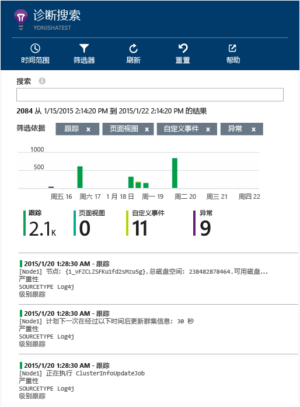

# <a name="explore-java-trace-logs-in-application-insights"></a>在 Application Insights 中浏览 Java 跟踪日志
如果使用 Logback 或 Log4J（v1.2 或 v2.0）进行跟踪，可将跟踪日志自动发送到 Application Insights，以便在其中发现和搜索日志。

## <a name="install-the-java-sdk"></a>安装 Java SDK

安装[适用于 Java 的 Application Insights SDK][java]（如果尚未安装）。

（如果不想要跟踪 HTTP 请求，可以省略大部分 .xml 配置文件，但必须至少包含 `InstrumentationKey` 元素。 此外，还应调用 `new TelemetryClient()` 来初始化 SDK。）


## <a name="add-logging-libraries-to-your-project"></a>将日志记录库添加到项目
*为项目选择适当的方式。*

#### <a name="if-youre-using-maven"></a>如果使用 Maven...
如果项目已设置为使用 Maven 进行生成，请将以下代码片段之一合并到 pom.xml 文件。

然后刷新项目依赖关系，以获取二进制文件下载。

*Logback*

```XML

    <dependencies>
       <dependency>
          <groupId>com.microsoft.azure</groupId>
          <artifactId>applicationinsights-logging-logback</artifactId>
          <version>[1.0,)</version>
       </dependency>
    </dependencies>
```

*Log4J v2.0*

```XML

    <dependencies>
       <dependency>
          <groupId>com.microsoft.azure</groupId>
          <artifactId>applicationinsights-logging-log4j2</artifactId>
          <version>[1.0,)</version>
       </dependency>
    </dependencies>
```

*Log4J v1.2*

```XML

    <dependencies>
       <dependency>
          <groupId>com.microsoft.azure</groupId>
          <artifactId>applicationinsights-logging-log4j1_2</artifactId>
          <version>[1.0,)</version>
       </dependency>
    </dependencies>
```

#### <a name="if-youre-using-gradle"></a>如果使用 Gradle...
如果项目已设置为使用 Gradle 进行生成，请将以下代码行之一添加到 build.gradle 文件中的 `dependencies` 组。

然后刷新项目依赖关系，以获取二进制文件下载。

**Logback**

```

    compile group: 'com.microsoft.azure', name: 'applicationinsights-logging-logback', version: '1.0.+'
```

**Log4J v2.0**

```
    compile group: 'com.microsoft.azure', name: 'applicationinsights-logging-log4j2', version: '1.0.+'
```

**Log4J v1.2**

```
    compile group: 'com.microsoft.azure', name: 'applicationinsights-logging-log4j1_2', version: '1.0.+'
```

#### <a name="otherwise-"></a>否则...
下载并提取相应的追加器，然后将相应的库添加到项目：

| 记录器 | 下载 | 库 |
| --- | --- | --- |
| Logback |[包含 Logback 追加器的 SDK](https://aka.ms/xt62a4) |applicationinsights-logging-logback |
| Log4J v2.0 |[包含 Log4J v2 追加器的 SDK](https://aka.ms/qypznq) |applicationinsights-logging-log4j2 |
| Log4j v1.2 |[包含 Log4J v1.2 追加器的 SDK](https://aka.ms/ky9cbo) |applicationinsights-logging-log4j1_2 |

## <a name="add-the-appender-to-your-logging-framework"></a>将追加器添加到日志记录框架
要开始跟踪，请将相关的代码片段合并到 Log4J 或 Logback 配置文件： 

*Logback*

```XML

    <appender name="aiAppender" 
      class="com.microsoft.applicationinsights.logback.ApplicationInsightsAppender">
    </appender>
    <root level="trace">
      <appender-ref ref="aiAppender" />
    </root>
```

*Log4J v2.0*

```XML

    <Configuration packages="com.microsoft.applicationinsights.Log4j">
      <Appenders>
        <ApplicationInsightsAppender name="aiAppender" />
      </Appenders>
      <Loggers>
        <Root level="trace">
          <AppenderRef ref="aiAppender"/>
        </Root>
      </Loggers>
    </Configuration>
```

*Log4J v1.2*

```XML

    <appender name="aiAppender" 
         class="com.microsoft.applicationinsights.log4j.v1_2.ApplicationInsightsAppender">
    </appender>
    <root>
      <priority value ="trace" />
      <appender-ref ref="aiAppender" />
    </root>
```

Application Insights 追加器可由配置的任何记录器（而不一定是根记录器）引用（如上面的代码示例所示）。

## <a name="explore-your-traces-in-the-application-insights-portal"></a>在 Application Insights 门户中浏览跟踪
将项目配置为向 Application Insights 发送跟踪后，可以在 Application Insights 门户的[搜索][diagnostic]边栏选项卡中查看和搜索这些跟踪。



## <a name="next-steps"></a>后续步骤
[诊断搜索][diagnostic]

<!--Link references-->

[diagnostic]: app-insights-diagnostic-search.md
[java]: app-insights-java-get-started.md


