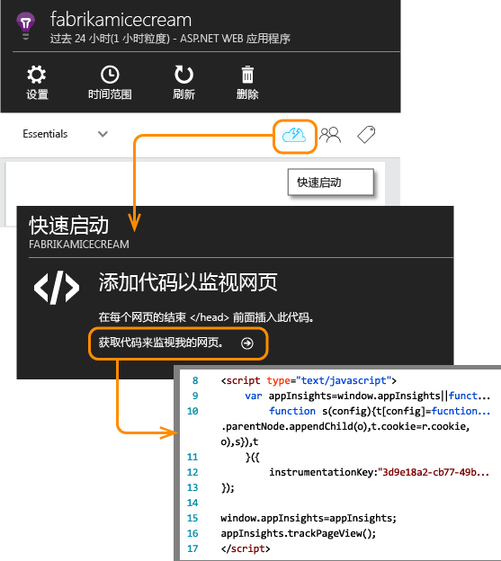
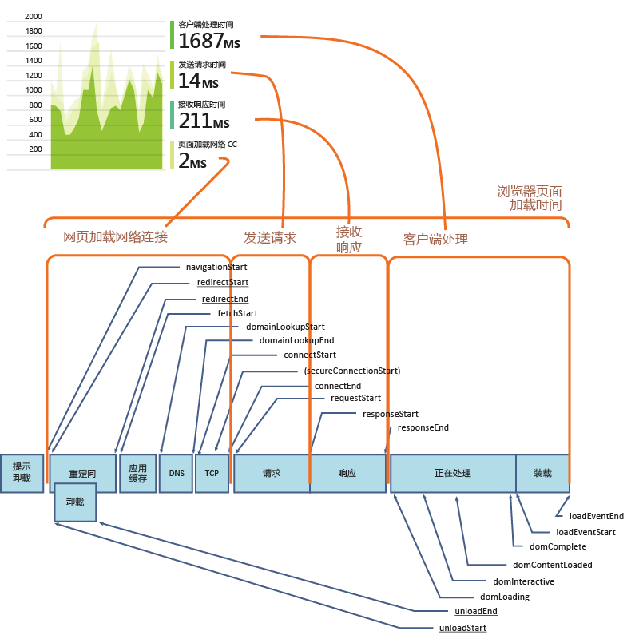
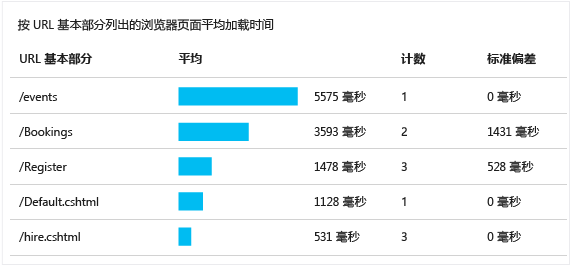
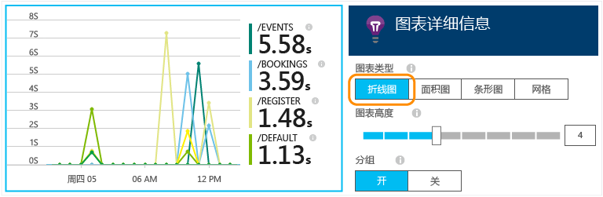
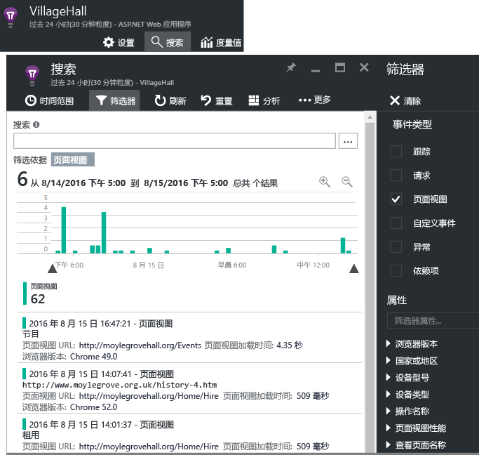

# 适用于网页的 Application Insights
了解网页或应用的性能和使用情况。 如果将 [Application Insights](app-insights-overview.md) 添加到页面脚本，可以获取页面加载和 AJAX 调用的时间、浏览器异常和 AJAX 失败的计数和详细信息，以及用户和会话计数。 所有这些信息可按页面、客户端 OS 和浏览器版本、地理位置和其他维度细分。 可以针对失败计数或页面加载缓慢情况设置警报。 并且通过在 JavaScript 代码中插入跟踪调用，可以跟踪网页应用程序的不同功能的使用情况。

可以在任何网页中使用 Application Insights - 刚刚添加了 JavaScript 的简短片段。 如果 Web 服务是 [Java](app-insights-java-get-started.md) 或 [ASP.NET](app-insights-asp-net.md)，可以集成来自服务器和客户端的遥测。

首先需要订阅 [Microsoft Azure](https://azure.com)。 如果团队拥有组织订阅，请咨询所有者将 Microsoft 帐户添加到其中。 开发和小规模的使用不会产生任何费用。

## 设置适用于网页的 Application Insights
按如下方式将加载程序代码片段添加到网页。

### 打开或创建 Application Insights 资源
Application Insights 资源是显示有关页面性能和使用情况的数据的位置。 

登录到 [Azure 门户](https://portal.azure.com)。

如果已经为应用的服务器端设置监视，则已创建了一个资源：

否则，请创建资源：

*有问题吗？* [有关创建资源的详细信息](app-insights-create-new-resource.md)。

### 将 SDK 脚本添加到应用或网页
在“快速启动”中获取网页的脚本：

紧靠在要跟踪的每个页面的 `</head>` 标记前面插入脚本。 如果网站有母版页，可以在那里插入脚本。 例如：

* 在 ASP.NET MVC 项目中，请将脚本放在 `View\Shared\_Layout.cshtml`
* 在 SharePoint 站点的控制面板中，打开 [站点设置/母版页](app-insights-sharepoint.md)。

脚本包含检测密钥，可将数据定向到 Application Insights 资源。 

（[更深入的脚本说明。](http://apmtips.com/blog/2015/03/18/javascript-snippet-explained/)）

*（如果使用的是已知网页框架，请查看 Application Insights 适配器。例如，可以看到 [AngularJS 模块](http://ngmodules.org/modules/angular-appinsights)。）*

## 详细配置
可以设置几个 [参数](https://github.com/Microsoft/ApplicationInsights-JS/blob/master/API-reference.md#config) ，但大多数情况下，应该不需要这样做。 例如，可以禁用或限制每个页面视图报告的 Ajax 调用数目（减少流量）。 或者，可以设置调试模式，让遥测通过管道快速移动而不需要批处理。

若要设置这些参数，请在代码片段中查找此行，在后面添加逗号分隔的更多项：

    })({
      instrumentationKey: "..."
      // Insert here
    });

[可用参数](https://github.com/Microsoft/ApplicationInsights-JS/blob/master/API-reference.md#config) 包括：

    // Send telemetry immediately without batching.
    // Remember to remove this when no longer required, as it
    // can affect browser performance.
    enableDebug: boolean,

    // Don't log browser exceptions.
    disableExceptionTracking: boolean,

    // Don't log ajax calls.
    disableAjaxTracking: boolean,

    // Limit number of Ajax calls logged, to reduce traffic.
    maxAjaxCallsPerView: 10, // default is 500

    // Time page load up to execution of first trackPageView().
    overridePageViewDuration: boolean,

    // Set these dynamically for an authenticated user.
    appUserId: string,
    accountId: string,

## 运行应用
运行 Web 应用，使用它生成遥测数据，然后等待几秒钟。 可以在开发计算机上使用 **F5** 键运行应用，或者发布应用供用户操作。

如果想要检查 Web 应用发送到 Application Insights 的遥测数据，请使用浏览器的调试工具（许多浏览器支持的**F12** 键）。 数据将发送到 dc.services.visualStudio.com。

## 查看浏览器性能数据
打开“浏览器”边栏选项卡，显示来自用户浏览器的聚合性能数据。

*还没有数据？单击页面顶部的“刷新”**。仍然没有数据？请参阅[故障排除](app-insights-troubleshoot-faq.md)。*

“浏览器”边栏选项卡是一个[指标资源管理器边栏选项卡](app-insights-metrics-explorer.md)，其中包含预设筛选器和图表选项。 如果需要，可以编辑时间范围、筛选器和图表配置，将结果另存为收藏项目。 单击“还原默认值”可恢复原始边栏选项卡配置。

## 页面加载性能
顶部是页面加载时间的分段图表。 图表总高度表示从应用加载页面并在用户浏览器中显示页面所花费的平均时间。 该时间从浏览器发送初始 HTTP 请求开始计量，直到处理所有同步加载事件，包括布局和运行脚本。 不包含从 AJAX 调用加载 Web 组件等异步任务。

图表将页面加载总时间细分为 [W3C 定义的标准计时](http://www.w3.org/TR/navigation-timing/#processing-model)。 

请注意， *网络连接* 时间通常小于预期，因为它是从浏览器到服务器的所有请求的平均值。 许多不同请求的连接时间为 0，原因是已经与服务器建立了活动的连接。

### 加载速度缓慢？
页面加载速度缓慢是用户不满的主要原因。 如果图表指出页面加载速度缓慢，可以轻松执行一些诊断调查。

图表显示应用中所有页面加载的平均时间。 若要查看问题是否局限于特定页面，请进一步查看边栏选项卡，其中包含按页面 URL 细分的网格：

请注意页面视图计数和标准偏差。 如果页面计数很小，则问题对用户的影响不大。 如果标准偏差（相对于平均值本身）较大，则表示单个测量之间存在很大的差异。

**放大一个 URL 和一个页面视图。** 单击任一页面名称可以查看针对该 URL 筛选的浏览器图表的边栏选项卡，然后是网页视图的实例。

单击 `...` 获取该事件的属性的完整列表，或检查 Ajax 调用和相关事件。 如果它们是同步的，缓慢的 Ajax 调用会影响整体页面加载时间。 相关事件包含服务器对同一 URL 的请求（如果已在 Web 服务器上设置 Application Insights）。

**一段时间内的页面性能。** 返回“浏览器”边栏选项卡，将“页面视图加载时间”网格更改为折线图，查看在特定时间是否出现高峰：

**按其他维度分段。** 也许页面在特定浏览器、客户端 OS 或用户位置的加载速度较缓慢？ 添加具有 **分组依据** 维度的图表和试验。

## AJAX 性能
确保网页中的任何 AJAX 调用执行正常。 它们通常用于以异步方式填充页面部件。 尽管可以立即加载整个页面，但用户仍可能厌烦于不断盯着空白 Web 部件，等待其中的数据出现。

从网页执行的 AJAX 调用作为依赖项显示在“浏览器”边栏选项卡中。

边栏选项卡上部是摘要图表：

下部是详细网格：

单击任一行可获取具体的详细信息。

> [!NOTE]
> 如果删除边栏选项卡上的“浏览器”筛选器，服务器和 AJAX 依赖项将包含在这些图表中。 单击“还原默认值”可以重新配置筛选器。
> 
> 

**若要深入到失败的 Ajax 调用** ，请向下滚动到“依赖项失败”网格，然后单击某行查看特定的实例。

单击 `...` 获取 Ajax 调用的完整遥测数据。

### 未报告任何 Ajax 调用？
Ajax 调用包含从网页脚本发出的任何 HTTP/HTTPS 调用。 如果没有看到这些报告，请检查代码片段中是否未设置 `disableAjaxTracking` 或 `maxAjaxCallsPerView` [参数](https://github.com/Microsoft/ApplicationInsights-JS/blob/master/API-reference.md#config)。

## 浏览器异常
“浏览器”边栏选项卡上有一个异常摘要图表，其下面还提供了异常类型网格。

如果未看到有报告浏览器异常，请检查代码片段中是否未设置 `disableExceptionTracking` [参数](https://github.com/Microsoft/ApplicationInsights-JS/blob/master/API-reference.md#config)。

## 检查各个页面视图事件

页面视图遥测数据通常由 Application Insights 分析，我们只会看到累积报告，其中的数据是基于所有用户的平均值。 但在调试时，也可以查看各个页面视图事件。

在“诊断搜索”边栏选项卡中，将“筛选器”设置为“页面视图”。

选择任一事件查看更多详细信息。 在详细信息页中，单击“...”查看更多详细信息。

> [!NOTE]
> 如果使用 [搜索](app-insights-diagnostic-search.md)，请注意，必须匹配整个字词：“Abou”和“bout”与“About”并不匹配。
> 
> 

也可以使用功能强大的 [分析查询语言](https://docs.microsoft.com/azure/application-insights/app-insights-analytics-tour#browser-timings-table) 来搜索页面视图。

### 页面视图属性
* **页面视图持续时间** 
  
  * 默认情况下，是指从客户端请求到完全加载页面（包括辅助文件，但不包括异步任务，例如 Ajax 调用）所花费的时间。 
  * 如果在[页面配置](#detailed-configuration)中设置了 `overridePageViewDuration`，则表示从发出客户端请求到执行第一个 `trackPageView` 相隔的时间。 如果在脚本初始化后将 trackPageView 从正常位置移走，此参数将反映不同的值。
  * 如果设置了 `overridePageViewDuration` 并且在 `trackPageView()` 调用中提供了持续时间参数，则改用该参数值。 

## 自定义页面计数
默认情况下，每当在客户端浏览器中加载新页面时，将会发生页面计数。  但是，可能想要统计其他页面视图。 例如，由于页面可能将内容显示在选项卡中，因此需要在用户切换选项卡时统计页面。 或者，页面中的 JavaScript 代码可能在未更改浏览器 URL 的情况下加载新内容。

请将类似于下面的 JavaScript 调用插入客户端代码中的适当位置：

    appInsights.trackPageView(myPageName);

页面名称可以包含与 URL 相同的字符，不过“#”或“?”后面的任何内容都将被忽略。

## 使用情况跟踪
想要了解用户如何使用应用？

* [了解使用情况跟踪](app-insights-web-track-usage.md)
* [了解自定义事件和指标 API。](app-insights-api-custom-events-metrics.md)

##  视频

> [!VIDEO https://channel9.msdn.com/events/Connect/2016/100/player]

## 后续步骤
* [跟踪使用情况](app-insights-web-track-usage.md)
* [自定义事件和指标](app-insights-api-custom-events-metrics.md)
* [Build-measure-learn](app-insights-overview-usage.md)

