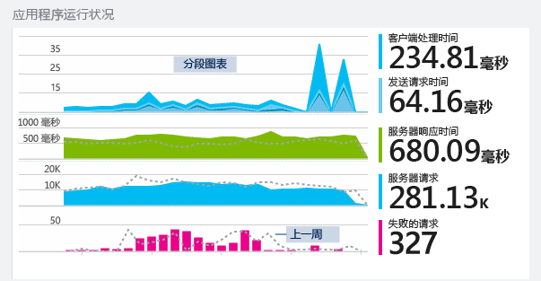
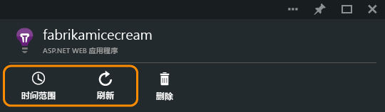
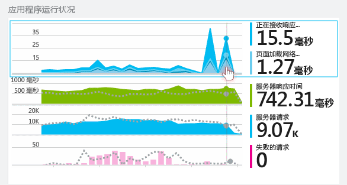
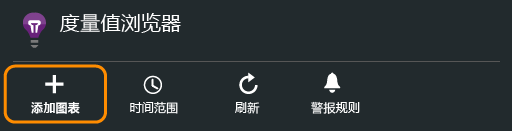
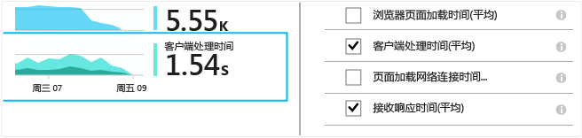
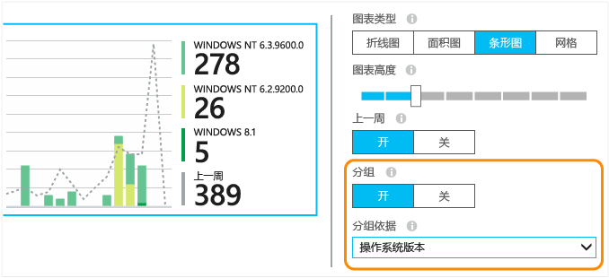
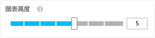
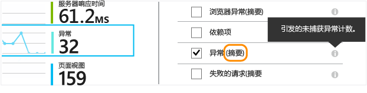
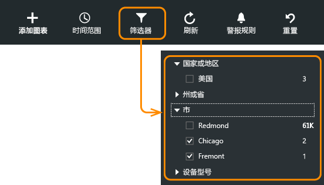
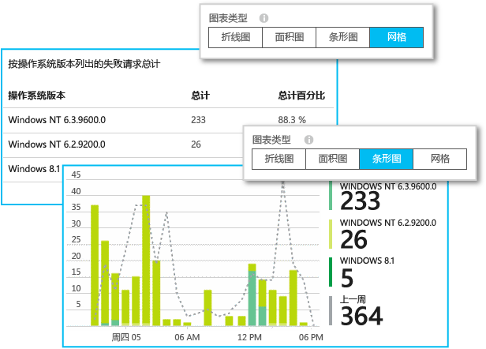

# 在 Application Insights 中浏览指标
[Application Insights][start] 中的指标是从应用程序遥测功能发送的度量值和事件计数。 它们可帮助检测性能问题，观察应用程序的用法趋势。 标准指标的范围很广泛，你也可以创建自己的自定义指标和事件。

指标和事件计数显示在聚合值图表（例如总和、平均值或计数）中。

下面是示例图表集：

可在 Application Insights 门户中的任何位置找到指标图表。 在大多数情况下，它们可以进行自定义，你可以向边栏选项卡添加更多图表。 在概览边栏选项卡中，单击浏览更详细的图表（它们具有诸如“服务器响应”这类的标题），或单击“指标资源管理器”以打开新边栏，可以在其中创建自定义图表。

## 时间范围
可以在任何边栏选项卡上更改图表或网格覆盖的时间范围。

如果某些数据未按预期出现，请单击“刷新”。 图表将定期自动刷新，但时间范围越大，刷新间隔时间越长。 数据通过分析管道显示在图表上可能需要一些时间。

若要放大图表的某个部分，请在该部分上拖动鼠标：

单击“撤消缩放”按钮可将该部分还原。

## 粒度和点值
将鼠标悬停在图表上可显示该点的指标值。

特定点的指标值基于前一个采样间隔聚合。

采样间隔或“粒度”显示在边栏选项卡的顶部。

可在“时间范围”边栏选项卡中调整粒度：

可提供的粒度取决于选择的时间范围。 显式粒度可替代时间范围内的“自动”粒度。

## 编辑图表和网格
在边栏选项卡中添加新图表：

在现有图表或新图表中选择“编辑”来编辑其显示内容：

可以在图表上显示多个指标，但是，可以一起显示的组合有一些限制。 只要选择一个指标，就会禁用其他一些指标。

如果在应用中编写了[自定义指标][track]（对 TrackMetric 和 TrackEvent 的调用），此处会列出这些指标。

## 将数据分段
可以根据属性拆分指标 - 例如，比较使用不同操作系统的客户端上的页面视图。

选择图表或网格，将分组切换为打开，然后选择用作分组依据的属性：

> [!NOTE]
> 使用分组时，“分区图”和“条形图”类型提供堆积视图。 这适用于“聚合”方法为“求和”的情况。 但如果聚合类型为“平均”，请选择“线条图”或“网格图”显示类型。
>
>

如果在应用中编写了[自定义指标][track]并且这些指标包含属性值，可以在列表中选择该属性。

图表是否对分段的数据而言太小？ 调整图表高度：

## 聚合类型
旁边的图例通常默认显示图表在这段期间的聚合值。 如果将鼠标悬停在图表上，将显示该点的值。

图表上的每个数据点是在以前采样间隔或“粒度”中所收到的数据值聚合。 粒度显示在边栏选项卡顶部，随着图表的时幅而有所不同。

指标可以用不同方式聚合：

* **计数**是在采样间隔中接收的事件的计数。 它用于诸如请求这类的事件。 图表高度的变化指示事件发生速率的变化。 但请注意，数值会在更改采样间隔时更改。
* **总和**：将采样间隔或图表期间收到的所有数据点的值相加。
* **平均**：将总和除以间隔期间收到的数据点数目。
* **唯一计数**：用于用户和帐户的计数。 在采样间隔或图表期间，图形显示在该时间看到的不同用户的计数。
* **%** - 每个聚合的百分比版本仅用于分段图表。 总计始终加起来等于 100%，图表显示总计的不同组成部分的相对比例。

    

### 更改聚合类型

创建新图表或取消选择所有指标时，系统会显示每个指标的默认方法：

## 固定 Y 轴 
默认情况下，图表显示的 Y 轴值从零开始一直到数据范围中的最大值，通过可视化方式表现值的份额。 但在某些情况下，除了份额外，通过可视化方式检查值的细微变化可能也很有趣。 为了达到此类自定义效果，请使用 Y 轴范围编辑功能将 Y 轴的最小值或最大值固定在所需位置。
单击“高级设置”复选框，显示 Y 轴范围设置

## 筛选数据
若只要查看选定的一组属性值的指标：

如果未为特定属性选择任何值，就相当于将它们全部选中：不对该属性使用筛选。

请注意每个属性值旁边的事件计数。 选择一个属性的值时，计数以及其他属性值会调整。

筛选器将应用到边栏选项卡上的所有图表。 如果要将不同的筛选器应用到不同的图表，请创建并保存不同的指标边栏选项卡。 如果需要，可将不同边栏选项卡中的图表固定到仪表板，以便并排查看这些图表。

### 删除 Bot 和 Web 测试流量
使用筛选器“实际或综合流量”并选中“实际”。

也可以按“综合流量的源”筛选。

### 将属性添加到筛选列表
想要根据自己选择的类别筛选遥测数据？ 例如，要将用户划分到不同的类别，并根据这些类别将数据分段。

[创建自己的属性](app-insights-api-custom-events-metrics.md#properties)。 在“遥测初始值设定项”中设置，使其显示在所有遥测中 - 包括不同 SDK 模块发送的标准遥测。

## 编辑图表类型
请注意，可以在网格与图形之间切换：

## 保存指标边栏选项卡
创建一些图表后，可将它们保存到收藏夹。 如果使用组织帐户，可以选择是否要将图表与其他团队成员共享。

若要再次查看边栏选项卡，**请转到概览边栏选项卡**并打开“收藏夹”：

如果保存时选择了“相对”时间范围，将使用最新指标更新边栏选项卡。 如果选择了“绝对”时间范围，边栏选项卡每次都显示相同的数据。

## 重置边栏选项卡
如果编辑了某个边栏选项卡，但后来想要还原到原始的保存集，单击“重置”即可。

## 实时指标流

若要更直观的观察遥测，请打开[实时流](app-insights-live-stream.md)。 由于聚合过程，大多数指标需要几分钟才会显示。 相比之下，实时指标为实现低延迟进行了优化。 

## 设置警报
若要收到任意指标异常值的电子邮件通知，请添加警报。 可选择将电子邮件发送给帐户管理员或特定电子邮件地址。

[详细了解警报][alerts]。

## 导出到 Excel
可将指标资源管理器中显示的指标数据导出到 Excel 文件。 导出的数据包括门户中所示的所有图表和表的数据。

每个图表或表的数据将导出到 Excel 文件中的独立工作表。

看到的内容即为导出的内容。 如果想要更改所导出数据的范围，请更改时间范围或筛选器。 对于表，如果显示了“加载更多”命令，可以单击该命令，然后单击“导出”来导出更多数据。

*导出目前仅适用于  Internet  Explorer 和 Chrome。我们正在努力添加对其他浏览器的支持。*

## 连续导出
如果想要连续导出数据以便在外部进行处理，请考虑使用[连续导出](app-insights-export-telemetry.md)。

### Power BI
如果想要获得数据的更丰富视图，可以[导出到 Power BI](http://blogs.msdn.com/b/powerbi/archive/2015/11/04/explore-your-application-insights-data-with-power-bi.aspx)。

## 分析
[Analytics](app-insights-analytics.md) 是使用强大查询语言来分析遥测数据的更灵活方式。 如果想要合并或计算指标的结果或执行应用程序近期性能的深入分析，可以使用该功能。 另一方面，如果想要自动刷新仪表板上的图表和警报，可以使用指标资源管理器。

## 故障排除
*图表中未显示任何数据。*

* 筛选器将应用到边栏选项卡中的所有图表。 将焦点放在某个图表上时，请确保未在其他图表上设置会排除所有数据的筛选器。

    如果想要在不同的图表上设置不同的筛选器，请在不同的边栏选项卡中创建图表，将它们保存为独立的收藏项。 如果需要，可将这些图表固定到仪表板，以便并排查看这些图表。
* 如果根据指标上未定义的属性将图表分组，则图表中不会显示任何数据。 请尝试清除“分组依据”，或选择不同的分组属性。
* 性能数据（CPU、IO 速率等）适用于 Java Web 服务、Windows 桌面应用、[IIS Web 应用和服务（如果安装了状态监视器）](app-insights-monitor-performance-live-website-now.md)以及 [Azure 云服务](app-insights-azure.md)。 这些数据不适用于 Azure 网站。

## 后续步骤
* [使用 Application Insights 监视使用情况](app-insights-overview-usage.md)
* [使用诊断搜索](app-insights-diagnostic-search.md)

<!--Link references-->

[alerts]: app-insights-alerts.md
[start]: app-insights-overview.md
[track]: app-insights-api-custom-events-metrics.md

<!--HONumber=Feb17_HO2-->

