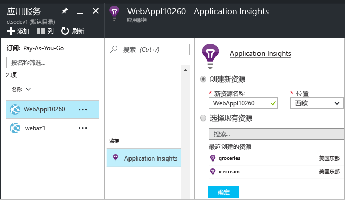
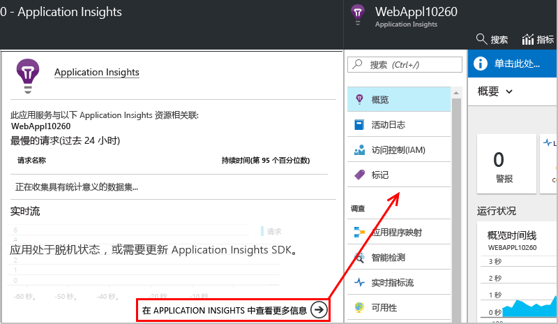

# 在运行时使用 Application Insights 检测 Web 应用

无需修改或重新部署代码，即可使用 Azure Application Insights 检测实时 Web 应用。 如果应用由本地 IIS 服务器托管，请安装“状态监视器”；如果应用是 Azure Web 应用或者在 Azure VM 中运行，可以安装 Application Insights 扩展。 （我们还单独提供了有关检测[实时 J2EE Web 应用](app-insights-java-live.md)和 [Azure 云服务](app-insights-cloudservices.md)的文章。）需要 [Microsoft Azure](http://azure.com) 订阅。

可以选择三种途径将 Application Insights 应用到 .NET Web 应用程序：

* **生成时：**[将 Application Insights SDK 添加][greenbrown]到 Web 应用代码。
* **运行时：** 如下所述检测服务器上的 Web 应用，无需重建并重新部署代码。
* **结合两种方法：** 将 SDK 构建到 Web 应用代码中，同时应用运行时扩展。 这样就充分利用了两种方法的优势。

下面是每种途径的优势摘要：

|  | 构建时 | 运行时 |
| --- | --- | --- |
| 请求和异常 |是 |是 |
| [更详细异常](app-insights-asp-net-exceptions.md) | |是 |
| [依赖项诊断](app-insights-asp-net-dependencies.md) |在 NET 4.6+ 上，但更少详细信息 |是，完整的详细信息：结果代码、SQL 命令文本、HTTP 谓词|
| [系统性能计数器](app-insights-performance-counters.md) |是 |是 |
| [自定义遥测 API][api] |是 | |
| [跟踪日志集成](app-insights-asp-net-trace-logs.md) |是 | |
| [页面视图和用户数据](app-insights-javascript.md) |是 | |
| 无需重新生成代码 |否 | |

## 监视实时 Azure Web 应用

如果应用程序正在作为 Azure Web 服务运行，请参阅以下步骤，了解如何进行监视切换：

* 在 Azure 的应用控制面板中选择“Application Insights”。

    
* 当 Application Insights 的摘要页打开时，请单击底部的链接，以便打开完整的 Application Insights 资源。

    

[监视云和 VM 应用](app-insights-azure.md)。

## 监视实时 IIS Web 应用

如果应用托管在 IIS 服务器上，请使用状态监视器启用 Application Insights。

1. 在 IIS Web 服务器上，使用管理员凭据登录。
2. 如果 Application Insights 状态监视器尚未安装，请下载并运行[状态监视器安装程序](http://go.microsoft.com/fwlink/?LinkId=506648)。
3. 在状态监视器中，选择已安装的 Web 应用程序或者要监视的网站。 使用 Azure 凭据登录。

    配置资源，以便在其中通过 Application Insights 门户查看结果。 （通常情况下，最好是创建新的资源。 如果已针对此应用进行了 [Web 测试][availability]或[客户端监视][client]，请选择现有资源。） 

    

4. 重新启动 IIS。

    

    Web 服务将中断片刻时间。

## 自定义监视选项

启用 Application Insights 就会将 DLL 和 ApplicationInsights.config 添加到 Web 应用。 可以[编辑 .config 文件](app-insights-configuration-with-applicationinsights-config.md)，对某些选项进行更改。

## 重新发布应用时，请重新启用 Application Insights

重新发布应用之前，可考虑[在 Visual Studio 中将 Application Insights 添加到代码][greenbrown]。 用户会获得更详细的遥测，并可编写自定义遥测。

如果需要重新发布，但又不希望将 Application Insights 添加到代码中，则请注意，部署过程可能会从已发布网站中删除 DLL 和 ApplicationInsights.config。 因此：

1. 如果已编辑 ApplicationInsights.config，则请对其进行复制，然后再重新发布应用。
2. 重新发布应用。
3. 重新启用 Application Insights 监视。 （使用适当的方法：Azure Web 应用控制面板或 IIS 主机上的状态监视器。）
4. 恢复对 .config 文件所做的任何编辑。

## 排查 Application Insights 的运行时配置问题

### 无法连接？ 没有遥测数据？

* 需要在服务器防火墙中打开 [一些传出端口](app-insights-ip-addresses.md#outgoing-ports) 才能让状态监视器正常工作。

* 打开状态监视器，然后在左窗格中选择应用程序。 检查“配置通知”部分中是否有任何关于此应用程序的诊断消息：

  
* 如果在服务器上看到有关“权限不足”的消息，请尝试以下操作：
  * 在 IIS 管理器中选择应用程序池，打开“高级设置”，并记下“进程模型”下的标识。
  * 在计算机管理控制面板中，将此标识添加到性能监试器用户组。
* 如果在服务器上安装了 MMA/SCOM，某些版本可能会发生冲突。 请卸载 SCOM 和状态监视器，然后重新安装最新版本。
* 请参阅[故障排除][qna]。

## 系统要求
支持服务器上 Application Insights 状态监视器的 OS：

* Windows Server 2008
* Windows Server 2008 R2
* Windows Server 2012
* Windows server 2012 R2
* Windows Server 2016

（装有最新 SP 及 .NET Framework 4.5）

在客户端 Windows 7、8、8.1 和 10 上，同样需要安装 .NET Framework 4.5

IIS 支持：IIS 7、7.5、8、8.5（必须有 IIS）

## 使用 PowerShell 自动化
可以在 IIS 服务器上使用 PowerShell 启动和停止监视。

首先导入 Application Insights 模块：

`Import-Module 'C:\Program Files\Microsoft Application Insights\Status Monitor\PowerShell\Microsoft.Diagnostics.Agent.StatusMonitor.PowerShell.dll'`

找出受监视的应用：

`Get-ApplicationInsightsMonitoringStatus [-Name appName]`

* `-Name` （可选）Web 应用的名称。
* 显示此 IIS 服务器中每个 Web 应用（或命名应用）的 Application Insights 监视状态。
* 针对每个应用返回 `ApplicationInsightsApplication` ：

  * `SdkState==EnabledAfterDeployment`：应用正受到监视，已在运行时通过“状态监视器”工具或 `Start-ApplicationInsightsMonitoring` 进行检测。
  * `SdkState==Disabled`：未针对 Application Insights 检测应用。 应用从未接受检测，或者“状态监视器”工具或 `Stop-ApplicationInsightsMonitoring`已禁用运行时监视。
  * `SdkState==EnabledByCodeInstrumentation`：已通过将 SDK 添加到源代码来检测应用。 其 SDK 无法更新或停止。
  * `SdkVersion` 显示正在用于监视此应用的版本。
  * `LatestAvailableSdkVersion`显示 NuGet 库中当前可用的版本。 若要将应用升级到此版本，请使用 `Update-ApplicationInsightsMonitoring`。

`Start-ApplicationInsightsMonitoring -Name appName -InstrumentationKey 00000000-000-000-000-0000000`

* `-Name` 应用在 IIS 中的名称
* `-InstrumentationKey` 要在其中显示结果的 Application Insights 资源的 ikey。
* 此 cmdlet 只影响尚未检测的应用，即 SdkState==NotInstrumented。

    此 cmdlet 不会影响构建时通过将 SDK 添加到代码，或者在运行时预先使用此 cmdlet 检测的应用。

    用于检测应用的 SDK 版本是最近下载到此服务器的版本。

    若要下载最新版本，请使用 Update-ApplicationInsightsVersion。
* 成功时返回 `ApplicationInsightsApplication` 。 如果失败，则在 stderr 记录跟踪。

          Name                      : Default Web Site/WebApp1
          InstrumentationKey        : 00000000-0000-0000-0000-000000000000
          ProfilerState             : ApplicationInsights
          SdkState                  : EnabledAfterDeployment
          SdkVersion                : 1.2.1
          LatestAvailableSdkVersion : 1.2.3

`Stop-ApplicationInsightsMonitoring [-Name appName | -All]`

* `-Name` 应用在 IIS 中的名称
* `-All` 停止监视此 IIS 服务器中 `SdkState==EnabledAfterDeployment` 的所有应用
* 停止监视指定的应用并删除检测。 它仅适用于已在运行时使用“状态监视器”工具或 Start-ApplicationInsightsApplication 进行检测的应用。 (`SdkState==EnabledAfterDeployment`)
* 返回 ApplicationInsightsApplication。

`Update-ApplicationInsightsMonitoring -Name appName [-InstrumentationKey "0000000-0000-000-000-0000"`]

* `-Name`：Web 应用在 IIS 中的名称。
* `-InstrumentationKey`（可选。）使用此项可更改应用的遥测数据所要发送到的资源。
* 此 cmdlet：
  * 将命名应用升级到最近下载到此计算机的 SDK 版本。 （仅当 `SdkState==EnabledAfterDeployment`时才适用）
  * 如果提供检测键，命名应用会重新配置为将遥测数据发送到具有该键的资源。 （仅当 `SdkState != Disabled`时才适用）

`Update-ApplicationInsightsVersion`

* 将最新的 Application Insights SDK 下载到服务器。

## 后续步骤

查看遥测：

* [浏览指标](app-insights-metrics-explorer.md)，以便监视性能和使用情况
* [搜索事件和日志][diagnostic]，以便诊断问题
* [分析](app-insights-analytics.md)，以便进行更高级的查询
* [创建仪表板](app-insights-dashboards.md)

添加更多遥测：

* [创建 Web 测试][availability]，确保站点保持活动状态。
* [添加 Web 客户端遥测][usage]，查看网页代码中的异常并将其插入跟踪调用。
* [将 Application Insights SDK 添加到代码][greenbrown]，以便插入跟踪和日志调用

<!--Link references-->

[api]: app-insights-api-custom-events-metrics.md
[availability]: app-insights-monitor-web-app-availability.md
[client]: app-insights-javascript.md
[diagnostic]: app-insights-diagnostic-search.md
[greenbrown]: app-insights-asp-net.md
[qna]: app-insights-troubleshoot-faq.md
[roles]: app-insights-resources-roles-access-control.md
[usage]: app-insights-web-track-usage.md

<!--HONumber=Feb17_HO2-->

