<properties
	pageTitle="诊断运行 IIS 网站时的性能问题 | Microsoft Azure"
	description="在不重新部署网站的情况下监视网站性能。使用独立 SDK 或者结合使用 Application Insights SDK 来获取依赖项遥测数据。"
	services="application-insights"
    documentationCenter=".net"
	authors="alancameronwills"
	manager="douge"/>

<tags
	ms.service="application-insights"
	ms.workload="tbd"
	ms.tgt_pltfrm="ibiza"
	ms.devlang="na"
	ms.topic="get-started-article"
	ms.date="08/24/2016"
	ms.author="awills"/>

# 在运行时使用 Application Insights 检测 Web 应用

*Application Insights 以预览版提供。*

无需修改或重新部署代码，即可使用 Visual Studio Application Insights 检测实时 Web 应用。如果应用由本地 IIS 服务器托管，请安装“状态监视器”；如果应用是 Azure Web 应用或者在 Azure VM 中运行，可以安装 Application Insights 扩展。（我们还单独提供了有关检测[实时 J2EE Web 应用](app-insights-java-live.md)和 [Azure 云服务](app-insights-cloudservices.md)的文章）。

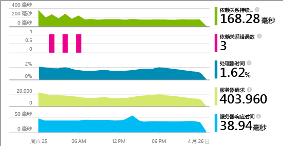

可以选择三种方法将 Application Insights 应用到 .NET Web 应用程序：

* **构建时：**[将 Application Insights SDK 添加][greenbrown]到 Web 应用代码。
* **运行时：**如下所述检测服务器上的 Web 应用，无需重建并重新部署代码。
* **结合两种方法：**将 SDK 构建到 Web 应用代码中，同时应用运行时扩展。这样就充分利用了两种方法的优势。

下面是每种方法的优势摘要：

||构建时|运行时|
|---|---|---|
|请求和异常|是|是|
|[更详细异常](app-insights-asp-net-exceptions.md)||是|
|[依赖项诊断](app-insights-asp-net-dependencies.md)|在 .NET 4.6+ 上|是|
|[系统性能计数器](app-insights-web-monitor-performance.md#system-performance-counters)||IIS 或 Azure 云服务，而不是 Azure Web 应用|
|[自定义遥测 API][api]|是||
|[跟踪日志集成](app-insights-asp-net-trace-logs.md)|是||
|[页面视图和用户数据](app-insights-javascript.md)|是||
|无需重新生成代码|否||

## 在运行时检测 Web 应用

需要 [Microsoft Azure](http://azure.com) 订阅。

### 如果应用托管在 IIS 服务器上

1. 在 IIS Web 服务器上，使用管理员凭据登录。
2. 下载并运行[状态监视器安装程序](http://go.microsoft.com/fwlink/?LinkId=506648)。
4. 在安装向导中，登录到 Microsoft Azure。

    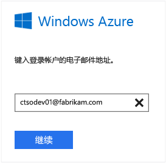

    *出现连接错误？ 请参阅[故障排除](#troubleshooting)。*

5. 选择要监视的已安装 Web 应用程序或网站，然后配置在 Application Insights 门户中查看结果时要使用的资源。

    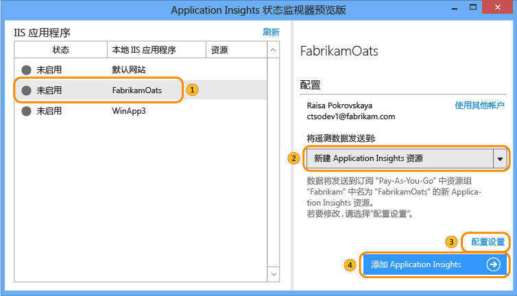

    通常，可以选择配置新的资源和[资源组][roles]。

    否则，如果已经为站点设置了 [Web 测试][availability]，或者设置了 [Web 客户端监视][client]，请使用现有资源。

6. 重新启动 IIS。

    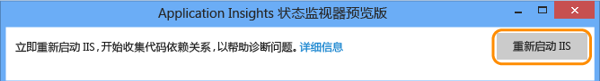

    Web 服务将中断片刻时间。

6. 可以看到，ApplicationInsights.config 已插入想要监视的 Web 应用。

    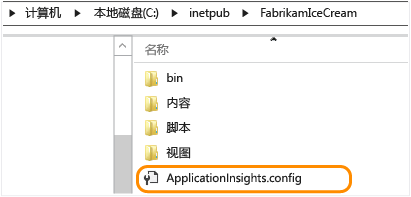

   web.config 也有一些改动。

#### 稍后再（重新）配置可以吗？

完成向导后，随时可以重新配置代理。如果已安装代理但初始设置有问题，也可以这样做。

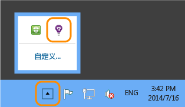

### 如果应用以 Azure Web 应用的形式运行

1. 在 [Azure 门户](https://portal.azure.com)中，创建 ASP.NET 类型的 Application Insights 资源。此资源将存储、分析和显示应用程序遥测数据。

    
     
2. 现在，请打开 Azure Web 应用的控制边栏选项卡，转到“工具”>“性能监视”并添加 Application Insights 扩展。

    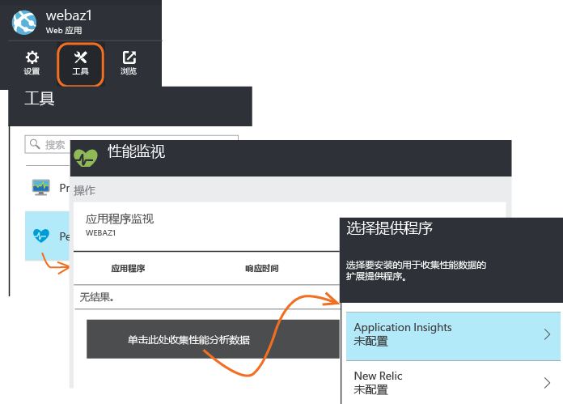

    选择刚刚创建的 Application Insights 资源。

### 如果是 Azure 云服务项目

[将脚本添加到 Web 角色和辅助角色](app-insights-cloudservices.md)。

## 查看性能遥测数据

登录到 [Azure 门户](https://portal.azure.com)，浏览 Application Insights，然后打开创建的资源。

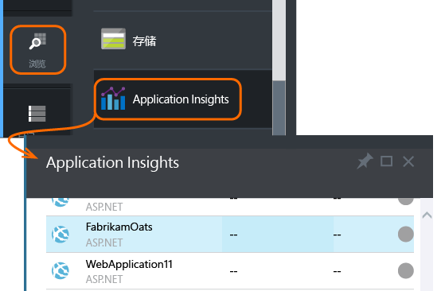

打开“性能”边栏选项卡，查看请求、响应时间、依赖项和其他数据。

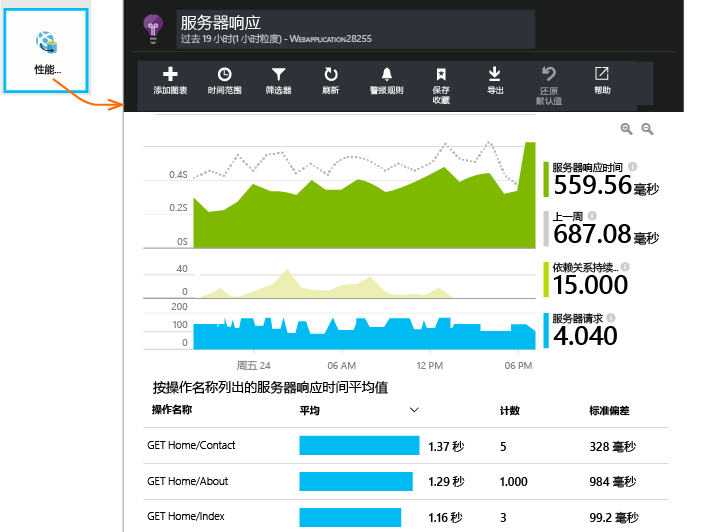

单击任一图表即可打开更详细的视图。

可以[编辑、重新排列、保存](app-insights-metrics-explorer.md)图表或整个边栏选项卡，以及将其固定到[仪表板](app-insights-dashboards.md)。

## 依赖项

“依赖项持续时间”图表显示从应用调用外部组件（例如数据库、REST API 或 Azure Blob 存储）所花费的时间。

若要通过调用不同的依赖项来细分图表：请编辑图表，打开“组”，然后按“依赖项”、“依赖项类型”或“依赖项性能”分组。

## 性能计数器 

（不适用于 Azure Web 应用。） 在概述边栏选项卡上单击“服务器”，查看服务器性能计数器的图表，例如 CPU 占用率和内存用量。

如果有多个服务器实例，可以编辑图表，以便按角色实例分组。

还可以[更改 SDK 报告的性能计数器集](app-insights-configuration-with-applicationinsights-config.md#nuget-package-3)。

## 异常

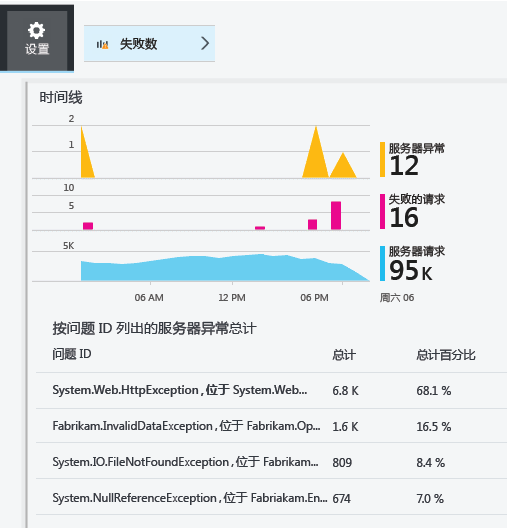

可以深入到过去七天的特定异常，获取堆栈跟踪和上下文数据。

## 采样

如果应用程序发送大量数据，并且使用的是用于 ASP.NET 的 Application Insights SDK 2.0.0-beta3 或更高版本，则自适应采样功能可以正常运行，只发送一部分遥测数据。[了解有关采样的详细信息。](app-insights-sampling.md)

## 故障排除

### 连接错误

需要在服务器防火墙中打开[一些传出端口](app-insights-ip-addresses.md#outgoing-ports)才能让状态监视器正常工作。

### 没有遥测数据？

  * 使用站点生成一些数据。
  * 等待几分钟让数据传入，然后单击“刷新”。
  * 打开“诊断搜索”（“搜索”磁贴）查看各个事件。聚合数据在图表中出现之前，事件通常显示在“诊断搜索”中。
  * 打开状态监视器，然后在左窗格中选择应用程序。检查“配置通知”部分中是否有任何关于此应用程序的诊断消息：

  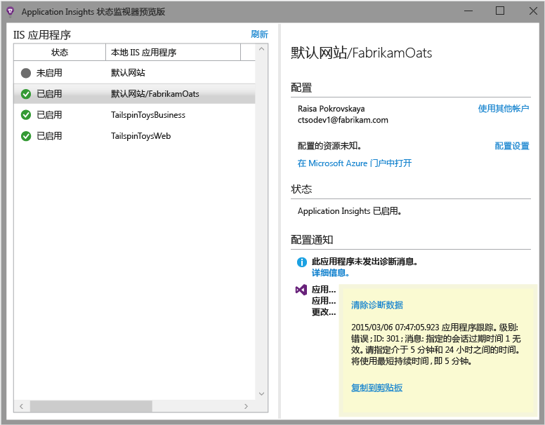

  * 确保服务器防火墙允许通过上述端口发送传出流量。
  * 如果在服务器上看到有关“权限不足”的消息，请尝试以下操作：
    * 在 IIS 管理器中选择应用程序池，打开“高级设置”，并记下“进程模型”下的标识。
    * 在计算机管理控制面板中，将此标识添加到性能监试器用户组。
  * 如果在服务器上安装了 MMA/SCOM，某些版本可能会发生冲突。请卸载 SCOM 和状态监视器，然后重新安装最新版本。
  * 请参阅[故障排除][qna]。

## 系统要求

支持服务器上 Application Insights 状态监视器的 OS：

- Windows Server 2008
- Windows Server 2008 R2
- Windows Server 2012
- Windows server 2012 R2

（装有最新版 SP 及 .NET Framework 4.0 和 4.5）

在客户端 Windows 7、8 和 8.1 上，同样需要安装 .NET Framework 4.0 和 4.5

IIS 支持：IIS 7、7.5、8、8.5（必须有 IIS）

## 使用 PowerShell 自动化

可以使用 PowerShell 启动和停止监视。

首先导入 Application Insights 模块：

`Import-Module 'C:\Program Files\Microsoft Application Insights\Status Monitor\PowerShell\Microsoft.Diagnostics.Agent.StatusMonitor.PowerShell.dll'`

找出受监视的应用：

`Get-ApplicationInsightsMonitoringStatus [-Name appName]`

* `-Name`（可选）Web 应用的名称。
* 显示此 IIS 服务器中每个 Web 应用（或命名应用）的 Application Insights 监视状态。

* 针对每个应用返回 `ApplicationInsightsApplication`：
 * `SdkState==EnabledAfterDeployment`：应用正受到监视，已在运行时通过“状态监视器”工具或 `Start-ApplicationInsightsMonitoring` 进行检测。
 * `SdkState==Disabled`：未针对 Application Insights 检测应用。应用从未接受检测，或者“状态监视器”工具或 `Stop-ApplicationInsightsMonitoring` 已禁用运行时监视。
 * `SdkState==EnabledByCodeInstrumentation`：已通过将 SDK 添加到源代码来检测应用。其 SDK 无法更新或停止。
 * `SdkVersion` 显示正在用于监视此应用的版本。
 * `LatestAvailableSdkVersion` 显示 NuGet 库中当前可用的版本。若要将应用升级到此版本，请使用 `Update-ApplicationInsightsMonitoring`。

`Start-ApplicationInsightsMonitoring -Name appName -InstrumentationKey 00000000-000-000-000-0000000`

* `-Name` 应用在 IIS 中的名称
* `-InstrumentationKey` 要在其中显示结果的 Application Insights 资源的 ikey。

* 此 cmdlet 只影响尚未检测的应用，即 SdkState==NotInstrumented。

    此 cmdlet 不会影响构建时通过将 SDK 添加到代码，或者在运行时预先使用此 cmdlet 检测的应用。

    用于检测应用的 SDK 版本是最近下载到此服务器的版本。

    若要下载最新版本，请使用 Update-ApplicationInsightsVersion。

* 成功时返回 `ApplicationInsightsApplication`。如果失败，则在 stderr 记录跟踪。

    
          Name                      : Default Web Site/WebApp1
          InstrumentationKey        : 00000000-0000-0000-0000-000000000000
          ProfilerState             : ApplicationInsights
          SdkState                  : EnabledAfterDeployment
          SdkVersion                : 1.2.1
          LatestAvailableSdkVersion : 1.2.3

`Stop-ApplicationInsightsMonitoring [-Name appName | -All]`

* `-Name` 应用在 IIS 中的名称
* `-All` 停止监视此 IIS 服务器中 `SdkState==EnabledAfterDeployment` 的所有应用

* 停止监视指定的应用并删除检测。它仅适用于已在运行时使用“状态监视器”工具或 Start-ApplicationInsightsApplication 进行检测的应用。(`SdkState==EnabledAfterDeployment`)

* 返回 ApplicationInsightsApplication。

`Update-ApplicationInsightsMonitoring -Name appName [-InstrumentationKey "0000000-0000-000-000-0000"`]

* `-Name`：Web 应用在 IIS 中的名称。
* `-InstrumentationKey`（可选。） 使用此参数可更改应用的遥测数据所要发送到的资源。
* 此 cmdlet：
 * 将命名应用升级到最近下载到此计算机的 SDK 版本。（仅当 `SdkState==EnabledAfterDeployment` 时才适用）
 * 如果提供检测键，命名应用会重新配置为将遥测数据发送到具有该键的资源。（仅当 `SdkState != Disabled` 时才适用）

`Update-ApplicationInsightsVersion`

* 将最新的 Application Insights SDK 下载到服务器。

## Azure 模板

如果 Web 应用在 Azure 中，并且使用 Azure Resource Manager 模板创建资源，可以通过将以下内容添加到资源节点来配置 Application Insights：

    {
      resources: [
        /* Create Application Insights resource */
        {
          "apiVersion": "2015-05-01",
          "type": "microsoft.insights/components",
          "name": "nameOfAIAppResource",
          "location": "centralus",
          "kind": "web",
          "properties": { "ApplicationId": "nameOfAIAppResource" },
          "dependsOn": [
            "[concat('Microsoft.Web/sites/', myWebAppName)]"
          ]
        }
       ]
     } 

* `nameOfAIAppResource` - Application Insights 资源的名称
* `myWebAppName` - Web 应用的 ID

## 后续步骤

* [创建 Web 测试][availability]，确保站点保持活动状态。
* [搜索事件和日志][diagnostic]帮助诊断问题。
* [添加 Web 客户端遥测][usage]查看网页代码中的异常并将其插入跟踪调用。
* [将 Application Insights SDK 添加到 Web 服务代码][greenbrown]，以便可以将跟踪和日志调用插入服务器代码。

<!--Link references-->

[api]: app-insights-api-custom-events-metrics.md
[availability]: app-insights-monitor-web-app-availability.md
[client]: app-insights-javascript.md
[diagnostic]: app-insights-diagnostic-search.md
[greenbrown]: app-insights-asp-net.md
[qna]: app-insights-troubleshoot-faq.md
[roles]: app-insights-resources-roles-access-control.md
[usage]: app-insights-web-track-usage.md

<!---HONumber=AcomDC_0921_2016-->