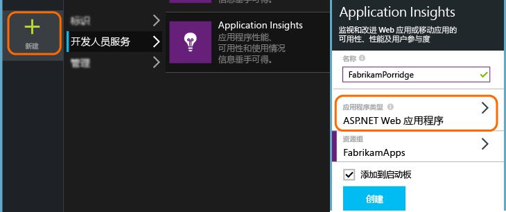
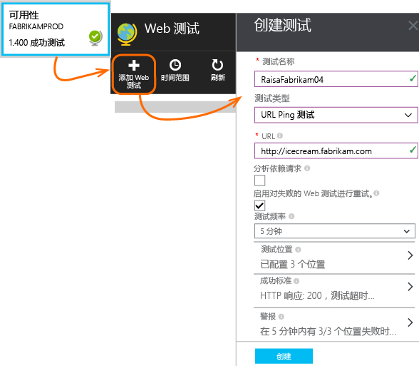
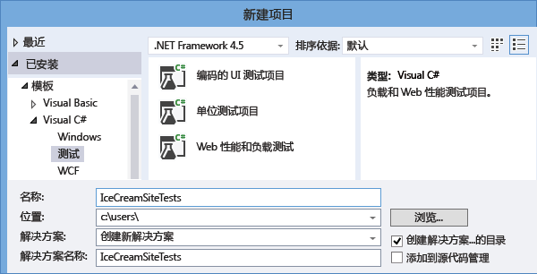
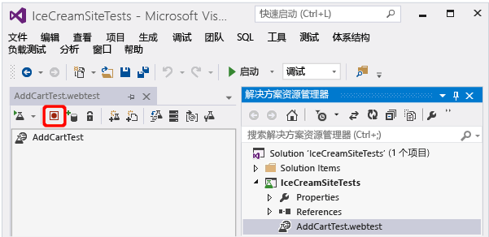
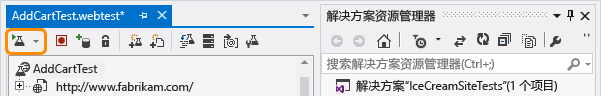
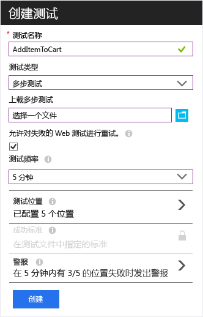
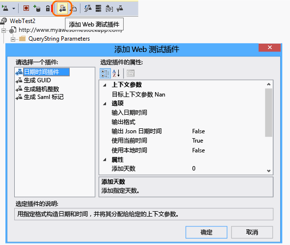
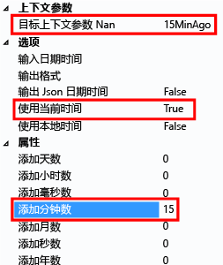
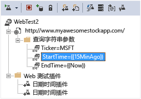

# 监视任何网站的可用性和响应能力
将 Web 应用或网站部署到任何服务器之后，可以设置测试来监视其可用性和响应能力。 [Azure Application Insights](app-insights-overview.md) 将来自全球各地的 Web 请求定期发送到应用程序。 如果应用程序无响应或响应太慢，则会发出警报。

对于可以从公共 Internet 访问的任何 HTTP 或 HTTPS 终结点，均可设置可用性测试。 无需将任何内容添加到要测试的网站。 它甚至不一定是站点：可以测试你所依赖的 REST API 服务。

有两种类型的可用性测试：

* [URL ping 测试](#create)：可以在 Azure 门户中创建的简单测试。
* [多步骤 Web 测试](#multi-step-web-tests)：可以在 Visual Studio Enterprise 中创建并上传到门户的测试。

对于每个应用程序资源，最多可以创建 25 个可用性测试。

## 1.为可用性测试报告打开资源

**如果已配置 Application Insights**（针对 Web 应用），请在 [Azure 门户](https://portal.azure.com)中打开 Application Insights 资源。

**或者，若要在新资源中查看报告**，请注册 [Microsoft Azure](http://azure.com)，转到 [Azure 门户](https://portal.azure.com)，然后创建 Application Insights 资源。

单击“所有资源”，打开新资源的“概述”边栏选项卡。

## 2.创建 URL ping 测试
打开“可用性”边栏选项卡，然后添加一个测试。

* **URL** 可以是要测试的任何网页，但必须在公共 Internet 中可见。 该 URL 可以包括查询字符串。 因此，例如，可以稍微训练一下数据库。 如果 URL 解析为重定向，最多可以跟踪 10 个重定向。
* **分析从属请求**：如果选中此选项，则测试将请求图像、脚本、样式文件以及其他属于受测网页的文件。 记录的响应时间包括获取这些文件所耗费的时间。 如果无法在超时期限内为整个测试成功下载所有这些资源，测试将会失败。 

    如果不选中此选项，则测试只请求指定 URL 的文件。
* **启用重试**：如果选中此选项，则测试失败时，将在短时间后重试。 仅当连续三次尝试失败时，才报告失败。 然后，将按照一般的测试频率执行后续测试。 重试将会暂停，直到下次成功为止。 可在每个测试位置单独应用此规则。 建议使用此选项。 平均大约有 80% 的失败可在重试后消除。
* **测试频率**：设置从每个测试位置运行测试的频率。 如果有五个测试位置，且频率为五分钟，则平均每隔一分钟测试站点一次。
* **测试位置** 是服务器将 Web 请求发送到的 URL 位置。 请选择多个位置，以便区分网站问题与网络问题。 最多可以选择 16 个位置。
* **成功准则**：

    **测试超时**：减少此值可以接收有关响应变慢的警报。 如果未在这段时间内收到站点的响应，则将测试视为失败。 如果选择了“分析依赖请求”，则必须在这段时间内收到所有图像、样式文件、脚本和其他依赖资源。

    **HTTP 响应**：视为成功的返回状态代码。 代码 200 指示返回了正常网页。

    **内容匹配**：类似于“欢迎!”的字符串。 我们测试区分大小写的匹配项是否出现在每个响应中。 它必须是不带通配符的纯字符串。 别忘了，如果页面内容更改，可能需要更新。
* **警报** 。 某个位置的失败很可能是网络问题，而不是站点问题。 但是，可以将阈值更改为更敏感或更不敏感，也可以更改要将电子邮件发送给哪个人。

    可以设置在引发警报时调用的 [webhook](../monitoring-and-diagnostics/insights-webhooks-alerts.md)。 （但请注意，查询参数不会以“属性”的形式传递。）

### 测试其他 URL
添加更多测试。 例如，除了测试主页外，还可以通过测试搜索 URL 来确保数据库正在运行。

## 3.查看可用性测试结果

几分钟之后，单击“刷新”即可查看测试结果。 

散点图显示其中都诊断测试步骤详细信息的测试结果示例。 测试引擎存储已失败的测试的诊断详细信息。 对于成功的测试，将存储执行子集的诊断详细信息。 将鼠标悬停在任何绿点/红点上，可查看测试时间戳、测试持续时间、位置和测试名称。 单击散点图中的任何点可查看测试结果的详细信息。  

选择特定测试、位置或减少时间段，可查看围绕感兴趣的时间段的更多结果。 使用搜索资源管理器以查看所有执行结果，或者使用分析查询以针对此数据运行自定义报告。

除了原始结果外，指标资源管理器中还有两个可用性指标： 

1. 可用性：已成功的测试占执行的所有测试的百分比。 
2. 测试持续时间：执行的所有测试的平均测试持续时间。

可以将筛选器应用于测试名称、位置以分析特定测试和/或位置的趋势。

##  检查和编辑测试

从摘要页面选择特定的测试。 你可以在该处查看具体结果，对其进行编辑或者临时禁用它。

对服务执行维护时，你可能想要禁用可用性测试或与这些测试关联的警报规则。 

## 如果看到失败
单击红点。

从可用性测试结果，可以：

* 检查从服务器收到的响应。
* 在处理失败的请求实例时将打开服务器应用发送的遥测。
* 在 Git 或 VSTS 中记录问题或工作项以跟踪问题。 Bug 中将包含转至此事件的链接。
* 在 Visual Studio 中打开 Web 测试结果。

*看起来正常，但却报告为失败* 检查所有图像、脚本、样式表和页面加载的任何其他文件。 如果其中有任何一个失败，即使 html 主页加载正常，测试也仍会报告为失败。

*没有相关项？* 如果已为服务器端应用程序设置 Application Insights，则可能是因为[采样](app-insights-sampling.md)正在进行。 

## 多步骤 Web 测试
可以监视涉及一连串 URL 的方案。 例如，如果正在监视销售网站，可以测试是否能够正常地将商品添加购物车。

> [!NOTE] 
> 对多步骤 Web 测试要收取费用。 [定价方案](http://azure.microsoft.com/pricing/details/application-insights/)。
> 

若要创建多步骤测试，可以使用 Visual Studio Enterprise 来录制方案，然后将录制内容上传到 Application Insights。 Application Insights 将按特定间隔重放该方案，并验证响应。

> [!NOTE]
> 不能在测试中使用编码的函数或循环。 测试必须完全包含在 .webtest 脚本中。 但是，你可以使用标准插件。
>

#### 1.录制方案
使用 Visual Studio Enterprise 录制 Web 会话。

1. 创建 Web 性能测试项目。

    

 * *看不到 Web 性能与负载测试模板？* - 关闭 Visual Studio Enterprise。 打开 **Visual Studio 安装程序**，修改 Visual Studio Enterprise 安装。 在“各个组件”下，选择“Web 性能和负载测试工具”。

2. 打开 .webtest 文件并开始录制。

    
3. 执行要在测试中模拟的用户操作：打开网站、将产品加入购物车，等等。 然后停止测试。

    

    不要录制太长的方案。 以 100 个步骤和 2 分钟为限。
4. 编辑测试：

   * 添加验证，检查收到的文本和响应代码。
   * 删除所有多余的交互。 也可以删除图片、广告或跟踪站点的依赖请求。

     请记住，只能编辑测试脚本 - 不能添加自定义代码或调用其他 Web 测试。 不要在测试中插入循环。 可以使用标准 Web 测试插件。
5. 在 Visual Studio 中运行测试，确保它可以正常工作。

    Web 测试运行器将打开 Web 浏览器，并重复录制的操作。 请确保它按预期工作。

    

#### 2.将 Web 测试上传到 Application Insights
1. 在 Application Insights 门户中创建 Web 测试。

    
2. 选择多步骤测试并上传 .webtest 文件。

    

    像设置 ping 测试一样设置测试位置、频率和警报参数。

#### 3.查看结果

像单 url 测试一样查看测试结果和所有失败。

此外，你还可以下载测试结果，在 Visual Studio 中查看。

#### 失败太多？

* 失败的常见原因是测试运行时间太久。 运行时间不能超过两分钟。

* 别忘了，必须正确加载页面的所有资源，测试才能成功（包括脚本、样式表、图像，等等）。

* Web 测试必须完全包含在 .webtest 脚本中：不能在测试中使用编码的函数。

### 将时间和随机数插入多步骤测试
假设要测试的工具从外部源获取与时间相关的数据（例如股票）。 录制 Web 测试时，必须使用具体的时间，但要将它们设置为测试参数：StartTime 和 EndTime。

运行测试时，EndTime 应该始终为当前时间，StartTime 在 15 分钟前。

Web 测试插件提供时间参数化方式。

1. 针对所需的每个变量参数值添加一个 Web 测试插件。 在 Web 测试工具栏中，选择“添加 Web 测试插件”。

    

    本示例使用两个日期时间插件实例。 一个实例设置为“15 分钟前”，另一个实例设置为“现在”。
2. 打开每个插件的属性。 为插件命名，然后将它设置为使用当前时间。 对于其中一个插件，将“添加分钟”设置为 -15。

    
3. 在 Web 测试参数中，使用 {{plug-in name}} 来引用插件名称。

    

现在，将测试上传到门户。 每次运行测试时，将使用动态值。

## 处理登录
如果用户登录应用，可以使用许多选项来模拟登录，以便可以在登录后测试页面。 使用的方法取决于应用提供的安全性类型。

在所有情况下，应该只针对测试目的在应用程序中创建帐户。 如果可能，请限制此测试帐户的权限，以便 Web 测试不会影响实际用户。

### 简单的用户名和密码
以普通方式录制 Web 测试。 先删除 Cookie。

### SAML 身份验证
使用可用于 Web 测试的 SAML 插件。

### 客户端机密
如果应用的某个登录路由涉及到客户端机密，请使用该路由。 例如，Azure Active Directory (AAD) 就是提供客户端机密登录的服务。 在 AAD 中，客户端机密是应用密钥。

下面是使用应用密钥的 Azure Web 应用的 Web 测试示例：

1. 使用客户端机密 (AppKey) 从 AAD 获取令牌。
2. 从响应中提取持有者令牌。
3. 使用授权标头中的持有者令牌调用 API。

确保 Web 测试是实际客户端 - 即，在 AAD 中有自身的应用 - 并使用其 clientId 和 appkey。 测试中的服务在 AAD 中也有自身的应用：此应用的 appID URI 反映在“resource”字段中的 Web 测试内。

### 开放身份验证
开放身份验证的示例包括使用 Microsoft 或 Google 帐户登录。 许多使用 OAuth 的应用提供替代的客户端机密，因此第一个技巧就是调查这种可能性。

如果测试必须使用 OAuth 登录，则常规方法是：

* 使用 Fiddler 等工具检查 Web 浏览器、身份验证站点与应用之间的流量。
* 使用不同的计算机或浏览器或者以较长的间隔执行两次以上的登录（使令牌过期）。
* 通过比较不同的会话，识别从身份验证站点返回的令牌，然后在登录后将此令牌传递给应用服务器。
* 使用 Visual Studio 录制 Web 测试。
* 参数化令牌，设置参数来指定从验证器返回令牌的时间，并在站点查询中使用该参数。
  （Visual Studio 会尝试参数化测试，但无法正确参数化令牌。）

## 性能测试
可以在网站上运行负载测试。 与可用性测试一样，可以从全球各地的站点发送简单请求或多步骤请求。 与可用性测试不同的是，发送的许多请求可以模拟多个并发用户。

在“概述”边栏选项卡中，打开“设置”、“性能测试”。 创建测试时，系统会邀请你连接或创建 Visual Studio Team Services 帐户。

测试完成时，将显示响应时间和成功率。

> [!TIP]
> 若要观察性能测试的效果，请使用[实时流](app-insights-live-stream.md)和[探查器](app-insights-profiler.md)。
>

## 自动化
* [使用 PowerShell 脚本自动设置可用性测试](app-insights-powershell.md#add-an-availability-test)。
* 设置在引发警报时调用的 [webhook](../monitoring-and-diagnostics/insights-webhooks-alerts.md) 。

## 有疑问？ 遇到问题？
* *是否可以从 Web 测试调用代码？*

    不可以。 测试步骤必须在 .webtest 文件中指定。 此外，不能调用其他 Web 测试或使用循环。 但是可以借助一些有用的插件。
* *是否支持 HTTPS？*

    支持 TLS 1.1 和 TLS 1.2。
* *“Web 测试”与“可用性测试”之间是否有差异？*

    这两个术语可以互换引用。 可用性测试是更通用的术语，其中除了包含多步骤 Web 测试外，还包含单 URL ping 测试。
* *如何在防火墙后面运行的内部服务器上使用可用性测试？*

    有两个可能的解决方案：
    
    * 请将防火墙配置为允许从[我们的 Web 测试代理 IP 地址](app-insights-ip-addresses.md)发出的传入请求。
    * 编写自己的代码，定期测试内部服务器。 在防火墙后的测试服务器上以后台进程的方式运行该代码。 你的测试进程可以通过核心 SDK 包中的 [TrackAvailability()](https://docs.microsoft.com/dotnet/api/microsoft.applicationinsights.telemetryclient.trackavailability) API 将其结果发送到 Application Insights。 这要求测试服务器能够以传出访问的方式访问 Application Insights 引入终结点，但与允许传入请求相比，这种方式的安全风险要小得多。 结果不会显示在可用性 Web 测试边栏选项卡中，但会作为可用性结果显示在分析、搜索和指标资源管理器中。
* *上传多步骤 Web 测试失败*

    存在 300 K 大小限制。

    不支持循环。

    不支持对其他 Web 测试的引用。

    不支持数据源。
* *多步骤测试无法完成*

    存在每个测试 100 个请求的限制。

    如果运行时间超过两分钟，测试将会停止。
* *如何使用客户端证书运行测试？*

    抱歉，不支持这种测试。

## 后续步骤
[搜索诊断日志][diagnostic]

[故障排除][qna]

[Web 测试代理 IP 地址](app-insights-ip-addresses.md)

<!--Link references-->

[azure-availability]: ../insights-create-web-tests.md
[diagnostic]: app-insights-diagnostic-search.md
[qna]: app-insights-troubleshoot-faq.md
[start]: app-insights-overview.md
