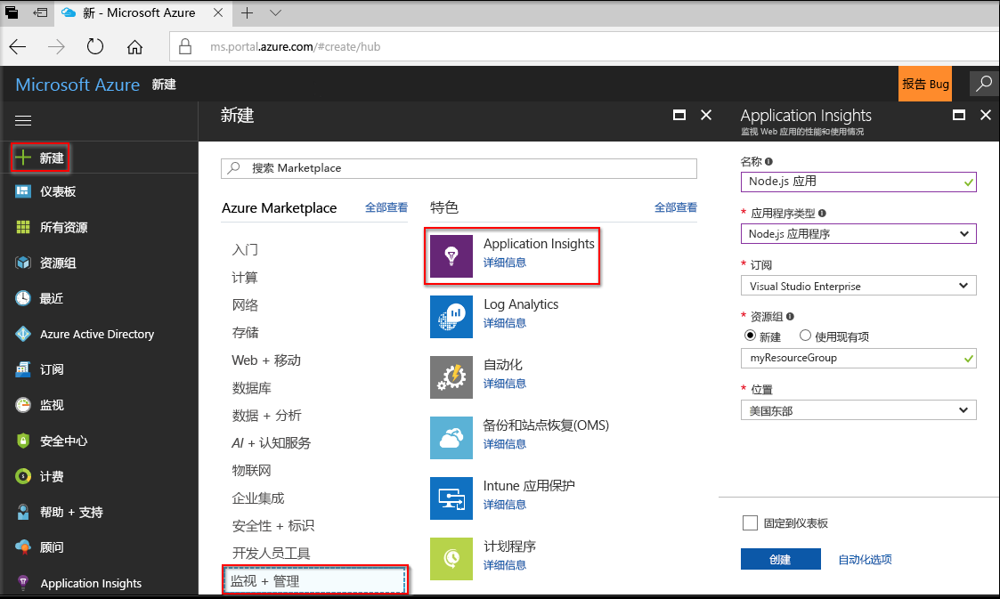
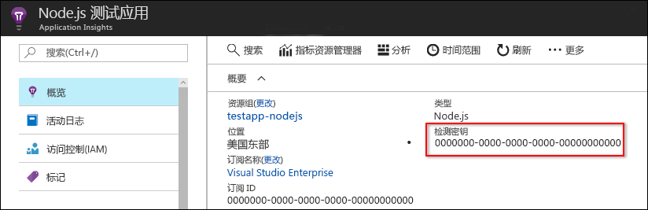
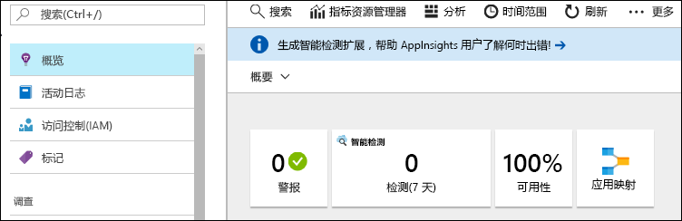
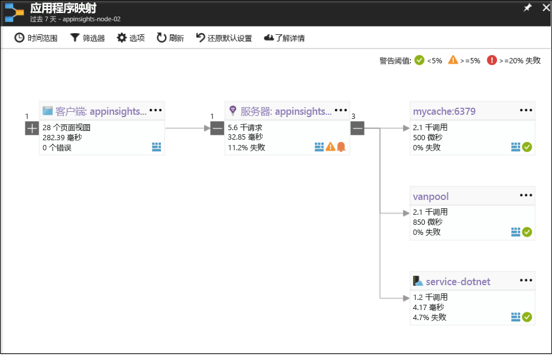
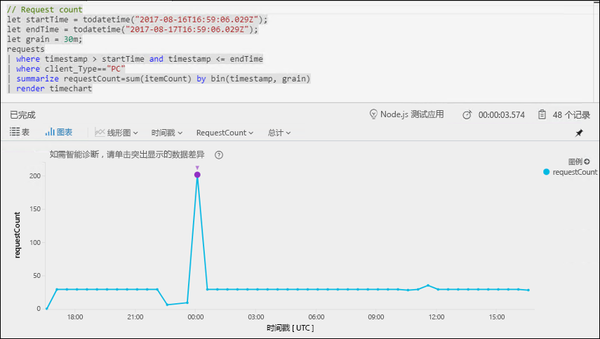
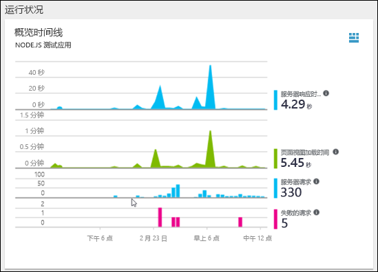

# <a name="start-monitoring-your-nodejs-web-application"></a>开始监视 Node.js Web 应用程序

使用 Azure Application Insights，可轻松监视 Web 应用程序的可用性、性能和使用情况。 还可以快速确定并诊断应用程序中的错误，而无需等待用户报告这些错误。 使用 0.20 版 SDK 发行版及更高版本，可以监视常见的第三方包，包括 MongoDB、MySQL 和 Redis。

本快速入门介绍如何将用于 Node.js 的 0.22 版 Application Insights SDK 添加到现有 Node.js Web 应用程序。

## <a name="prerequisites"></a>先决条件

完成本快速入门教程：

- 需要 Azure 订阅和现有 Node.js Web 应用程序。

如果没有 Node.js Web 应用程序，则可以按照[创建 Node.js Web 应用快速入门](https://docs.microsoft.com/azure/app-service/app-service-web-get-started-nodejs)创建一个。
 
如果你还没有 Azure 订阅，可以在开始前创建一个[免费](https://azure.microsoft.com/free/)帐户。

## <a name="log-in-to-the-azure-portal"></a>登录到 Azure 门户

登录到 [Azure 门户](https://portal.azure.com/)。

## <a name="enable-application-insights"></a>启用 Application Insights

Application Insights 可以从任何连接 Internet 的应用程序收集遥测数据，而不考虑它是在本地运行还是在云中运行。 按照以下步骤开始查看此数据。

1. 选择“创建资源” > “监视 + 管理” > “Application Insights”。

   

   此时会显示配置对话框，请使用下表填写输入字段。

    | 设置        | 值           | 说明  |
   | ------------- |:-------------|:-----|
   | **Name**      | 全局唯一值 | 标识所监视的应用的名称 |
   | **应用程序类型** | Node.js 应用程序 | 所监视的应用的类型 |
   | **资源组**     | myResourceGroup      | 用于托管 App Insights 数据的新资源组的名称 |
   | **位置** | 美国东部 | 选择离你近的位置或离托管应用的位置近的位置 |

2. 单击“创建”。

## <a name="configure-app-insights-sdk"></a>配置 App Insights SDK

1. 选择“概述” > “概要”> 复制应用程序的**检测密钥**。

   

2. 将用于 Node.js 的 Application Insights SDK 添加到应用程序。 从应用的根文件夹运行：

   ```bash
   npm install applicationinsights --save
   ```

3. 编辑应用的第一个 .js 文件并将以下两行添加到脚本的最顶部部分。 如果使用的是 [Node.js 快速入门应用](https://docs.microsoft.com/azure/app-service/app-service-web-get-started-nodejs)，则将修改 index.js 文件。 将 &lt;instrumentation_key&gt; 替换为应用程序的检测密钥。 

   ```JavaScript
   const appInsights = require('applicationinsights');
   appInsights.setup('<instrumentation_key>').start();
   ```

4. 重启应用。

> [!NOTE]
> 这需要 3-5 分钟，然后数据才开始显示在门户中。 如果此应用是一个低流量测试应用，请记住，仅当存在活动请求或正在执行的操作时，才会捕获大多数指标。

## <a name="start-monitoring-in-the-azure-portal"></a>开始在 Azure 门户中监视

1. 现在可以在 Azure 门户中重新打开 Application Insights“概述”页（已在其中检索到检测密钥），查看有关当前正在运行的应用程序的详细信息。

   

2. 单击“应用映射”以获取应用程序组件之间依赖关系的可视布局。 每个组件均显示 KPI，如负载、性能、失败和警报。

   

3. 单击“应用分析”图标 。  这将打开“Application Insights Analytics”，该软件提供丰富的查询语言，可用于分析 Application Insights 收集的所有数据。 在本示例中，将生成以图表形式呈现请求计数的查询。 可以编写自己的查询来分析其他数据。

   

4. 返回到“概述”页，并检查“运行状况概述时间线”。  此仪表板提供有关应用程序运行状况的统计信息，包括传入请求数、这些请求的持续时间，以及发生的任何故障。 

   

   若要启用“页面视图加载时间”图表以填充“客户端遥测”数据，请将此脚本添加到要跟踪的每一页：

   ```HTML
   <!-- 
   To collect end-user usage analytics about your application, 
   insert the following script into each page you want to track.
   Place this code immediately before the closing </head> tag,
   and before any other scripts. Your first data will appear 
   automatically in just a few seconds.
   -->
   <script type="text/javascript">
     var appInsights=window.appInsights||function(config){
       function i(config){t[config]=function(){var i=arguments;t.queue.push(function(){t[config].apply(t,i)})}}var t={config:config},u=document,e=window,o="script",s="AuthenticatedUserContext",h="start",c="stop",l="Track",a=l+"Event",v=l+"Page",y=u.createElement(o),r,f;y.src=config.url||"https://az416426.vo.msecnd.net/scripts/a/ai.0.js";u.getElementsByTagName(o)[0].parentNode.appendChild(y);try{t.cookie=u.cookie}catch(p){}for(t.queue=[],t.version="1.0",r=["Event","Exception","Metric","PageView","Trace","Dependency"];r.length;)i("track"+r.pop());return i("set"+s),i("clear"+s),i(h+a),i(c+a),i(h+v),i(c+v),i("flush"),config.disableExceptionTracking||(r="onerror",i("_"+r),f=e[r],e[r]=function(config,i,u,e,o){var s=f&&f(config,i,u,e,o);return s!==!0&&t["_"+r](config,i,u,e,o),s}),t
       }({
           instrumentationKey:"<insert instrumentation key>"
       });
       
       window.appInsights=appInsights;
       appInsights.trackPageView();
   </script>
   ```

5. 从“调查”标题下单击“浏览器”。 在此处可找到与应用页性能相关的指标。 可以单击“添加新图表”创建其他自定义视图，或者选择“编辑”修改现有的图表类型、高度、调色板、分组和指标。

   

若要了解有关监视 Node.js 的详细信息，请查看[其他 App Insights Node.js 文档](app-insights-nodejs.md)。

## <a name="clean-up-resources"></a>清理资源

如果计划继续使用后续的快速入门或相关教程，请勿清除在本快速入门中创建的资源。 如果不打算继续，请在 Azure 门户中执行以下步骤，删除通过此快速入门创建的所有资源。

1. 在 Azure 门户的左侧菜单中，单击“资源组”，然后单击“myResourceGroup”。
2. 在资源组页上单击“删除”，在文本框中键入 **myResourceGroup**，然后单击“删除”。

## <a name="next-steps"></a>后续步骤

> [!div class="nextstepaction"]
> [查找和诊断性能问题](https://docs.microsoft.com/azure/application-insights/app-insights-analytics)
