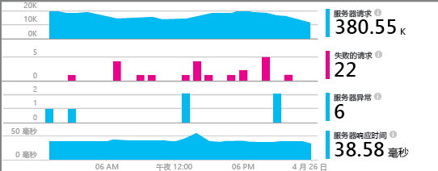
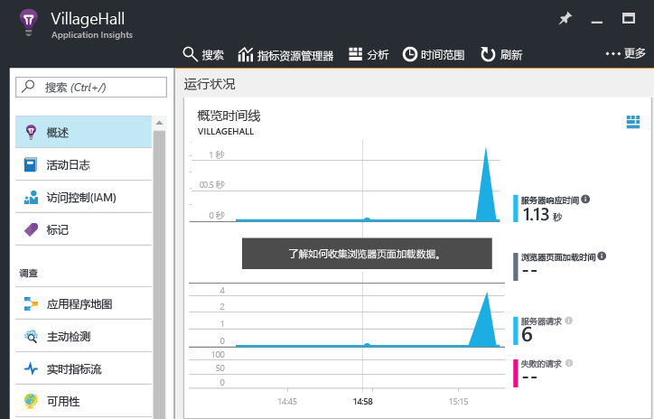

# <a name="monitor-your-nodejs-services-and-apps-with-application-insights"></a>使用 Application Insights 监视 Node.js 服务和应用

[Azure Application Insights](app-insights-overview.md) 可以在你部署后端服务和组件后对其进行监视，以便[发现并快速诊断性能问题和其他问题](app-insights-detect-triage-diagnose.md)。 可将其用于托管在任何位置（数据中心、Azure VM 和 Web 应用甚至其他公有云）的 Node.js 服务。

若要接收、存储和探索监视数据，请按以下说明操作，将代理包括到代码中，并在 Azure 中设置相应的 Application Insights 资源。 代理会将数据发送到该资源进行进一步的分析和探索。

Node.js 代理可以自动监视传入和传出的 HTTP 请求、多个系统指标以及异常。 从 v0.20 开始，该代理还可以监视一些常见的第三方包，例如 `mongodb`、`mysql` 和 `redis`。 所有与传入 HTTP 请求相关的事件都会进行关联，以加快故障排除速度。

可以使用稍后介绍的代理 API 来手动检测应用和系统的更多方面，从而对其进行监视。



## <a name="getting-started"></a>入门

让我们逐步了解如何设置应用或服务的监视。

### <a name="resource"></a> 设置 App Insights 资源

**开始之前**，请确保你拥有 Azure 订阅，否则请[免费获取一个新的][azure-free-offer]。 如果你的组织已经拥有 Azure 订阅，管理员可以按照[这些说明][add-aad-user]将你添加到该订阅。

[azure-free-offer]: https://azure.microsoft.com/en-us/free/
[add-aad-user]: https://docs.microsoft.com/en-us/azure/active-directory/active-directory-users-create-azure-portal

现在，请登录到 [Azure 门户][portal]并创建 Application Insights 资源，如下所述：单击“新建”>“开发人员工具”>“Application Insights”。 该资源包括用于接收遥测数据的终结点、用于该数据的存储、保存的报告和仪表板、规则和警报配置等。


在资源创建页上，从应用程序类型下拉列表中选择“Node.js 应用程序”。 应用类型决定了为你创建的默认仪表板和报告集。 但请不要担心，实际上，任何 App Insights 资源都可以收集任何语言和平台的数据。


### <a name="agent"></a> 设置 Node.js 代理

现在可以将代理包括到应用中，使之能够收集数据。
开始时，请从门户中复制资源的检测密钥（以下称为 `ikey`），如下所示。 App Insights 系统使用该密钥将数据映射到 Azure 资源，因此需在环境变量或代码中指定它，供代理使用。  


接下来，通过 package.json 将 Node.js 代理库添加到应用的依赖项。 从应用的根文件夹，运行：

```bash
npm install applicationinsights --save
```

现在需将库显式加载到代码中。 由于代理将检测注入到许多其他库中，应尽早将其加载，甚至应赶在其他 `require` 语句之前加载。 若要开始，请在第一个 .js 文件顶部添加：

```javascript
const appInsights = require("applicationinsights");
appInsights.setup("<instrumentation_key>");
appInsights.start();
```

`setup` 方法配置默认情况下用于所有已跟踪项的检测密钥（因此也配置 Azure 资源）。 完成配置后调用 `start` 即可开始收集和发送遥测数据。

也可通过环境变量 APPINSIGHTS\_INSTRUMENTATIONKEY 来提供 ikey，不必手动将其传递给 `setup()` 或 `getClient()`。 这种做法允许你将 ikey 脱离已提交的源代码，并为不同的环境指定不同的 ikey。

下面介绍了其他配置选项。

可以尝试代理而不用发送遥测，方法是：将检测密钥设置为任意非空字符串。

### <a name="monitor"></a> 监视应用

代理自动收集有关 Node.js 运行时和一些常见第三方模块的遥测。 现在可以使用应用程序生成部分此类数据。

然后，在 [Azure 门户][portal]中浏览到此前创建的 Application Insights 资源，并在“概览”时间线中查找最开始的部分数据点，如下图所示。 单击图表可查看更多详细信息。



单击“应用程序映射”按钮可查看应用的已发现拓扑，如下图所示。 单击映射中的组件可查看更多详细信息。


使用“调查”部分提供的其他视图了解应用的详细信息并排查问题。


#### <a name="no-data"></a>没有数据？

由于代理对要提交的数据进行批处理，项目在门户中显示之前可能会有一段延迟。 如果在资源中看不到数据，可尝试下面的部分修复手段：

* 多使用几次应用程序；执行更多操作以生成更多遥测。
* 在门户资源视图中单击“刷新”。 图表会定期自动刷新自己，但单击“刷新”可以强制其立即刷新。
* 验证[所需传出端口](app-insights-ip-addresses.md)是否已打开。
* 打开[“搜索”](app-insights-diagnostic-search.md)磁贴，查找单个事件。
* 查看[常见问题][]。


## <a name="agent-configuration"></a>代理配置

下面是代理的配置方法及其默认值。

若要让服务中的事件完全相关联，请确保设置 `.setAutoDependencyCorrelation(true)`。 这样可以让代理在 Node.js 中跨异步回调跟踪上下文。

```javascript
const appInsights = require("applicationinsights");
appInsights.setup("<instrumentation_key>")
    .setAutoDependencyCorrelation(false)
    .setAutoCollectRequests(true)
    .setAutoCollectPerformance(true)
    .setAutoCollectExceptions(true)
    .setAutoCollectDependencies(true)
    .start();
```

## <a name="agent-api"></a>代理 API

<!-- TODO: Fully document agent API. -->

.NET 代理 API 的说明详见[此文](app-insights-api-custom-events-metrics.md)。

可以使用 Application Insights Node.js 客户端跟踪任何请求、事件、指标或异常。 以下示例演示了部分可用 API。

```javascript
let appInsights = require("applicationinsights");
appInsights.setup().start(); // assuming ikey in env var
let client = appInsights.getClient();

client.trackEvent("my custom event", {customProperty: "custom property value"});
client.trackException(new Error("handled exceptions can be logged with this method"));
client.trackMetric("custom metric", 3);
client.trackTrace("trace message");

let http = require("http");
http.createServer( (req, res) => {
  client.trackRequest(req, res); // Place at the beginning of your request handler
});
```

### <a name="track-your-dependencies"></a>跟踪依赖项

```javascript
let appInsights = require("applicationinsights");
let client = appInsights.getClient();

var success = false;
let startTime = Date.now();
// execute dependency call here....
let duration = Date.now() - startTime;
success = true;

client.trackDependency("dependency name", "command name", duration, success);
```

### <a name="add-a-custom-property-to-all-events"></a>将自定义属性添加到所有事件

```javascript
appInsights.client.commonProperties = {
    environment: process.env.SOME_ENV_VARIABLE
};
```

### <a name="track-http-get-requests"></a>跟踪 HTTP GET 请求

```javascript
var server = http.createServer((req, res) => {
    if ( req.method === "GET" ) {
            appInsights.client.trackRequest(req, res);
    }
    // other work here....
    res.end();
});
```

### <a name="track-server-startup-time"></a>跟踪服务器启动时间

```javascript
let start = Date.now();
server.on("listening", () => {
    let duration = Date.now() - start;
    appInsights.client.trackMetric("server startup time", duration);
});
```

## <a name="more-resources"></a>更多资源

* [在门户中监视遥测](app-insights-dashboards.md)
* [通过遥测编写分析查询](app-insights-analytics-tour.md)

<!--references-->

[portal]: https://portal.azure.com/
[常见问题]: app-insights-troubleshoot-faq.md

