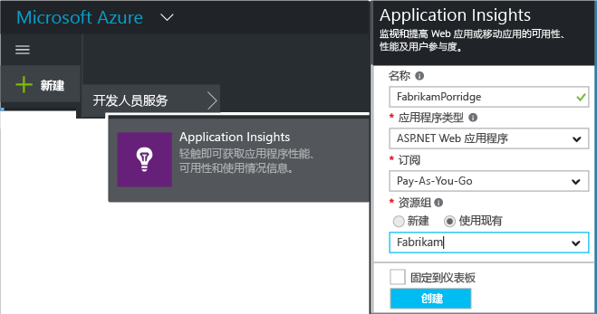
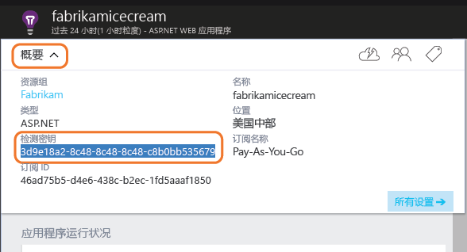

# <a name="add-application-insights-sdk-to-monitor-your-nodejs-app"></a>添加 Application Insights SDK 以监视 Node.js 应用
*Application Insights 目前提供预览版。*

[Visual Studio Application Insights](app-insights-overview.md) 监视实时应用程序，帮助[检测和诊断性能问题及异常](app-insights-detect-triage-diagnose.md)，同时[了解应用的使用情况](app-insights-overview-usage.md)。 它适用于在自有本地 IIS 服务器或 Azure VM 上托管的应用，以及 Azure Web 应用。

该 SDK 可以自动收集传入 HTTP 请求速率和响应、性能计数器（CPU、内存、RPS）和未经处理的异常。 此外，还可以添加自定义的调用，以跟踪依赖关系、指标或其他事件。


#### <a name="before-you-start"></a>开始之前
你需要：

* Visual Studio 2013 或更高版本。 版本越高越好。
* [Microsoft Azure](http://azure.com)订阅。 如果你的团队或组织拥有 Azure 订阅，则所有者可以使用你的 [Microsoft 帐户](http://live.com)将你加入其中。

## <a name="a-nameaddacreate-an-application-insights-resource"></a><a name="add"></a>创建 Application Insights 资源
登录 [Azure 门户][门户]，创建新的 Application Insights 资源。 Azure 中的[资源][角色]是服务的实例。 将在此资源中分析并呈现来自应用的遥测。



选择“其他”作为应用程序类型。 应用程序类型的选择会设置资源边栏选项卡和 [指标资源管理器][指标]中可见属性的默认内容。

#### <a name="copy-the-instrumentation-key"></a>复制检测密钥
密钥可标识资源，很快将在 SDK 中安装它来将数据定向到资源。



## <a name="a-namesdka-install-the-sdk-in-your-application"></a><a name="sdk"></a> 在应用程序中安装 SDK
```
npm install applicationinsights --save
```

## <a name="usage"></a>使用情况
这能启用请求监视、跟踪未经处理的异常和系统性能监视（CPU/内存/RPS）。

```javascript

var appInsights = require("applicationinsights");
appInsights.setup("<instrumentation_key>").start();
```

还可以在环境变量 APPINSIGHTS_INSTRUMENTATIONKEY 中设置检测密钥。 如果完成此操作，调用 `appInsights.setup()` 或 `appInsights.getClient()` 时无需使用参数。

可以尝试 SDK 而不用发送遥测：将检测密钥设置为非空字符串。

## <a name="a-nameruna-run-your-project"></a><a name="run"></a> 运行项目
运行应用程序并试用：打开不同的页面来生成一些遥测。

## <a name="a-namemonitora-view-your-telemetry"></a><a name="monitor"></a> 查看遥测
返回 [Azure 门户](https://portal.azure.com) ，浏览到 Application Insights 资源。

在“概述”页中查找数据。 首先，只会看到一个或两个点。 例如：


单击任何图表以查看更详细的指标。 [了解有关指标的详细信息。][perf]

#### <a name="no-data"></a>没有数据？
* 使用应用程序打开不同的页面，以生成一些遥测。
* 打开 [“搜索”](app-insights-diagnostic-search.md) 磁贴，查看每个事件。 有时，事件会需要较长的时间才能通过指标管道。
* 请等待几秒钟，然后单击“刷新” 。 图表会定期刷新本身，但如果正在等待某些数据显示，则可以手动刷新。
* 请参阅[故障排除][qna]。

## <a name="publish-your-app"></a>发布应用
现在，将应用程序部署到 IIS 或 Azure，然后观看数据累积。

#### <a name="no-data-after-you-publish-to-your-server"></a>发布到服务器后却没有数据？
在服务器的防火墙中打开这些出口流量的端口：

* `dc.services.visualstudio.com:443`
* `f5.services.visualstudio.com:443`

#### <a name="trouble-on-your-build-server"></a>生成服务器遇到问题？
请参阅 [此疑难解答项](app-insights-asp-net-troubleshoot-no-data.md#NuGetBuild)。

## <a name="customized-usage"></a>定制的使用情况
### <a name="disabling-autocollection"></a>禁用自动收集
```javascript
import appInsights = require("applicationinsights");
appInsights.setup("<instrumentation_key>")
    .setAutoCollectRequests(false)
    .setAutoCollectPerformance(false)
    .setAutoCollectExceptions(false)
    // no telemetry will be sent until .start() is called
    .start();
```

### <a name="custom-monitoring"></a>自定义监视
```javascript
import appInsights = require("applicationinsights");
var client = appInsights.getClient();

client.trackEvent("custom event", {customProperty: "custom property value"});
client.trackException(new Error("handled exceptions can be logged with this method"));
client.trackMetric("custom metric", 3);
client.trackTrace("trace message");
```

[了解有关遥测 API 的详细信息](app-insights-api-custom-events-metrics.md)。

### <a name="using-multiple-instrumentation-keys"></a>使用多个检测密钥
```javascript
import appInsights = require("applicationinsights");

// configure auto-collection with one instrumentation key
appInsights.setup("<instrumentation_key>").start();

// get a client for another instrumentation key
var otherClient = appInsights.getClient("<other_instrumentation_key>");
otherClient.trackEvent("custom event");
```

## <a name="examples"></a>示例
### <a name="tracking-dependency"></a>跟踪依赖关系
```javascript
import appInsights = require("applicationinsights");
var client = appInsights.getClient();

var startTime = Date.now();
// execute dependency call
var endTime = Date.now();

var elapsedTime = endTime - startTime;
var success = true;
client.trackDependency("dependency name", "command name", elapsedTime, success);
```


### <a name="manual-request-tracking-of-all-get-requests"></a>手动请求跟踪所有 "GET" 请求
```javascript
var http = require("http");
var appInsights = require("applicationinsights");
appInsights.setup("<instrumentation_key>")
    .setAutoCollectRequests(false) // disable auto-collection of requests for this example
    .start();

// assign common properties to all telemetry sent from the default client
appInsights.client.commonProperties = {
    environment: process.env.SOME_ENV_VARIABLE
};

// track a system startup event
appInsights.client.trackEvent("server start");

// create server
var port = process.env.port || 1337
var server = http.createServer(function (req, res) {
    // track all "GET" requests
    if(req.method === "GET") {
        appInsights.client.trackRequest(req, res);
    }

    res.writeHead(200, { "Content-Type": "text/plain" });
    res.end("Hello World\n");
}).listen(port);

// track startup time of the server as a custom metric
var start = +new Date;
server.on("listening", () => {
    var end = +new Date;
    var duration = end - start;
    appInsights.client.trackMetric("StartupTime", duration);
});
```

## <a name="next-steps"></a>后续步骤
* [在门户中监视遥测](app-insights-dashboards.md)
* [通过遥测编写分析查询](app-insights-analytics-tour.md)

<!--Link references-->

[了解用户]: app-insights-overview-usage.md
[指标]: app-insights-metrics-explorer.md
[性能]: app-insights-web-monitor-performance.md
[门户]: http://portal.azure.com/
[问题与解答]: app-insights-troubleshoot-faq.md
[角色]: app-insights-resources-roles-access-control.md


<!--HONumber=Nov16_HO2-->


