# Application Insights 使用分析
通过了解用户如何使用你的应用程序，从而专注于他们最重视的方案的开发工作，并深入了解他们发现更容易或更难实现的目标。

借助 Application Insights，可以清楚地了解应用程序使用情况，帮助改善用户体验，并实现企业目标。

Application Insights 适用于两个独立应用（位于 iOS、Android 和 Windows 上）以及 Web 应用（托管在 .NET 或 J2EE 上）。 

## 将 Application Insights 添加到项目
开始前，使用 [Microsoft Azure](https://azure.com) 获取免费帐户。 （试用期到期后，可以继续使用服务免费层。）

在 [Azure 门户](https://portal.azure.com)中，创建 Application Insights 资源。 此处将看到有关应用的使用情况和性能数据。

**如果应用是设备应用，**将 Application Insights SDK 添加到项目。 具体过程因 [IDE 和平台](app-insights-platforms.md)而异。 对于 Windows 应用，只需右键单击 Visual Studio 中的项目并选择“添加 Application Insights”。

**如果应用是 Web 应用，**则打开“快速启动”边栏选项卡，并获取要添加到网页的代码片段。 使用此片段重新发布它们。

也可以将 Application Insights 添加到 [ASP.NET](app-insights-asp-net.md) 或 [J2EE](app-insights-java-get-started.md) 服务器代码，以便同时从客户端和服务器合并遥测。

### 运行项目并查看最初的结果
在调试模式下运行项目几分钟，然后转到 [Azure 门户](https://portal.azure.com)并浏览到 Application Insights 中的项目资源。

发布应用以获取更多遥测，并查看用户使用你的应用执行哪些操作。

## 分析开箱即用
单击“页面视图”磁贴，查看使用情况详细信息。

将空白部分的鼠标悬停在图表上，查看特定点处的计数。 否则，数字显示一段时间内聚合的值，例如一段时间内不同用户的平均数、总数或计数。

在 Web 应用程序中，使用 Cookie 计算用户数。 对于使用多个浏览器、清除 Cookie 或使用隐私功能的用户，将多次计入。

Web 会话处于非活动状态 30 分钟后将计入。 当应用暂停时间超出几秒时，手机或其他设备上的会话将计入。

单击任何图表以查看更多详细信息。 例如：

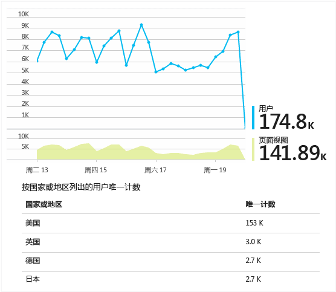

（此示例取自某个网站，但对于运行在设备上的应用而言图表看起来类似。）

与上一周进行比较，查看情况是否有变化：

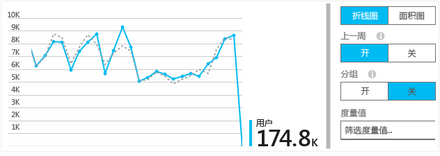

比较两个指标，例如用户和新用户：

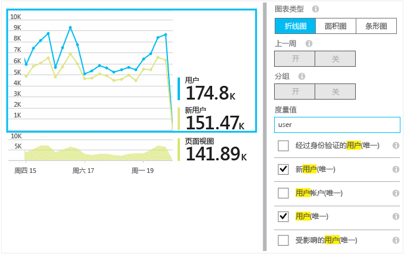

按浏览器、操作系统或城市等属性对数据进行分组（分段）：

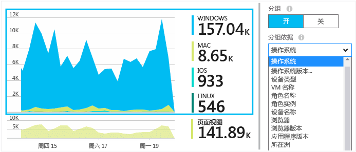

## 页面使用情况
单击页面视图磁贴，获取最常用页面的细目分类：

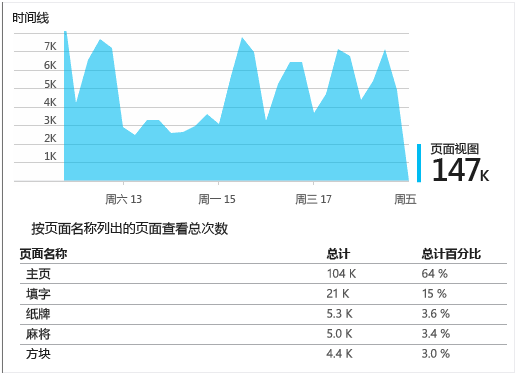

上面的示例取自某个游戏网站。 通过该示例，我们可以立即看到：

* 使用情况在上周未改善。 或许我们应该考虑搜索引擎优化？
* 查看游戏页面的人数比查看主页的人数少很多。 为什么我们的主页不能吸引用户来玩游戏？
* “Crossword”是最受欢迎的游戏。 在这里，我们应优先考虑新的想法和改进。

## 自定义跟踪
假设你决定将游戏全都重构到同一单页应用并在网页中将大多数功能编码为 Javascript，而不是在单个网页中实现每个游戏。 这将允许用户在游戏之间快速切换，甚至在一个页面上显示多个游戏。

但如果仍希望 Application Insights 在每个游戏打开时记录次数，并采用与它们位于单个网页上时完全相同的方式。 这很简单，只需将对遥测模块的调用插入到 JavaScript 中要记录新“页面”打开的位置即可：

    telemetryClient.trackPageView(game.Name);

## 自定义事件
可通过多种方式使用遥测，了解应用程序是如何使用的。 但是，你不希望总是将消息与页面视图混合在一起。 而使用自定义事件。 可以从设备应用、网页或 Web 服务器发送它们：

(JavaScript)

    telemetryClient.trackEvent("GameEnd");

(C#)

    var tc = new Microsoft.ApplicationInsights.TelemetryClient();
    tc.TrackEvent("GameEnd");

(VB)

    Dim tc = New Microsoft.ApplicationInsights.TelemetryClient()
    tc.TrackEvent("GameEnd")

“概述”边栏选项卡上会列出最常见的自定义事件。

单击要查看事件总数的表头。 可以按各种属性（如事件名称）对图表进行分段：

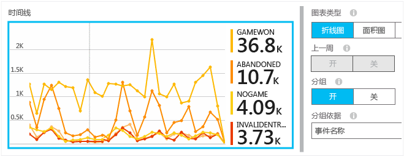

时间线特别有用的功能是可以将变化与其他指标和事件相关联。 例如，如果玩了多款游戏，预计已放弃的游戏数也呈上升趋势。 但是已放弃游戏数的上升不成比例，你希望找到是否是高负载导致用户觉得不可接受的问题。

## 钻取到特定事件
若要更好地了解典型会话的进展，可能需要关注包含特定事件类型的特定用户会话。

在此示例中，我们已编码自定义事件“NoGame”，即用户注销而未实际启动游戏时调用的事件。 用户为何需要执行此操作？ 假如钻取到某些特定匹配项，将获得提示。

从应用接收的自定义事件将按名称在“概述”边栏选项卡上列出：

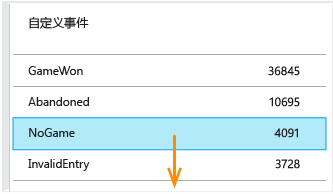

单击感兴趣的事件并选择最近的特定匹配项：

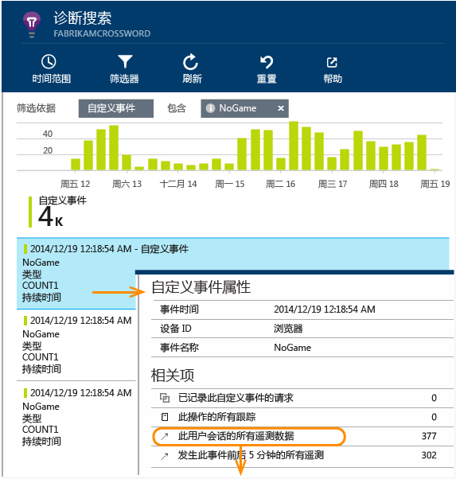

看一下发生这一特定 NoGame 事件的会话中的所有遥测。

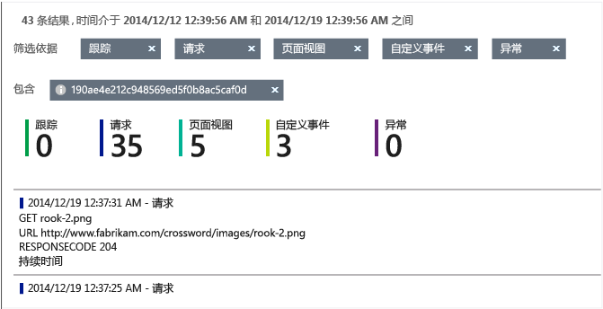

没有任何异常，因此没有以某些故障形式阻止用户玩游戏。

我们可以筛选出此会话所有类型的遥测，页面视图除外：

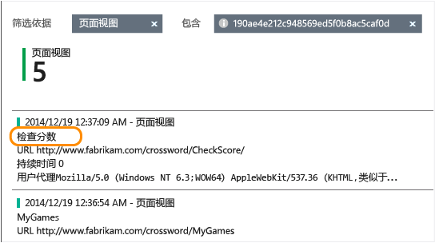

现在，我们可以看到此用户登录只是为了查看最新分数。 也许我们应考虑开发用户情景，以便于执行该操作。 （我们应实现自定义事件以在出现此特定情景时报告。）

## 使用属性对数据进行筛选、搜索和分段
可以向事件附加任意标记和数值。

客户端上的 JavaScript

    appInsights.trackEvent("WinGame",
        // String properties:
        {Game: currentGame.name, Difficulty: currentGame.difficulty},
        // Numeric measurements:
        {Score: currentGame.score, Opponents: currentGame.opponentCount}
    );

在服务器上使用 C#

    // Set up some properties:
    var properties = new Dictionary <string, string>
        {{"game", currentGame.Name}, {"difficulty", currentGame.Difficulty}};
    var measurements = new Dictionary <string, double>
        {{"Score", currentGame.Score}, {"Opponents", currentGame.OpponentCount}};

    // Send the event:
    telemetry.TrackEvent("WinGame", properties, measurements);

服务器上的 VB

    ' Set up some properties:
    Dim properties = New Dictionary (Of String, String)
    properties.Add("game", currentGame.Name)
    properties.Add("difficulty", currentGame.Difficulty)

    Dim measurements = New Dictionary (Of String, Double)
    measurements.Add("Score", currentGame.Score)
    measurements.Add("Opponents", currentGame.OpponentCount)

    ' Send the event:
    telemetry.TrackEvent("WinGame", properties, measurements)

以相同方式将属性附加到页面视图：

客户端上的 JavaScript

    appInsights.trackPageView("Win",
        {Game: currentGame.Name},
        {Score: currentGame.Score});

在诊断搜索中，通过单击单个事件匹配项查看属性。

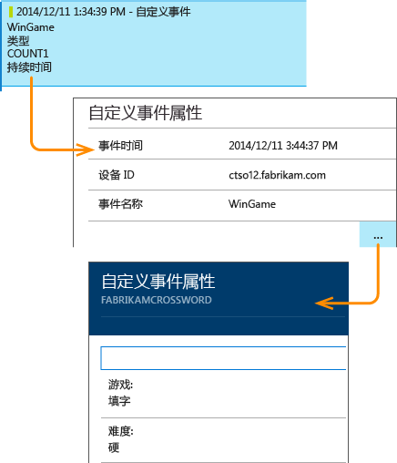

使用“搜索”字段查看具有特定属性值的事件匹配项。

## A | B 测试
如果不知道哪个功能变体将更有成效，可同时发布这两项，使不同用户都能访问它们。 评估每个项的成效，然后移至统一的版本。

对于此技术，可将不同标记附加到应用的每个版本所发送的所有遥测。 为此，可以在活动的 TelemetryContext 中定义属性。 这些默认属性将添加到应用程序发送的每个遥测消息（并非仅自定义消息），不过标准遥测也是这样。

在 Application Insights 门户中，将能够基于标记筛选和分组（分段）数据，以便比较不同的版本。

服务器上的 C#

    using Microsoft.ApplicationInsights.DataContracts;

    var context = new TelemetryContext();
    context.Properties["Game"] = currentGame.Name;
    var telemetry = new TelemetryClient(context);
    // Now all telemetry will automatically be sent with the context property:
    telemetry.TrackEvent("WinGame");

服务器上的 VB

    Dim context = New TelemetryContext
    context.Properties("Game") = currentGame.Name
    Dim telemetry = New TelemetryClient(context)
    ' Now all telemetry will automatically be sent with the context property:
    telemetry.TrackEvent("WinGame")

单个遥测可能会覆盖默认值。

可以设置通用初始值设定项，以便所有新的 TelemetryClient 自动使用上下文。

    // Telemetry initializer class
    public class MyTelemetryInitializer : ITelemetryInitializer
    {
        public void Initialize (ITelemetry telemetry)
        {
            telemetry.Properties["AppVersion"] = "v2.1";
        }
    }

在应用初始值设定项（如 Global.asax.cs）中：

    protected void Application_Start()
    {
        // ...
        TelemetryConfiguration.Active.TelemetryInitializers
        .Add(new MyTelemetryInitializer());
    }

## 生成 - 衡量 - 学习
当使用分析时，它将成为开发周期的集成部分，而不仅是考虑帮助解决问题的某些内容。 下面是一些提示：

* 确定应用程序的关键指标。 是需要尽可能多的用户，还是更倾向于一小部分满意度很好的用户？ 是否希望最大化访问量或销量？
* 计划衡量每个情景。 当草拟新的用户情景或功能，或者计划更新现有内容时，应始终考虑将如何衡量更改的成效。 在编码开始前，系统会询问“如果可行的话，这将对我们的指标产生什么影响？ 我们是否应跟踪任何新的事件？”
  当然，如果功能是实时功能，请确保查看分析并对结果进行操作。
* 将其他指标与关键指标相关。 例如，如果添加“收藏夹”功能，需要知道用户添加收藏夹的频率。 但或许了解他们返回到收藏夹的频率会更有趣。 而最重要的是，使用收藏夹的客户是否最终会购买更多产品？
* Canary 测试。 设置功能切换，使得仅向某些用户显示新功能。 使用 Application Insights 查看是否按设想的方式使用新功能。 进行一些调整，然后面向更大范围的受众发布它。
* 与用户沟通！ 仅依靠分析还不够，还需要补充才能维护良好的客户关系。

## 了解详细信息
* [检测、会审和诊断应用中的崩溃和性能问题](app-insights-detect-triage-diagnose.md)
* [多个平台上的 Application Insights 入门](app-insights-detect-triage-diagnose.md)

## 视频
> [!VIDEO https://channel9.msdn.com/Series/ConnectOn-Demand/231/player]
> 
> 

<!--HONumber=Nov16_HO3-->

