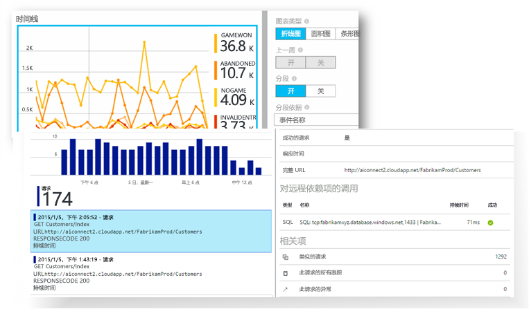
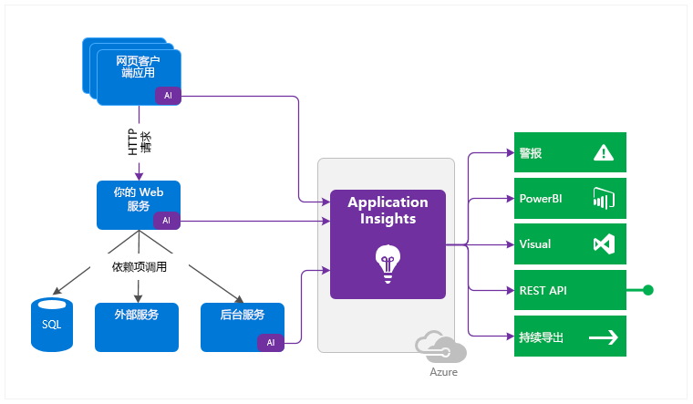
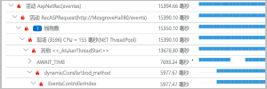
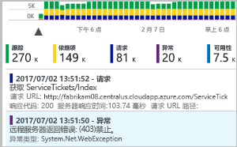
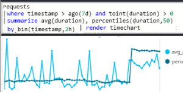
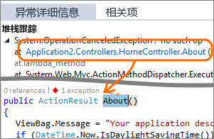
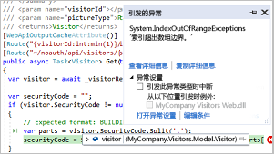
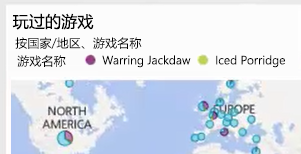
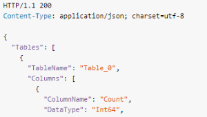
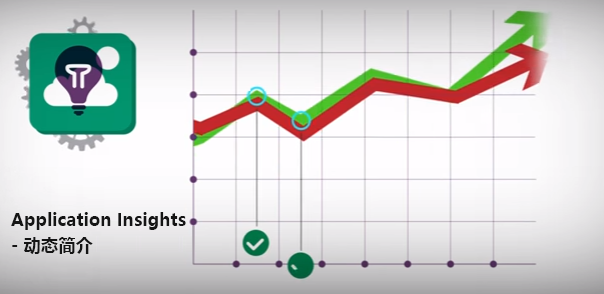

# 什么是 Application Insights？
Application Insights 是多个平台上面向 Web 开发人员的可扩展应用程序性能管理 (APM) 服务。 使用它可以监视实时 Web 应用程序。 它会自动检测性能异常。 其中包含强大的分析工具来帮助诊断问题，了解用户在应用中实际执行了哪些操作。  它旨在帮助持续提高性能与可用性。 它适用于本地或云中托管的各种平台（包括 .NET、Node.js 和 J2EE）中的应用。 它与 DevOps 流程集成，具有与各种开发工具的连接点。

[查看简介动画](https://www.youtube.com/watch?v=fX2NtGrh-Y0)。

## Application Insights 的工作原理是什么？
在应用程序中安装小检测包，并在 Microsoft Azure 门户中设置 Application Insights 资源。 检测会监视应用，并将遥测数据发送到门户。 （可在任意位置运行此应用程序 - 无需在 Azure 中托管。）

不仅可以检测 Web 服务应用程序，还可以检测所有后台组件以及 Web 页面中的 JavaScript。 

此外，还可以从主机环境（如性能计数器、Azure 诊断或 Docker 日志）中拉取遥测。 还可以对定期向 Web 服务发送综合请求的 Web 测试进行设置。

所有这些遥测流都在 Azure 门户中集成，可以在其中对原始数据应用强大的分析和搜索工具。

### 什么是开销？
应用性能受到的影响非常小。 跟踪调用是非阻塞式的，以批量方式进行并在单独的线程中发送。

## Application Insights 监视器的工作原理是什么？

Application Insights 主要面向开发团队，旨在帮助用户了解应用的运行性能和使用方式。 监视：

* **请求率、响应时间和失败率** - 了解最受欢迎的页面、时段以及用户的位置。 查看哪些页面效果最好。 当有较多请求时，如果响应时间长且失败率高，则可能存在资源问题。 
* **依赖项速率、响应时间和失败率** - 了解外部服务是否正拖慢你的速度。
* **异常** - 分析聚合的统计信息，或选择特定实例并钻取堆栈跟踪和相关请求。 报告服务器和浏览器异常。
* **页面查看次数和负载性能** - 由用户的浏览器报告。
* **AJAX 调用**（从网页） - 速率、响应时间和失败率。
* **用户和会话计数**。
* Windows 或 Linux 服务器计算机中的**性能计数器**，例如 CPU、内存和网络使用情况。 
* Docker 或 Azure 中的**主机诊断**。 
* 应用中的**诊断跟踪日志**- 可以将跟踪事件与请求相关联。
* 在客户端或服务器代码中自行编写的**自定义事件和指标**，用于跟踪业务事件（例如销售的商品或赢得的游戏）。

## 在哪里可以查看我的遥测数据？

可通过许多方式浏览你的数据。 请查看以下文章：

|  |  |
| --- | --- |
| [**智能检测和手动警报**](app-insights-proactive-diagnostics.md) 当某些内容处于异常模式时，自动警报适应你的应用的遥测和触发器正常模式。 还可以在自定义或标准指标的特定级别上[设置警报](app-insights-alerts.md)。 | |
| [**应用程序映射**](app-insights-app-map.md) 应用的组件，包含关键指标和警报。 |  |
| [**探查器**](app-insights-profiler.md) 检查抽样请求的执行配置文件。 | |
| [**使用情况分析**](app-insights-usage-overview.md) 分析用户细分和保留情况。| |
| [**实例数据的诊断搜索**](app-insights-diagnostic-search.md) 搜索和筛选事件，例如请求、异常、依赖项调用、日志跟踪和页面视图。  | |
| [**聚合数据的指标资源管理器**](app-insights-metrics-explorer.md) 浏览、筛选和细分聚合的数据，例如请求率、故障率和异常率；响应时间、页面加载时间。 | |
| [**仪表板**](app-insights-dashboards.md#dashboards) 混合使用来自多个资源的数据并与他人共享。 对于多组件应用程序和在团队聊天室中连续显示很有用。 | |
| [**实时指标流**](app-insights-live-stream.md) 部署新的生成时，观看这些准实时性能指示器，确保一切按预期工作。 | |
| [**分析**](app-insights-analytics.md) 使用此功能强大的查询语言，回答有关应用的性能和使用情况的疑难问题。 | |
| [**Visual Studio**](app-insights-visual-studio.md) 查看代码中的性能数据。 从堆栈跟踪转到代码。| |
| [**快照调试器**](app-insights-snapshot-debugger.md) 使用参数值调试从实时操作采样的快照。| |
| [**Power BI**](app-insights-export-power-bi.md) 将使用指标与其他商业智能集成。| |
| [**REST API**](https://dev.applicationinsights.io/) 编写代码以对指标和原始数据运行查询。|  |
| [**连续导出**](app-insights-export-telemetry.md) 原始数据到达后，立即将其批量导出到存储。 | |

## 如何使用 Application Insights？

### 监视
在应用中安装 Application Insights，设置[可用性 Web 测试](app-insights-monitor-web-app-availability.md)，然后：

* 为团队聊天室设置[仪表板](app-insights-dashboards.md)，以便监视负载、响应能力和依赖项性能、页面加载和 AJAX 调用。
* 发现最慢和多数情况下失败的请求。
* 在部署新版本时查看[实时流](app-insights-live-stream.md)，快速掌握任何降级情况。

### 检测、诊断
当收到警报，或发现问题时：

* 评估受到影响的的用户的数量。
* 将失败与异常、依赖项调用和跟踪关联起来。
* 检查探查器、快照、堆栈转储和跟踪日志。

### 生成、衡量、学习
[测量有效性](app-insights-usage-overview.md)（针对部署的每个新功能）。

* 规划以衡量客户使用新的 UX 或业务功能的方式。
* 将自定义遥测写入代码。
* 使下一个开发周期基于遥测的硬性证据。

## 入门
Application Insights 是 Microsoft Azure 中托管的众多服务之一，遥测会发送到此处进行分析和展示。 因此在执行任何其他操作之前，需要有 [Microsoft Azure](http://azure.com) 订阅。 可免费注册该订阅，如果选择 Application Insights 的基本[pricing plan](https://azure.microsoft.com/pricing/details/application-insights/)（定价计划），不会产生费用，但如果应用的使用量大幅增加，将会产生费用。 如果你的组织已有订阅，则组织可向其中添加你的 Microsoft 帐户。

可通过多种方法开始使用。 可从最适合你的方法开始。 可在以后添加其他方法。

* **运行时：检测服务器上的 Web 应用。** 避免任何代码更新。 需要服务器的管理员访问权限。
  * [**本地或 VM 上的 IIS**](app-insights-monitor-performance-live-website-now.md)
  * [Azure Web 应用或 VM](app-insights-monitor-performance-live-website-now.md)
  * [**J2EE**](app-insights-java-live.md)
* **开发时：将 Application Insights 添加到代码。** 可以编写自定义遥测以及检测后端和桌面应用。
  * [Visual Studio](app-insights-asp-net.md) 2013 update 2 或更高版本。
  * [Eclipse](app-insights-java-eclipse.md) 或[其他工具](app-insights-java-get-started.md)中的 Java
  * [Node.js](app-insights-nodejs.md)
  * [其他平台](app-insights-platforms.md)
* 针对页面视图、AJAX 和其他客户端遥测**[检测网页](app-insights-javascript.md)**。
* **[可用性测试](app-insights-monitor-web-app-availability.md)** - 从我们的服务器定期对网站执行 ping 操作。

## 后续步骤
在运行时开始使用：

* [IIS 服务器](app-insights-monitor-performance-live-website-now.md)
* [J2EE 服务器](app-insights-java-live.md)

在开发时开始使用：

* [ASP.NET](app-insights-asp-net.md)
* [Java](app-insights-java-get-started.md)
* [Node.js](app-insights-nodejs.md)

## 支持和反馈
* 问题：
  * [故障排除][qna]
  * [MSDN 论坛](https://social.msdn.microsoft.com/Forums/vstudio/home?forum=ApplicationInsights)
  * [StackOverflow](http://stackoverflow.com/questions/tagged/ms-application-insights)
* 用户建议：
  * [UserVoice](https://visualstudio.uservoice.com/forums/357324)
* 博客：
  * [Application Insights blog](https://azure.microsoft.com/blog/tag/application-insights)（Application Insights 博客）

## 视频

> [!VIDEO https://channel9.msdn.com/events/Connect/2016/100/player] 

<!--Link references-->

[android]: https://github.com/Microsoft/ApplicationInsights-Android
[azure]: ../insights-perf-analytics.md
[client]: app-insights-javascript.md
[desktop]: app-insights-windows-desktop.md
[detect]: app-insights-detect-triage-diagnose.md
[greenbrown]: app-insights-asp-net.md
[ios]: https://github.com/Microsoft/ApplicationInsights-iOS
[java]: app-insights-java-get-started.md
[knowUsers]: app-insights-web-track-usage.md
[platforms]: app-insights-platforms.md
[portal]: http://portal.azure.com/
[qna]: app-insights-troubleshoot-faq.md
[redfield]: app-insights-monitor-performance-live-website-now.md

