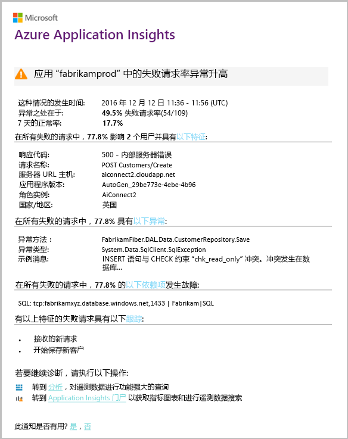

# 智能检测 - 失败异常
如果 Web 应用的失败请求速率出现异常上升，[Application Insights](app-insights-overview.md) 会几乎实时地自动通知你。 它会对 HTTP 请求速率或报告为失败的依赖项调用的异常上升进行检测。 对于请求而言，失败的请求通常是响应代码为 400 或更高的请求。 为了帮助会审和诊断问题，通知中会提供失败及相关遥测的特征分析。 还提供指向 Application Insights 门户的链接，以供进一步诊断。 该功能不需要任何设置或配置，因为它使用机器学习算法来预测正常的失败率。

此功能适用于 Java 和 ASP.NET Web 应用，它们托管在云中或自己的服务器上。 它也适用于生成请求或依赖项遥测的任何应用，例如当你具有用于调用 [TrackRequest()](app-insights-api-custom-events-metrics.md#trackrequest) 或 [TrackDependency()](app-insights-api-custom-events-metrics.md#trackdependency) 的辅助角色时。

在设置[适用于你的项目的 Application Insights](app-insights-overview.md) 后，如果应用生成特定最低遥测量，在进行切换和发送警报前，智能检测失败异常将花费 24 小时来了解应用的正常行为。

下面是一个示例警报。

> [!NOTE]
> 默认情况下，你会收到比该示例中更短的格式邮件。 但是你可以[切换为这一详细格式](#configure-alerts)。
>
>

请注意，它会指示：

* 相较于正常应用行为的失败率。
* 受影响的用户数，因此你知道需要有多担心。
* 与失败关联的特征模式。 在此示例中，有特定的响应代码、请求名称（操作）和应用版本。 这将立即通知在代码中开始查找的位置。 其他可能性可能是特定的浏览器或客户端操作系统。
* 似乎与特征失败相关联的异常、日志跟踪和依赖项失败（数据库或其他外部组件）。
* 直接指向 Application Insights 中遥测的相关搜索的链接。

## 智能检测的优点
普通[指标警报](app-insights-alerts.md)会通知你可能存在问题。 但是，智能检测将开始诊断工作，并执行以往都需要你自行进行的大量分析。 结果将整齐地打包，以帮助你快速找到问题的根源。

## 工作原理
智能检测监视从应用收到的遥测数据，特别是失败率。 此规则计算 `Successful request` 属性为 False 的请求数，和 `Successful call` 属性为 False 的依赖项调用数。 对于请求而言，默认情况下，`Successful request == (resultCode < 400)`（除非已将自定义代码写入[筛选器](app-insights-api-filtering-sampling.md#filtering)或生成自己的 [TrackRequest](app-insights-api-custom-events-metrics.md#trackrequest) 调用）。 

应用性能具有典型的行为模式。 某些请求或依赖项调用更容易出现失败，而且总体失败率可能会随着负载的增加而上升。 智能检测使用机器学习来查找这些异常。

由于遥测数据从 Web 应用提供给 Application Insights，因此智能检测会将当前行为与过去几天看到的模式进行比较。 如果通过与先前性能比较观察到失败率中有异常上升，将触发分析。

分析触发后，服务将对失败的请求执行群集分析，以尝试标识特征化失败的值的模式。 在上面的示例中，分析发现大多数失败都是关于特定结果代码、请求名称、服务器 URL 主机和角色实例。 相比之下，分析已发现客户端操作系统属性分布在多个值上，因此它未列出。

当使用这些遥测调用检测服务时，分析器查找与已标识群集中的请求关联的异常和依赖项失败，以及与这些请求关联的任何跟踪日志的示例。

生成的分析将以警报形式发送给用户，除非已将它配置为不这样做。

与[手动设置的警报](app-insights-alerts.md)一样，你可以检查警报状态并在 Application Insights 资源的“警报”边栏选项卡中配置它。 但与其他警报不同，无需设置或配置智能检测。 如果需要，可以禁用它或更改其目标电子邮件地址。

## 配置警报
可以禁用智能检测、更改电子邮件收件人、创建 webhook，或者选择启用更详细的警报消息。

打开“警报”页。 包括失败异常以及已手动设置的任何警报，并可以查看其当前是否处于警报状态。

单击警报以配置它。

请注意，你可以禁用智能检测，但不能删除它（或创建另一个）。

#### 详细的警报
如果选择“获取更详细的诊断”，电子邮件将包含更多诊断信息。 有时，你可以仅通过电子邮件中的数据诊断问题。

存在更详细的警告消息可能包含敏感信息的轻微危险性，因为它包括异常和跟踪消息。 但是，只有代码允许敏感信息包含在这些消息中，才会发生这种情形。

## 会审和诊断警报
警报指示已检测到失败请求中有异常上升。 应用或其环境很可能存在某些问题。

根据请求百分比和受影响用户数，可以确定问题的紧急程度。 在上面的示例中，将 22.5% 的失败率与 1% 的正常失败率比较，指示一些不好的事情正在进行。 另一方面，只有 11 位用户受到影响。 如果它是你的应用，你将能够评估情况的严重情况。

在许多情况下，你将能够从提供的请求名称、异常、依赖项失败和跟踪数据快速诊断问题。

存在其他一些提示。 例如，该示例中的依赖项失败率与异常率 (89.3%) 相同。 这表明异常直接由依赖项失败引发，假设你对在代码中开始查找的位置有清晰的认识。

若要进一步调查，每个部分中的链接可直接转到[搜索页](app-insights-diagnostic-search.md)，该页面已针对相关请求、异常、依赖项或跟踪进行筛选。 或者，可以打开 [Azure 门户](https://portal.azure.com)，导航到应用的 Application Insights 资源并打开“失败”边栏选项卡。

在此示例中，单击“查看依赖项失败详细信息”链接将打开 Application Insights 搜索边栏选项卡。 它显示包含根本原因的示例的 SQL 语句：在必填字段提供 NULL，并且在保存操作期间未通过验证。

## 查看最近的警报

单击“智能检测”以转到最近警报：

## 区别是什么...
智能检测失败异常对其他类似但又不同的 Application Insight 功能进行补充。

* [指标警报](app-insights-alerts.md)由你设置，并且可监视各种指标，如 CPU 占用、请求速率、页面加载时间等。 可以将它们用于发出警告，例如在需要添加更多资源时。 相比之下，智能检测失败异常涵盖小范围的关键指标（当前仅失败请求速率），设计成一旦 Web 应用的失败请求速率相较于 Web 应用的正常行为而言显著增加，便会以近实时方式通知你。

    智能检测自动调整其阈值以响应现行条件。

    智能检测将开始诊断工作。
* [智能检测性能异常](app-insights-proactive-performance-diagnostics.md)还使用计算机智能发现指标中的异常模式，使得你无需执行任何配置。 但与智能检测失败异常不同，智能检测性能异常的目的是查找可能不能提供很好服务的使用情况复写体分段，例如通过特定类型浏览器上的特定页面。 将每日执行分析，如果找到任何结果，则很可能紧急程度远低于警报。 相比之下，会对传入的遥测数据连续执行失败异常分析，如果服务器失败率超出预期值，将在几分钟内通知你。

## 如果收到智能检测警报
*为什么会收到此警报？*

* 我们检测到与之前一段时间的正常基线相比，失败请求率中出现异常上升。 对失败和关联遥测进行分析后，我们认为存在问题并且你应当给予关注。

*通知是否表示肯定存在问题？*

* 我们尝试针对应用中断或降级发出警报，但只有你可以完全了解语义以及对应用或用户的影响。

*所以你们会查看我的数据？*

* 否。 该服务完全是自动的。 只有你会收到通知。 你的数据是[私有](app-insights-data-retention-privacy.md)数据。

*是否需要订阅此警报？*

* 不会。 发送请求遥测的每个应用程序都有智能检测警报规则。

*是否可以取消订阅或者获取已发送至同事的通知？*

* 是，在“警报”规则中，单击“智能检测”规则可配置它。 可以禁用警报，或更改警报的收件人。

*我丢失了电子邮件。在哪里可以找到门户中的通知？*

* 在活动日志中。 在 Azure 中，打开你的应用的 Application Insights 资源，然后选择“活动日志”。

*一些警报关于已知问题，我不希望接收它们。*

* 我们对积压工作会有警报抑制。

## 后续步骤
这些诊断工具可帮助你检查应用中的遥测：

* [指标资源管理器](app-insights-metrics-explorer.md)
* [搜索资源管理器](app-insights-diagnostic-search.md)
* [分析 - 功能强大的查询语言](app-insights-analytics-tour.md)

智能检测是完全自动执行的。 但或许你想要设置更多一些警报？

* [手动配置的指标警报](app-insights-alerts.md)
* [可用性 Web 测试](app-insights-monitor-web-app-availability.md)

<!--HONumber=Feb17_HO1-->

