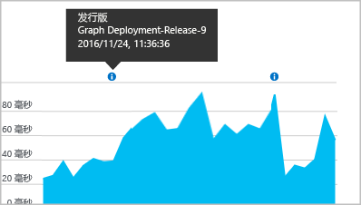

# <a name="separating-telemetry-from-development-test-and-production"></a>分隔开发、测试和生产阶段的遥测

部署 Web 应用程序的下一个版本时，不希望将新版本和已发布的版本中的 [Application Insights](app-insights-overview.md) 遥测混合使用。 为避免混淆，请使用不同的检测密钥 (ikey) 将遥测数据从不同的开发阶段发送到不同的 Application Insights 资源。 为了在版本从一个阶段移动到另一个阶段时更轻松地更改检测密钥，在代码中而非在配置文件中设置 ikey 可能比较有用。 

（如果系统是 Azure 云服务，有[另一种方法可以设置单独 ikey](app-insights-cloudservices.md)。）

## <a name="about-resources-and-instrumentation-keys"></a>关于资源和检测密钥

为 Web 应用设置 Application Insights 监视时，会在 Microsoft Azure 中创建 Application Insights *资源*。 为了查看和分析从应用收集的遥测数据，会在 Azure 门户中打开此资源。 每个资源都由一个*检测密钥* (iKey) 予以标识。 在安装 Application Insights 程序包来监视应用时，将为其配置检测密钥，以使其知道要将遥测数据发送到何处。

在不同的方案中，通常选择使用不同的资源或使用单个共享资源：

* 不同的独立应用程序 - 为每个应用使用不同的资源和 ikey。
* 单个业务应用程序的多个组件或角色 - 为所有组件应用使用[单个共享资源](app-insights-monitor-multi-role-apps.md)。 可以按 cloud_RoleName 属性对遥测数据进行筛选或分段。
* 开发、测试和发布 - 在各个生产“戳记”或生产阶段中为系统的不同版本使用不同的资源和 ikey。
* A | B 测试 - 使用单个资源 创建遥测初始值设定项来向遥测添加用于标识各个变体的属性。


## <a name="dynamic-ikey"></a> 动态检测密钥

为了在代码在不同生产阶段中移动时更轻松地更改 ikey，请在代码中而非在配置文件中设置 ikey。

在初始化方法中设置密钥，如 ASP.NET 服务中的 global.aspx.cs：

*C#*

    protected void Application_Start()
    {
      Microsoft.ApplicationInsights.Extensibility.
        TelemetryConfiguration.Active.InstrumentationKey = 
          // - for example -
          WebConfigurationManager.AppSettings["ikey"];
      ...

在此示例中，不同资源的 ikey 放置在 Web 配置文件的不同版本中。 通过交换 Web 配置文件（可作为发布脚本的一部分执行），将交换目标资源。

### <a name="web-pages"></a>网页
通过[从快速启动边栏选项卡获取的脚本](app-insights-javascript.md)，iKey 也在应用的网页中使用。 从服务器状态生成它，而不是逐字将其编码到脚本中。 例如，在 ASP.NET 应用中：

*使用 Razor 的 JavaScript*

    <script type="text/javascript">
    // Standard Application Insights web page script:
    var appInsights = window.appInsights || function(config){ ...
    // Modify this part:
    }({instrumentationKey:  
      // Generate from server property:
      "@Microsoft.ApplicationInsights.Extensibility.
         TelemetryConfiguration.Active.InstrumentationKey"
    }) // ...


## <a name="create-additional-application-insights-resources"></a>创建其他 Application Insights 资源
若要为不同的应用程序组件或同一组件的不同戳记（开发/测试/生产）分隔遥测，则必须创建新的 Application Insights 资源。

在 [portal.azure.com](https://portal.azure.com) 中，添加 Application Insights 资源：


* **应用程序类型**会影响在概述边栏选项卡上看到的内容和[指标资源管理器](app-insights-metrics-explorer.md)中的可用属性。 如果未看到应用类型，请选择网页的 Web 类型之一。
* **资源组**便于管理[访问控件](app-insights-resources-roles-access-control.md)之类的属性。 可为开发、测试和生产使用单独的资源组。
* **订阅**是 Azure 中的付款帐户。
* **位置**是保留数据的位置。 当前无法更改它。 
* **添加到仪表板**将资源的快速访问磁贴放在 Azure 主页上。 

创建资源需要几秒钟。 完成后，会看到警报。

（可编写 [PowerShell 脚本](app-insights-powershell-script-create-resource.md)，自动创建资源。）

### <a name="getting-the-instrumentation-key"></a>获取检测密钥
检测密钥标识所创建的资源。 


需要将向其发送数据的所有资源的检测密钥。

## <a name="filter-on-build-number"></a>按版本号筛选
发布新应用版本时，我们希望能够将不同版本的遥测数据分开。

可以设置“应用程序版本”属性，这样便可以筛选[搜索](app-insights-diagnostic-search.md)和[指标资源管理器](app-insights-metrics-explorer.md)结果。


可通过多种不同的方法设置“应用程序版本”属性。

* 直接设置：

    `telemetryClient.Context.Component.Version = typeof(MyProject.MyClass).Assembly.GetName().Version;`
* 在[遥测初始值设定项](app-insights-api-custom-events-metrics.md#defaults)中将该行换行，确保以一致的方式设置所有 TelemetryClient 实例。
* [ASP.NET] 在 `BuildInfo.config` 中设置版本。 Web 模块将从 BuildLabel 节点选择版本。 在项目中包含此文件，并记得在解决方案资源管理器中设置“始终复制”属性。

    ```XML

    <?xml version="1.0" encoding="utf-8"?>
    <DeploymentEvent xmlns:xsi="http://www.w3.org/2001/XMLSchema-instance" xmlns:xsd="http://www.w3.org/2001/XMLSchema" xmlns="http://schemas.microsoft.com/VisualStudio/DeploymentEvent/2013/06">
      <ProjectName>AppVersionExpt</ProjectName>
      <Build type="MSBuild">
        <MSBuild>
          <BuildLabel kind="label">1.0.0.2</BuildLabel>
        </MSBuild>
      </Build>
    </DeploymentEvent>

    ```
* [ASP.NET] 在 MSBuild 中自动生成 BuildInfo.config。 为此，请在 `.csproj` 文件中添加以下几行：

    ```XML

    <PropertyGroup>
      <GenerateBuildInfoConfigFile>true</GenerateBuildInfoConfigFile>    <IncludeServerNameInBuildInfo>true</IncludeServerNameInBuildInfo>
    </PropertyGroup>
    ```

    这会生成一个名为 *yourProjectName*.BuildInfo.config 的文件。发布过程会将此文件重命名为 BuildInfo.config。

    当使用 Visual Studio 生成时，生成标签包含一个占位符 (AutoGen_...)。 但是，在使用 MSBuild 生成时，标签中会填充正确的版本号。

    若要允许 MSBuild 生成版本号，请在 AssemblyReference.cs 中设置类似于 `1.0.*` 的版本

## <a name="version-and-release-tracking"></a>版本和发行版本跟踪
若要跟踪应用程序版本，请确保 Microsoft 生成引擎进程生成了 `buildinfo.config`。 在 .csproj 文件中，添加：  

```XML

    <PropertyGroup>
      <GenerateBuildInfoConfigFile>true</GenerateBuildInfoConfigFile>    <IncludeServerNameInBuildInfo>true</IncludeServerNameInBuildInfo>
    </PropertyGroup>
```

当它具有内部信息时，Application Insights Web 模块自动将**应用程序版本**作为属性添加到每个遥测项。 这样，便可以在执行[诊断搜索](app-insights-diagnostic-search.md)或[浏览指标](app-insights-metrics-explorer.md)时按版本进行筛选。

但请注意，内部版本号只能由 Microsoft 生成引擎生成，而不能由 Visual Studio 中的开发人员生成引擎生成。

### <a name="release-annotations"></a>版本注释
如果使用 Visual Studio Team Services，则可以在每次发布新版本时会[批注标记](app-insights-annotations.md)添加到图表中。 下图显示了此标记的形式。


## <a name="next-steps"></a>后续步骤

* [多个角色的共享资源](app-insights-monitor-multi-role-apps.md)
* [创建遥测初始值设定项来区分 A|B 变体](app-insights-api-filtering-sampling.md#add-properties)
