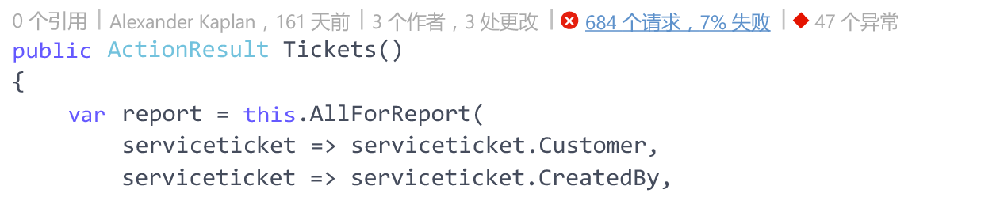
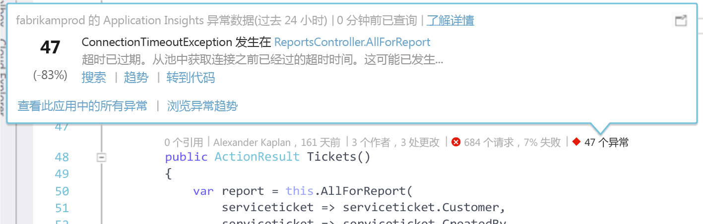
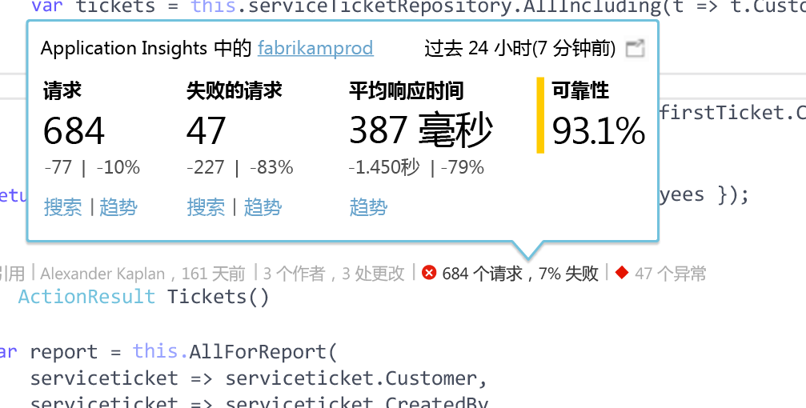

# Visual Studio CodeLens 中的 Application Insights 遥测
使用有关运行时异常和请求响应时间的遥测，可以批注 Web 应用代码中的方法。 如果在应用程序中安装 [Visual Studio Application Insights](app-insights-overview.md)，遥测会在 Visual Studio [CodeLens](https://msdn.microsoft.com/library/dn269218.aspx) 中显示，即每个函数顶端的备注，通常在此处查看有用的信息，例如引用函数的位置数量或最后编辑函数的人员。

> [!NOTE]
> Visual Studio 2015 Update 3 和更高版本，或 [开发者分析工具扩展](https://visualstudiogallery.msdn.microsoft.com/82367b81-3f97-4de1-bbf1-eaf52ddc635a)的最新版本提供 CodeLens 中的 Application Insights。 Visual Studio 的 Enterprise 和 Professional 版本提供 CodeLens。
> 
> 

## 在哪里查找 Application Insights 数据
在 Web 应用程序的公共请求方法的 CodeLens 指示器中查找 Application Insights 遥测。 CodeLens 指示器在 C# 和 Visual Basic 代码中的方法和其他声明上方显示。 如果 Application Insights 数据可用于某个方法，将看到请求和异常指示器，例如“100 个请求，%1 个失败”或“10 个异常”。 单击 CodeLens 指示器了解更多详细信息。 

> [!TIP]
> 在其他 CodeLens 指示器出现后，Application Insights 请求和异常指示器可能需要再过几秒才能加载。
> 
> 

## CodeLens 中的异常

异常 CodeLens 指示器会在处理方法提供的请求时，显示过去 24 小时内应用程序中发生的十五大最频繁发生的异常的数量。

若要查看更多详细信息，请单击异常 CodeLens 指示器：

* 相对之前 24 小时的最近 24 小时内的异常数量的百分比变化
* 选择“转到代码”  可浏览引发异常的函数的源代码
* 选择“搜索”  可查询过去 24 小时内发生此异常的所有实例
* 选择“趋势”  可查看过去 24 小时内此异常发生次数的区域可视化效果
* 选择“查看此应用中的所有异常”  可查询过去 24 小时内发生的所有异常
* 选择“探索异常趋势”  可查看过去 24 小时内发生的所有异常的趋势可视化效果。 

> [!TIP]
> 如果在 CodeLens 中看到“0 个异常”，但知道应该有异常，请检查并确保在 CodeLens 中选择了正确的 Application Insights 资源。 若要选择其他资源，请在解决方案资源管理器中右键单击项目，然后选择“Application Insights”>“选择遥测源”。 CodeLens 仅显示过去 24 小时内应用程序中的十五大最频繁发生的异常，因此，如果异常的发生频率排名第 16 位或发生频率更低，将看到“0 个异常”。 ASP.NET 视图中的异常可能不会在生成这些视图的控制器方法中显示。
> 
> [!TIP]
> 如果在 CodeLens 中看到“？ 个异常”，则需要将 Azure 帐户与 Visual Studio 关联，否则 Azure 帐户凭据可能会过期。 在任何一种情况下，单击“？ 个异常”，然后选择“添加帐户...”  以输入凭据。
> 
> 

## CodeLens 中的请求

请求 CodeLens 指示器显示过去 24 小时内某个方法提供的 HTTP 请求的数量，以及失败请求的百分比。

若要查看更多详细信息，请单击请求 CodeLens 指示器：

* 相对之前 24 小时的过去 24 小时内的请求数量、失败的请求和平均响应时间的绝对值和百分比变化
* 方法的可靠性，通过计算过去 24 小时内未失败请求的百分比获得
* 选择“搜索”  请求或失败的请求，可查询过去 24 小时内发生的所有（失败）请求
* 选择“趋势”  可查看过去 24 小时内的请求、失败的请求或平均响应时间的趋势可视化效果。
* 选择 CodeLens 详细信息视图左上角的 Application Insights 资源名称，更改 CodeLens 数据源对应的资源。

## 后续步骤
|  |  |
| --- | --- |
| **[在 Visual Studio 中使用 Application Insights](app-insights-visual-studio.md)** 搜索遥测、查看 CodeLens 中的数据以及配置 Application Insights。 一切尽在 Visual Studio 中。 | |
| **[添加更多数据](app-insights-asp-net-more.md)** 监视使用情况、可用性、依赖项、异常。 集成来自记录框架的跟踪。 编写自定义遥测。 | |
| **[使用 Application Insights 门户](app-insights-dashboards.md)** 仪表板、功能强大的诊断和分析工具、警报、应用程序的实时依赖项映射和遥测导出。 | |

<!--HONumber=Nov16_HO2-->

