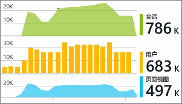

# 在 Visual Studio 中使用 Application Insights
在 Visual Studio（2015 和更高版本）中，可以使用来自 [Azure Application Insights](app-insights-overview.md) 的遥测，在调试和生产环境中分析性能和诊断问题。

如果尚未 [在应用中安装 Application Insights](app-insights-asp-net.md)，请立即安装。

##  调试项目
使用 F5 运行应用程序并试用：打开不同的页面来生成一些遥测。

在 Visual Studio 中，将看到已记录事件的计数。

单击此按钮，打开诊断搜索。 

## 诊断搜索
“搜索”窗口显示已记录的事件。 （如果在设置 Application Insights 时登录 Azure，将能够在门户中搜索相同的事件。）

自定义文本搜索适用于事件中的任何字段。 例如，搜索页面的 URL 的一部分；或客户城市的属性值；或跟踪日志中的特定字词。

单击任何事件即可查看其详细属性。

还可以打开“相关项目”选项卡，帮助诊断失败的请求或异常。

## 诊断中心
诊断中心（在 Visual Studio 2015 或更高版本中）显示其生成的 Application Insights 服务器遥测。 即使选择仅安装 SDK，而不连接到 Azure 门户中的资源，这也同样适用。

## 异常
如果已 [设置异常监视](app-insights-asp-net-exceptions.md)，异常报告将在“搜索”窗口中显示。 

单击异常可获得堆栈跟踪。 如果应用的代码在 Visual Studio 中打开，可从堆栈跟踪单击浏览到相关代码行。

此外，在每个方法上的 Code Lens 行中，将看到过去 24 小时内由 Application Insights 记录的异常的计数。

## 本地监视
（从 Visual Studio 2015 Update 2 开始）如果未将 SDK 配置为将遥测发送到 Application Insights 门户（以便让 ApplicationInsights.config 中没有检测密钥），“诊断”窗口会显示来自最新调试会话的遥测。 

如果已发布过应用的以前版本，这会是比较好的做法。 你不会希望来自调试会话的遥测与 Application Insights 门户中来自已发布应用的遥测混在一起。

如果在将遥测发送到门户之前有一些想要调试的 [自定义遥测](app-insights-api-custom-events-metrics.md) ，它会很有用。

* *最初，将 Application Insights 完全配置为将遥测发送到门户。但现在只想查看 Visual Studio 中的遥测。*
  
  * 在“搜索”窗口的“设置”中，即使应用将遥测发送到门户，也有选项可供搜索本地诊断。
  * 若要停止将遥测发送到门户，请注释禁止 ApplicationInsights.config 的 `<instrumentationkey>...` 行。 准备好再次将遥测发送到门户时，请取消注释。

## 趋势
趋势是用于可视化一段时间内的应用行为的工具。 

从 Application Insights 工具栏按钮或 Application Insights“搜索”窗口选择“浏览遥测趋势”  。 选择五种常见查询中的一个，以便开始使用。 可以根据遥测类型、时间范围和其他属性分析不同的数据集。 

若要查找数据中的异常情况，请选择“视图类型”下拉列表下的其中一个异常情况选项。 使用窗口底部的筛选选项，可轻松地全力探索遥测的特定子集。

[详细了解趋势](app-insights-visual-studio-trends.md)。

## 后续步骤
|  |  |
| --- | --- |
| **[添加更多数据](app-insights-asp-net-more.md)** 监视使用情况、可用性、依赖项、异常。 集成来自记录框架的跟踪。 编写自定义遥测。 | |
| **[使用 Application Insights 门户](app-insights-dashboards.md)** 仪表板、功能强大的诊断和分析工具、警报、应用程序的实时依赖项映射和遥测导出。 | |

<!--HONumber=Nov16_HO3-->

