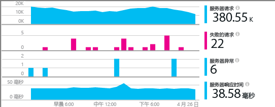
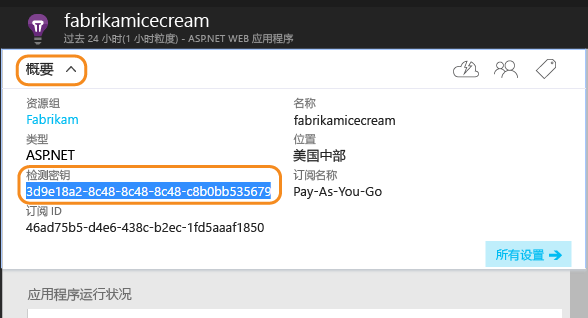
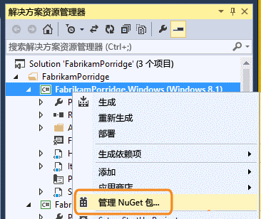
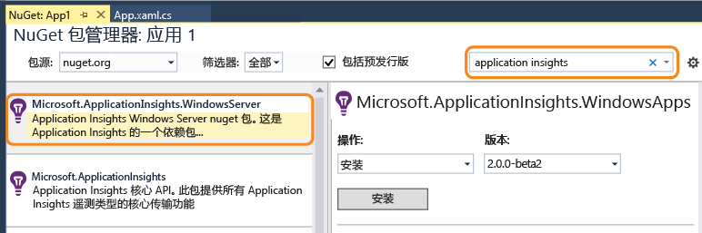
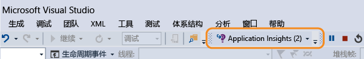
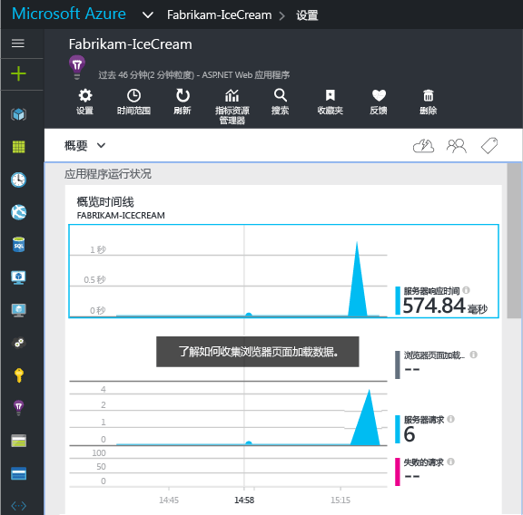
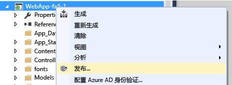

# 为 ASP.NET 4 应用程序手动配置 Application Insights
[Application Insights](app-insights-overview.md) 是为 Web 开发人员提供的可扩展工具，用于监视实时应用程序的性能和使用情况。 可以手动配置它以监视 Windows 服务、辅助角色和其他 ASP.NET 应用程序。 对于 Web 应用，Visual Studio 提供手动配置作为 [自动设置](app-insights-asp-net.md) 的替代方法。

#### 开始之前
你需要：

* [Microsoft Azure](http://azure.com)订阅。 如果你的团队或组织拥有 Azure 订阅，则所有者可以使用你的 [Microsoft 帐户](http://live.com)将你加入其中。
* Visual Studio 2013 或更高版本。

## 1.创建 Application Insights 资源
登录 [Azure 门户](https://portal.azure.com/)，创建新的 Application Insights 资源。 选择 ASP.NET 作为应用程序类型。

Azure 中的 [资源](app-insights-resources-roles-access-control.md) 是服务的实例。 将在此资源中分析并呈现来自应用的遥测。

应用程序类型的选择会设置资源边栏选项卡和 [指标资源管理器](app-insights-metrics-explorer.md)中可见属性的默认内容。

#### 复制检测密钥
密钥可标识资源，很快将在 SDK 中安装它来将数据定向到资源。

刚才执行的用于创建新资源的步骤是开始监视任何应用程序的好方法。 现在可以将数据发送给它。

## 2.在应用程序中安装 SDK
Application Insights SDK 的安装和配置因使用的平台而异。 对于 ASP.NET 应用而言，这很容易。

1. 在 Visual Studio 中，编辑 Web 应用项目的 NuGet 包。
   
    
2. 安装用于 Web 应用的 Application Insights SDK。
   
    
   
    *是否可以使用其他包？*
   
    是的。 如果只想使用 API 发送自己的遥测，请选择 Core API (Microsoft.ApplicationInsights)。 Windows Server 包会自动包括 Core API 以及若干其他包，例如性能计数器集合和依赖项监视。 

#### 升级到 SDK 的未来版本
我们会不时发布 SDK 的新版本。

若要升级到 [SDK 的新版本](https://github.com/Microsoft/ApplicationInsights-dotnet-server/releases/)，请再次打开 NuGet 包管理器，然后筛选已安装的包。 选择“Microsoft.ApplicationInsights.Web”，然后选择“升级”。

如果对 ApplicationInsights.config 执行了任何自定义操作，请在升级前保存相关副本，并在升级后将更改合并到新版本中。

## 3.发送遥测
**如果只安装 Core API 包：**

* 在代码中设置检测密钥，例如，在 `main()`中： 
  
    `TelemetryConfiguration.Active.InstrumentationKey = "` *你的密钥* `";` 
* [使用 API 编写自己的遥测](app-insights-api-custom-events-metrics.md#ikey)。

**如果安装了其他 Application Insights 包，** 可以视需要使用 .config 文件来设置检测密钥：

* 编辑 ApplicationInsights.config（通过 NuGet 安装添加）。 在结束标记前插入此内容：
  
    `<InstrumentationKey>` *所复制的检测密钥* `</InstrumentationKey>`
* 确保解决方案资源管理器中的 ApplicationInsights.config 的属性设置为“生成操作”=“内容”、“复制到输出目录”=“复制” 。

如果要[针对不同生成配置切换密钥](app-insights-separate-resources.md)，则在代码中设置检测密钥会很有用。 如果在代码中设置密钥，则无需在 `.config` 文件中设置它。

##  运行项目
使用 **F5** 运行应用程序并试用：打开不同的页面来生成一些遥测。

在 Visual Studio 中，将看到已发送事件的计数。

##  查看遥测
返回 [Azure 门户](https://portal.azure.com/) ，浏览到 Application Insights 资源。

在“概述”图表中查找数据。 首先，只会看到一个或两个点。 例如：

单击任何图表以查看更详细的指标。 [了解有关指标的详细信息。](app-insights-web-monitor-performance.md)

#### 没有数据？
* 使用应用程序打开不同的页面，以生成一些遥测。
* 打开 [“搜索”](app-insights-diagnostic-search.md) 磁贴，查看每个事件。 有时，事件会需要较长的时间才能通过指标管道。
* 请等待几秒钟，然后单击“刷新” 。 图表会定期刷新本身，但如果正在等待某些数据显示，则可以手动刷新。
* 请参阅 [疑难解答](app-insights-troubleshoot-faq.md)。

## 发布应用
现在，将应用程序部署到服务器或 Azure，然后观看数据累积。

在调试模式下运行时，系统通过管道加速遥测，因此应该可以在数秒内看到数据。 以发布配置部署应用时，数据的累积速度会更慢。

#### 发布到服务器后却没有数据？
在服务器的防火墙中打开这些出口流量的端口：

* `dc.services.visualstudio.com:443`
* `f5.services.visualstudio.com:443`

#### 生成服务器遇到问题？
请参阅 [此疑难解答项](app-insights-asp-net-troubleshoot-no-data.md#NuGetBuild)。

> [!NOTE]
> 如果应用生成大量遥测（且使用的是 ASP.NET SDK 版本 2.0.0-beta3 或更高版本），自适应采样模块将通过仅发送具有代表性的事件部分来自动减少发送到门户的量。 但是，将以组为单位选择或取消选择与同一请求相关的事件，以便可以在相关事件之间浏览。 
> [了解采样](app-insights-sampling.md)。
> 
> 

## 后续步骤
* [添加更多遥测](app-insights-asp-net-more.md) ，获取应用程序的 360 度完整视图。

<!--HONumber=Nov16_HO3-->

