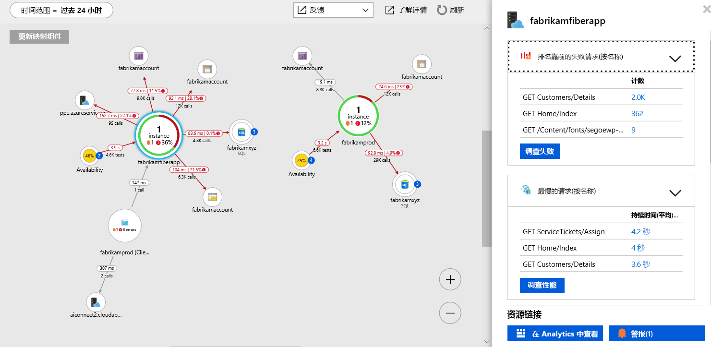

# <a name="collect-distributed-traces-from-go-preview"></a>从 Go（预览版）收集分布式跟踪

Application Insights 现在支持通过与 [OpenCensus](https://opencensus.io) 和我们新的[本地转发器](./opencensus-local-forwarder.md)集成来对 Go 应用程序进行分布式跟踪。 本文将逐步介绍设置 OpenCensus for Go 并将跟踪数据提供给 Application Insights 的过程。

## <a name="prerequisites"></a>先决条件

- 需要一个 Azure 订阅。
- 应该安装 Go，本文使用版本 1.11 [去下载](https://golang.org/dl/)。
- 按照说明[将本地转发器安装为 Windows 服务](./opencensus-local-forwarder.md#windows-service)。

如果没有 Azure 订阅，请在开始之前创建一个[免费](https://azure.microsoft.com/free/)帐户。

## <a name="sign-in-to-the-azure-portal"></a>登录到 Azure 门户

登录到 [Azure 门户](https://portal.azure.com/)。

## <a name="create-application-insights-resource"></a>创建 Application Insights 资源

首先，你需要创建一个 Application Insights 资源，该资源将生成一个检测密钥 (ikey)。 然后使用 ikey 配置本地转发器，以将 OpenCensus 检测应用程序中的分布式跟踪发送到 Application Insights。   

1. 选择“创建资源” > “开发人员工具” > “Application Insights”。

   

   此时会显示配置对话框，请使用下表填写输入字段。

    | 设置        | 值           | 说明  |
   | ------------- |:-------------|:-----|
   | **Name**      | 全局唯一值 | 标识所监视的应用的名称 |
   | **应用程序类型** | 常规 | 所监视的应用的类型 |
   | **资源组**     | myResourceGroup      | 用于托管 App Insights 数据的新资源组的名称 |
   | **位置** | 美国东部 | 选择离你近的位置或离托管应用的位置近的位置 |

2. 单击“创建”。

## <a name="configure-local-forwarder"></a>配置本地转发器

1. 选择“概述” > “概要”> 复制应用程序的**检测密钥**。

   

2. 编辑 `LocalForwarder.config` 文件并添加检测密钥。 如果已按照[先决条件](./opencensus-local-forwarder.md#windows-service)中的说明操作，则该文件位于 `C:\LF-WindowsServiceHost`

    ```xml
      <OpenCensusToApplicationInsights>
        <!--
          Instrumentation key to track telemetry to.
          -->
        <InstrumentationKey>{enter-instrumentation-key}</InstrumentationKey>
      </OpenCensusToApplicationInsights>
    
      <!-- Describes aspects of processing Application Insights telemetry-->
      <ApplicationInsights>
        <LiveMetricsStreamInstrumentationKey>{enter-instrumentation-key}</LiveMetricsStreamInstrumentationKey>
      </ApplicationInsights>
    </LocalForwarderConfiguration>
    ```

3. 重启应用程序**本地转发器**服务。

## <a name="opencensus-go-packages"></a>OpenCensus Go 包

1. 从命令行安装用于 Go 的 Open Census 包：

    ```go
    go get -u go.opencensus.io
    go get -u contrib.go.opencensus.io/exporter/ocagent
    ```

2. 将以下代码添加到 .go 文件，然后生成并运行。 （此示例源自官方 OpenCensus 指南，其中添加了有助于与本地转发器集成的代码）

     ```go
        // Copyright 2018, OpenCensus Authors
        //
        // Licensed under the Apache License, Version 2.0 (the "License");
        // you may not use this file except in compliance with the License.
        // You may obtain a copy of the License at
        //
        //     http://www.apache.org/licenses/LICENSE-2.0
        //
        // Unless required by applicable law or agreed to in writing, software
        // distributed under the License is distributed on an "AS IS" BASIS,
        // WITHOUT WARRANTIES OR CONDITIONS OF ANY KIND, either express or implied.
        // See the License for the specific language governing permissions and
        // limitations under the License.
        package main
        
        import (
        
            "bytes"
            "fmt"
            "log"
            "net/http"
            os "os"
            
            ocagent "contrib.go.opencensus.io/exporter/ocagent"
            "go.opencensus.io/plugin/ochttp"
            "go.opencensus.io/plugin/ochttp/propagation/tracecontext"
            "go.opencensus.io/trace"
        
        )
        
        func main() {
            // Register stats and trace exporters to export the collected data.
            serviceName := os.Getenv("SERVICE_NAME")
            if len(serviceName) == 0 {
                serviceName = "go-app"
            }
            fmt.Printf(serviceName)
            agentEndpoint := os.Getenv("OCAGENT_TRACE_EXPORTER_ENDPOINT")

            if len(agentEndpoint) == 0 {
                agentEndpoint = fmt.Sprintf("%s:%d", ocagent.DefaultAgentHost, ocagent.DefaultAgentPort)
            }
        
            fmt.Printf(agentEndpoint)
            exporter, err := ocagent.NewExporter(ocagent.WithInsecure(), ocagent.WithServiceName(serviceName), ocagent.WithAddress(agentEndpoint))
        
            if err != nil {
                log.Printf("Failed to create the agent exporter: %v", err)
            }
        
            trace.RegisterExporter(exporter)
        
            trace.ApplyConfig(trace.Config{DefaultSampler: trace.AlwaysSample()})
        
            client := &http.Client{Transport: &ochttp.Transport{Propagation: &tracecontext.HTTPFormat{}}}
        
            http.HandleFunc("/", func(w http.ResponseWriter, req *http.Request) {
                fmt.Fprintf(w, "hello world")
        
                var jsonStr = []byte(`[ { "url": "http://blank.org", "arguments": [] } ]`)
                r, _ := http.NewRequest("POST", "http://blank.org", bytes.NewBuffer(jsonStr))
                r.Header.Set("Content-Type", "application/json")
        
                // Propagate the trace header info in the outgoing requests.
                r = r.WithContext(req.Context())
                resp, err := client.Do(r)
                if err != nil {
                    log.Println(err)
                } else {
                    // TODO: handle response
                    resp.Body.Close()
                }
            })
        
            http.HandleFunc("/call_blank", func(w http.ResponseWriter, req *http.Request) {
                fmt.Fprintf(w, "hello world")
        
                r, _ := http.NewRequest("GET", "http://blank.org", nil)

                // Propagate the trace header info in the outgoing requests.
                r = r.WithContext(req.Context())
                resp, err := client.Do(r)
        
                if err != nil {
                    log.Println(err)
                } else {
                    // TODO: handle response
                    resp.Body.Close()
                }        
            })
        
            log.Fatal(http.ListenAndServe(":50030", &ochttp.Handler{Propagation: &tracecontext.HTTPFormat{}}))
        
        }
        ```

3. Once the simple go app is running navigate to `http://localhost:50030`. Each refresh of the browser will generate the text "hello world" accompanied by corresponding span data that is picked up by the local forwarder.

4. To confirm that the **local forwarder** is picking up the traces check the `LocalForwarder.config` file. If you followed the steps in the [prerequisite](https://docs.microsoft.com/azure/application-insights/local-forwarder#windows-service), it will be located in `C:\LF-WindowsServiceHost`.

    In the image below of the log file, you can see that prior to running the second script where we added an exporter `OpenCensus input BatchesReceived` was 0. Once we started running the updated script `BatchesReceived` incremented equal to the number of values we entered:
    
    

## Start monitoring in the Azure portal

1. You can now reopen the Application Insights **Overview** page in the Azure portal, to view details about your currently running application. Select **Live Metric Stream**.

   

2. If you run the second Go app again and start refreshing the browser for `http://localhost:50030`, you will see live trace data as it arrives in Application Insights from the local forwarder service.

   

3. Navigate back to the **Overview** page and select **Application Map** for a visual layout of the dependency relationships and call timing between your application components.

    

    Since we were only tracing one method call, our application map isn't as interesting. But application map can scale to visualize far more distributed applications:

   

4. Select **Investigate Performance** to perform detailed performance analysis and determine the root cause of slow performance.

    

5. Selecting **Samples** and then clicking on any of the samples that appear in the right-hand pane will launch the end-to-end transaction details experience. While our sample app will just show us a single event, a more complex application would allow you to explore the end-to-end transaction down to level of an individual event's call stack.

     

## OpenCensus trace for Go

We only covered the basics of integrating OpenCensus for Go with the local forwarder and Application Insights. The [official OpenCensus Go usage guidance](https://godoc.org/go.opencensus.io) covers more advanced topics.

## Next steps

* [Application map](./app-insights-app-map.md)
* [End-to-end performance monitoring](./app-insights-tutorial-performance.md)