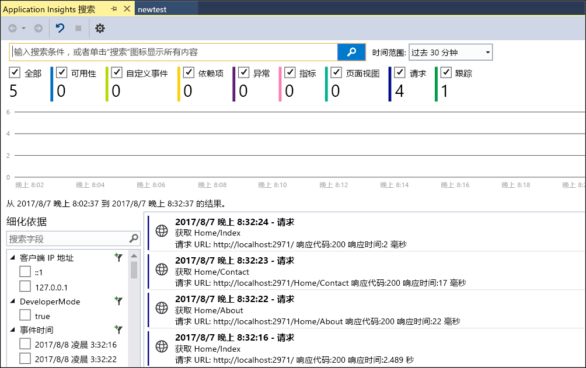
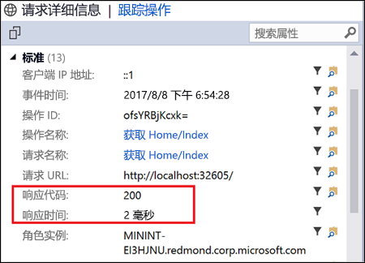
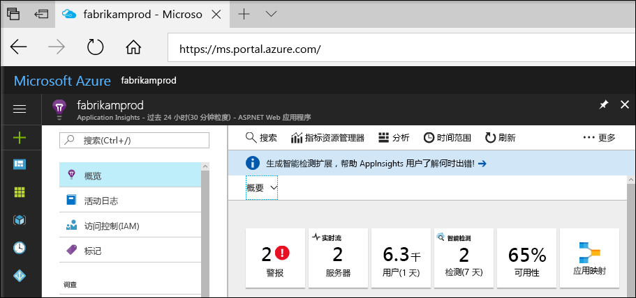
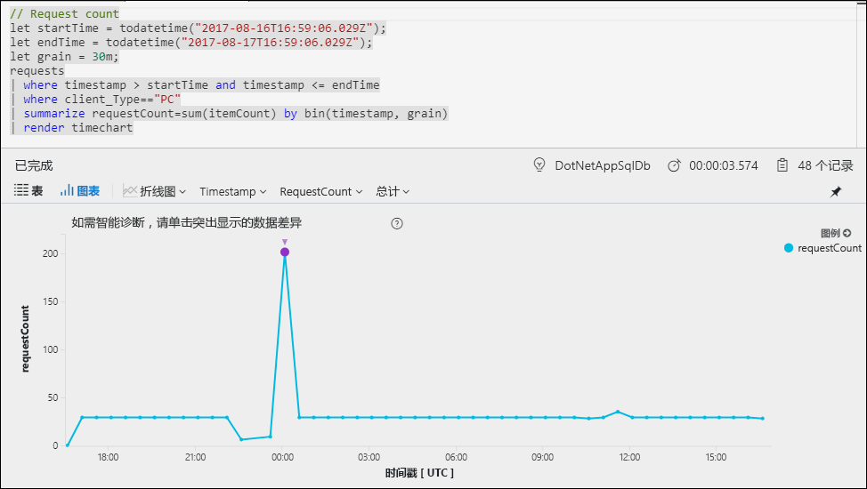
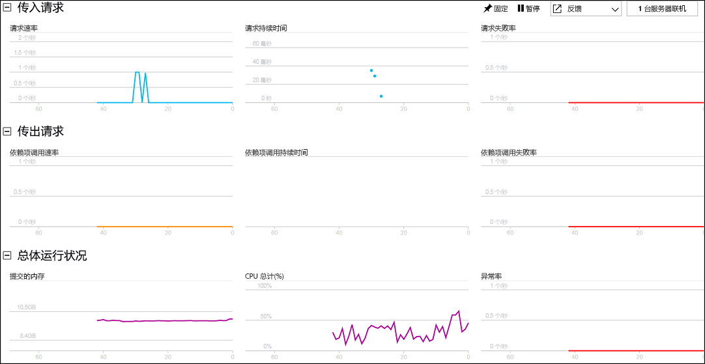

# 开始监视 ASP.NET Web 应用程序

使用 Azure Application Insights，可轻松监视 Web 应用程序的可用性、性能和使用情况。  还可以快速确定并诊断应用程序中的错误，而无需等待用户报告这些错误。  使用从 Application Insights 收集的有关应用的性能和效率的信息，可在维护和改进应用程序时做出明智的选择。

本快速入门演示如何将 Application Insights 添加到现有 ASP.NET Web 应用程序并开始分析实时统计信息，这只是可用来分析应用程序的各种方法之一。 如果没有 ASP.NET Web 应用程序，则可以按照[创建 ASP.NET Web 应用快速入门](../app-service/app-service-web-get-started-dotnet.md)创建一个。

## 先决条件
完成本快速入门教程：

- 使用以下工作负荷安装 [Visual Studio 2017](https://www.visualstudio.com/downloads/)：
    - ASP.NET 和 Web 开发
    - Azure 开发

如果你还没有 Azure 订阅，可以在开始前创建一个[免费](https://azure.microsoft.com/free/)帐户。

## 启用 Application Insights

1. 在 Visual Studio 2017 中打开项目。
2. 从“项目”菜单中选择“配置 Application Insights”。 Visual Studio 会将 Application Insights SDK 添加到应用程序。
3. 单击“免费开始”，选择首选计费计划，然后单击“注册”。

    

4. 通过从“调试”菜单中选择“启动调试”或通过按 F5 键来运行应用程序。

## 确认应用配置

Application Insights 收集应用程序的遥测数据，而不考虑应用程序在何处运行。 按照以下步骤开始查看此数据。

1. 通过单击“项目” -> “Application Insights” -> “搜索调试会话遥测”打开 Application Insights。  从当前会话查看遥测数据。  

2. 单击列表中的第一个请求（在此示例中为“获取主页/索引”）查看请求详细信息。 请注意，包含状态代码和响应时间以及有关请求的其他重要信息。  

## 开始在 Azure 门户中监视

现在可以在 Azure 门户中打开 Application Insights，查看有关正在运行的应用程序的各种详细信息。

1. 在解决方案资源管理器中右键单击“连接的服务 Application Insights”文件夹，然后单击“打开 Application Insights 门户”。  可以看到有关应用程序的一些信息和各种选项。

    

2. 单击“应用映射”以获取应用程序组件之间依赖关系的可视布局。  每个组件均显示 KPI，如负载、性能、失败和警报。

    

3. 单击应用程序组件之一上的“应用分析”图标 。  这将打开“Application Insights Analytics”，该软件提供丰富的查询语言，可用于分析 Application Insights 收集的所有数据。  在本示例中，将生成以图表形式呈现请求计数的查询。  可以编写自己的查询来分析其他数据。

    

4. 返回到“概述”页，单击“实时流”。  这将显示有关正在运行的应用程序的实时统计信息。  这包括传入请求数、这些请求的持续时间和发生的任何故障等信息。  还可以检查处理器和内存等关键性能指标。

    

如果已准备好在 Azure 中托管应用程序，则可以立即发布它。 按照[创建 ASP.NET Web 应用快速入门](../app-service/app-service-web-get-started-dotnet.md#update-the-app-and-redeploy)中所述的步骤进行操作。

## 后续步骤
在本快速入门中，已通过 Azure Application Insights 为应用程序启用了监视。  继续学习教程，了解如何使用它来监视统计信息和检测应用程序中的问题。

> [!div class="nextstepaction"]
> [Azure Application Insights 教程](app-insights-tutorial-runtime-exceptions.md)
