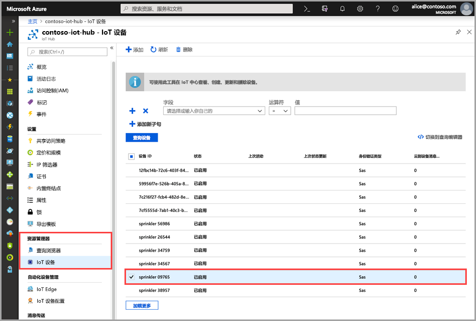
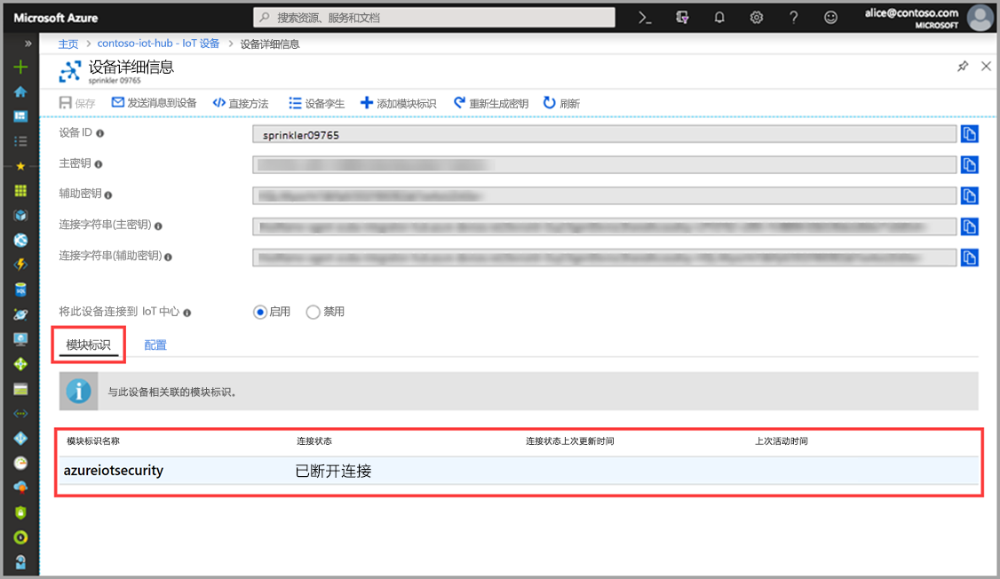

# 快速入门：创建 azureiotsecurity 模块孪生

本快速入门介绍如何为新设备创建单个 _azureiotsecurity_ 模块孪生，或者为 IoT 中心内的所有设备批量创建模块孪生。  

## 了解 azureiotsecurity 模块孪生 

对于在 Azure 中生成的 IoT 解决方案，设备孪生在设备管理和流程自动化方面发挥着关键作用。 

适用于 IoT 的 Azure 安全中心可与现有的 IoT 设备管理平台完全集成，使你能够管理设备的安全状态，以及利用现有的设备控制功能。
适用于 IoT 的 Azure 安全中心集成是使用 IoT 中心孪生机制实现的。  

请参阅 [IoT 中心模块孪生](https://docs.microsoft.com/azure/iot-hub/iot-hub-devguide-module-twins)详细了解 Azure IoT 中心内模块孪生的一般概念。 
 
适用于 IoT 的 Azure 安全中心利用模块孪生机制，并为每个设备维护一个名为 _azureiotsecurity_ 的安全模块孪生。

该安全模块孪生保存每个设备的所有设备安全性相关信息。 
 
若要充分利用适用于 IoT 的 Azure 安全中心功能，需要为服务中的每个设备创建、配置并使用这些安全模块孪生。  

## 创建 azureiotsecurity 模块孪生 

可通过两种方式创建 _azureiotsecurity_ 模块孪生：
1. [模块批处理脚本](https://aka.ms/iot-security-github-create-module) - 使用默认配置为新的设备或者不包含模块孪生的设备自动创建模块孪生。
2. 使用每个设备的特定配置单独手动编辑每个模块孪生。

>[!NOTE] 
> 使用批处理方法不会覆盖现有的 azureiotsecurity 模块孪生。 使用批处理方法只会为尚不包含安全模块孪生的设备创建新的模块孪生。 

请参阅[代理配置](how-to-agent-configuration.md)，了解如何修改或更改现有模块孪生的配置。 

若要手动为设备创建新的 _azureiotsecurity_ 模块孪生，请遵照以下说明操作： 

1. 在 IoT 中心，找到并选择要为其创建安全模块孪生的设备。
1. 单击设备，然后单击“添加模块标识”。 
1. 在“模块标识名称”字段中输入 **azureiotsecurity**。 

1. 单击“ **保存**”。 

## 验证是否要创建模块孪生

验证特定的设备是否存在安全模块孪生：

1. 在 Azure IoT 中心，从“资源管理器”菜单中选择“IoT 设备”。      
1. 输入设备 ID，或者在“查询设备字段”中选择一个选项，然后单击“查询设备”。   
    
1. 选择该设备或双击它，以打开“设备详细信息”页。 
1. 选择“模块标识”菜单，在与设备关联的模块标识列表中，确认是否存在 **azureiotsecurity** 模块。  
    

若要详细了解如何自定义适用于 IoT 的 Azure 安全中心模块孪生的属性，请参阅[代理配置](how-to-agent-configuration.md)。

## 后续步骤

转到下一篇文章，了解如何配置自定义警报...

> [!div class="nextstepaction"]
> [配置自定义警报](quickstart-create-custom-alerts.md)
