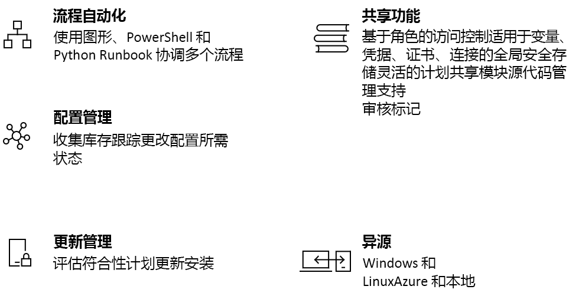

# Azure 自动化简介

Azure 自动化提供基于云的自动化和配置服务，用于跨 Azure 环境和非 Azure 环境进行一致的管理。 它包含流程自动化、更新管理和配置功能。 可以通过 Azure 自动化在工作负荷和资源的部署、操作和解除授权过程中进行完全的控制。
本文概述了 Azure 自动化并回答了一些常见问题。 有关不同功能的详细信息，请访问本概述中提供的链接。

## Azure 自动化功能

### 流程自动化

可以通过 Azure 自动化自动完成频繁进行的、耗时的、易出错的云管理任务。 有了这样的自动化，你就可以专注于能够让业务增值的工作。 还可以通过自动化来减少错误和提升效率，从而降低运营成本。 可以将 Azure 服务和其他公用系统集成，这些系统是部署、配置和管理端到端流程所必需的。 可以在 PowerShell 或 Python 中使用此服务以图形方式[创作 Runbook](automation-runbook-types.md)。 可以使用混合 Runbook 辅助角色跨本地环境进行协调，实现统一管理。 可以通过 [Webhook](automation-webhooks.md) 从 ITSM、DevOps 和监视系统触发自动化，从而满足相关请求并确保持续交付和操作。

### 配置管理

Azure 自动化 [Desired State Configuration](automation-dsc-overview.md) 是一个针对 PowerShell DSC 的基于云的解决方案，可提供企业环境所需的服务。 可以在 Azure 自动化中管理 DSC 资源，并将配置应用于 Azure 云的 DSC 拉取服务器中的虚拟机或物理机。 它提供各种报告，告知各种重要的事件，例如节点何时没有遵循其指定配置。 可以在云中或本地监视并自动更新物理机和虚拟机的计算机配置，不管操作系统是Windows 还是 Linux。

可以获取有关来宾内资源的清单，了解已安装的应用程序和其他配置项。 可以通过丰富的报告和搜索功能快速查找详细信息，了解操作系统中的具体配置。 可以跨服务、守护程序、软件、注册表和文件跟踪更改，快速确定问题原因。 另外，当环境中出现不需要的更改时，还可以使用 DSC 的诊断和警报功能。

### 更新管理

通过 Azure 自动化跨混合环境更新 Windows 和 Linux 系统。 可以在 Azure 中、本地和其他云中了解更新符合性。 可以创建计划性部署，在定义的维护时段协调各种更新的安装。 如果不应在计算机上安装某个更新，可以将该更新从部署中排除。

### 共享资源

Azure 自动化包含一组共享资源，方便用户大规模地完成环境的自动化操作和配置。

* **[计划](automation-schedules.md)** - 用在服务中，在预定义的时间触发自动化。
* **[模块](automation-integration-modules.md)** - 模块用于管理 Azure 和其他系统。 请将其导入到适用于 Microsoft、第三方、社区或自定义 cmdlet 和 DSC 资源的自动化帐户中。
* **[模块库](automation-runbook-gallery.md)** - 与 PowerShell 库进行本机集成以查看 runbook 并将其导入自动化帐户。
* **[Python 2 包](python-packages.md)** - 将 Python 2 包添加到自动化帐户以在 Python runbook 中使用。
* **[凭据](automation-credentials.md)** - 安全地存储可供 Runbook 和配置在运行时使用的敏感信息。
* **[连接](automation-connections.md)** - 以名称/值对的形式存储信息。在连接资源中连接到系统时，需要使用其中包含的常用信息。 连接由模块作者定义，在运行时的 Runbook 和配置中使用。
* **[证书](automation-certificates.md)** - 存储证书，使之在运行时可供用于身份验证，确保已部署资源的安全。
* **[变量](automation-variables.md)** - 通过变量来保存那些可以跨 Runbook 和配置使用的内容。 可以更改值而不需修改引用这些值的 Runbook 和配置。

### 源代码管理集成

Azure 自动化能够[与源代码管理集成](source-control-integration.md)，这会在可将 runbook 或配置签入源代码管理系统的情况下，改进代码配置。

### 基于角色的访问控制

Azure 自动化支持基于角色的访问控制来控制对自动化帐户及其资源的访问。有关自动化帐户、runbook 和作业的配置 RBAC 的详细信息，请参阅[适用于 Azure 自动化的基于角色的访问控制](automation-role-based-access-control.md)。

### Windows 和 Linux

根据设计，Azure 自动化可以在混合云环境中使用，且同时适用于 Windows 和 Linux。 可以通过它对部署的工作负荷及其运行时所依赖的操作系统进行一致的自动化操作和配置。

### 社区库

以浏览方式查找[自动化库](automation-runbook-gallery.md)中的 Runbook 和模块，以便通过 PowerShell 库和 Microsoft 脚本中心快速启动流程的集成和创作。

## 常用自动化方案

Azure 自动化可以在基础结构和应用程序的整个生命周期中进行管理。 可以将有关组织如何交付和维护工作负荷的知识传输到系统中； 可以使用 PowerShell、Desired State Configuration、Python、图形 Runbook 等常用语言进行创作； 可以获取已部署资源的完整清单，以便进行针对性操作、完成相关报告并了解符合性情况； 确定哪些更改可能导致配置错误，哪些更改可以改进操作符合性。

* **生成/部署资源** - 使用 Runbook 和 Azure 资源管理器模板在混合环境中部署 VM。 可以集成到 Jenkins 和 Azure DevOps 之类的开发工具中。
* **配置 VM** - 使用基础结构和应用程序所需的配置评估和配置 Windows 和 Linux 计算机。
* **监视** - 确定计算机上那些导致问题的更改，进行相应的补救，或者将其升级到管理系统。
* **保护** - 在已引发安全警报的情况下隔离 VM。 设置来宾内要求。
* **管控** - 为团队设置基于角色的访问控制。 恢复未使用的资源。

## 自动化定价

可以在[定价](https://azure.microsoft.com/pricing/details/automation/)页查看 Azure 自动化的价格。

## 后续步骤

> [!div class="nextstepaction"]
> [创建自动化帐户](automation-quickstart-create-account.md)

