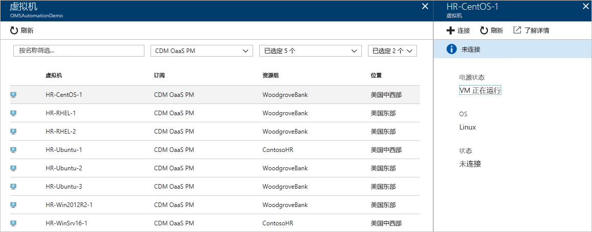
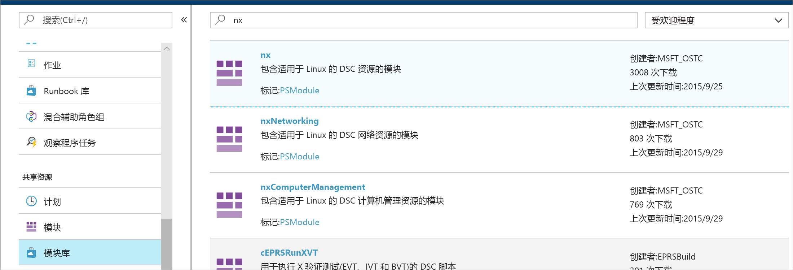
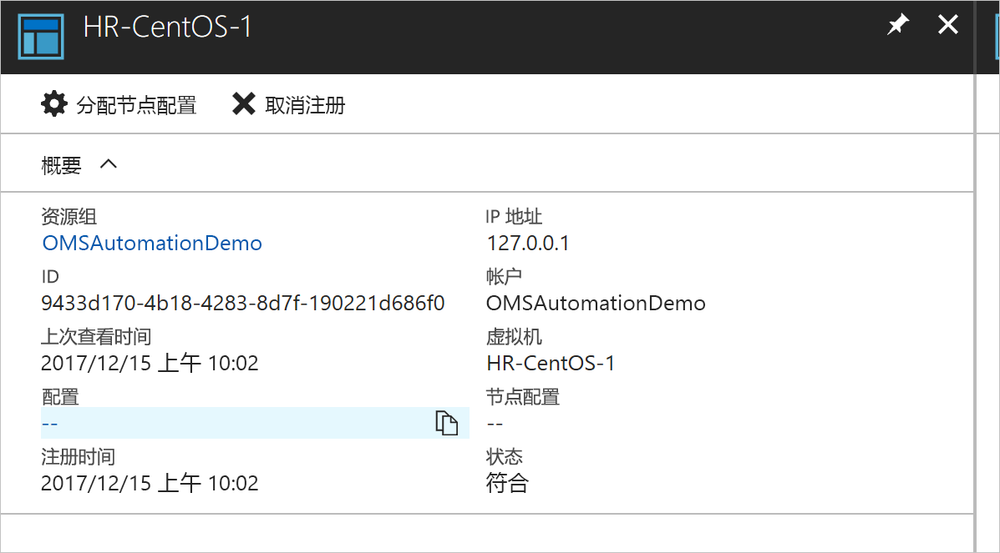
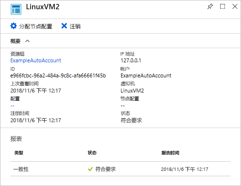
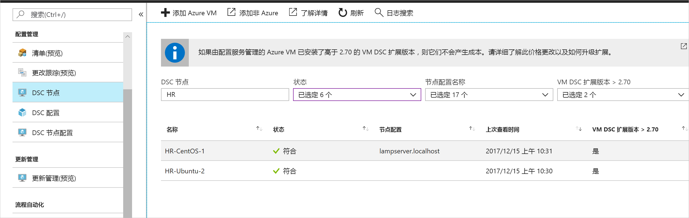

# <a name="configure-a-linux-virtual-machine-with-desired-state-configuration"></a>使用 Desired State Configuration 配置 Linux 虚拟机

启用 Desired State Configuration (DSC) 即可管理和监视 Windows 和 Linux 服务器的配置。 可以标识或自动更正不符合所需配置的配置。 本快速入门逐步介绍了如何使用 DSC 载入 Linux VM 并部署 LAMP 堆栈。

## <a name="prerequisites"></a>先决条件

若要完成本快速入门，你需要：

* Azure 订阅。 如果没有 Azure 订阅，可以[创建一个免费帐户](https://azure.microsoft.com/free/)。
* 一个 Azure 自动化帐户。 有关如何创建 Azure 自动化运行方式帐户的说明，请参阅 [Azure 运行方式帐户](automation-sec-configure-azure-runas-account.md)。
* 运行 Red Hat Enterprise Linux、CentOS 或 Oracle Linux 的 Azure 资源管理器 VM（非经典）。 如需创建 VM 的说明，请参阅[在 Azure 门户中创建第一个 Linux 虚拟机](../virtual-machines/linux/quick-create-portal.md)

## <a name="log-in-to-azure"></a>登录 Azure
通过 https://portal.azure.com 登录 Azure

## <a name="onboard-a-virtual-machine"></a>载入虚拟机
可以通过多种不同的方法载入计算机并启用 Desired State Configuration。 本快速入门介绍如何通过自动化帐户进行载入。 可以阅读此[载入](https://docs.microsoft.com/en-us/azure/automation/automation-dsc-onboarding)文章，详细了解如何通过不同的方法将计算机载入到 Desired State Configuration。

1. 在 Azure 门户的左窗格中，选择“自动化帐户”。 如果该选项未显示在左窗格中，请单击“所有服务”，然后在出现的视图中进行搜索。
1. 在列表中选择一个自动化帐户。
1. 在自动化帐户的左窗格中，选择“DSC 节点”。
1. 单击菜单选项“添加 Azure VM”。
1. 找到要启用 DSC 的虚拟机。 可以使用搜索栏和筛选器选项来查找特定的虚拟机。
1. 单击虚拟机，然后选择“连接”。
1. 选择适用于虚拟机的 DSC 设置。 如果已准备了一个配置，可以通过“节点配置名称”的形式来指定该配置。 可以将[配置模式](https://docs.microsoft.com/en-us/powershell/dsc/metaconfig)设置为控制计算机的配置行为。
1. 单击 **“确定”**



当 Desired State Configuration 扩展部署到虚拟机时，会显示“正在连接”。

## <a name="import-modules"></a>导入模块

模块包含 DSC 资源，许可可以在 [PowerShell 库](https://www.powershellgallery.com)中找到。 在配置中使用的任何资源都必须在编译前导入到自动化帐户中。 本教程需要名为 **nx** 的模块。

1. 在自动化帐户的左窗格中，选择“模块库”（位于“共享资源”下）。
1. 搜索要导入的模块，方法是键入其名称的一部分：*nx*
1. 单击要导入的模块
1. 单击“导入”



## <a name="import-the-configuration"></a>导入配置

本快速入门使用 DSC 配置在计算机上配置 Apache HTTP Server、MySQL 和 PHP。

有关 DSC 配置的详细信息，请参阅 [DSC 配置](https://docs.microsoft.com/powershell/dsc/configurations)。

在文本编辑器中，键入以下命令，并在本地将其保存为 `LAMPServer.ps1`。

```powershell-interactive
configuration LAMPServer {
   Import-DSCResource -module "nx"

   Node localhost {

        $requiredPackages = @("httpd","mod_ssl","php","php-mysql","mariadb","mariadb-server")
        $enabledServices = @("httpd","mariadb")

        #Ensure packages are installed
        ForEach ($package in $requiredPackages){
            nxPackage $Package{
                Ensure = "Present"
                Name = $Package
                PackageManager = "yum"
            }
        }

        #Ensure daemons are enabled
        ForEach ($service in $enabledServices){
            nxService $service{
                Enabled = $true
                Name = $service
                Controller = "SystemD"
                State = "running"
            }
        }
   }
}
```

若要导入配置，请执行以下操作：

1. 在自动化帐户的左窗格中，选择“DSC 配置”。
1. 单击菜单选项“添加配置”。
1. 选择在前面的步骤中保存的配置文件。
1. 单击 **“确定”**

## <a name="compile-a-configuration"></a>编译配置

必须先将 DSC 配置编译为节点配置（MOF 文档），然后才能将其分配给节点。 编译时会验证配置，并允许输入参数值。 若要详细了解如何编译配置，请参阅：[在 Azure 自动化 DSC 中编译配置](https://docs.microsoft.com/en-us/azure/automation/automation-dsc-compile)

若要编译配置，请执行以下操作：

1. 在自动化帐户的左窗格中，选择“DSC 配置”。
1. 选择在前面的步骤中导入的配置“LAMPServer”。
1. 在菜单选项中单击“编译”，然后单击“是”。
1. 在“配置”视图中，可以看到排入队列的新编译作业。 成功完成作业以后，即可转到下一步。 如果出现故障，可以单击该编译作业来了解详细信息。



## <a name="assign-a-node-configuration"></a>分配节点配置

可以向 DSC 节点分配编译的节点配置。 可以通过分配操作将配置应用到计算机，并监视（或自动更正）出现的与该配置不符的任何偏差。

1. 在自动化帐户的左窗格中，选择“DSC 节点”
1. 选择要为其分配配置的节点
1. 单击“分配节点配置”
1. 选择要分配的节点配置  - **LAMPServer.localhost**，然后单击“确定”
1. 此时会向节点分配编译的配置，节点状态更改为“挂起”。 下一次进行定期检查时，节点会检索配置，并在应用该配置后将状态报告回来。 节点检索配置可能需要长达 30 分钟的时间，具体取决于节点的设置。 若要强制进行即时检查，可以在 Linux 虚拟机上以本地方式运行以下命令：`sudo /opt/microsoft/dsc/Scripts/PerformRequiredConfigurationChecks.py`



## <a name="viewing-node-status"></a>查看节点状态

可以在自动化帐户的“DSC 节点”视图中找到所有托管节点的状态。 可以通过状态、节点配置或名称搜索的方式来筛选显示结果。 



## <a name="next-steps"></a>后续步骤

本快速入门介绍了如何将 Linux VM 载入到 DSC、如何为 LAMP 堆栈创建配置，以及如何将其部署到 VM。 若要了解如何通过自动化 DSC 启用持续部署，请继续阅读以下文章：

> [!div class="nextstepaction"]
> [通过 DSC 和 Chocolatey 持续部署到 VM](./automation-dsc-cd-chocolatey.md)

* 若要详细了解 PowerShell Desired State Configuration，请参阅 [PowerShell Desired State Configuration 概述](https://docs.microsoft.com/en-us/powershell/dsc/overview)。
* 若要详细了解如何通过 PowerShell 管理自动化 DSC，请参阅 [Azure PowerShell](https://docs.microsoft.com/en-us/powershell/module/azurerm.automation/?view=azurermps-5.0.0)。
* 若要了解如何将用于报告信息和提醒用户的 DSC 报告转发到 Log Analytics，请参阅[将 DSC 报告转发到 Log Analytics](https://docs.microsoft.com/en-us/azure/automation/automation-dsc-diagnostics)。 
