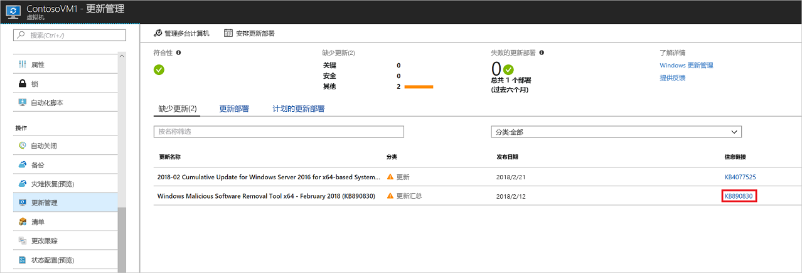
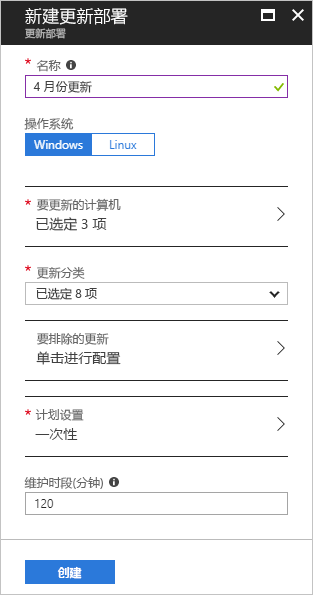
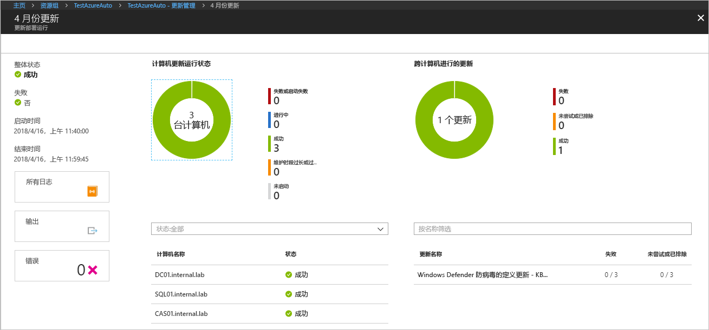

# 使用 Azure 自动化管理 Windows 更新

使用更新管理可以管理虚拟机的更新和修补程序。
本教程介绍了如何快速评估可用更新的状态、计划所需更新的安装以及查看部署结果，从而验证更新是否已成功应用。

有关定价信息，请参阅[更新管理自动化定价](https://azure.microsoft.com/pricing/details/automation/)

本教程介绍如何执行下列操作：

> [!div class="checklist"]
> * 载入用于更新管理的 VM
> * 查看更新评估
> * 计划更新部署
> * 查看部署结果

## 先决条件

要完成本教程，需要：

* Azure 订阅。 如果还没有帐户，可以[激活 MSDN 订户权益](https://azure.microsoft.com/pricing/member-offers/msdn-benefits-details/)或注册[免费帐户](https://azure.microsoft.com/free/?WT.mc_id=A261C142F)。
* [自动化帐户](automation-offering-get-started.md)，用于保存观察程序、操作 Runbook 和观察程序任务。
* 要载入的[虚拟机](../virtual-machines/windows/quick-create-portal.md)。

## 登录 Azure

通过 http://portal.azure.com 登录到 Azure 门户。

## 启用更新管理

就本教程来说，首先需为 VM 启用更新管理。 如果以前已为 VM 启用其他自动化解决方案，则此步骤不是必需的。

1. 在左侧菜单上选择“虚拟机”，然后从列表中选择一个 VM。
2. 在左侧菜单的“操作”部分单击“更新管理”。 “启用更新管理”页随即打开。

执行验证以确定是否为该虚拟机启用了更新管理。
验证包括检查 Log Analytics 工作区和链接的自动化帐户，以及解决方案是否在工作区中。

[Log Analytics](../log-analytics/log-analytics-overview.md?toc=%2fazure%2fautomation%2ftoc.json) 工作区用于收集由功能和服务（如更新管理）生成的数据。
工作区提供了一个位置来查看和分析来自多个数据源的数据。
若要在需要更新的 VM 上执行其他操作，可使用 Azure 自动化运行针对 VM 的 Runbook，例如下载和应用更新。

验证过程还会检查 VM 是否预配了 Microsoft Monitoring Agent (MMA) 和自动化混合 Runbook 辅助角色。
此代理用于与虚拟机通信并获取关于更新状态的信息。

选择 Log analytics 工作区和自动化帐户，然后单击“启用”即可启用此解决方案。 启用此解决方案最长需要 15 分钟的时间。

如果在载入过程中发现缺少下列任何先决条件，则会自动添加这些条件：

* [Log Analytics](../log-analytics/log-analytics-overview.md?toc=%2fazure%2fautomation%2ftoc.json) 工作区
* [自动化](./automation-offering-get-started.md)
* VM 上已启用[混合 runbook 辅助角色](./automation-hybrid-runbook-worker.md)

“更新管理”屏幕随即打开。 配置要使用的位置、Log Analytics 工作区和自动化帐户，然后单击“启用”。 如果这些字段灰显，则意味着已为 VM 启用其他自动化解决方案，因此必须使用同一工作区和自动化帐户。

启用解决方案最多可能需要 15 分钟。 在此期间，不应关闭浏览器窗口。
启用该解决方案后，VM 中缺少的更新信息会流向 Log Analytics。
这些数据需花费 30 分钟到 6 小时的时间才能用于分析。

## 查看更新评估

启用“更新管理”后，“更新管理”屏幕随即显示。
如果缺少更新，可在“缺失更新”选项卡上查看缺失更新的列表。

选择更新的“信息链接”即可在新窗口中打开更新的支持文章。 可以在此处了解有关更新的重要信息。

单击更新的其他位置会打开所选更新的“日志搜索”窗口。 日志搜索的查询是为该特定更新预定义的。 可以修改此查询或创建自己的查询，以便查看环境中已部署更新或缺失更新的详细信息。

## 计划更新部署

现在已知道 VM 缺少更新。 若要安装更新，请计划一个遵循你的发布时间和服务窗口的部署。
可选择在部署中包括哪种更新类型。
例如，可包括关键或安全更新，排除更新汇总。

> [!WARNING]
> 如果更新要求重启，VM 会自动重启。

导航回到“更新管理”并选择屏幕顶部的“计划更新部署”即可计划用于 VM 的新的更新部署。

在“新建更新部署”屏幕中，指定以下信息：

* **名称** - 提供用于更新部署的唯一名称。
* 更新分类- 选择部署中包含的更新部署的软件类型。 对于本教程，请保留所有选定的类型。

  分类类型：

  * 关键更新
  * 安全更新
  * 更新汇总
  * 功能包
  * 服务包
  * 定义更新
  * 工具
  * 更新

* **计划设置** - 将时间设置为将来的 5 分钟。 也可接受默认设置，即当前时间过后 30 分钟。
还可以指定部署是发生一次还是设置定期计划。
在“重复周期 ”下选择“定期”。 保留默认值“1 天”，然后单击“确定”。 这样会设置定期计划。

* **维护时段(分钟)** - 将此值保留为默认值。 可以指定要进行更新部署的时间段。 此设置有助于确保在定义的服务时段内执行更改。

完成计划配置以后，请单击“创建”按钮。 此时会回到状态仪表板。 选择“计划性更新部署”即可显示所创建的部署计划。

## 查看更新部署结果

在计划性部署开始后，可以在“更新管理”屏幕的“更新部署”选项卡上查看该部署的状态。
如果部署当前正在运行，则状态显示为“正在运行”。
如果部署已成功完成，则状态会更改为“成功”。
当部署中有一个或多个更新失败时，状态为“部分失败”。
单击已完成的更新部署，查看该更新部署的仪表板。

“更新结果”磁贴中的摘要提供了 VM 上更新和部署结果的总数。
右侧的表显示了每个更新的细目以及安装结果。
以下列表显示可用值：

* 未尝试 - 由于定义的维护时段时长不足，因而未安装更新。
* 成功- 更新成功
* 失败- 更新失败

单击“所有日志”，查看部署创建的所有日志条目。

单击“输出”磁贴，查看负责管理目标虚拟机更新部署的 runbook 的作业流。

单击“错误”，查看有关部署中的任何错误的详细信息。

## 后续步骤

本教程介绍了如何：

> [!div class="checklist"]
> * 载入用于更新管理的 VM
> * 查看更新评估
> * 计划更新部署
> * 查看部署结果

继续阅读更新管理解决方案的概述。

> [!div class="nextstepaction"]
> [更新管理解决方案](../operations-management-suite/oms-solution-update-management.md?toc=%2fazure%2fautomation%2ftoc.json)
