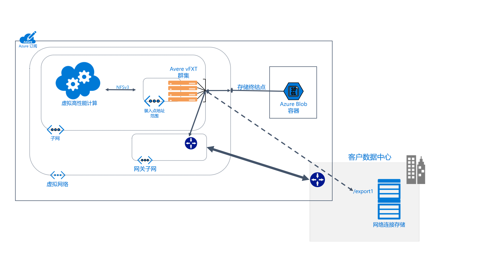

# 什么是 Avere vFXT for Azure？ 

Avere vFXT for Azure 是一种文件系统缓存解决方案，适用于数据密集型高性能计算 (HPC) 任务。 它允许你利用云计算的可伸缩性，让数据在需要的时间和位置可供使用，甚至包括存储在你自己的本地硬件上的数据。

Avere vFXT 支持下述常见的计算方案： 

* 混合云体系结构：Avere vFXT for Azure 可以适用于硬件存储系统，其优势是不需移动文件即可进行云计算。 
* 云爆发：Avere vFXT for Azure 可以将单个项目的数据移动到云，或者将整个工作流永久地进行直接迁移。 

Avere vFXT for Azure 最适合以下情况： 

* 适用于 HPC 工作负荷的读取密集型操作
* 使用常用 NFS 协议的应用程序
* 包含 1000 到 40,000 CPU 核心的计算场
* 集成本地硬件 NAS 和/或 Azure Blob 存储

有关详细信息，请访问<https://azure.microsoft.com/services/storage/avere-vfxt/>。

## 谁使用 Avere vFXT for Azure？ 

Avere vFXT 适用于所有类型的读取密集型计算任务：

### 视觉效果渲染 

在媒体和娱乐行业，Avere vFXT 群集可以加速时间关键型渲染项目的数据访问。 由于可以在 Azure 中添加更多的缓存空间和计算节点，因此可以灵活高效地处理大型项目。 

### 生命科学 

Avere vFXT 可以让研究人员在 Azure 计算中运行其辅助分析工作流并访问基因组数据，不管其身处何处。

在药物研究中，Avere vFXT 群集可以帮助研究人员预测药物-靶点相互作用并分析研究数据，因此可以用于加速药物开发。

### 金融服务分析

Avere vFXT 群集可以加快量化分析计算，让金融服务公司可以更好地了解数据，以便进行战略性决策。 

## 功能和规格

Avere vFXT 系统包含至少三个在群集中配置的虚拟边缘文件管理器节点。 它可以位于客户端计算机附近，这些客户端计算机装载群集而不是直接装载存储。 

Avere vFXT 群集根据请求来缓存文件。 重复的请求在超过 80% 的时间内可以从缓存提供。

### 兼容性 

* 兼容 NetApp 或 Dell EMC Isilon 提供的硬件 NAS 系统
* 兼容 Azure Blob
* 使用 NFSv3 或 SMB2 协议

Avere vFXT 使用下述 Azure 资源： 

|Azure 组件|   |
|----------|-----------|
|虚拟机|3 个或更多个 E32s_v3|
|高级 SSD 存储|200 GB OS 空间加上每个节点的 1 TB 到 4 TB 缓存空间 |
|存储帐户（可选） |v2|
|数据后端存储（可选） | 一个空的 LRS Blob 容器 |

## 后续步骤

可以通过下面的一些链接开始创建自己的 Avere vFXT 部署。 

* [规划系统](avere-vfxt-deploy-plan.md)
* [部署概述](avere-vfxt-deploy-overview.md)
* [创建 vFXT](avere-vfxt-deploy.md)
