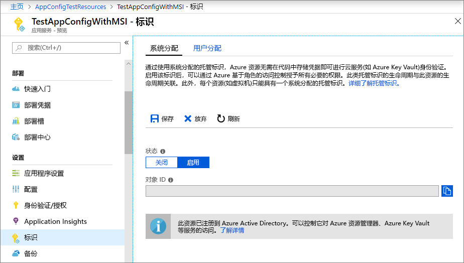
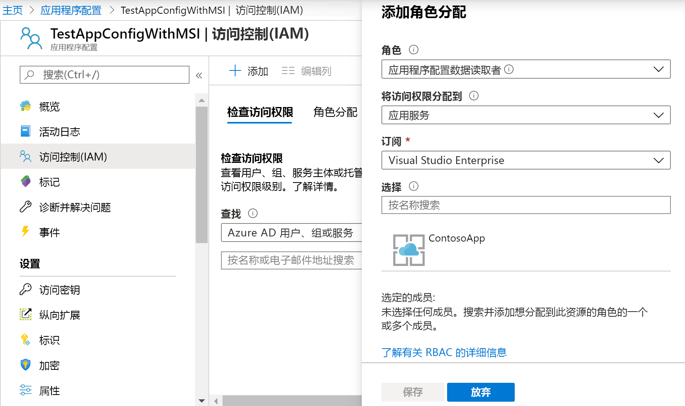

# <a name="integrate-with-azure-managed-identities"></a>与 Azure 托管标识集成

Azure Active Directory[托管标识](../active-directory/managed-identities-azure-resources/overview.md)简化了云应用程序的密钥管理。 使用托管标识，你的代码可以使用为其运行所在的 Azure 服务创建的服务主体。 使用托管标识而不是存储在 Azure Key Vault 中的单独凭据或本地连接字符串。 

Azure 应用配置及其 .NET Core、.NET Framework 和 Java 春季客户端库内置了托管标识支持。 尽管不需要使用它，但托管标识不再需要包含机密的访问令牌。 你的代码只能使用服务终结点访问应用配置存储。 可以直接在代码中嵌入此 URL，而无需公开任何机密。

本文说明如何利用托管标识访问应用配置。 它建立在快速入门中介绍的 Web 应用之上。 继续之前，请先[使用应用配置创建 ASP.NET Core 应用](./quickstart-aspnet-core-app.md)。

本文还演示如何将托管标识与应用配置的 Key Vault 引用结合使用。 使用单个托管标识，你可以通过应用配置从 Key Vault 和配置值无缝访问这两个机密。 如果希望探索此功能，请先完成[使用 ASP.NET Core Key Vault 引用](./use-key-vault-references-dotnet-core.md)。

你可以使用任何代码编辑器执行本教程中的步骤。 [Visual Studio Code](https://code.visualstudio.com/) 是 Windows、macOS 和 Linux 平台上提供的一个卓越选项。

在本文中，学习如何：

> [!div class="checklist"]
> * 授予对应用程序配置的托管身份访问权限。
> * 配置应用以在连接到应用程序配置时使用托管标识。
> * （可选）将应用配置为在通过应用配置 Key Vault 引用连接到 Key Vault 时使用托管标识。

## <a name="prerequisites"></a>必备条件

若要完成本教程，必须满足以下先决条件：

* [.NET Core SDK](https://www.microsoft.com/net/download/windows)。
* [已配置的 Azure Cloud Shell](https://docs.microsoft.com/azure/cloud-shell/quickstart)。

[!INCLUDE [quickstarts-free-trial-note](../../includes/quickstarts-free-trial-note.md)]

## <a name="add-a-managed-identity"></a>添加托管标识

若要在门户中设置托管标识，首先要创建一个应用程序，然后再启用该功能。

1. 按通常的方式在[Azure 门户](https://portal.azure.com)中创建应用服务实例。 在门户网站中转到它。

1. 在左侧窗格向下滚动到“设置”组，然后选择“标识”。

1. 在“系统分配”选项卡中，将“状态”切换为“启用”并选择“保存”。

1. 在系统提示启用系统分配的托管标识时回答 **"是"** 。

    

## <a name="grant-access-to-app-configuration"></a>授予对应用配置的访问权限

1. 在[Azure 门户](https://portal.azure.com)中，选择 "**所有资源**"，并选择在快速入门中创建的应用配置存储。

1. 选择“访问控制 (IAM)”。

1. 在“检查访问权限”选项卡中，选择“添加角色分配”卡 UI 中的“添加”。

1. 在 "**角色**" 下，选择 "**应用配置数据读取器**"。 将“访问权限分配对象”下，选择“应用服务”（在“系统分配的托管标识”下）。

1. 在“订阅”下，选择 Azure 订阅。 选择应用的应用服务资源。

1. 选择“保存”。

    

1. 可选：如果希望同时授予对 Key Vault 的访问权限，请按照[使用托管标识提供 Key Vault 身份验证](https://docs.microsoft.com/azure/key-vault/managed-identity)中的说明进行操作。

## <a name="use-a-managed-identity"></a>使用托管标识

1. 添加对*Azure. Identity*包的引用：

    ```cli
    dotnet add package Azure.Identity
    ```

1. 查找应用配置存储的终结点。 此 URL 在 Azure 门户中存储的 "**访问密钥**" 选项卡上列出。

1. 打开“appsettings.json”，并添加以下脚本。 将 *\<service_endpoint >* （包括括号）替换为应用配置存储的 URL。 

    ```json
    "AppConfig": {
        "Endpoint": "<service_endpoint>"
    }
    ```

1. 打开*Program.cs*，并添加对 `Azure.Identity` 和 `Microsoft.Azure.Services.AppAuthentication` 命名空间的引用：

    ```csharp-interactive
    using Azure.Identity;
    ```

1. 如果只希望访问直接存储在应用程序配置中的值，请通过替换 `config.AddAzureAppConfiguration()` 方法来更新 `CreateWebHostBuilder` 方法。

    > [!IMPORTANT]
    > `CreateHostBuilder` 替换 .NET Core 3.0 中的 `CreateWebHostBuilder`。  根据环境选择正确的语法。

    ### <a name="net-core-2x"></a>[.NET Core 2.x](#tab/core2x)

    ```csharp
        public static IWebHostBuilder CreateWebHostBuilder(string[] args) =>
            WebHost.CreateDefaultBuilder(args)
                .ConfigureAppConfiguration((hostingContext, config) =>
                {
                    var settings = config.Build();
                    config.AddAzureAppConfiguration(options =>
                        options.Connect(new Uri(settings["AppConfig:Endpoint"]), new ManagedIdentityCredential()));
                })
                .UseStartup<Startup>();
    ```

    ### <a name="net-core-3x"></a>[.NET Core 3.x](#tab/core3x)

    ```csharp
        public static IHostBuilder CreateHostBuilder(string[] args) =>
            Host.CreateDefaultBuilder(args)
            .ConfigureWebHostDefaults(webBuilder =>
            webBuilder.ConfigureAppConfiguration((hostingContext, config) =>
            {
                var settings = config.Build();
                    config.AddAzureAppConfiguration(options =>
                        options.Connect(new Uri(settings["AppConfig:Endpoint"]), new ManagedIdentityCredential()));
                })
                .UseStartup<Startup>());
    ```
    ---

1. 若要同时使用应用配置值和 Key Vault 引用，请按如下所示更新*Program.cs* 。 此代码使用 `AzureServiceTokenProvider` 创建新 `KeyVaultClient`，并将此引用传递给对 `UseAzureKeyVault` 方法的调用。

    ### <a name="net-core-2x"></a>[.NET Core 2.x](#tab/core2x)

    ```csharp
            public static IWebHostBuilder CreateWebHostBuilder(string[] args) =>
                WebHost.CreateDefaultBuilder(args)
                    .ConfigureAppConfiguration((hostingContext, config) =>
                    {
                        var settings = config.Build();
                        AzureServiceTokenProvider azureServiceTokenProvider = new AzureServiceTokenProvider();
                        KeyVaultClient kvClient = new KeyVaultClient(new KeyVaultClient.AuthenticationCallback(azureServiceTokenProvider.KeyVaultTokenCallback));
                        
                        config.AddAzureAppConfiguration(options => options.Connect(new Uri(settings["AppConfig:Endpoint"]), new ManagedIdentityCredential()).UseAzureKeyVault(kvClient));
                    })
                    .UseStartup<Startup>();
    ```

    ### <a name="net-core-3x"></a>[.NET Core 3.x](#tab/core3x)

    ```csharp
        public static IHostBuilder CreateHostBuilder(string[] args) =>
            Host.CreateDefaultBuilder(args)
            .ConfigureWebHostDefaults(webBuilder =>
            webBuilder.ConfigureAppConfiguration((hostingContext, config) =>
            {
                var settings = config.Build();
                        AzureServiceTokenProvider azureServiceTokenProvider = new AzureServiceTokenProvider();
                        KeyVaultClient kvClient = new KeyVaultClient(new KeyVaultClient.AuthenticationCallback(azureServiceTokenProvider.KeyVaultTokenCallback));
                        
                        config.AddAzureAppConfiguration(options => options.Connect(new Uri(settings["AppConfig:Endpoint"]), new ManagedIdentityCredential()).UseAzureKeyVault(kvClient));
                    })
                    .UseStartup<Startup>());
    ```
    ---

    你现在可以像访问任何其他应用配置键一样访问 Key Vault 引用。 配置提供程序将使用你配置的 `KeyVaultClient` 进行身份验证，以 Key Vault 并检索值。

[!INCLUDE [Prepare repository](../../includes/app-service-deploy-prepare-repo.md)]

## <a name="deploy-from-local-git"></a>从本地 Git 进行部署

若要为应用程序使用 Kudu 生成服务器启用本地 Git 部署，最简单的方法是使用[Azure Cloud Shell](https://shell.azure.com)。

### <a name="configure-a-deployment-user"></a>配置部署用户

[!INCLUDE [Configure a deployment user](../../includes/configure-deployment-user-no-h.md)]

### <a name="enable-local-git-with-kudu"></a>使用 Kudu 启用本地 Git
如果没有适用于应用的本地 git 存储库，则需要对其进行初始化。 若要初始化本地 git 存储库，请从应用的项目目录中运行以下命令：

```cmd
git init
git add .
git commit -m "Initial version"
```

要使用 Kudu 生成服务器为应用启用本地 Git 部署，请在 Cloud Shell 中运行 [`az webapp deployment source config-local-git`](/cli/azure/webapp/deployment/source?view=azure-cli-latest#az-webapp-deployment-source-config-local-git)。

```azurecli-interactive
az webapp deployment source config-local-git --name <app_name> --resource-group <group_name>
```

此命令提供类似于以下输出的内容：

```json
{
  "url": "https://<username>@<app_name>.scm.azurewebsites.net/<app_name>.git"
}
```

### <a name="deploy-your-project"></a>部署项目

在_本地终端窗口_中，将 Azure 远程计算机添加到本地 Git 存储库。 将 _\<url >_ 替换为从使用[Kudu 启用本地 Git](#enable-local-git-with-kudu)获取的 Git 远程 url。

```bash
git remote add azure <url>
```

使用以下命令推送到 Azure 远程功能以部署应用。 当系统提示输入密码时，请输入你在[配置部署用户](#configure-a-deployment-user)中创建的密码。 请勿使用用于登录 Azure 门户的密码。

```bash
git push azure master
```

在输出中可能会看到特定于运行时的自动化，如 MSBuild for ASP.NET、`npm install` for Node.js 和 `pip install` for Python。

### <a name="browse-to-the-azure-web-app"></a>浏览到 Azure Web 应用

使用浏览器浏览到 Web 应用以验证是否已部署内容。

```bash
http://<app_name>.azurewebsites.net
```


## <a name="use-managed-identity-in-other-languages"></a>使用其他语言的托管标识

适用于 .NET Framework 和 Java Spring 的应用配置提供程序也有针对托管标识的内置支持。 配置其中一个提供程序时，可以使用存储的 URL 终结点，而不是其完整的连接字符串。 

例如，你可以更新在快速入门中创建的 .NET Framework 控制台应用程序，以在*app.config*文件中指定以下设置：

```xml
    <configSections>
        <section name="configBuilders" type="System.Configuration.ConfigurationBuildersSection, System.Configuration, Version=4.0.0.0, Culture=neutral, PublicKeyToken=b03f5f7f11d50a3a" restartOnExternalChanges="false" requirePermission="false" />
    </configSections>

    <configBuilders>
        <builders>
            <add name="MyConfigStore" mode="Greedy" endpoint="${Endpoint}" type="Microsoft.Configuration.ConfigurationBuilders.AzureAppConfigurationBuilder, Microsoft.Configuration.ConfigurationBuilders.AzureAppConfiguration" />
            <add name="Environment" mode="Greedy" type="Microsoft.Configuration.ConfigurationBuilders.EnvironmentConfigBuilder, Microsoft.Configuration.ConfigurationBuilders.Environment" />
        </builders>
    </configBuilders>

    <appSettings configBuilders="Environment,MyConfigStore">
        <add key="AppName" value="Console App Demo" />
        <add key="Endpoint" value ="Set via an environment variable - for example, dev, test, staging, or production endpoint." />
    </appSettings>
```

## <a name="clean-up-resources"></a>清理资源

[!INCLUDE [azure-app-configuration-cleanup](../../includes/azure-app-configuration-cleanup.md)]

## <a name="next-steps"></a>后续步骤
在本教程中，你添加了 Azure 托管标识，以简化对应用配置的访问并改善应用的凭据管理。 若要了解有关如何使用应用程序配置的更多信息，请继续阅读 Azure CLI 示例。

> [!div class="nextstepaction"]
> [CLI 示例](./cli-samples.md)
