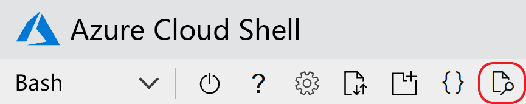

# <a name="quickstart-create-an-aspnet-core-app-with-azure-app-configuration"></a>快速入门：使用 Azure 应用配置创建 ASP.NET Core 应用

在本快速入门中，将使用 Azure 应用程序配置来集中存储和管理 ASP.NET Core 应用程序的应用程序设置。 ASP.NET Core 使用由应用程序指定的一个或多个数据源的设置，生成基于键值的单个配置对象。 这些数据源称为配置提供程序  。 由于应用程序配置的 .NET Core 客户端作为配置提供程序实现，因此服务就像是另一个数据源。

## <a name="prerequisites"></a>必备条件

- Azure 订阅 - [创建免费帐户](https://azure.microsoft.com/free/)
- [.NET Core SDK](https://dotnet.microsoft.com/download)

>[!TIP]
> Azure Cloud Shell 是免费的交互式 shell，可以使用它运行本文中的命令行指令。  它预安装了常用的 Azure 工具，其中包括 .NET Core SDK。 如果你已登录到 Azure 订阅，请从 shell.azure.com 启动 [Azure Cloud Shell](https://shell.azure.com)。  若要详细了解 Azure Cloud Shell，请[阅读我们的文档](../cloud-shell/overview.md)

## <a name="create-an-app-configuration-store"></a>创建应用配置存储区

[!INCLUDE [azure-app-configuration-create](../../includes/azure-app-configuration-create.md)]

6. 选择“配置资源管理器” > “创建”来添加以下键值对   ：

    | 密钥 | 值 |
    |---|---|
    | TestApp:Settings:BackgroundColor | 白色 |
    | TestApp:Settings:FontSize | 24 |
    | TestApp:Settings:FontColor | 黑色 |
    | TestApp:Settings:Message | Azure 应用配置的数据 |

    暂时将“标签”和“内容类型”保留为空   。

## <a name="create-an-aspnet-core-web-app"></a>创建一个 ASP.NET Core Web 应用

使用 [.NET Core 命令行接口 (CLI)](https://docs.microsoft.com/dotnet/core/tools/) 创建新的 ASP.NET Core MVC Web 应用项目。 [Azure Cloud Shell](https://shell.azure.com) 提供了这些工具。  它们还可在 Windows、macOS 和 Linux 平台上使用。

1. 为项目新建一个文件夹。 在此快速入门中，将其命名为 TestAppConfig  。

1. 在新文件夹中，运行以下命令，创建新的 ASP.NET Core MVC Web 应用项目：

```dotnetcli
dotnet new mvc --no-https
```

## <a name="add-secret-manager"></a>添加机密管理器

若要使用机密管理器，请将 `UserSecretsId` 元素添加到 .csproj  文件。

打开 *.csproj* 文件。 添加 `UserSecretsId` 元素，如下所示。 可以使用相同的 GUID，也可以将此值替换为你自己的值。 保存文件。

> [!IMPORTANT]
> `CreateHostBuilder` 替换 .NET Core 3.0 中的 `CreateWebHostBuilder`。  根据环境选择正确的语法。

#### <a name="net-core-2xtabcore2x"></a>[.NET Core 2.x](#tab/core2x)

```xml
<Project Sdk="Microsoft.NET.Sdk.Web">

    <PropertyGroup>
        <TargetFramework>netcoreapp2.1</TargetFramework>
        <UserSecretsId>79a3edd0-2092-40a2-a04d-dcb46d5ca9ed</UserSecretsId>
    </PropertyGroup>

    <ItemGroup>
        <PackageReference Include="Microsoft.AspNetCore.App" />
        <PackageReference Include="Microsoft.AspNetCore.Razor.Design" Version="2.1.2" PrivateAssets="All" />
    </ItemGroup>

</Project>
```

#### <a name="net-core-3xtabcore3x"></a>[.NET Core 3.x](#tab/core3x)

```xml
<Project Sdk="Microsoft.NET.Sdk.Web">
    
    <PropertyGroup>
        <TargetFramework>netcoreapp3.1</TargetFramework>
        <UserSecretsId>79a3edd0-2092-40a2-a04d-dcb46d5ca9ed</UserSecretsId>
    </PropertyGroup>

</Project>
```
---

机密管理器工具存储敏感数据，以便用于项目树之外的开发工作。 此方法有助于防止意外共享源代码中的应用密码。 有关机密管理器的详细信息，请参阅[在 ASP.NET Core 开发中安全存储应用机密](https://docs.microsoft.com/aspnet/core/security/app-secrets)

## <a name="connect-to-an-app-configuration-store"></a>连接到应用程序配置存储区

1. 通过运行以下命令，添加对 `Microsoft.Azure.AppConfiguration.AspNetCore` NuGet 包的引用：

    ```dotnetcli
    dotnet add package Microsoft.Azure.AppConfiguration.AspNetCore --version 3.0.0-preview-011100002-1192
    ```

1. 运行以下命令，还原项目包：

    ```dotnetcli
    dotnet restore
    ```

1. 将名为 ConnectionStrings:AppConfig 的机密添加到机密管理器  。

    此机密包含用于访问应用程序配置存储区的连接字符串。 将以下命令中的值替换为应用程序配置存储区的连接字符串。

    必须在 .csproj 文件所在的同一目录中执行此命令  。

    ```dotnetcli
    dotnet user-secrets set ConnectionStrings:AppConfig <your_connection_string>
    ```

    > [!IMPORTANT]
    > 有些 shell 会截断连接字符串，除非将连接字符串括在引号中。 确保 `dotnet user-secrets` 命令的输出显示整个连接字符串。 如果未显示，请重新运行该命令，并将连接字符串括在引号中。

    机密管理器仅用于本地测试 web 应用程序。 例如，将应用部署到 [Azure 应用服务](https://azure.microsoft.com/services/app-service/web)后，可以使用应用服务中的“连接字符串”应用程序设置，而无需使用机密管理器来存储连接字符串  。

    使用配置 API 访问此机密。 在所有支持的平台上，冒号 (:) 可以在配置 API 的配置名称中使用。 请参阅[按环境进行的配置](https://docs.microsoft.com/aspnet/core/fundamentals/configuration/index?tabs=basicconfiguration&view=aspnetcore-2.0)。

1. 打开 *Program.cs*，并添加对 .NET Core 应用程序配置提供程序的引用。

    ```csharp
    using Microsoft.Extensions.Configuration.AzureAppConfiguration;
    ```

1. 通过调用 `config.AddAzureAppConfiguration()` 方法，更新 `CreateWebHostBuilder` 方法以使用应用配置。

    > [!IMPORTANT]
    > `CreateHostBuilder` 替换 .NET Core 3.0 中的 `CreateWebHostBuilder`。  根据环境选择正确的语法。

    #### <a name="net-core-2xtabcore2x"></a>[.NET Core 2.x](#tab/core2x)

    ```csharp
    public static IWebHostBuilder CreateWebHostBuilder(string[] args) =>
        WebHost.CreateDefaultBuilder(args)
            .ConfigureAppConfiguration((hostingContext, config) =>
            {
                var settings = config.Build();
                config.AddAzureAppConfiguration(settings["ConnectionStrings:AppConfig"]);
            })
            .UseStartup<Startup>();
    ```

    #### <a name="net-core-3xtabcore3x"></a>[.NET Core 3.x](#tab/core3x)

    ```csharp
    public static IHostBuilder CreateHostBuilder(string[] args) =>
        Host.CreateDefaultBuilder(args)
        .ConfigureWebHostDefaults(webBuilder =>
        webBuilder.ConfigureAppConfiguration((hostingContext, config) =>
        {
            var settings = config.Build();
            config.AddAzureAppConfiguration(settings["ConnectionStrings:AppConfig"]);
        })
        .UseStartup<Startup>());
    ```

    ---

1. 导航到 <app root>/Views/Home，然后打开 Index.cshtml   。 将其内容替换为以下代码：

    ```HTML
    @using Microsoft.Extensions.Configuration
    @inject IConfiguration Configuration

    <style>
        body {
            background-color: @Configuration["TestApp:Settings:BackgroundColor"]
        }
        h1 {
            color: @Configuration["TestApp:Settings:FontColor"];
            font-size: @Configuration["TestApp:Settings:FontSize"];
        }
    </style>

    <h1>@Configuration["TestApp:Settings:Message"]</h1>
    ```

1. 导航到 <app root>，然后打开 _Layout.cshtml   。 将其内容替换为以下代码：

    ```HTML
    <!DOCTYPE html>
    <html>
    <head>
        <meta charset="utf-8" />
        <meta name="viewport" content="width=device-width, initial-scale=1.0" />
        <title>@ViewData["Title"] - hello_world</title>

        <link rel="stylesheet" href="~/lib/bootstrap/dist/css/bootstrap.css" />
        <link rel="stylesheet" href="~/css/site.css" />
    </head>
    <body>
        <div class="container body-content">
            @RenderBody()
        </div>

        <script src="~/lib/jquery/dist/jquery.js"></script>
        <script src="~/lib/bootstrap/dist/js/bootstrap.js"></script>
        <script src="~/js/site.js" asp-append-version="true"></script>

        @RenderSection("Scripts", required: false)
    </body>
    </html>
    ```

## <a name="build-and-run-the-app-locally"></a>在本地生成并运行应用

1. 若要使用 .NET Core CLI 生成应用，请导航到应用程序的根目录，然后在命令 shell 中运行以下命令：

    ```dotnetcli
    dotnet build
    ```

1. 生成成功完成后，请运行以下命令以在本地运行 Web 应用：

    ```dotnetcli
    dotnet run
    ```

1. 如果要在本地计算机上操作，请使用浏览器导航到 `http://localhost:5000`。 这是在本地托管的 Web 应用的默认 URL。  

如果要在 Azure Cloud Shell 中操作，请依次选择“Web 预览”按钮和“配置”   。  



系统提示配置预览端口时，请输入“5000”，然后选择“打开并浏览”  。  网页将显示“数据来自 Azure 应用程序配置”。

## <a name="clean-up-resources"></a>清理资源

[!INCLUDE [azure-app-configuration-cleanup](../../includes/azure-app-configuration-cleanup.md)]

## <a name="next-steps"></a>后续步骤

在本快速入门中，你创建了一个新的应用程序配置存储区，并通过[应用程序配置提供程序](https://go.microsoft.com/fwlink/?linkid=2074664)将其用于 ASP.NET Core Web 应用。 若要了解如何配置 ASP.NET Core 应用以动态刷新配置设置，请继续学习下一个教程。

> [!div class="nextstepaction"]
> [启用动态配置](./enable-dynamic-configuration-aspnet-core.md)
