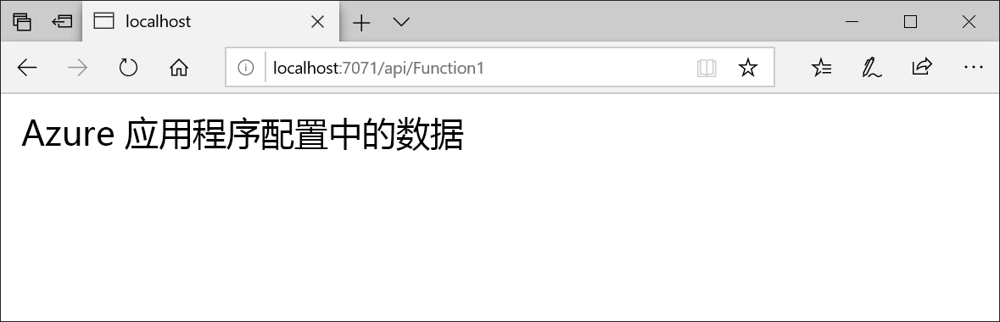

# <a name="quickstart-create-an-azure-function-with-app-configuration"></a>快速入门：使用应用配置创建 Azure 函数

Azure 应用配置是 Azure 中的托管配置服务。 借助它，无需代码即可在一个位置轻松存储和管理所有应用程序设置。 该快速入门展示了如何将此服务融入 Azure 函数。 

你可使用任意代码编辑器来执行该快速入门中的步骤。 [Visual Studio Code](https://code.visualstudio.com/) 是 Windows、macOS 和 Linux 平台上提供的一个卓越选项。



## <a name="prerequisites"></a>先决条件

要学习该快速入门，请安装 [Visual Studio 2017](https://visualstudio.microsoft.com/vs)。 确保还安装了 **Azure 开发**工作负荷。 另请安装 [latest Azure Functions 工具](../azure-functions/functions-develop-vs.md#check-your-tools-version)。

[!INCLUDE [quickstarts-free-trial-note](../../includes/quickstarts-free-trial-note.md)]

## <a name="create-an-app-configuration-store"></a>创建应用配置存储区

[!INCLUDE [azure-app-configuration-create](../../includes/azure-app-configuration-create.md)]

## <a name="create-a-function-app"></a>创建函数应用

[!INCLUDE [Create a project using the Azure Functions template](../../includes/functions-vstools-create.md)]

## <a name="connect-to-an-app-configuration-store"></a>连接到应用程序配置存储区

1. 右键单击项目，然后选择“管理 NuGet 包”。 在“浏览”选项卡中，搜索以下 NuGet 包并将其添加到项目中。 如果无法找到，请选中“包括预发行版”复选框。

    ```
    Microsoft.Extensions.Configuration.AzureAppConfiguration 1.0.0 preview or later
    ```

2. 打开 Function1.cs，并添加对应用程序配置 .NET Core 配置提供程序的引用。

    ```csharp
    using Microsoft.Extensions.Configuration.AzureAppConfiguration;
    ```

3. 通过调用 `builder.AddAzureAppConfiguration()` 更新 `Run` 方法以使用应用配置。

    ```csharp
    public static async Task<IActionResult> Run(
        [HttpTrigger(AuthorizationLevel.Anonymous, "get", "post", Route = null)] HttpRequest req, ILogger log)
    {
        log.LogInformation("C# HTTP trigger function processed a request.");

        var builder = new ConfigurationBuilder();
        builder.AddAzureAppConfiguration(Environment.GetEnvironmentVariable("ConnectionString"));
        var config = builder.Build();
        string message = config["TestApp:Settings:Message"];
        message = message ?? req.Query["message"];

        string requestBody = await new StreamReader(req.Body).ReadToEndAsync();
        dynamic data = JsonConvert.DeserializeObject(requestBody);
        message = message ?? data?.message;

        return message != null
            ? (ActionResult) new OkObjectResult(message)
            : new BadRequestObjectResult("Please pass a message from a configuration store, on the query string or in the request body");
    }
    ```

## <a name="test-the-function-locally"></a>在本地测试函数

1. 设置名为“ConnectionString”的环境变量，并将其设置为应用程序配置存储区的访问键。 如果使用 Windows 命令提示符，则请运行以下命令并重启命令提示符，这样更改才会生效：

        setx ConnectionString "connection-string-of-your-app-configuration-store"

    如果使用 Windows PowerShell，请运行以下命令：

        $Env:ConnectionString = "connection-string-of-your-app-configuration-store"

    如果使用 macOS 或 Linux，则请运行以下命令：

        export ConnectionString='connection-string-of-your-app-configuration-store'

2. 若要测试函数，请按 F5。 如果系统提示，请按 Visual Studio 的请求下载和安装 Azure Functions Core (CLI) 工具。 你还需要启用防火墙例外，这样工具才能处理 HTTP 请求。

3. 从 Azure Functions 运行时输出复制函数的 URL。

    

4. 将 HTTP 请求的 URL 粘贴到浏览器的地址栏中。 下图显示了浏览器中函数返回的本地 GET 请求的响应。

    

## <a name="clean-up-resources"></a>清理资源

[!INCLUDE [azure-app-configuration-cleanup](../../includes/azure-app-configuration-cleanup.md)]

## <a name="next-steps"></a>后续步骤

在该快速入门中，你创建了一个新的应用程序配置存储，并将其与 Azure 函数结合使用。 若要深入了解如何使用应用程序配置，请继续学习下一个教程，其中将介绍如何进行身份验证。

> [!div class="nextstepaction"]
> [用于 Azure 资源集成的托管标识](./integrate-azure-managed-service-identity.md)
