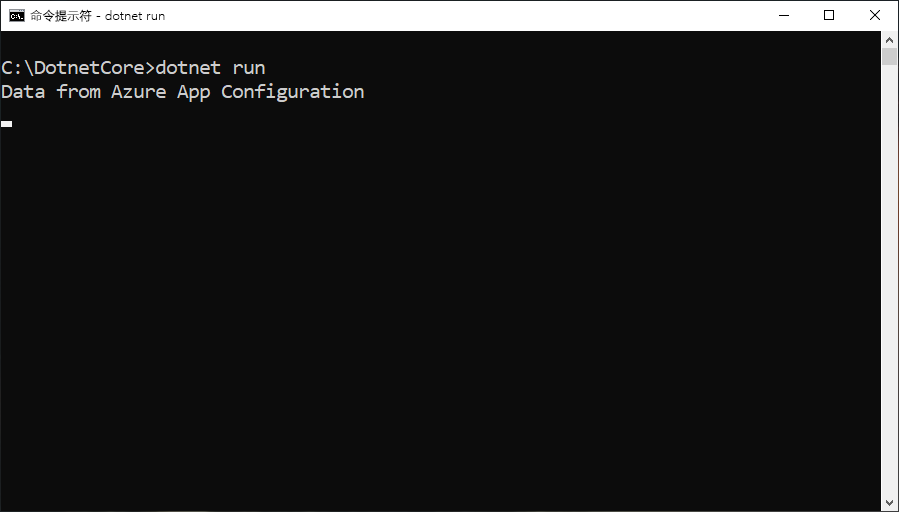

# <a name="quickstart-create-a-net-core-app-with-app-configuration"></a>快速入门：使用应用程序配置创建 .NET Core 应用

Azure 应用配置是 Azure 中的托管配置服务。 借助它，无需代码即可在一个位置轻松存储和管理所有应用程序设置。 本快速入门将介绍如何将服务合并到 .NET Core 控制台应用中。

你可使用任意代码编辑器来执行该快速入门中的步骤。 [Visual Studio Code](https://code.visualstudio.com/) 是 Windows、macOS 和 Linux 平台上提供的一个卓越选项。

## <a name="prerequisites"></a>先决条件

要完成本快速入门，请安装 [.NET Core SDK](https://dotnet.microsoft.com/download)。

[!INCLUDE [quickstarts-free-trial-note](../../includes/quickstarts-free-trial-note.md)]

## <a name="create-an-app-configuration-store"></a>创建应用配置存储区

[!INCLUDE [azure-app-configuration-create](../../includes/azure-app-configuration-create.md)]

## <a name="create-a-net-core-console-app"></a>创建 .NET Core 控制台应用

你使用 [.NET Core 命令行接口 (CLI)](https://docs.microsoft.com/dotnet/core/tools/) 创建新的 .NET Core 控制台应用项目。 通过 Visual Studio 使用 .NET Core CLI 的优点是，它可用于 Windows、macOS 和 Linux 平台。

1. 为项目新建一个文件夹。

2. 在新文件夹中，运行以下命令，创建新的 ASP.NET Core MVC Web 应用项目：

        dotnet new console

## <a name="connect-to-an-app-configuration-store"></a>连接到应用程序配置存储区

1. 通过运行以下命令，添加对 `Microsoft.Extensions.Configuration.AzureAppConfiguration` NuGet 包的引用：

        dotnet add package Microsoft.Extensions.Configuration.AzureAppConfiguration --version 1.0.0-preview-007830001

2. 运行以下命令，还原项目包：

        dotnet restore

3. 打开 Program.cs 并更新 `Main` 方法以通过调用 `builder.AddAzureAppConfiguration()` 方法使用应用程序配置。

    ```csharp
    using Microsoft.Extensions.Configuration;
    using Microsoft.Extensions.Configuration.AzureAppConfiguration;

    ...

    static void Main(string[] args)
    {
        var builder = new ConfigurationBuilder();
        builder.AddAzureAppConfiguration(Environment.GetEnvironmentVariable("ConnectionString"));

        var config = builder.Build();
        Console.WriteLine(config["TestApp:Settings:Message"] ?? "Hello world!");
    }
    ```

## <a name="build-and-run-the-app-locally"></a>在本地生成并运行应用

1. 设置名为“ConnectionString”的环境变量，并将其设置为应用程序配置存储区的访问键。 如果使用 Windows 命令提示符，则请运行以下命令并重启命令提示符，这样更改才会生效：

        setx ConnectionString "connection-string-of-your-app-configuration-store"

    如果使用 Windows PowerShell，请运行以下命令：

        $Env:ConnectionString = "connection-string-of-your-app-configuration-store"

    如果使用 macOS 或 Linux，则请运行以下命令：

        export ConnectionString='connection-string-of-your-app-configuration-store'

2. 运行以下命令以生成控制台应用：

        dotnet build

3. 生成成功完成后，请运行以下命令以在本地运行应用：

        dotnet run

    

## <a name="clean-up-resources"></a>清理资源

[!INCLUDE [azure-app-configuration-cleanup](../../includes/azure-app-configuration-cleanup.md)]

## <a name="next-steps"></a>后续步骤

在本快速入门中，你创建了一个新的应用配置存储区，并通过[应用配置提供程序](https://go.microsoft.com/fwlink/?linkid=2074664)将其用于 .NET Core 控制台应用。 若要深入了解如何使用应用程序配置，请继续学习下一个教程，其中将介绍如何进行身份验证。

> [!div class="nextstepaction"]
> [用于 Azure 资源集成的托管标识](./integrate-azure-managed-service-identity.md)
