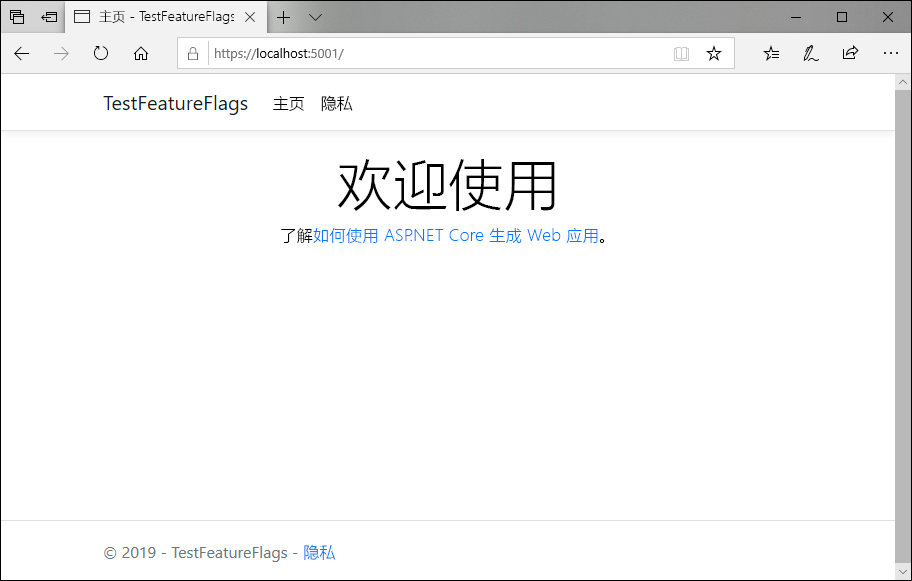
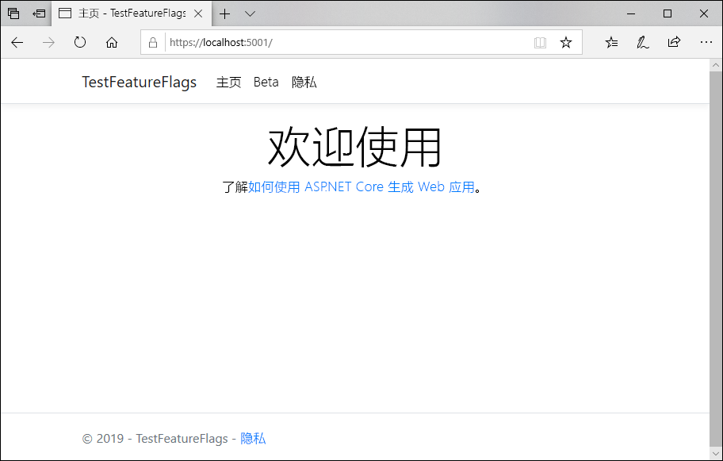

# <a name="quickstart-add-feature-flags-to-an-aspnet-core-app"></a>快速入门：将功能标志添加到 ASP.NET Core 应用

在本快速入门中，会将 Azure 应用程序配置合并到 ASP.NET Core Web 应用中，以创建功能管理的端到端实现。 可以使用应用程序配置服务集中存储所有功能标志并控制其状态。 

.NET Core 功能管理库使用全面的功能标志支持扩展了该框架。 这些库在 .NET Core 配置系统的基础上构建。 它们可以通过其 .NET Core 配置提供程序无缝集成到应用程序配置。

## <a name="prerequisites"></a>先决条件

- Azure 订阅 - [创建免费帐户](https://azure.microsoft.com/free/)
- [.NET Core SDK](https://dotnet.microsoft.com/download)。

## <a name="create-an-app-configuration-store"></a>创建应用配置存储区

[!INCLUDE [azure-app-configuration-create](../../includes/azure-app-configuration-create.md)]

6. 选择“功能管理器” > “+添加”以添加以下功能标志：  

    | 密钥 | 状态 |
    |---|---|
    | Beta | 关闭 |

## <a name="create-an-aspnet-core-web-app"></a>创建一个 ASP.NET Core Web 应用

使用 [.NET Core命令行接口 (CLI)](https://docs.microsoft.com/dotnet/core/tools/) 创建新的 ASP.NET Core MVC Web 应用项目。 使用 .NET Core CLI 而不是 Visual Studio 的优点是，它可用于 Windows、macOS 和 Linux 平台。

1. 为项目新建一个文件夹。 本快速入门将其命名为 *TestFeatureFlags*。

1. 在新文件夹中，运行以下命令，创建新的 ASP.NET Core MVC Web 应用项目：

   ```    
   dotnet new mvc
   ```

## <a name="add-secret-manager"></a>添加机密管理器

向项目添加[机密管理器工具](https://docs.microsoft.com/aspnet/core/security/app-secrets)。 机密管理器工具存储敏感数据，以用于项目树外部的开发工作。 此方法有助于防止意外共享源代码中的应用密码。

1. 打开 *.csproj* 文件。
1. 如下例所示，添加 `UserSecretsId` 元素，将其值替换为你自己的值（通常为 GUID）：

    ```xml
    <Project Sdk="Microsoft.NET.Sdk.Web">

    <PropertyGroup>
        <TargetFramework>netcoreapp2.1</TargetFramework>
        <UserSecretsId>79a3edd0-2092-40a2-a04d-dcb46d5ca9ed</UserSecretsId>
    </PropertyGroup>

    <ItemGroup>
        <PackageReference Include="Microsoft.AspNetCore.App" />
        <PackageReference Include="Microsoft.AspNetCore.Razor.Design" Version="2.1.2" PrivateAssets="All" />
    </ItemGroup>

    </Project>
    ```

1. 保存文件。

## <a name="connect-to-an-app-configuration-store"></a>连接到应用程序配置存储区

1. 运行以下命令添加对 `Microsoft.Azure.AppConfiguration.AspNetCore` 和 `Microsoft.FeatureManagement.AspNetCore` NuGet 包的引用：

    ```
    dotnet add package Microsoft.Azure.AppConfiguration.AspNetCore --version 2.0.0-preview-009470001-12
    dotnet add package Microsoft.FeatureManagement.AspNetCore --version 1.0.0-preview-009000001-1251
    ```

1. 运行以下命令，还原项目包：

    ```
    dotnet restore
    ```

1. 将名为 ConnectionStrings:AppConfig 的机密添加到机密管理器  。

    此机密包含用于访问应用程序配置存储区的连接字符串。 将以下命令中的 `<your_connection_string>` 值替换为应用程序配置存储区的连接字符串。

    必须在 .csproj 文件所在的同一目录中执行此命令  。

    ```
    dotnet user-secrets set ConnectionStrings:AppConfig <your_connection_string>
    ```

    仅使用机密管理器在本地测试 Web 应用。 例如，当你将应用部署到 [Azure 应用服务](https://azure.microsoft.com/services/app-service)时，你将在应用服务中使用名为“连接字符串”  的应用程序设置，而不是使用机密管理器来存储连接字符串。

    可以使用应用程序配置 API 访问此机密。 在所有支持的平台上，冒号 (:) 可以在应用程序配置 API 的配置名称中使用。 请参阅[按环境进行的配置](https://docs.microsoft.com/aspnet/core/fundamentals/configuration)。

1. 打开 *Program.cs*，并添加对 .NET Core 应用程序配置提供程序的引用：

    ```csharp
    using Microsoft.Extensions.Configuration.AzureAppConfiguration;
    ```

1. 通过调用 `config.AddAzureAppConfiguration()` 方法，更新 `CreateWebHostBuilder` 方法以使用应用配置。

    ```csharp
    public static IWebHostBuilder CreateWebHostBuilder(string[] args) =>
        WebHost.CreateDefaultBuilder(args)
            .ConfigureAppConfiguration((hostingContext, config) =>
            {
                var settings = config.Build();
                config.AddAzureAppConfiguration(options => {
                    options.Connect(settings["ConnectionStrings:AppConfig"])
                           .UseFeatureFlags();
                });
            })
            .UseStartup<Startup>();
    ```

1. 打开 *Startup.cs*，并添加对 .NET Core 功能管理器的引用：

    ```csharp
    using Microsoft.FeatureManagement;
    ```

1. 通过调用 `services.AddFeatureManagement()` 方法更新 `ConfigureServices` 方法以添加功能标志支持。 （可选）可以通过调用 `services.AddFeatureFilter<FilterType>()` 来包括要与功能标志一起使用的任何筛选器：

    ```csharp
    public void ConfigureServices(IServiceCollection services)
    {
        services.AddFeatureManagement();
    }
    ```

1. 更新 `Configure` 方法以添加中间件，以允许在 ASP.NET Core Web 应用继续接收请求的同时定期刷新功能标志值。

    ```csharp
    public void Configure(IApplicationBuilder app, IHostingEnvironment env)
    {
        app.UseAzureAppConfiguration();
        app.UseMvc();
    }
    ```

1. 添加 *MyFeatureFlags.cs* 文件：

    ```csharp
    namespace TestFeatureFlags
    {
        public enum MyFeatureFlags
        {
            Beta
        }
    }
    ```

1. 将 *BetaController.cs* 添加到 Controllers 目录  ：

    ```csharp
    using Microsoft.AspNetCore.Mvc;
    using Microsoft.FeatureManagement;
    using Microsoft.FeatureManagement.Mvc;

    namespace TestFeatureFlags.Controllers
    {
        public class BetaController: Controller
        {
            private readonly IFeatureManager _featureManager;

            public BetaController(IFeatureManagerSnapshot featureManager)
            {
                _featureManager = featureManager;
            }

            [FeatureGate(MyFeatureFlags.Beta)]
            public IActionResult Index()
            {
                return View();
            }
        }
    }
    ```

1. 打开 Views 目录中的 _ViewImports.cshtml  ，并添加功能管理器标记帮助器  ：

    ```html
    @addTagHelper *, Microsoft.FeatureManagement.AspNetCore
    ```

1. 打开“视图”  \\“共享”  目录中的 _Layout.cshtml  ，然后将 `<body>` > `<header>` 下的 `<nav>` 条形码替换为以下代码：

    ```html
    <nav class="navbar navbar-expand-sm navbar-toggleable-sm navbar-light bg-white border-bottom box-shadow mb-3">
        <div class="container">
            <a class="navbar-brand" asp-area="" asp-controller="Home" asp-action="Index">TestFeatureFlags</a>
            <button class="navbar-toggler" type="button" data-toggle="collapse" data-target=".navbar-collapse" aria-controls="navbarSupportedContent"
            aria-expanded="false" aria-label="Toggle navigation">
            <span class="navbar-toggler-icon"></span>
            </button>
            <div class="navbar-collapse collapse d-sm-inline-flex flex-sm-row-reverse">
                <ul class="navbar-nav flex-grow-1">
                    <li class="nav-item">
                        <a class="nav-link text-dark" asp-area="" asp-controller="Home" asp-action="Index">Home</a>
                    </li>
                    <feature name="Beta">
                    <li class="nav-item">
                        <a class="nav-link text-dark" asp-area="" asp-controller="Beta" asp-action="Index">Beta</a>
                    </li>
                    </feature>
                    <li class="nav-item">
                        <a class="nav-link text-dark" asp-area="" asp-controller="Home" asp-action="Privacy">Privacy</a>
                    </li>
                </ul>
            </div>
        </div>
    </nav>
    ```

1. 在“视图”  下创建一个 Beta 目录  ，并在其中添加 Index.cshtml  ：

    ```html
    @{
        ViewData["Title"] = "Beta Home Page";
    }

    <h1>
        This is the beta website.
    </h1>
    ```

## <a name="build-and-run-the-app-locally"></a>在本地生成并运行应用

1. 要通过使用 .NET Core CLI 生成应用，请在命令行界面中执行以下命令：

    ```
    dotnet build
    ```

1. 生成成功完成后，请运行以下命令以在本地运行 Web 应用：

    ```
    dotnet run
    ```

1. 启动浏览器窗口并转到 `https://localhost:5001`，即本地托管的 Web 应用的默认 URL。

    

1. 登录到 [Azure 门户](https://portal.azure.com)。 选择“所有资源”，然后选择在快速入门中创建的应用程序配置存储区实例  。

1. 选择“功能管理器”，将“Beta”密钥的状态更改为“启用”：   

    | 密钥 | 状态 |
    |---|---|
    | Beta | 启用 |

1. 通过切换回命令提示符并按 `Ctrl-C` 取消正在运行的 `dotnet` 进程，然后重新运行 `dotnet run` 来重启应用程序。

1. 刷新浏览器页面，查看新的配置设置。

    

## <a name="clean-up-resources"></a>清理资源

[!INCLUDE [azure-app-configuration-cleanup](../../includes/azure-app-configuration-cleanup.md)]

## <a name="next-steps"></a>后续步骤

在本快速入门中，你已创建一个新的应用程序配置存储区，并已使用它来通过[功能管理库](https://go.microsoft.com/fwlink/?linkid=2074664)管理 ASP.NET Core Web 应用中的功能。

- 详细了解[功能管理](./concept-feature-management.md)。
- [管理功能标志](./manage-feature-flags.md)。
- [在 ASP.NET Core 应用中使用功能标志](./use-feature-flags-dotnet-core.md)。
- [在 ASP.NET Core 应用中使用动态配置](./enable-dynamic-configuration-aspnet-core.md)
