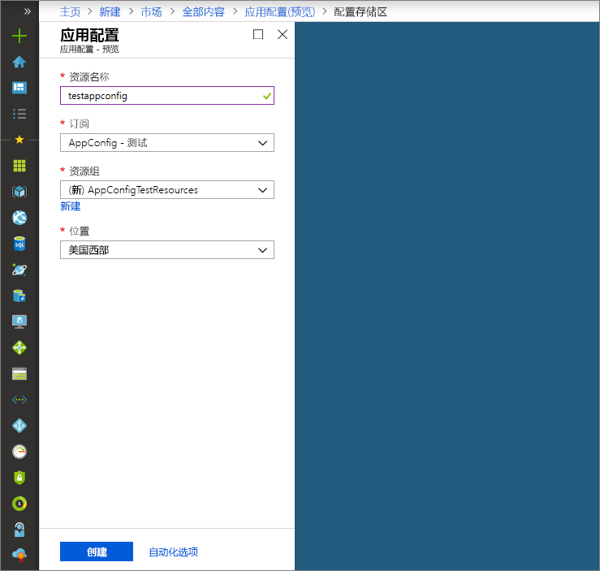

# <a name="quickstart-create-a-java-spring-app-with-app-configuration"></a>快速入门：使用应用配置创建 Java Spring 应用

Azure 应用配置是 Azure 中的托管配置服务。 借助它，无需代码即可在一个位置轻松存储和管理所有应用程序设置。 本快速入门介绍如何将服务合并到 Java Spring 应用中。

你可使用任意代码编辑器来执行该快速入门中的步骤。 [Visual Studio Code](https://code.visualstudio.com/) 是 Windows、macOS 和 Linux 平台上提供的一个卓越选项。

## <a name="prerequisites"></a>先决条件

要完成此快速入门，请安装受支持的 [Java 开发套件 (JDK)](https://aka.ms/azure-jdks) 版本 8 以及 [Apache Maven](https://maven.apache.org/) 版本 3.0 或更高版本。

[!INCLUDE [quickstarts-free-trial-note](../../includes/quickstarts-free-trial-note.md)]

## <a name="create-an-app-configuration-store"></a>创建应用配置存储区

1. 要创建新应用程序配置存储区，请登录 [Azure 门户](https://aka.ms/azconfig/portal)。 在页面的左上角，选择“+ 创建资源”。 在“搜索市场”框中，输入“应用程序配置”并按 Enter。

    

2. 在搜索结果中选择“应用程序配置”，然后选择“创建”。

3. 在“应用程序配置” > “创建”页中，输入以下设置。

    | 设置 | 建议的值 | 说明 |
    |---|---|---|
    | **资源名称** | 全局唯一名称 | 输入用于应用配置存储区资源的唯一资源名称。 该名称必须是包含 1 到 63 个字符的字符串，只能包含数字、字母和 `-` 字符。 该名称的开头或末尾不能是 `-` 字符，并且连续的 `-` 字符无效。  |
    | **订阅** | 订阅 | 选择要用来测试应用配置的 Azure 订阅。 如果帐户只有一个订阅，则会自动选择该订阅并且不显示“订阅”下拉菜单。 |
    | **资源组** | *AppConfigTestResources* | 为应用配置存储区资源选择或创建资源组。 此组可用于组织多个资源，删除该资源组可以同时删除这些资源。 有关详细信息，请参阅[使用资源组管理 Azure 资源](https://docs.microsoft.com/azure/azure-resource-manager/resource-group-overview)。 |
    | **位置** | *美国中部* | 使用“位置”指定在其中托管 SignalR 资源的地理位置。 为获得最佳性能，请在应用程序的其他组件所在的同一区域创建资源。 |

    

4. 选择“创建”。 部署可能需要几分钟时间才能完成。

5. 部署完成后，选择“设置” > “访问密钥”。 记下只读主键或读写主键连接字符串。 稍后将使用此连接字符串来配置应用程序，以与创建的应用程序配置存储区进行通信。

6. 选择“键/值资源管理器” > “+创建”来添加以下键值对：

    | 密钥 | 值 |
    |---|---|
    | /application/config.message | 你好 |

    暂时将“标签”和“内容类型”保留为空。

## <a name="create-a-spring-boot-app"></a>创建 Spring Boot 应用

使用 [Spring Initializr](https://start.spring.io/) 创建一个新 Spring Boot 项目。

1. 浏览到 <https://start.spring.io/>。

2. 指定以下选项：

   * 使用 **Java** 生成一个 **Maven** 项目。
   * 指定一个其值大于或等于 2.0 的 Spring Boot 版本。
   * 指定应用程序的“组”和“项目”名称。
   * 添加 **Web** 依赖项。

3. 指定上述选项后，选择“生成项目”。 出现提示时，将项目下载到本地计算机中的路径。

## <a name="connect-to-an-app-configuration-store"></a>连接到应用程序配置存储区

1. 从本地系统提取文件后，即可使用简单的 Spring Boot 应用程序进行编辑。 在应用的根目录中找到 pom.xml 文件。

2. 在文本编辑器中打开 *pom.xml* 文件，将 Spring Cloud Azure Config Starter 添加到 `<dependencies>` 列表：

    ```xml
    <dependency>
        <groupId>com.microsoft.azure</groupId>
        <artifactId>spring-cloud-starter-azure-appconfiguration-config</artifactId>
        <version>1.1.0.M3</version>
    </dependency>
    ```

3. 在应用的包目录中创建名为 MessageProperties.java 的新 Java 文件。 添加以下行：

    ```java
    @ConfigurationProperties(prefix = "config")
    public class MessageProperties {
        private String message;

        public String getMessage() {
            return message;
        }

        public void setMessage(String message) {
            this.message = message;
        }
    }
    ```

4. 在应用的包目录中创建新的名为 HelloController.java 的 Java 文件。 添加以下行：

    ```java
    @RestController
    public class HelloController {
        private final MessageProperties properties;

        public HelloController(MessageProperties properties) {
            this.properties = properties;
        }

        @GetMapping
        public String getMessage() {
            return "Message: " + properties.getMessage();
        }
    }
    ```

5. 打开主应用程序 Java 文件，并添加 `@EnableConfigurationProperties`以启用此功能。

    ```java
    @SpringBootApplication
    @EnableConfigurationProperties(MessageProperties.class)
    public class AzureConfigApplication {
        public static void main(String[] args) {
            SpringApplication.run(AzureConfigApplication.class, args);
        }
    }
    ```

6. 在应用的资源目录下创建名为 `bootstrap.properties` 的新文件，并将以下行添加到该文件中。 使用应用程序配置存储区的相应属性替换示例值。

    ```properties
    spring.cloud.azure.appconfiguration.stores[0].connection-string=[your-connection-string]
    ```

## <a name="build-and-run-the-app-locally"></a>在本地生成并运行应用

1. 使用 Maven 生成 Spring Boot 应用程序，然后运行该程序，例如：

    ```shell
    mvn clean package
    mvn spring-boot:run
    ```
2. 应用程序运行以后，请使用 curl 测试该应用程序，例如：

      ```shell
      curl -X GET http://localhost:8080/
      ```
    可看到在应用程序配置存储区中输入的消息。

## <a name="clean-up-resources"></a>清理资源

[!INCLUDE [azure-app-configuration-cleanup](../../includes/azure-app-configuration-cleanup.md)]

## <a name="next-steps"></a>后续步骤

在本快速入门中，你创建了一个新的应用程序配置存储区，并将其用于 Java Spring 应用。 有关详细信息，请参阅 [Azure 上的 Spring](https://docs.microsoft.com/java/azure/spring-framework/)。

若要深入了解如何使用应用程序配置，请继续学习下一个教程，其中将介绍如何进行身份验证。

> [!div class="nextstepaction"]
> [用于 Azure 资源集成的托管标识](./integrate-azure-managed-service-identity.md)
