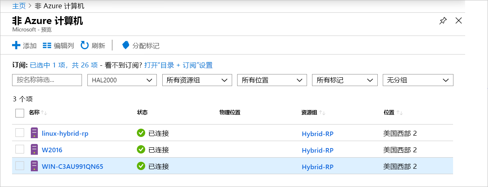

# <a name="what-is-azure-arc-for-servers"></a>什么是用于服务器的 Azure Arc

利用用于服务器的 Azure Arc 可以管理非 Azure 的计算机。
当非 Azure 的计算机连接到 Azure 时，它将成为“已连接的计算机”  并被视为 Azure 中的资源。 每个“已连接的计算机”都有一个资源 ID，均作为订阅内资源组的一部分进行管理，并且得益于标准的 Azure 构造，如 Azure Policy 和标记  。

需要在每台计算机上安装代理包才能将其连接到 Azure。 本文档的其余部分更详细地介绍了该过程。

基于代理最近的签入方式，计算机的状态会显示为“已连接”或“已断开连接”   。 每个签入称为一个检测信号。 如果计算机在过去 5 分钟内未签入，则在连接恢复之前，计算机会显示为“脱机”。  <!-- For more information on troubleshooting agent connectivity, see [Troubleshooting Azure Arc for servers](troubleshoot/arc-for-servers.md). -->



## <a name="clients"></a>客户端

### <a name="supported-operating-systems"></a>支持的操作系统

在公开预览版中，支持以下操作系统：

- Windows Server 2012 R2 和更高版本
- Ubuntu 16.04 和 18.04

公共预览版旨在进行评估，不应用来管理关键的生产资源。

## <a name="azure-subscription-and-service-limits"></a>Azure 订阅和服务限制

请务必阅读 Azure 资源管理器限制，并根据针对[订阅](../../azure-subscription-service-limits.md#subscription-limits---azure-resource-manager)和[资源组](../../azure-subscription-service-limits.md#resource-group-limits)列出的准则来规划要连接的计算机的数量。 尤其在默认情况下，每个资源组的服务器数量限制为 800。

## <a name="networking-configuration"></a>网络配置

在安装期间和运行时，代理需要连接到“Azure Arc 服务终结点”  。 如果使用防火墙阻止出站连接，请确保默认情况下不会阻止以下 URL。 所有连接都是从代理到 Azure 的出站连接，并受 SSL 保护  。 可以通过 HTTPS 代理来路由所有流量  。 如果允许服务器所允许连接到的 IP 范围或域名，则必须允许端口 443 访问以下服务标记和 DNS 名称。

服务标记：

* AzureActiveDirectory
* AzureTrafficManager

有关每个服务标记/区域的 IP 地址列表，请参阅 JSON 文件 - [Azure IP 范围和服务标记 - 公有云](https://www.microsoft.com/download/details.aspx?id=56519)。 Microsoft 每周将发布包含每个 Azure 服务及其使用的 IP 范围的更新。 有关更多详细信息，请参阅[服务标记](https://docs.microsoft.com/azure/virtual-network/security-overview#service-tags)。

因为大多数服务当前未注册服务标记，IP 可能会更改，所以除了服务标记 IP 范围信息之外，还提供了这些 DNS 名称。 如果防火墙配置需要 IP 范围，则应使用 AzureCloud 服务标记允许对所有 Azure 服务的访问  。 请勿禁用对这些 URL 的安全监视或检查，但就像允许其他 Internet 流量一样允许这些 URL。

| 域环境 | 所需的 Azure 服务终结点 |
|---------|---------|
|management.azure.com|Azure 资源管理器|
|login.windows.net|Azure Active Directory|
|dc.services.visualstudio.com|Application Insights|
|agentserviceapi.azure-automation.net|来宾配置|
|*-agentservice-prod-1.azure-automation.net|来宾配置|
|*.his.hybridcompute.azure-automation.net|混合标识服务|

### <a name="installation-network-requirements"></a>安装网络要求

如果要从官方分发服务器下载 [Azure 连接的计算机代理包](https://aka.ms/AzureConnectedMachineAgent)，则必须可从环境中访问以下站点。 可以选择将包下载到文件共享，并从该位置安装代理。 在这种情况下，可能需要修改从 Azure 门户生成的载入脚本。

Windows:

* `aka.ms`
* `download.microsoft.com`

Linux：

* `aka.ms`
* `packages.microsoft.com`

有关如何配置代理来使用代理服务器的信息，请参阅[代理服务器配置](quickstart-onboard-powershell.md#proxy-server-configuration)部分。

## <a name="register-the-required-resource-providers"></a>注册所需的资源提供程序

若要使用适用于服务器的 Azure Arc，必须注册所需的资源提供程序。

*  Microsoft.HybridCompute
*  Microsoft.GuestConfiguration

可以使用以下命令注册资源提供程序：

Azure PowerShell：

```azurepowershell-interactive
Login-AzAccount
Set-AzContext -SubscriptionId [subscription you want to onboard]
Register-AzResourceProvider -ProviderNamespace Microsoft.HybridCompute
Register-AzResourceProvider -ProviderNamespace Microsoft.GuestConfiguration
```

Azure CLI：

```azurecli-interactive
az account set --subscription "{Your Subscription Name}"
az provider register --namespace 'Microsoft.HybridCompute'
az provider register --namespace 'Microsoft.GuestConfiguration'
```

此外，还可以按照 [Azure 门户](../../azure-resource-manager/resource-manager-supported-services.md#azure-portal)下的步骤，使用门户注册资源提供程序。

## <a name="supported-scenarios"></a>支持的方案

注册节点后，便可以使用其他 Azure 服务来管理节点。

在公共预览版中，已连接的计算机  支持以下方案。

## <a name="guest-configuration"></a>来宾配置

将计算机连接到 Azure 后，可以将 Azure 策略分配到“已连接的计算机”，此方法与将策略分配到 Azure 虚拟机的方法相同  。

有关详细信息，请参阅[了解 Azure 策略的来宾配置](../../governance/policy/concepts/guest-configuration.md)。

“已连接的计算机”的来宾配置代理日志位于以下位置： 

* Windows - `%ProgramFiles%\AzureConnectedMachineAgent\logs\dsc.log`。
* Linux：- `/opt/logs/dsc.log`

## <a name="log-analytics"></a>Log Analytics

现在，由 [Microsoft Monitoring Agent (MMA)](https://docs.microsoft.com/azure/azure-monitor/log-query/log-query-overview) 收集并存储于 Log Analytics 工作区中日志数据将包含特定于计算机的属性，如 ResourceId  ，该属性可用于以资源为中心的日志访问。

- 已安装 MMA 代理的计算机，将通过更新的管理包启用 Azure Arc 功能  。
- 用于服务器的 Azure Arc 的集成需要 [MMA 代理10.20.18011 或更高版本](https://docs.microsoft.com/azure/virtual-machines/extensions/oms-windows#agent-and-vm-extension-version)。
- 在 [Azure Monitor](https://docs.microsoft.com/azure/azure-monitor/log-query/log-query-overview)中查询日志数据时，返回的数据架构将包含混合的 **ResourceId**，形式如下：`/subscriptions/<SubscriptionId/resourceGroups/<ResourceGroup>/providers/Microsoft.HybridCompute/machines/<MachineName>`。

有关详细信息，请参阅 [Azure Monitor 中的 Log Analytics 入门](https://docs.microsoft.com/azure/azure-monitor/log-query/get-started-portal)。

<!-- MMA agent version 10.20.18011 and later -->

## <a name="next-steps"></a>后续步骤

可以通过两种方法使用用于服务器的 Azure Arc 连接计算机。

* **交互式** - 参照[门户快速入门](quickstart-onboard-portal.md)，从门户生成脚本并在计算机上执行它。 如果一次只连接一台计算机，则这是最佳选项。
* **大规模** - 参照 [PowerShell 快速入门](quickstart-onboard-powershell.md)创建服务主体，以非交互式方式连接计算机。
