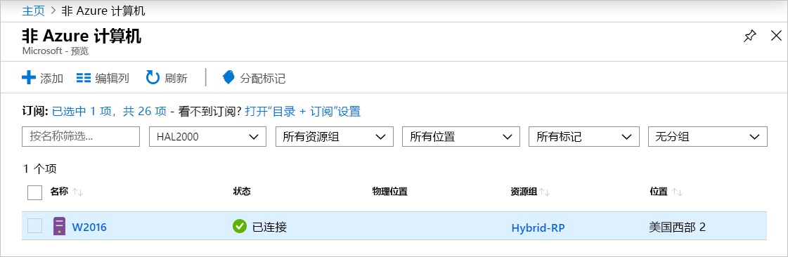
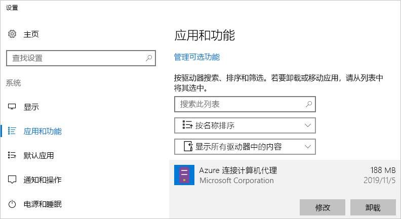

# <a name="quickstart-connect-machines-to-azure-using-azure-arc-for-servers---powershell"></a>快速入门：使用用于服务器的 Azure Arc 将计算机连接到 Azure - PowerShell

如果没有 Azure 订阅，请在开始之前创建一个[免费帐户](https://azure.microsoft.com/free/?WT.mc_id=A261C142F)。

## <a name="prerequisites"></a>先决条件

在[用于服务器的 Azure Arc 概述](overview.md)中查看受支持的客户端和所需的网络配置。

## <a name="create-a-service-principal-for-onboarding-at-scale"></a>为大规模载入创建服务主体

服务主体是一种特殊的受限管理身份，仅授予将计算机连接到 Azure 所需的最小权限。 这比使用像“租户管理员”这样功能更强大的帐户更为安全。 服务主体仅在载入期间使用。 连接所需的服务器后，可以安全地删除服务主体。

> [!NOTE]
> 此步骤不是必需的，但建议执行此步骤。

### <a name="steps-to-create-the-service-principal"></a>创建服务主体的步骤

在本示例中，我们将使用 [Azure PowerShell](/powershell/azure/install-az-ps) 创建服务主体名称 (SPN)。 或者，可以按照此任务的[使用 Azure 门户创建服务主体](../../active-directory/develop/howto-create-service-principal-portal.md)下列出的步骤进行操作。

`Azure Connected Machine Onboarding` 角色仅包含载入所需的权限。 可以定义 SPN 的权限以允许其范围覆盖资源组或订阅。

必须存储 [`New-AzADServicePrincipal`](/powershell/module/az.resources/new-azadserviceprincipal) cmdlet 的输出，否则将无法检索密码以在后续步骤中使用。

```azurepowershell-interactive
$sp = New-AzADServicePrincipal -DisplayName "Arc-for-servers" -Role "Azure Connected Machine Onboarding"
$sp
```

```output
Secret                : System.Security.SecureString
ServicePrincipalNames : {ad9bcd79-be9c-45ab-abd8-80ca1654a7d1, https://Arc-for-servers}
ApplicationId         : ad9bcd79-be9c-45ab-abd8-80ca1654a7d1
ObjectType            : ServicePrincipal
DisplayName           : Hybrid-RP
Id                    : 5be92c87-01c4-42f5-bade-c1c10af87758
Type                  :
```

现在，使用 PowerShell 检索密码。

```azurepowershell-interactive
$credential = New-Object pscredential -ArgumentList "temp", $sp.Secret
$credential.GetNetworkCredential().password
```

从输出中，复制密码和 ApplicationId（来自上一步），并稍后将它们存储安全位置，例如服务器配置工具的机密存储   。 如果忘记或丢失了 SPN 密码，可以使用 [`New-AzADSpCredential`](/powershell/module/azurerm.resources/new-azurermadspcredential) cmdlet 重置。

在安装代理载入脚本中：

* ApplicationId 属性用于在安装代理使用的 `--service-principal-id` 参数 
* password 属性用于在安装代理使用的 `--service-principal-secret` 参数  。

## <a name="manually-install-the-agent-and-connect-to-azure"></a>手动安装代理并连接到 Azure

使用以下指南，可通过登录计算机并执行步骤将计算机连接到 Azure。 也可以[从门户](quickstart-onboard-portal.md)将计算机连接到 Azure。

### <a name="download-and-install-the-agent"></a>下载并安装代理

安装代理包需要在目标服务器上具有根或本地管理员访问权限，但不需要 Azure 访问权限。

#### <a name="linux"></a>Linux

对于 Linux 服务器，该代理通过 [Microsoft 的包存储库](https://packages.microsoft.com)使用首选包格式（.RPM 或 .DEB）进行分发  。

> [!NOTE]
> 在公开预览期间，仅发布了一个包，其适用于 Ubuntu 16.04 或 18.04。

<!-- What about this aks? -->
最简单的方案是注册包存储库，然后使用分配的包管理器安装包。
位于 [https://aka.ms/azcmagent](https://aka.ms/azcmagent) 的 Bash 脚本执行以下操作：

1. 将主机配置为从 `packages.microsoft.com` 下载。
2. 安装混合资源提供程序包。
3. 如果指定 `--proxy`，则可以根据需要配置代理以进行代理操作。

该脚本还包含对受支持和不受支持的分配的检查，以及检测安装所需的权限。

下面的示例无需任何条件检查即可下载并安装代理。

```bash
# Download the installation package
wget https://aka.ms/azcmagent -O ~/Install_linux_azcmagent.sh

# Install the connected machine agent. Omit the '--proxy "{proxy-url}"' parameters if proxy is not needed
bash ~/Install_linux_azcmagent.sh--proxy "{proxy-url}"
```

> [!NOTE]
> 如果不想参考 Microsoft 的包存储库，则可以从中将包文件复制到内部存储库。

#### <a name="windows"></a>Windows

对于 Windows，该代理打包在 Windows Installer (`.MSI`) 文件中并可从 [https://aka.ms/AzureConnectedMachineAgent](https://aka.ms/AzureConnectedMachineAgent)（托管在 [https://download.microsoft.com](https://download.microsoft.com) 上）下载  。

```powershell
# Download the package
Invoke-WebRequest -Uri https://aka.ms/AzureConnectedMachineAgent -OutFile AzureConnectedMachineAgent.msi

# Install the package
msiexec /i AzureConnectedMachineAgent.msi /l*v installationlog.txt /qn | Out-String
```

> [!NOTE]
> 在 Linux 上，再次运行安装脚本将自动升级到最新版本。 在 Windows 上，必须先卸载“Azure 连接的计算机代理”，然后才能再次运行安装程序以进行升级。

### <a name="connecting-to-azure"></a>连接到 Azure

安装后，可以使用名为 `azcmagent.exe` 的命令行工具来管理和配置代理。 该代理位于 Linux 上的 `/opt/azcmagent/bin` 和 Windows 上的 `$env:programfiles\AzureConnectedMachineAgent` 中。

在 Windows 上，以管理员身份在目标节点上打开 PowerShell 并运行：

```powershell
& "$env:ProgramFiles\AzureConnectedMachineAgent\azcmagent.exe" connect `
  --service-principal-id "{your-spn-appid}" `
  --service-principal-secret "{your-spn-password}" `
  --resource-group "{your-resource-group-name}" `
  --tenant-id "{your-tenant-id}" `
  --location "{location-of-your-resource-group}" `
  --subscription-id "{your-subscription-id}"
```

在 Linux 上，打开 shell 并运行

<!-- Same command for linux?-->
```bash
azcmagent connect \
  --service-principal-id "{your-spn-appid}" \
  --service-principal-secret "{your-spn-password}" \
  --resource-group "{your-resource-group-name}" \
  --tenant-id "{your-tenant-id}" \
  --location "{location-of-your-resource-group}" \
  --subscription-id "{your-subscription-id}"
```

参数：

* `tenant-id`：租户 GUID。 通过选择“Azure Active directory 域服务” -> “属性” -> “Directory ID”，可以在 Azure 门户中找到它    。
* `subscription-id`：要在其中连接计算机的 Azure 中订阅的 GUID。
* `resource-group`：要连接到计算机的资源组。
* `location`：请参阅 [Azure 区域和位置](https://azure.microsoft.com/global-infrastructure/regions/)。 此位置可以与资源组的位置相同或不同。 对于公开预览版，该服务在美国西部 2 和西欧受支持   。
* `resource-name`：（可选）用于本地计算机的 Azure 资源表示  。 如果未指定此值，将使用计算机主机名。

有关详细信息，请参阅 [Azcmagent 参考](azcmagent-reference.md)中的“azcmagent”工具。
<!-- Isn't this still needed to view machines? -->

成功完成后，计算机将连接到 Azure。 可以通过访问 [https://aka.ms/hybridmachineportal](https://aka.ms/hybridmachineportal) 来查看 Azure 门户中的计算机。



### <a name="proxy-server-configuration"></a>代理服务器配置

#### <a name="linux"></a>Linux

<!-- New proxy name? -->

对于 Linux，如果服务器需要代理服务器，则可以执行以下操作之一  ：

* 通过 `--proxy`，从上面的[安装代理](#download-and-install-the-agent)部分运行 `install_linux_hybrid_agent.sh` 脚本。
* 如果已安装代理，请执行命令 `/opt/azcmagent/bin/hybridrp_proxy add http://{proxy-url}:{proxy-port}`，以配置代理并重启代理。

#### <a name="windows"></a>Windows

对于 Windows，如果服务器需要代理服务器访问 Internet 资源，则应运行以下命令来设置代理服务器环境变量  。 这样可使代理使用代理服务器进行 Internet 访问。

```powershell
# If a proxy server is needed, execute these commands with actual proxy URL
[Environment]::SetEnvironmentVariable("https_proxy", "http://{proxy-url}:{proxy-port}", "Machine")
$env:https_proxy = [System.Environment]::GetEnvironmentVariable("https_proxy","Machine")
# The agent service needs to be restarted after the proxy environment variable is set in order for the changes to take effect.
Restart-Service -Name himds
```

> [!NOTE]
> 公开预览版不支持经过身份验证的代理。

## <a name="clean-up"></a>清理

若要从用于服务器的 Azure Arc 断开连接计算机，需要执行两个步骤。

1. 在[门户](https://aka.ms/hybridmachineportal)中选择该计算机，单击省略号 (`...`)，然后选择“删除”  。
1. 从计算机中卸载代理。

   在 Windows 上，可以使用“应用和功能”控制面板来卸载代理。
  
  

   若要编写卸载脚本，可以参考以下示例，该示例将检索 **PackageId** 并使用 `msiexec /X` 卸载代理。

   查看注册表项 `HKEY_LOCAL_MACHINE\Software\Microsoft\Windows\CurrentVersion\Uninstall` 并找到 **PackageId**。 然后，可以使用 `msiexec` 卸载代理。

   以下示例演示如何卸载代理。

   ```powershell
   Get-ChildItem -Path HKLM:\Software\Microsoft\Windows\CurrentVersion\Uninstall | `
   Get-ItemProperty | `
   Where-Object {$_.DisplayName -eq "Azure Connected Machine Agent"} | `
   ForEach-Object {MsiExec.exe /Quiet /X "$($_.PsChildName)"}
   ```

   在 Linux 上，请执行以下命令来卸载代理。

   ```bash
   sudo apt purge hybridagent
   ```

## <a name="next-steps"></a>后续步骤

> [!div class="nextstepaction"]
> [将策略分配到连接的计算机](../../governance/policy/assign-policy-portal.md)
