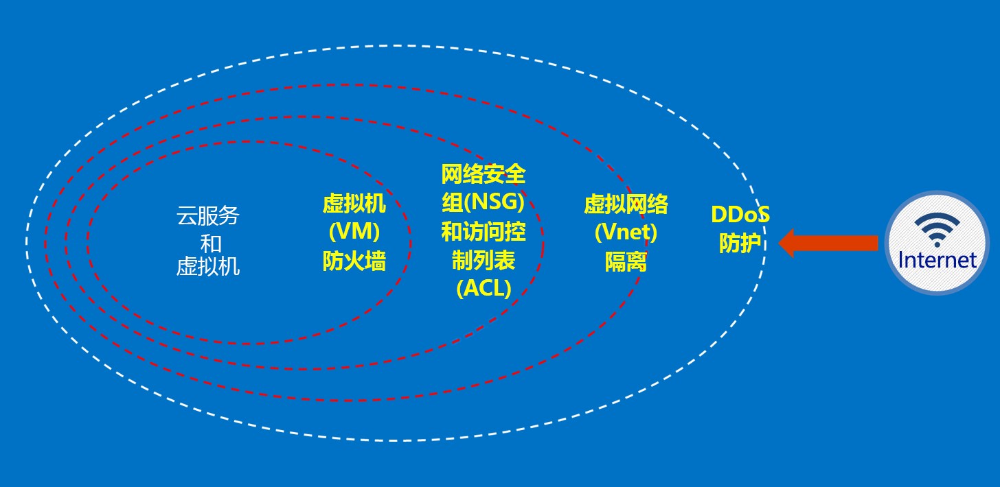

# 什么是 Azure 澳大利亚？

2014 年，Azure 已在澳大利亚的两个区域推出：澳大利亚东部（悉尼）和澳大利亚东南部（墨尔本）。 2018 年 4 月，在堪培拉设立了两个新的 Azure 区域：澳大利亚中部和澳大利亚中部 2 区域 澳大利亚中部和澳大利亚中部 2 区域是为了满足澳大利亚政府和关键基础设施的需求而专门设立的，提供专业化的连接和灵活性，可让客户将系统定位在云的旁边，获得只有机密级网络才能提供的安全性与弹性级别。 Azure 澳大利亚版是对澳大利亚政府和关键基础设施进行数字化转换的平台 – 并且是澳大利亚国内仅有的、专门为了解决这些需求而提供的任务关键云。

澳大利亚政府针对在 [Microsoft Azure 澳大利亚版](https://azure.microsoft.com/global-infrastructure/australia/)内部连接、使用和操作澳大利亚政府数据与系统制定了具体的要求。 本页上的资源还为特别关注安全配置和操作的所有客户提供了一般性指导。

有关 Azure 澳大利亚信息安全注册评估机构 (IRAP) 评估、认证和加入已认证云服务列表 (CCSL) 的最新信息，请参阅 [Microsoft 服务信任门户](https://aka.ms/au-irap)上的“澳大利亚”页。 在“澳大利亚”页上，还可以找到适用于政府和关键基础设施提供商的其他 Microsoft 建议。

## 有关在 Azure 澳大利亚版中保护客户数据的原则

Azure 澳大利亚版提供了一系列功能和服务，可用于构建云解决方案以满足你在管控数据方面的需要。 一个兼容的客户解决方案就是有效实施现成可用的 Azure 澳大利亚版功能，辅以可靠的数据安全实践。

在 Azure 澳大利亚版中托管解决方案时，Microsoft 会在云基础结构级别处理许多这些需求。

下图显示了 Azure 深层防御模型。 例如，Microsoft 提供了基本的云基础设施 DDoS 以及客户功能，例如可满足客户特定应用程序需求的安全设备或高级 DDoS 服务。

这些文章概述了有关保护服务和应用程序的基本原则，并提供了有关如何运用这些原则的指导与最佳做法。 换而言之，其中说明了客户应如何明智使用 Azure 澳大利亚版来符合法规要求和履行责任，以便能够达到处理政府敏感和机密信息的解决方案的要求。

对于正在迁移到 Azure 的澳大利亚政府机构，我们提供了两类文档。

## Azure 澳大利亚的安全性

标识、基于角色的访问控制、通过加密进行的数据保护、权限管理以及有效的监视和配置控制是需要实现的关键要素。 本部分列出的一系列文章介绍了 Azure 的内置功能及其与 ISM 和 ASD Essential 8 之间的关系。

可以通过“概念”->“Azure 澳大利亚版的安全性”下的菜单访问这些文章。 

## Azure 澳大利亚版的网关

政府机构要执行的另一个重要步骤是建立外围安全功能。 这些功能称为“安全 Internet 网关”(SIG)，使用 Azure 时，你需要负责确保实施这些保护。 Microsoft 不会运营 SIG；但是，将用于保护所有客户的 Microsoft 边缘网络服务与你的 Azure 环境中部署的特定服务相结合，可以操作等效的功能。

可以通过“概念”->“Azure 澳大利亚版的网关”下的菜单访问这些文章。 

## 后续步骤

* 如果你的重点是保护你在 Azure 中的数据，请从[数据安全性](secure-your-data.md)着手
* 如果你的重点是在 Azure 中构建网关，请从[网关审核、日志记录和可见性](gateway-log-audit-visibility.md)着手。
