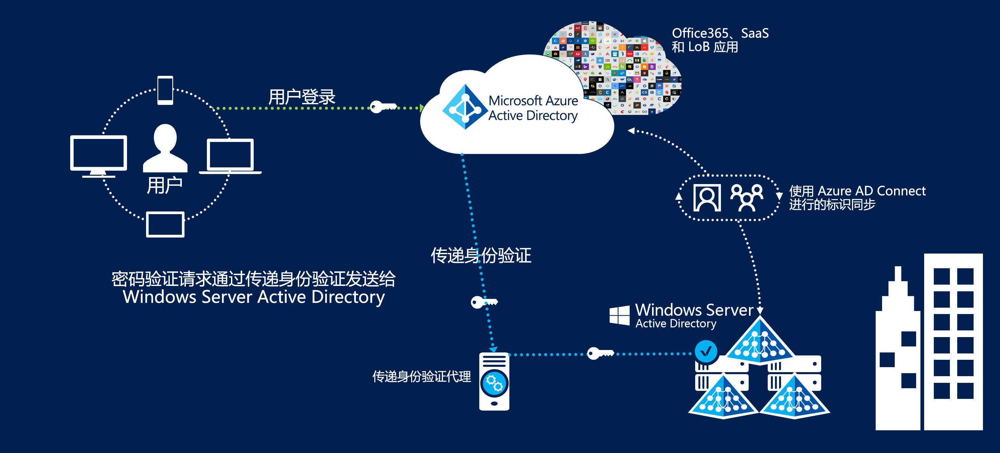
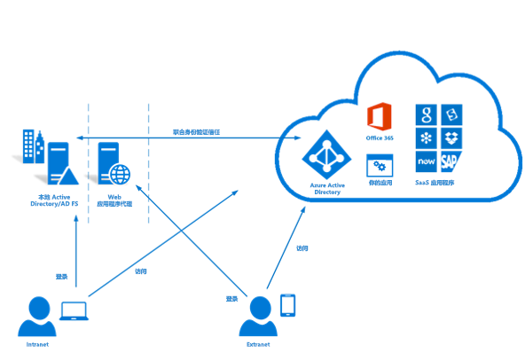

# Azure 澳大利亚中的标识联合

通过公有云产品/服务进行标识管理和联合是使用云的最关键首要步骤之一。 Microsoft Azure Active Directory 服务会存储用户信息以便能够访问云服务，这也是使用其他 Azure 服务的先决条件。

本文介绍实施 Azure Active Directory、同步 Active Directory 域服务域中的用户以及实施安全身份验证的设计要点。 本文专门将重点放在澳大利亚网络安全中心的信息安全手册 (ISM) 和 Azure 认证报告的建议上。

Azure Active Directory 中存储的信息分类应告知有关其设计方式的决策。 以下内容摘自 [ACSC 认证报告 – Microsoft Azure](https://aka.ms/au-irap)：

>当英联邦实体在受保护级别分类其 Active Directory 的用法和数据内容时，必须使用 Active Directory 联合身份验证服务配置 **ACSC 认证报告 – Microsoft Azure** – Azure Active Directory (Azure AD)。 尽管分类为“未分类传播限制标记 (UDLM)”的 Active Directory 数据不需要联合，但英联邦实体仍可实施联合，以缓解从澳大利亚外部提供服务的相关风险。

因此，要同步哪些信息，以及要通过哪种机制对用户进行身份验证，是本文探讨的两个重要考虑因素。

## 关键设计考虑因素

### 用户同步

部署 Azure AD Connect 时，必须在要同步的数据方面做出几项决策。 Azure AD Connect 基于 Microsoft Identity Manager，提供强大的功能集用于在目录之间[转换](https://docs.microsoft.com/azure/active-directory/hybrid/how-to-connect-sync-best-practices-changing-default-configuration)数据。

Microsoft 顾问服务可以参与现有 Windows Server Active Directory 的 ADRAP 评估。 在与 Azure Active Directory 同步之前，ADRAP 可帮助确定需要更正哪些问题。 Microsoft 顶级支持协议通常涵盖此服务。

在与 Azure AD 同步之前，[IDFix 工具](https://docs.microsoft.com/office365/enterprise/install-and-run-idfix)可以扫描本地 Active Directory 域中的问题。 IDFix 是实施 Azure AD Connect 之前关键的第一步。 尽管 IDFix 扫描能够识别大量的问题，但其中的许多问题可以使用脚本快速解决，或者使用 Azure AD Connect 中的数据转换来解决。

Azure AD 要求用户使用外部可路由的顶级域来启用身份验证。 如果你的域的 UPN 后缀不可在外部路由，则需要将 AD Connect 中的[备用登录 ID](https://docs.microsoft.com/azure/active-directory/hybrid/plan-connect-userprincipalname) 设置为用户的邮件属性。 然后，用户可使用其电子邮件地址（而不是域登录）登录到 Azure 服务。

但是，也可以使用 PowerShell 等工具更改用户帐户中的 UPN 后缀；这可能会对其他互连系统产生不可预见的后果，因此，此方法不再被视为最佳做法。

在决定要将哪些属性同步到 Azure Active Directory 时，最安全的做法是假设所有属性都是必需的。 目录极少包含实际的受保护数据，但建议执行审核。 如果在目录中找到受保护数据，请评估省略或转换属性的影响。 有一个列出了 Microsoft 云服务[所需](https://docs.microsoft.com/azure/active-directory/hybrid/reference-connect-sync-attributes-synchronized)属性的列表提供了有用的指导。

### Authentication

必须了解可用的选项，以及如何使用这些选项来保证最终用户的安全。
Microsoft 提供[三个本机解决方案](https://docs.microsoft.com/azure/active-directory/hybrid/plan-connect-user-signin)来针对 Azure Active Directory 验证用户的身份：

* 密码哈希同步 - Azure AD Connect 会将 Active Directory 域服务中的哈希密码同步到 Azure Active Directory 中。
* [直通身份验证](https://docs.microsoft.com/azure/active-directory/hybrid/how-to-connect-pta) - 密码保留在 Active Directory 域服务中。 用户通过代理对 Active Directory 域服务进行身份验证。 不会在 Azure AD 中存储密码。
* [联合 SSO](https://docs.microsoft.com/azure/active-directory/hybrid/how-to-connect-fed-whatis) - Azure Active Directory 与 Active Directory 联合身份验证服务相联合；在登录过程中，Azure 会将用户定向到 Active Directory 联合身份验证服务进行身份验证。 不会在 Azure AD 中存储密码。

如果在目录中存储“官方：敏感”数据和以下数据，则可以使用密码哈希同步。 如果存储受保护数据，则需要使用剩余的两个选项中的一个。

这三个选项都支持[密码写回](https://docs.microsoft.com/azure/active-directory/authentication/concept-sspr-writeback)，[ACSC 使用者指南](https://aka.ms/au-irap)建议禁用该功能。 但是，组织应该评估为了提高工作效率并减少使用自助式密码重置的支持工作量而禁用密码写回所带来的风险。

#### 直通身份验证 (PTA)

直通身份验证是在完成 IRAP 评估后发布的，因此，应单独对其进行评估，以确定解决方案对组织风险走势的适应度。 Microsoft 优先使用直通身份验证而不是联合身份验证，因为前者的安全性更高。

对于直通身份验证，需要考虑到以下几项设计因素：

* 直通身份验证代理必须能够与 Microsoft 云服务建立传出连接。
* 安装多个代理可确保服务具有高可用性。 最佳做法是最少部署 3 个代理，最多部署 12 个代理。
* 最佳做法是避免直接在 Active Directory 域控制器上安装代理。 默认情况下，在使用直通身份验证部署 Azure AD Connect 时，将在 AD Connect 服务器上安装代理。
* 与 Active Directory 联合身份验证服务相比，直通身份验证是一个低维护的选项，因为它不需要专用的服务器基础结构、证书管理或入站防火墙规则。

#### Active Directory 联合身份验证服务 (ADFS)

Active Directory 联合身份验证服务已包含在 IRAP 评估中，并已批准在受保护环境中使用。

对于 Active Directory 联合身份验证服务，需要考虑到以下几项设计因素：

* 联合身份验证服务要求为来自 Internet 的 HTTPS 流量提供网络入口，或者最起码需要提供 Microsoft 服务终结点。
* 联合身份验证服务使用 PKI 和证书，这需要持续进行管理和续订。
* 联合身份验证服务应部署在专用服务器上，需要提供相关的网络基础结构才能从外部安全对其进行访问。

### 多重身份验证 (MFA)

有关多重身份验证的 ISM 部分建议在以下情况下根据风险走势实施 MFA：

* 对标准用户进行身份验证
* 对特权帐户进行身份验证
* 对用户远程访问进行身份验证
* 执行特权操作的用户

Azure Active Directory 提供可为所有或一部分用户（例如，仅限特权帐户）启用的多重身份验证。 Microsoft 还提供一种称作“条件访问”的解决方案，使用该解决方案可以更精细地控制多重身份验证的应用方式（例如，仅当用户从远程 IP 地址范围登录时）。

Azure 多重身份验证支持 ISM 可接受的以下验证形式：

* 电话呼叫
* 短信
* Microsoft Authenticator 应用程序
* 支持的硬件令牌

使用 Privileged Identity Management（Azure Active Directory 的一个组件）可以在用户提升其权限时，根据第四条建议强制使用多重身份验证。

## 后续步骤

查看有关[基于角色的访问控制和 Privileged Identity Management](role-privileged.md) 的文章。
