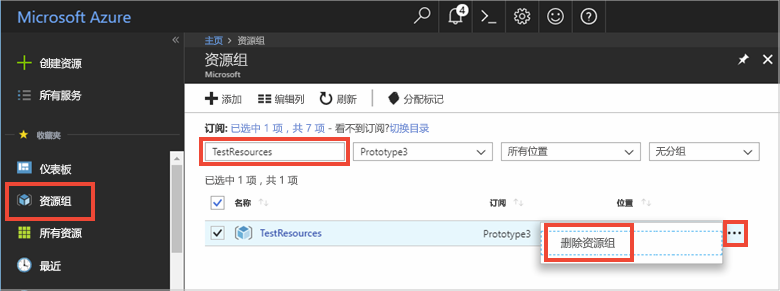

# <a name="quickstart-use-azure-cache-for-redis-with-java"></a>快速入门：将 Azure Redis 缓存与 Java 配合使用

在本快速入门中，会使用 [Jedis](https://github.com/xetorthio/jedis) Redis 客户端将 Azure Redis 缓存合并到 Java 应用中，以便能够访问 Azure 中的任何应用程序都可以访问的安全专用缓存。

## <a name="prerequisites"></a>先决条件

- Azure 订阅 - [创建免费帐户](https://azure.microsoft.com/free/)
- [Apache Maven](https://maven.apache.org/download.cgi)

## <a name="create-an-azure-cache-for-redis"></a>创建 Azure Redis 缓存

[!INCLUDE [redis-cache-create](../../includes/redis-cache-create.md)]

[!INCLUDE [redis-cache-access-keys](../../includes/redis-cache-access-keys.md)]

为**主机名**和**主**访问密钥添加环境变量。 你将通过代码使用这些变量，而不是直接在代码中包含敏感信息。

```CMD 
set REDISCACHEHOSTNAME=contosoCache.redis.cache.windows.net
set REDISCACHEKEY=XXXXXXXXXXXXXXXXXXXXXXXXXXXXXXXXXXXXXXXXXXXX
```

## <a name="create-a-new-java-app"></a>新建 Java 应用

使用 Maven 生成新的快速入门应用：

```CMD
mvn archetype:generate -DarchetypeGroupId=org.apache.maven.archetypes -DarchetypeArtifactId=maven-archetype-quickstart -DarchetypeVersion=1.3 -DgroupId=example.demo -DartifactId=redistest -Dversion=1.0
```

切换到新的 *redistest* 项目目录。

打开 *pom.xml* 文件并添加 [Jedis](https://github.com/xetorthio/jedis) 的依赖项：

```xml
    <dependency>
        <groupId>redis.clients</groupId>
        <artifactId>jedis</artifactId>
        <version>3.2.0</version>
        <type>jar</type>
        <scope>compile</scope>
    </dependency>
```

保存 *pom.xml* 文件。

打开 *App.java*，将代码替换为以下代码：

```java
package example.demo;

import redis.clients.jedis.Jedis;
import redis.clients.jedis.JedisShardInfo;

/**
 * Redis test
 *
 */
public class App 
{
    public static void main( String[] args )
    {

        boolean useSsl = true;
        String cacheHostname = System.getenv("REDISCACHEHOSTNAME");
        String cachekey = System.getenv("REDISCACHEKEY");

        // Connect to the Azure Cache for Redis over the TLS/SSL port using the key.
        JedisShardInfo shardInfo = new JedisShardInfo(cacheHostname, 6380, useSsl);
        shardInfo.setPassword(cachekey); /* Use your access key. */
        Jedis jedis = new Jedis(shardInfo);      

        // Perform cache operations using the cache connection object...

        // Simple PING command        
        System.out.println( "\nCache Command  : Ping" );
        System.out.println( "Cache Response : " + jedis.ping());

        // Simple get and put of integral data types into the cache
        System.out.println( "\nCache Command  : GET Message" );
        System.out.println( "Cache Response : " + jedis.get("Message"));

        System.out.println( "\nCache Command  : SET Message" );
        System.out.println( "Cache Response : " + jedis.set("Message", "Hello! The cache is working from Java!"));

        // Demonstrate "SET Message" executed as expected...
        System.out.println( "\nCache Command  : GET Message" );
        System.out.println( "Cache Response : " + jedis.get("Message"));

        // Get the client list, useful to see if connection list is growing...
        System.out.println( "\nCache Command  : CLIENT LIST" );
        System.out.println( "Cache Response : " + jedis.clientList());

        jedis.close();
    }
}
```

此代码演示如何使用缓存主机名和密钥环境变量连接到 Azure Redis 缓存实例。 此代码还在缓存中存储和检索字符串值。 还执行了 `PING` 和 `CLIENT LIST` 命令。 

保存 *App.java*。

## <a name="build-and-run-the-app"></a>生成并运行应用

执行以下 Maven 命令来生成并运行应用：

```CMD
mvn compile
mvn exec:java -D exec.mainClass=example.demo.App
```

在以下示例中可以看到，`Message` 键事先已包含一个缓存值，该值是使用 Azure 门户中的 Redis 控制台设置的。 应用更新了该缓存值。 应用还执行了 `PING` 和 `CLIENT LIST` 命令。


## <a name="clean-up-resources"></a>清理资源

如果想要继续学习下一篇教程，可以保留本快速入门中创建的资源，以便重复使用。

如果已完成快速入门示例应用程序，可以删除本快速入门中创建的 Azure 资源，以免产生费用。 

> [!IMPORTANT]
> 删除资源组的操作不可逆，资源组以及其中的所有资源将被永久删除。 请确保不会意外删除错误的资源组或资源。 如果在现有资源组（其中包含要保留的资源）中为托管此示例而创建了相关资源，可从各自的边栏选项卡逐个删除这些资源，而不要删除资源组。
>

1. 登录到 [Azure 门户](https://portal.azure.com)，然后选择“资源组”。 

1. 在“按名称筛选”文本框中键入资源组的名称  。 本文的说明使用了名为 *TestResources* 的资源组。 在结果列表中的资源组上，选择“...”，然后选择“删除资源组”   。

   

1. 系统会要求确认是否删除资源组。 键入资源组的名称进行确认，然后选择“删除”  。

片刻之后，将会删除该资源组及其包含的所有资源。

## <a name="next-steps"></a>后续步骤

本快速入门介绍了如何通过 Java 应用程序使用 Azure Redis 缓存。 请继续学习下一个快速入门，将 Azure Redis 缓存与 ASP.NET Web 应用配合使用。

> [!div class="nextstepaction"]
> [创建使用 Azure Redis 缓存的 ASP.NET Web 应用。](./cache-web-app-howto.md)
