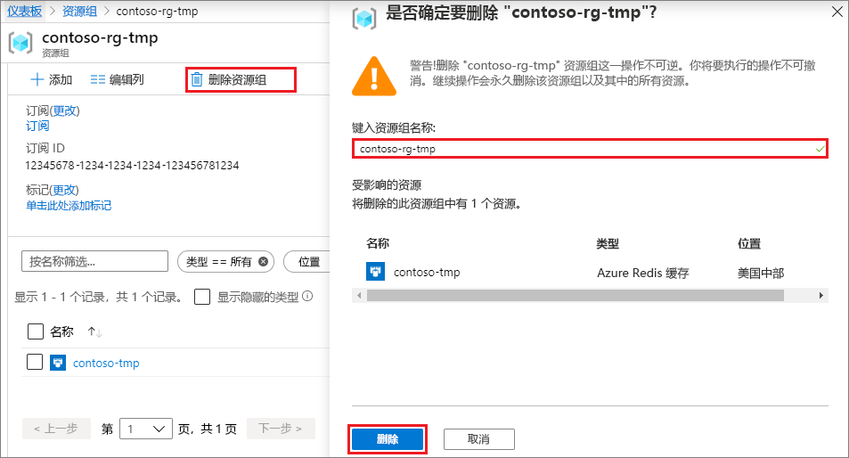

# <a name="quickstart-create-a-python-app-that-uses-azure-cache-for-redis"></a>快速入门：创建使用 Azure Redis 缓存的 Python 应用

在本文中，会将 Azure Redis 缓存合并到 Python 应用中，以便能够访问 Azure 中的任何应用程序都可以访问的安全专用缓存。

## <a name="prerequisites"></a>先决条件

- Azure 订阅 - [创建免费帐户](https://azure.microsoft.com/free/)
- [Python 2 或 Python 3](https://www.python.org/downloads/)

## <a name="create-an-azure-cache-for-redis-instance"></a>创建用于 Redis 的 Azure 缓存实例
[!INCLUDE [redis-cache-create](../../includes/redis-cache-create.md)]

[!INCLUDE [redis-cache-create](../../includes/redis-cache-access-keys.md)]

## <a name="install-redis-py"></a>安装 redis-py

[Redis-py](https://github.com/andymccurdy/redis-py) 是 Azure Redis 缓存的 Python 接口。 使用 Python 包工具 pip 从命令提示符安装 redis-py 包   。 

下面的示例使用 Python 3 的 pip3 在 Windows 10 上从管理员命令提示符安装 redis-py   。


## <a name="read-and-write-to-the-cache"></a>从缓存中读取数据以及向其中写入数据

从命令行运行 Python，并使用下面的代码测试缓存。 将 `<Your Host Name>` 和 `<Your Access Key>` 替换为 Azure Redis 缓存实例中的值。 主机名的格式为 \<DNS 名称>.redis.cache.windows.net  。

```python
>>> import redis
>>> r = redis.StrictRedis(host='<Your Host Name>',
        port=6380, db=0, password='<Your Access Key>', ssl=True)
>>> r.set('foo', 'bar')
True
>>> r.get('foo')
b'bar'
```

> [!IMPORTANT]
> 对于 Azure Redis 缓存版本 3.0 或更高版本，强制执行 SSL 证书检查。 连接到 Azure Redis 缓存时，必须显式设置 ssl_ca_certs。 对于 RedHat Linux，ssl_ca_certs 位于 /etc/pki/tls/certs/ca-bundle.crt 证书中  。

## <a name="create-a-python-sample-app"></a>创建 Python 示例应用

创建新的文本文件，添加以下脚本，并将文件另存为 PythonApplication1.py  。 将 `<Your Host Name>` 和 `<Your Access Key>` 替换为 Azure Redis 缓存实例中的值。 主机名的格式为 \<DNS 名称>.redis.cache.windows.net  。

```python
import redis

myHostname = "<Your Host Name>"
myPassword = "<Your Access Key>"

r = redis.StrictRedis(host=myHostname, port=6380,
                      password=myPassword, ssl=True)

result = r.ping()
print("Ping returned : " + str(result))

result = r.set("Message", "Hello!, The cache is working with Python!")
print("SET Message returned : " + str(result))

result = r.get("Message")
print("GET Message returned : " + result.decode("utf-8"))

result = r.client_list()
print("CLIENT LIST returned : ")
for c in result:
    print("id : " + c['id'] + ", addr : " + c['addr'])
```

使用 Python 运行 PythonApplication1.py  。 应显示如以下示例所示的结果：


## <a name="clean-up-resources"></a>清理资源

如果已完成在此快速入门中创建的 Azure 资源组和资源，则可以删除它们以避免产生费用。

> [!IMPORTANT]
> 删除资源组的操作不可逆，资源组以及其中的所有资源将被永久删除。 如果在要保留的现有资源组中创建了 Azure Redis 缓存实例，可从缓存“概述”页选择“删除”以便仅删除缓存   。 

删除资源组及其 Azure Redis 缓存实例：

1. 从 [Azure 门户](https://portal.azure.com)中，搜索并选择“资源组”  。
1. 在“按名称筛选”文本框中，输入包含缓存实例的资源组的名称，然后从搜索结果中选择它  。 
1. 在资源组页上，选择“删除资源组”  。
1. 键入资源组名称，然后选择“删除”  。
   
   

## <a name="next-steps"></a>后续步骤

> [!div class="nextstepaction"]
> [创建简单的使用 Azure Redis 缓存的 ASP.NET Web 应用。](./cache-web-app-howto.md)

